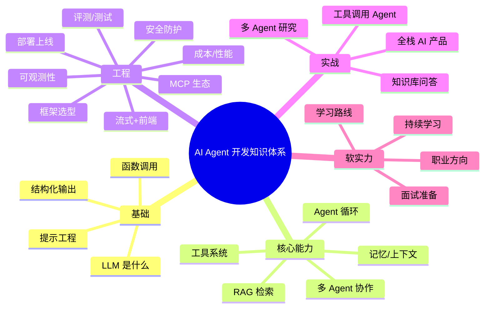
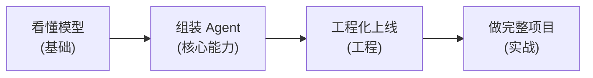

# 序言与导读

> 这是一本写给前端工程师的 AI Agent 实战书。如果你会 TypeScript、写过 React 或 Vue、熟悉异步和 fetch，那么你已经具备了转型 Agent 开发的大部分底子——剩下的，这本书帮你补齐。

## 为什么现在学 Agent 是个好时机

不谈风口，只讲三个能落地的理由：

1. **能力到位了。** 大模型已经能稳定地调用工具、按 schema 输出结构化数据、做多步推理。这意味着 Agent 不再是 demo，而是能写进生产代码的东西。两三年前你要靠一堆正则和规则去"伪装"智能，现在交给模型 + 几个工具就能干得更好。

2. **门槛降到了应用层。** 你不需要训练模型,也不需要懂反向传播。绝大多数 Agent 工作是**调用 API、设计工具、管理上下文、做工程化**——全是工程师擅长的事。模型厂商把最难的部分(预训练)替你做完了,留给你的是熟悉的那一半。

3. **岗位在变多,且缺人。** "AI 应用工程师""Agent 工程师"这类岗位正在从大厂蔓延到各类公司。它要的不是算法博士,而是**能把模型接进真实产品、还能上线扛住流量**的人。这恰好是会前端 + 一点后端的工程师的射程之内。

时机的本质是:**技术成熟度、学习门槛、岗位需求**三条曲线正好在此刻交汇。

## 这本书要解决什么问题

市面上讲 Agent 的资料,要么是论文式的(讲 attention、讲训练,劝退工程师),要么是营销式的(讲愿景、不讲代码)。本书只解决一类问题:

**一个会前端的工程师,如何系统地、能落地地掌握 Agent 开发,做到能写项目、能上线、能面试。**

具体来说:

- **原理讲清,但不过度。** 你需要知道上下文窗口是什么、ReAct 怎么循环、RAG 为什么有用——但不需要推导损失函数。
- **代码可跑,且双语。** 每个核心概念给 TypeScript 和 Python 两份代码。TS 是你的主场,Python 是 Agent 生态的通用语,两边都要看得懂。
- **框架无关,先讲原理。** 我们不把你绑死在某个框架上。先讲"为什么这么做",再讲"某框架替你做了什么",这样换框架时你不慌。
- **多模型,不押注单一厂商。** 代码通过一层薄抽象调用模型,Anthropic Claude / OpenAI / 开源模型都能接。

## 知识体系全景图

先建立全局观。整本书覆盖五个层次,下面这张图是你的"地图"——读任何一章时,都可以回来看看自己站在哪。

> 能力随阶段逐层叠加:**看懂模型 → 组装 Agent → 工程化上线 → 做完整项目**。

几个读图要点:

- **基础篇**回答"模型到底是什么、怎么用"。类比前端:这是你学 Agent 的"HTML/CSS/JS 三件套"。
- **核心能力篇**回答"怎么把模型组装成一个会做事的 Agent"。这是全书的心脏——循环、工具、记忆、检索、协作。
- **工程篇**回答"怎么让它在生产环境里跑得稳、花得省、出了问题查得到"。前端工程师对"工程化"这件事本来就有肌肉记忆,这一篇会很有亲切感。
- **实战篇**用四个完整项目把前面的知识串起来,从单 Agent 到全栈产品。
- **软实力**(贯穿面试篇与附录)是"路线图 + 面试 + 职业方向",帮你把知识变成 offer。

## 本书结构

全书分为四大主篇 + 实战 + 面试,外加前言和附录:

| 部分 | 内容 | 你会得到 |
| --- | --- | --- |
| **前言** | 序言、为什么前端适合转型、环境准备 | 全局观 + 跑通第一个请求 |
| **基础篇** | LLM、提示工程、结构化输出、函数调用 | 看懂并驾驭模型 |
| **核心能力篇** | Agent 循环、工具、记忆、RAG、多 Agent | 把模型组装成 Agent |
| **工程篇** | 框架、MCP、流式、评测、可观测、成本、安全、部署 | 让 Agent 能上线 |
| **实战篇** | 四个递进式完整项目 | 从知识到作品 |
| **面试篇** | 基础/核心/工程/项目四类面试题 | 把知识变成 offer |
| **附录** | 术语表、学习路线图、资源清单 | 长期参考手册 |

## 三条阅读路径

不是每个人都要从头读到尾。根据你的目标选一条:

- **快速上手(赶项目)**:前言 → 基础篇第 1、3、4 章 → 核心能力篇第 5、6 章 → 直接做实战篇[项目 1](../04-实战篇/项目1-智能知识库问答助手.md)。目标是两周内跑出一个能用的 Agent。

- **完整体系(系统转型)**:按顺序读完四大篇 + 全部实战项目。这是把自己从"前端"变成"AI 应用工程师"的完整路径,大约需要 1–3 个月。

- **面试突击(准备跳槽)**:基础篇 + 核心能力篇过一遍建立概念 → 重点刷[面试篇](../05-面试篇/01-基础概念面试题.md)四章 → 用实战项目里的代码作为"项目经验"素材。

三条路径的详细周计划、章节取舍和检查点,见 **[附录 · 学习路线图](../06-附录/02-学习路线图.md)**。

## 阅读约定(重要,先看一眼)

读正文前,记住这几条,后面就不重复解释了:

1. **双语代码。** 核心概念会同时给 `#### TypeScript` 和 `#### Python` 两份。TS 是你的主语言;Python 在 Agent 生态里几乎是事实标准(很多库、很多示例只有 Python),所以请至少读懂它。

2. **多模型抽象。** 书里的代码默认通过一个薄薄的 `chat()` 函数调用模型,而不是到处直接写厂商 SDK。这样换 Anthropic / OpenAI / 开源模型时,改一处即可。这个抽象在[环境准备](./02-环境准备与工具链.md)那章就会搭好雏形。

3. **模型 ID 易变,以占位符为准。** 模型版本更新极快。本书示例里,Claude 用 `claude-opus-4-8` 这类当前可用的 ID,其他厂商常用占位符 `MODEL_ID` 或常见名(如 `gpt-4o`),并标注"以官方文档为准"。**你照着跑时,请去对应厂商文档确认最新的模型 ID 和定价**,不要把书里的字符串当成永远正确。

4. **先原理,后框架。** 看到 LangChain、LlamaIndex 这类框架时,我们会先说清它替你做了什么、对应哪个原理,再给代码。这样你不会变成"只会调框架,不知道底层"的人。

准备好了就翻到下一篇:[为什么前端开发者适合转型 Agent 开发](./01-为什么前端开发者适合转型agent.md)。

## 延伸阅读

- 本书[附录 · 学习路线图](../06-附录/02-学习路线图.md):三条路径的详细安排。
- 本书[附录 · 术语表](../06-附录/01-术语表.md):遇到不认识的中英文术语先来这里查。
- Anthropic、OpenAI 官方文档:模型 ID、定价、API 形参以官方为准——这是你贯穿全书都要养成的习惯。
