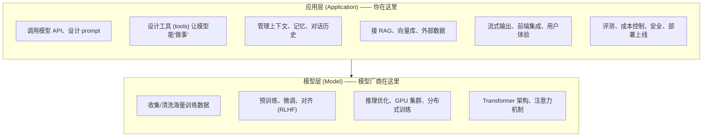

# 为什么前端开发者适合转型 Agent 开发

> 很多前端同学一听"AI",第一反应是"我又不会算法,搞不了"。这是个误会。本章要说清楚:Agent 开发的绝大部分工作在**应用层**,而应用层正是前端工程师的主场。

> 学习目标
> - 理解"应用层 vs 模型层"的分工,知道自己该站在哪一层
> - 盘点你已经会的、可直接迁移到 Agent 开发的技能
> - 认清需要补的短板(以及哪些其实不用补)
> - 了解三个常见职业方向各自的要求

前置知识:会 TypeScript、写过组件、用过 fetch 调接口。没有任何 ML 背景也没关系。

## 应用层 vs 模型层:90% 的工作不在训练模型

先把一个最大的认知障碍拆掉。"做 AI"这件事,粗分两层:

模型层是 Anthropic、OpenAI、Meta、阿里这些公司做的事,需要博士团队、几千张 GPU、上亿美元。**你不需要碰这一层**——就像你做 Web 开发,不需要自己实现 V8 引擎或 TCP 协议栈。

绝大多数 Agent 产品的价值,产生在**应用层**:怎么把一个通用模型,变成一个能查公司知识库、能调内部 API、能完成具体业务流程的"员工"。这件事拼的是**工程能力和产品感觉**,不是模型训练能力。

> **类比:** 模型厂商造了"浏览器",你做的是"网站"。造浏览器的人很厉害,但全世界 99% 的前端工程师都不造浏览器,照样有活干、有价值。Agent 开发同理。

想清楚这一点,你就会明白:转型的核心不是"补算法",而是"把已有的工程能力迁移到一个新场景"。

## 前端可以直接迁移的优势技能

下面这些你已经会了,而且在 Agent 开发里几乎天天用:

### 异步与 Promise

调用大模型是个**慢 I/O 操作**——一次请求几百毫秒到几十秒都正常。你早就习惯了 `async/await`、`Promise.all`、并发控制、超时处理。Agent 里调模型、并行调多个工具、给请求加超时,全是这套东西。

> **类比:** 调模型 ≈ 调一个很慢的后端接口。你处理 loading、错误、重试的那套经验,直接能用。

### 流式渲染 / SSE

大模型逐 token 返回,前端要"打字机效果"地实时渲染——这正是 Server-Sent Events(SSE)。你如果做过流式接口、用过 `EventSource` 或 `ReadableStream`,那 LLM 的流式输出对你来说毫无门槛。这是很多后端转型者反而要现学的东西,而你已经会了。(详见[工程篇 · 流式输出与前端集成](../03-工程篇/12-流式输出与前端集成.md)。)

### HTTP / fetch

所有模型 API 本质上就是 `POST` 一个 JSON、收一个 JSON(或一个 SSE 流)。请求头、鉴权 token、状态码、重试、错误处理——你做接口联调的全部经验直接复用。后面你会看到,很多"高级功能"剥开看就是请求体里多了几个字段。

### 状态管理

对话历史、工具调用的中间结果、多轮上下文……Agent 本质上是个**有状态的循环**。你用 Redux / Zustand / Pinia 管理过复杂状态,知道怎么设计数据结构、怎么避免状态混乱。Agent 的"记忆"和"上下文管理"(见[核心能力篇 · 记忆与上下文管理](../02-核心能力篇/07-记忆与上下文管理.md))需要的就是这种思维。

### 组件化思维

把大问题拆成可复用的小单元——这是前端的核心方法论。Agent 开发里,"工具"就是注册给模型的一个个能力单元,"多 Agent 协作"就是把一个大任务拆给多个专职 Agent。

> **类比:** 一个工具(tool)≈ 你注册给模型的一个回调函数。模型决定"什么时候、用什么参数"调它,你负责实现它干什么。是不是和给组件传 `onXxx` 回调很像?

### 产品 / 交互直觉

Agent 是直接面向用户的。什么时候该流式输出、什么时候该显示"正在思考"、错误怎么友好提示、多轮对话怎么不让用户迷路——这些**交互设计的直觉**,后端工程师往往缺,而你有。一个体验好的 AI 产品和一个能跑的 demo,差距常常就在这里。

### 全栈能力(Node 生态)

现代前端大多会点 Node——写过 Express/Koa/Next.js 的 API route、用过 npm 生态。Agent 的后端服务用 Node 完全可以写(`@anthropic-ai/sdk`、`openai` 都有官方 TS 包)。你能一个人从前端写到 BFF,这在做 AI 产品 MVP 时是巨大优势。

**小结:** 异步、流式、HTTP、状态管理、组件化、产品感、全栈——你的技能栈和 Agent 开发的重叠度高得惊人。

## 需要补的短板(以及不用补的)

实话实说,有几样要补。但范围比你想象的小。

### 要补:Python 基础

Agent 生态的"母语"是 Python。大量的库、教程、论文示例、开源项目只有 Python 版本(向量库、评测框架、数据处理尤其如此)。

但好消息是:**你不需要成为 Python 专家,能读懂、能改、能照着写就够了。** 你已经会一门动态语言(JS),Python 的语法迁移成本很低——变量、函数、循环、类,概念都一样,主要是 `def`、缩进、`self` 这些表面差异。本书每个概念都配 Python 代码,跟着读几章就顺了。

> 别因为"我不会 Python"就退缩。这是最容易补、回报最快的一块。

### 要补:后端系统设计

Agent 上线要面对后端的真实问题:接口怎么设计、并发怎么扛、数据库怎么存对话、密钥怎么管、服务怎么部署。前端同学这块往往是弱项。本书[工程篇](../03-工程篇/17-部署与生产化.md)会专门补,但你平时也可以有意识地了解一些后端基础。

### 要补:评测与成本意识

这是 AI 开发**独有**的新东西:

- **评测**:模型输出是不确定的,"跑通了"不等于"对"。你要学会用数据集和指标衡量 Agent 质量(见[工程篇 · 评测与测试](../03-工程篇/13-评测与测试.md))。
- **成本**:每次调模型都在花钱(按 token 计费)。一个不注意成本的 Agent 可能一天烧掉几千块。你要建立"这个请求多少钱"的直觉(见[工程篇 · 成本与性能优化](../03-工程篇/15-成本与性能优化.md))。

这两点没有对应的前端经验,需要从头建立意识。

### 要补:一点点 ML 直觉(但不用懂训练)

你需要的是**直觉**,不是数学:知道模型为什么会"幻觉"、为什么上下文越长越贵越慢、为什么同样的 prompt 两次结果不一样、temperature 大概是干嘛的。这些在[基础篇 · 大语言模型基础](../01-基础篇/02-大语言模型基础.md)讲清楚就够了。

**不用补:** 反向传播、损失函数、Transformer 的数学推导、怎么训练/微调一个模型、GPU 编程。除非你想转去做模型层(那是另一条职业路径),否则这些对应用层开发几乎用不上。

## 三个职业方向

转型后大致有三个方向,要求各不相同:

| 方向 | 干什么 | 重点要求 |
| --- | --- | --- |
| **AI 应用工程师** | 把模型接进现有产品(智能客服、文档问答、AI 助手等) | 提示工程、API 集成、前端体验、产品感。**最适合前端直接切入的方向。** |
| **Agent 工程师** | 设计有自主性的 Agent(工具系统、多步推理、多 Agent 协作) | Agent 循环、工具设计、上下文/记忆管理、评测。本书核心能力篇正是为此准备。 |
| **全栈 AI 工程师** | 从前端到后端到模型集成,独立交付完整 AI 产品 | 上面两者 + 后端系统设计 + 部署运维。前端转全栈的天然延伸。 |

三个方向不是互斥的,更像是能力的逐级叠加。前端同学最自然的路径通常是:**AI 应用工程师 → Agent 工程师 / 全栈 AI 工程师**。详细的成长路线见[附录 · 学习路线图](../06-附录/02-学习路线图.md)。

## 前端视角:你已经赢在起跑线的地方

把整章浓缩成一句话送给还在犹豫的你:**Agent 开发是"工程问题",不是"算法问题"——而工程,恰恰是你的强项。**

后端工程师转型,常卡在前端体验和流式渲染上;算法工程师转型,常卡在工程化和产品落地上。而你,带着异步、流式、HTTP、状态管理、组件化和产品直觉一起来,起点其实很高。要补的那几块(Python、后端、评测成本)都是可学的、有明确路径的。

## 常见坑 / 心态建议

- **别等"准备好了"再开始。** 看完一章就动手敲代码、跑请求。Agent 开发是练出来的,不是看出来的。
- **别怕 Python。** 它比你想的简单。读不懂的语法当场查,几天就习惯。
- **别陷在原理里出不来。** 你不需要先把 Transformer 搞懂再开始。够用的直觉 + 大量实践,远胜于啃完一本深度学习教材却没写过一个 Agent。
- **以"做项目"为目标驱动学习。** 带着"我要做一个 XX"的目标去学,比漫无目的地刷概念高效得多。本书[实战篇](../04-实战篇/项目1-智能知识库问答助手.md)就是为此设计的。
- **别盲目押注单一框架。** 框架会变,原理不变。先理解底层在干什么,框架只是省事的工具。

## 本章小结

1. Agent 开发的 90% 工作在**应用层**,不是训练模型——这正是前端/工程师的机会。
2. 你已会的异步、流式、HTTP、状态管理、组件化、产品感、全栈能力,**全部可迁移**。
3. 要补的是:Python 基础、后端系统设计、评测与成本意识、一点 ML 直觉——**不需要懂训练**。
4. 职业方向有 AI 应用工程师、Agent 工程师、全栈 AI 工程师,前端最自然的入口是第一个。
5. 心态比什么都重要:动手、做项目、别怕 Python。

## 练习题

1. **(易)** 用一句话向一个非技术的朋友解释"应用层 vs 模型层"的区别。
2. **(易)** 列出你自己已经掌握、且本章提到可迁移到 Agent 开发的 3 个技能,并各举一个你用过它的具体场景。
3. **(中)** 找一个你最近用过的 AI 产品(如某个 AI 助手、AI 搜索),试着判断:它的哪些功能属于应用层?哪些可能依赖模型层能力?
4. **(中)** 如果让你现在补 Python,你会怎么安排?写一个一周的小计划(可参考[学习路线图](../06-附录/02-学习路线图.md))。
5. **(难)** 从三个职业方向里选一个作为你的目标,对照本章列出的"要求",诚实评估自己目前差哪几块,并标出本书哪几章能帮你补。

## 延伸阅读

- 本书[基础篇 · 大语言模型基础](../01-基础篇/02-大语言模型基础.md):建立够用的 ML 直觉。
- 本书[附录 · 学习路线图](../06-附录/02-学习路线图.md):三条路径的详细周计划与成长路线。
- 关键词:"LLM application development""building with LLMs"——搜索时用这些词,能避开大量讲模型训练的内容,直达应用层资料。
