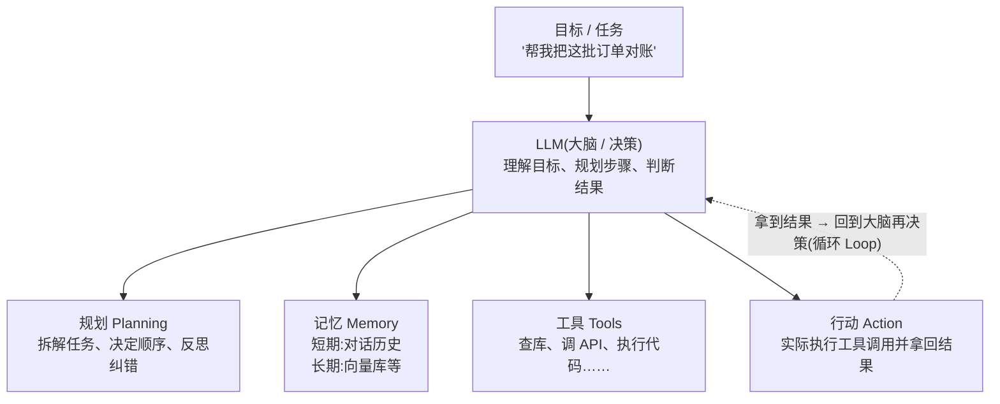
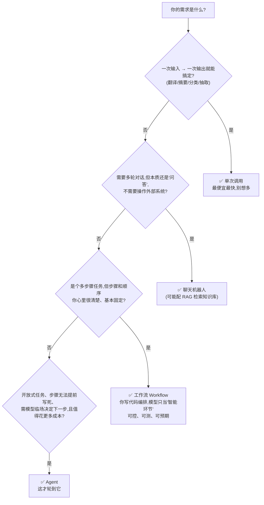
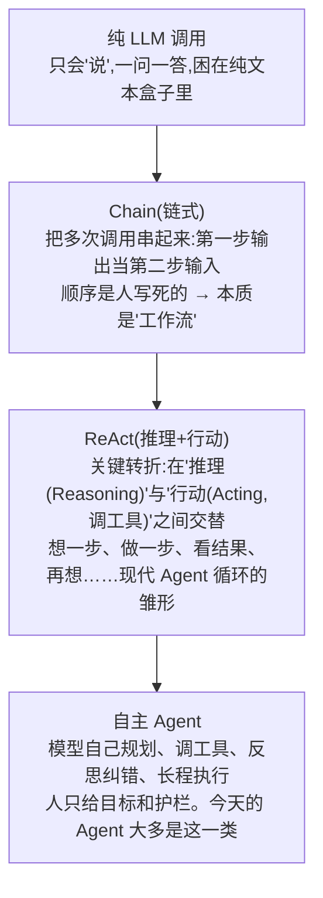
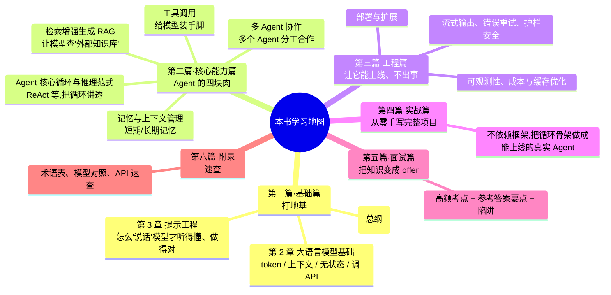

# 第 1 章 从 LLM 到 Agent

本章解决一个问题：**到底什么是 AI Agent，它和你平时调的那个"问一句答一句"的大模型 API 有什么本质区别，以及——什么时候你该用它，什么时候千万别用。**

这是全书的总纲。读完本章，你脑子里应该有一张清晰的地图：知道 Agent 由哪几块拼起来，知道它能干什么、不能干什么，也知道接下来每一章在讲哪一块。

> **学习目标**
> - 用前端能懂的方式说清楚 LLM 的本质（预测下一个 token），以及它为什么"显得会思考"。
> - 给 AI Agent 一个能落地的定义：**LLM（大脑）+ 工具（手脚）+ 循环（自主多步）+ 记忆/目标**。
> - 掌握一个关键决策：**单次调用 / 工作流 / Agent / 聊天机器人**，分别在什么场景用，尤其是"什么时候不该上 Agent"。
> - 清楚 Agent 的能力边界与风险（幻觉、不可靠、延迟、成本、失控），以及该用什么心态对待它。
> - 在脑子里建立一个"最小 Agent 心智模型"。

**前置知识**：会 TypeScript / JavaScript，懂 `fetch`、`async/await`、事件循环、回调函数、调过 REST API。不需要任何机器学习背景。

---

## 1.1 先说大语言模型（LLM）：本质就是"猜下一个 token"

我们天天说"大模型很聪明""它会推理""它懂我说的话"。这些说法都没错，但容易让人误以为模型内部有个"理解引擎"。**它没有。** 大语言模型（LLM, Large Language Model）干的事情，本质上只有一件：

> **给定前面的一串文字，预测下一个最可能出现的"词块"（token）。**

就这么简单。然后把预测出来的 token 接到后面，再预测下一个，循环往复，直到它预测出一个"该结束了"的标记。你看到的一整段流畅回答，就是这样一个 token 一个 token "蹦"出来的。

### 用前端的方式理解：它像一个超级自动补全

你写代码时,编辑器的自动补全见过吧。你打 `const arr = [1, 2, 3]; arr.` ,它弹出 `map`、`filter`、`forEach`。它怎么知道的?因为它见过海量代码,统计出"在 `arr.` 后面,这些方法出现的概率最高"。

LLM 就是这个自动补全的"究极进化版"——只不过:

- 它补全的不是代码方法名,而是**任意自然语言**;
- 它的"见过的语料"是**几乎整个互联网的文本**;
- 它一次不只看前面几个字符,而是看你给它的**全部上下文**(可能几十万字)。

所以当你问它"用一句话解释闭包",它并不是去查了一本《JS 权威指南》,而是凭着"见过无数篇讲闭包的文章",一个 token 一个 token 地,预测出一段听起来最像"对闭包的正确解释"的文字。

### 那它为什么"显得会推理"?

这是关键,也是很多人想不通的地方。如果只是猜下一个词,为什么它能解数学题、能写出有逻辑的代码、能一步步分析问题?

两个原因:

1. **语料里本来就有大量"推理过程"的文本。** 互联网上有无数"先分析、再得结论"的文章、题解、讨论。模型在预测下一个 token 时,为了让接下来的文字"接得上",不得不学会模仿这种推理的**形式**。当它写出"因为 A,所以 B,因此 C"时,它是在预测"这种句式后面最该跟什么",而这个过程的产物,看起来就和真的推理一模一样。

2. **"想出声"会让答案更准。** 一个有意思的现象:如果你让模型"一步步想",它的正确率会明显提高。因为每写一步中间过程,这些中间过程就成了后续预测的上下文——相当于它把草稿纸摊在面前,后面的预测有更多依据。这就是后面会讲的"思维链(Chain of Thought)"和现代模型的"思考(thinking)"模式的底层逻辑。

> **一句话记住**:LLM 不是"懂了再答",而是"为了把话接得像样,顺便学会了推理的形式"。它的"智能"是预测能力的副产品。理解这一点,你才不会对它产生不切实际的期待——也不会在它一本正经胡说时感到意外。

Token、上下文窗口、采样这些更细的机制,放到[下一章](./02-大语言模型基础.md)展开。这里你只要建立"它就是个会预测下一个 token 的概率机器"这个直觉就够了。

---

## 1.2 什么是 AI Agent:给大脑装上手脚和循环

LLM 本身有个致命局限:**它只会"说",不会"做"。**

你问它"北京现在几度",它只能根据训练时见过的旧数据瞎猜,或者老老实实告诉你"我访问不了实时天气"。它不能帮你查数据库、调 API、读文件、发邮件——它被困在一个"纯文本进、纯文本出"的盒子里。

**AI Agent 就是把这个盒子打开:给 LLM 配上工具,让它能真正去"做事",并且能根据做事的结果,自己决定下一步做什么。**

### 一个能落地的定义

抛开各种花哨说法,一个 AI Agent 由四块拼成:

$$
\text{Agent} = \underbrace{\text{LLM}}_{\text{大脑}} + \underbrace{\text{工具 Tools}}_{\text{手脚}} + \underbrace{\text{循环 Loop}}_{\text{自主多步}} + \underbrace{\text{记忆/目标}}_{\text{知道自己在干嘛}}
$$

- **大脑(LLM)**:负责理解、决策、推理。决定"现在该调哪个工具""结果够不够""下一步干什么"。
- **手脚(工具 Tools)**:模型可以调用的能力。查数据库、调天气 API、执行代码、读写文件、搜索网页……每个工具就像你给模型**注册的一个回调函数**——你告诉它"有这么个函数,它能干 X,参数长这样",模型需要时就"调用"它。
- **循环(Loop)**:这是 Agent 区别于普通调用的灵魂。模型不是答一次就完,而是"思考 → 调工具 → 看结果 → 再思考 → 再调工具……"反复进行,直到任务完成。
- **记忆/目标**:它得记住自己要干什么(目标),以及前面几步发生了什么(记忆/上下文),否则会原地打转。

### 用前端类比:Agent ≈ 一个会自己决定调哪些 API 的"智能控制器"

想象你在写一个前端页面的逻辑层。普通代码是这样的——你**写死了**调用顺序:

```ts
// 普通代码:控制流是你写死的
const user = await fetchUser(id);
const orders = await fetchOrders(user.id);
const result = renderDashboard(user, orders);
```

而 Agent 是这样的——**控制流由模型在运行时动态决定**:

```ts
// Agent:你只提供工具,调用顺序由"大脑"在运行时决定
const tools = { fetchUser, fetchOrders, fetchInventory, sendEmail };
// 模型看着用户的目标,自己决定:先调哪个?拿到结果后该调哪个?够了没?
```

你不再写 `if/else` 决定调用顺序,而是**把一堆能力交给模型,让它自己编排**。这就是为什么我把 Agent 理解成"一个会自己决定调用哪些 API、并根据结果决定下一步的智能控制器"。

这个类比很重要,后面会反复用到。在前端,你习惯了"用户点按钮 → 触发事件 → 调 API → 更新 state → 重渲染"这套**事件循环**。Agent 的循环和它惊人地相似:"收到目标 → 模型决策 → 调工具 → 拿到结果塞回上下文 → 模型再决策……"。后面[核心能力篇的 Agent 核心循环](../02-核心能力篇/05-agent核心循环与推理范式.md)会把这个循环讲透。

### Agent 的组成要素图

学术界常把 Agent 拆成四个能力维度,基本和上面的定义对应。记住这张图,后面所有章节都是在填充其中某一块:



四个要素一句话各自的职责:

| 要素 | 职责 | 前端类比 |
|---|---|---|
| **规划 Planning** | 把大目标拆成小步骤,决定先后顺序,中途反思纠错 | 你写的任务编排逻辑,只不过现在是模型动态生成 |
| **记忆 Memory** | 短期:本轮对话历史;长期:跨会话的知识(常用向量库) | 短期≈组件 state;长期≈持久化的数据库 |
| **工具 Tools** | 模型能调用的外部能力,带名字、描述、参数 schema | 给模型注册的一组回调函数 / API |
| **行动 Action** | 真正去执行某个工具调用,并把结果拿回来 | 真正发出那个 `fetch` |

> ⚠️ **别被"Agent 框架"绑架。** 你会听到 LangChain、LangGraph、AutoGen、CrewAI 等一堆框架名字。它们做的事,本质上都是帮你把上面这个"决策→工具→循环"的骨架搭起来、管好状态。**先理解原理,框架只是省事的工具。** 本书坚持先讲原理、再讲框架,讲到框架时会明确说它替你做了什么。你完全可以不用任何框架,用几十行代码手写一个能跑的 Agent(本书[实战篇](../04-实战篇/)就会这么干一次)。

---

## 1.3 关键决策:单次调用 vs 工作流 vs Agent vs 聊天机器人

这一节是本章**最重要、最值钱**的部分,也是面试和实际工作里最容易踩坑的地方。

很多人一学会 Agent 就上头,什么需求都想用 Agent 做。**这是错的。** Agent 更贵、更慢、更不可控。**能用简单方案解决的,就别上 Agent。** 这是一条专业开发者的纪律。

先把四种形态摆清楚:

| 形态 | 是什么 | 控制流由谁定 | 典型场景 |
|---|---|---|---|
| **单次调用** | 一次请求一次响应,模型直接给答案 | 不需要控制流 | 翻译、摘要、分类、信息抽取、改写 |
| **聊天机器人 Chatbot** | 多轮对话,但模型仍然只"说"不"做" | 用户驱动(用户问一句,它答一句) | 客服问答、知识库问答、陪聊 |
| **工作流 Workflow** | 多步骤,但每一步的顺序**由你的代码写死** | **你的代码**(模型只是其中一两个环节) | 固定流程:抽取→校验→入库;翻译→润色→排版 |
| **Agent** | 模型自主多步,**自己决定调哪些工具、下一步干啥** | **模型**(在运行时动态决定) | 开放式任务:"帮我排查这个线上 bug""把这份设计稿变成 PR" |

### 一棵决策树:我到底该用哪个?



### 上 Agent 之前,过一遍这四个问题

在决定"这个需求要不要做成 Agent"时,逐条问自己——只要有一个答案是"否",就退回到更简单的方案:

1. **复杂度**:任务是不是多步、且无法提前完整描述清楚?
   - "把这个 PDF 的标题抽出来" → 否,单次调用就行。
   - "把这份需求文档变成一个能跑的 PR" → 是,步骤无法预先写死。

2. **价值**:这件事的产出,值不值得为它付出更高的成本和延迟?(Agent 一次任务可能调几十次模型)

3. **可行性**:这类任务,模型现在的能力真的能胜任吗?(别让它去做它根本做不好的事)

4. **错误成本**:它出错了,能不能被发现和兜底?(有测试?能 review?能回滚?还是一错就直接打到生产、无法挽回?)

> **核心纪律(请背下来,面试常问)**:
> **"能用单次调用就别用工作流,能用工作流就别用 Agent。"** Agent 是把"控制权交给模型"换取"灵活性",代价是可控性、可预测性、成本和延迟全面下降。它是把双刃剑,不是银弹。

### 一个具体的例子

需求:"用户上传一张发票图片,提取金额、日期、商家,存进数据库。"

- ❌ **错误做法**:做成 Agent,给它一堆工具,让它自己决定怎么干。——杀鸡用牛刀,慢、贵、还可能在简单步骤上抽风。
- ✅ **正确做法**:**工作流**。流程是固定的:① 调一次模型(带视觉能力)做信息抽取,要求结构化输出 → ② 你的代码校验字段格式 → ③ 入库。模型只在第①步出现,其余是普通后端逻辑。可控、可测、便宜。

什么时候这个需求才升级成 Agent?当流程变成开放式的:"用户上传一堆乱七八糟的单据(发票、合同、收据混在一起),自己判断每张是什么、用不同方式处理、遇到不认识的格式还要去查规则"——这时步骤无法预先写死,才轮到 Agent。

---

## 1.4 Agent 的能力边界与风险:别神化它

Agent 很强,但它建立在 LLM 之上,而 LLM 的一切毛病它一个不落地继承,而且因为"自主多步",这些毛病还会**被放大**。专业开发者必须清楚地知道它的边界。

| 风险 | 说明 | 为什么 Agent 里更严重 | 怎么看待 / 缓解 |
|---|---|---|---|
| **幻觉(Hallucination)** | 模型会一本正经地编造不存在的事实、API、参数 | 一步幻觉 → 后续步骤基于错误信息继续 → 错误滚雪球 | 关键事实用工具去"查"而不是让它"想";让它给出处;人工/测试兜底 |
| **不可靠 / 不稳定** | 同样的输入,两次结果可能不同;偶尔会突然跑偏 | 多步循环里,每一步都有翻车概率,连乘下来成功率掉得快 | 缩小每步的开放度;加校验和重试;关键节点人工确认 |
| **延迟(Latency)** | 单次调用可能几秒;Agent 一个任务调几十次,可能跑几分钟甚至更久 | 循环天然慢,步骤越多越慢 | 用流式输出让用户看到进度;能并行的步骤并行;非交互任务异步跑 |
| **成本(Cost)** | 按 token 计费,Agent 反复把历史塞回去,token 消耗暴涨 | 每一轮都要把**完整历史**重新发一遍(下一章细讲) | 提示缓存、控制上下文长度、便宜模型跑简单子任务 |
| **失控(Runaway)** | 它可能陷入死循环、反复调同一个工具、或执行危险操作 | "自主"是把双刃剑,没护栏就可能脱缰 | 设最大步数上限;危险操作(删除、发消息、花钱)加人工确认门;在沙箱里执行 |

> **该用什么心态对待 Agent?**
> 把它当成一个**能力很强、但偶尔会犯迷糊、需要被监督的初级同事**,而不是一个永远正确的神。你不会把"直接打到生产数据库"的权限毫无保留地交给一个新人,对 Agent 也一样:**给它合适的工具、画好边界、关键动作留确认、出错能兜底。** 这些工程实践,正是[工程篇](../03-工程篇/)的核心内容。

关于幻觉、可靠性、护栏的系统性应对,会在[核心能力篇](../02-核心能力篇/)和[工程篇](../03-工程篇/)展开;现在你只要记住"它不可靠,所以要做工程"。

---

## 1.5 Agent 演进简史(点到为止)

了解一下来龙去脉,有助于你理解为什么 Agent 长成今天这样。不用记年份,记住这条**能力进化的主线**:



- **Chain**:最早大家发现单次调用不够用,就把多次调用串成"链"。但顺序是人写死的——所以它其实是工作流,不是真正的 Agent。
- **ReAct**:2022 年提出的 **ReAct(Reasoning + Acting)** 是一个里程碑。它让模型把"推理"和"调用工具的行动"交替进行——这正是 1.2 节那个"思考→调工具→看结果→再思考"循环的来源。ReAct 这个推理范式很重要,[核心能力篇会专门讲](../02-核心能力篇/05-agent核心循环与推理范式.md)。
- **自主 Agent**:随着模型能力变强(尤其是现代模型内置了强大的"思考"能力),它越来越能独立完成长程、复杂的任务,人的介入越来越少。

> 这里点到为止。你只需建立"从只会说,到会一步步做,到能自主规划"这个进化直觉。具体的推理范式(ReAct、Plan-and-Execute、反思 Reflection 等)是后面的重点内容。

---

## 1.6 最小 Agent 心智模型(伪代码)

光说不练假把式。下面这段伪代码,是整个 Agent 最核心的骨架——**一个循环**。看懂它,你就抓住了 Agent 的灵魂。真正的实现细节(怎么定义工具、怎么和具体模型 API 对接、怎么管理上下文)会在后面章节逐步展开,这里**只为建立直觉,先别纠结细节**。

```ts
// 最小 Agent 心智模型 —— 伪代码,目的是建立直觉
//
// 核心就是一个 while 循环:模型决策 → 执行工具 → 把结果塞回 → 再决策

async function runAgent(goal: string, tools: ToolSet) {
  // messages 就是"记忆"——这轮对话的完整历史。
  // 注意:LLM API 是无状态的,所以历史得我们自己拿着,每轮重新发过去(下一章细讲)。
  const messages = [
    { role: "system", content: "你是一个助手,可以使用工具来完成任务。" },
    { role: "user", content: goal }, // 用户给的目标
  ];

  // 设个步数上限,防止它陷入死循环(失控风险的护栏之一)
  for (let step = 0; step < MAX_STEPS; step++) {
    // ① 大脑思考:把当前历史和可用工具一起交给模型,让它决定下一步
    const decision = await llm.decide({ messages, tools });

    // ② 模型说"任务完成了",就把最终答案返回,跳出循环
    if (decision.type === "final_answer") {
      return decision.answer;
    }

    // ③ 模型说"我要调某个工具",就真的去执行它(行动 Action)
    if (decision.type === "tool_call") {
      const result = await tools.run(decision.toolName, decision.args);

      // ④ 把"模型想调工具"和"工具返回的结果"都记进历史,
      //    这样下一轮模型才知道上一步发生了什么 → 回到 ① 继续循环
      messages.push({ role: "assistant", content: decision.raw });
      messages.push({ role: "tool", content: result });
    }
  }

  throw new Error("超过最大步数,任务未完成"); // 兜底:防失控
}
```

把这段代码和前面那张组成要素图对一下,你会发现严丝合缝:

- `messages` 数组 = **记忆 Memory**(短期);
- `llm.decide(...)` = **大脑** 在做 **规划 Planning** 和决策;
- `tools.run(...)` = **行动 Action**,执行 **工具 Tools**;
- `for` 循环 = **循环 Loop**;
- `MAX_STEPS` 上限 = 防失控的护栏。

> **这就是 Agent 的全部秘密。** 后面所有章节,无非是在给这个骨架的每一块"填肉":工具怎么定义得让模型用得好?上下文怎么管才不爆?思考模式怎么开?多 Agent 怎么协作?怎么上线、怎么省钱、怎么监控?但骨架,就是这个循环。

---

## 1.7 后续章节学习地图

本章是全书总纲。下面这张地图告诉你,接下来每一篇在给上面那个骨架填哪一块肉。看不懂的术语没关系,后面都会讲。



> 章节文件参见:基础篇 [`./02-大语言模型基础.md`](./02-大语言模型基础.md)、[`./03-提示工程.md`](./03-提示工程.md);核心能力篇 [`../02-核心能力篇/`](../02-核心能力篇/);工程篇 [`../03-工程篇/`](../03-工程篇/)(如流式输出见 [`../03-工程篇/12-流式输出与前端集成.md`](../03-工程篇/12-流式输出与前端集成.md));实战篇 [`../04-实战篇/`](../04-实战篇/);面试篇 [`../05-面试篇/`](../05-面试篇/);术语表 [`../06-附录/01-术语表.md`](../06-附录/01-术语表.md)。

建议路径:**基础篇打牢直觉 → 核心能力篇逐块吃透 → 工程篇学会落地 → 实战篇动手 → 面试篇查漏补缺**。别跳着读基础篇,后面会反复用到这里建立的概念和类比。

---

## 1.8 常见坑 / 最佳实践

- **坑:把 LLM 当数据库 / 计算器。** 它是概率预测机,不是真理来源。需要精确事实或精确计算,就给它工具(查库、跑代码),别让它"凭记忆答"。
- **坑:什么都做成 Agent。** 90% 的需求,单次调用或工作流就够了。先问"这真的需要模型自主多步吗",答案多半是"不需要"。
- **坑:不设步数上限。** 没有 `MAX_STEPS` 护栏的 Agent,翻车时会无限烧钱、死循环。上限是第一道防线。
- **坑:危险操作不加确认。** 删数据、发邮件、花钱这类不可逆动作,默认就该加人工确认门,别让模型自己说了算。
- **最佳实践:先想清楚控制流归谁。** 写死的流程(工作流)归你的代码;开放式的临场决策才交给模型。这条边界想清楚,架构就清晰一大半。
- **最佳实践:用"会犯迷糊的初级同事"心态设计。** 给清楚的目标、合适的工具、明确的边界、出错的兜底。把工程做扎实,而不是指望模型永远正确。
- **最佳实践:框架之前先懂原理。** 能手写一个 50 行的 Agent 循环,再去用框架,你才知道框架替你做了什么、出问题时去哪查。

---

## 1.9 本章小结

1. **LLM 的本质是"预测下一个 token"** ——一个超级自动补全。它的"推理能力"是预测能力的副产品,而不是真的"理解了"。理解这点,你才不会神化它,也不会被它的幻觉吓到。
2. **AI Agent = LLM(大脑)+ 工具(手脚)+ 循环(自主多步)+ 记忆/目标。** 它把困在纯文本盒子里的模型解放出来,让它能真正去"做事"并根据结果决定下一步。前端类比:一个**会自己决定调哪些 API、并根据结果决定下一步的智能控制器**。
3. **四种形态要分清:单次调用 / 聊天机器人 / 工作流 / Agent。** 核心纪律:**能用简单方案就别上 Agent**——它更贵、更慢、更不可控。上 Agent 前过一遍复杂度、价值、可行性、错误成本四问。
4. **Agent 继承并放大了 LLM 的所有毛病**:幻觉、不可靠、延迟、成本、失控。该用的心态是"监督一个会犯迷糊的初级同事",靠工程实践兜底,而非指望它完美。
5. **演进主线**:纯调用 → Chain(人编排)→ ReAct(推理+行动交替)→ 自主 Agent。
6. **Agent 的灵魂是一个循环**:思考 → 调工具 → 看结果 → 再思考。后面所有章节都是给这个循环骨架的各块"填肉"。

---

## 1.10 练习题

1. **(易)** 用你自己的话,向一个完全不懂技术的朋友解释"为什么 LLM 会显得很聪明,但又会一本正经地胡说八道"。不许用"概率"以外的术语堆砌,要让对方真听懂。

2. **(易)** 下面四个需求,各应该用"单次调用 / 聊天机器人 / 工作流 / Agent"中的哪一种?简述理由:
   - (a) 把一段中文邮件翻译成英文。
   - (b) 一个挂在官网、回答产品常见问题的客服机器人。
   - (c) 用户上传简历 PDF → 抽取关键字段 → 校验格式 → 存入人才库(流程固定)。
   - (d) "帮我调研一下竞品最近三个月的动态,整理成一份带数据的报告"(需要自己搜索、判断、组织)。

3. **(中)** 回顾 1.6 节的最小 Agent 伪代码,回答:
   - (a) 为什么每一轮都要把"工具返回的结果"`push` 进 `messages`?如果不 push 会发生什么?
   - (b) `MAX_STEPS` 这个上限防的是哪一类风险?去掉它最坏会怎样?

4. **(中)** 1.4 节说"Agent 会放大 LLM 的毛病"。请用"成功率连乘"的角度,定量地解释:如果每一步的成功率是 95%,一个需要 10 步才能完成的 Agent 任务,整体成功率大约是多少?这说明了什么工程上的启示?

5. **(难)** 你的团队收到一个需求:"做一个能自动处理用户工单的系统。" 产品经理张口就说"用 Agent"。请你扮演一个有判断力的工程师,**先不急着同意**:列出你会追问的 3~5 个问题,以判断这到底该做成工作流还是 Agent;并说明在什么样的回答下你会选工作流、什么样的回答下才升级到 Agent。

---

## 1.11 延伸阅读

- **ReAct 论文**:《ReAct: Synergizing Reasoning and Acting in Language Models》(Yao et al., 2022)。理解现代 Agent 循环起源的经典文献,关键词 `ReAct reasoning acting`。
- **Anthropic 工程博客《Building effective agents》**:对"工作流 vs Agent"这一关键决策有非常务实的论述,和本章 1.3 节的观点一脉相承。搜索关键词 `Anthropic building effective agents`。
- **各家模型厂商的官方文档**(Anthropic Claude、OpenAI、以及开源生态的 Qwen/Llama)的 "Agents / Tool use" 章节,是了解原生能力的第一手资料。具体 API 形态、参数请**以官方文档为准**(模型与接口变化很快)。
- 本书[附录·术语表](../06-附录/01-术语表.md):随时回查 LLM、token、Agent、ReAct、RAG 等术语的中英文对照与简明定义。
