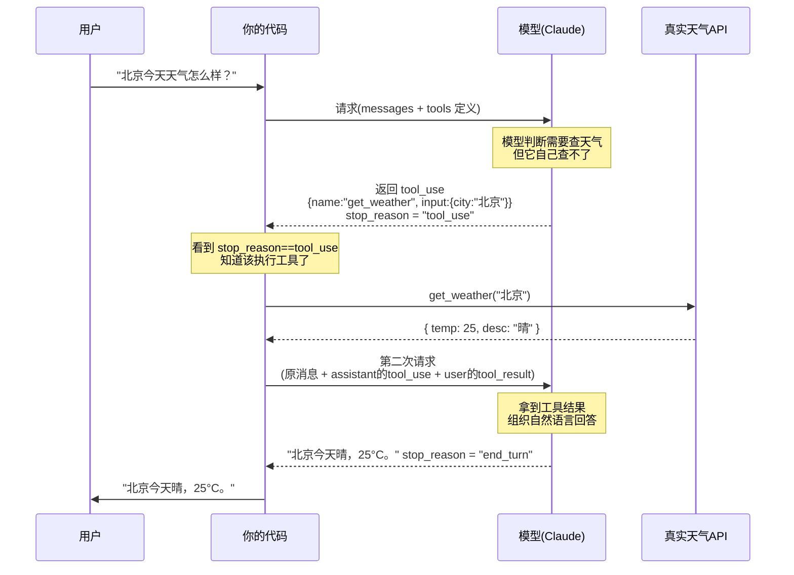

# 第 4 章 结构化输出与函数调用

第 3 章结尾我们埋了个伏笔：提示能让输出"大概率正确"，但下游程序要解析时，"大概率"是不够的。这一章解决两个紧密相关的问题：

1. **结构化输出**——怎么让模型**保证**吐出合法、可解析的 JSON，而不是靠正则从自然语言里硬抠。
2. **函数调用 / 工具使用**——怎么让模型**调用你的代码**去拿数据、做动作。

这两件事是后面所有 Agent 能力的地基。**第 5 章会把工具调用放进一个循环里，让模型自主地连续行动；第 6 章会深入工具系统的工程设计。** 而它们的本质机制，全在这一章。尤其是函数调用——初学者几乎都会误解它，我们会反复强调那个关键点。

> **学习目标**
> - 说清为什么需要结构化输出，以及它和"提示里写'请输出 JSON'"的本质区别
> - 用 JSON Schema 强约束模型输出（Claude / OpenAI 双语）
> - **彻底理解函数调用的本质：模型不执行函数，只输出"想调什么 + 参数"，由你的代码执行**
> - 跑通一次完整的工具调用往返（含时序图）
> - 知道"结构化输出"和"工具调用"分别在什么场景用
>
> **前置知识**：第 2 章（消息数组、`stop_reason`）、第 3 章（`system`、清晰指令）。会读 JSON Schema。

---

## 4.1 为什么需要结构化输出

设想你在做一个"从用户留言里提取联系信息"的功能。你让模型提取姓名、邮箱、套餐意向，下游代码要把这些字段写进数据库。

如果只靠提示，模型可能这次回：

```
好的，我提取到了以下信息：
姓名是张三，邮箱 zhangsan@example.com，他想要企业版。
```

下次又回：

```json
{"name": "张三", "email": "zhangsan@example.com", "plan": "企业版"}
```

再下次用 markdown 包起来：

````
```json
{ "name": "张三", ... }
```
````

你的解析代码怎么写？用正则抠 JSON？用字符串 split？**这条路走不通**——自然语言的形态无穷无尽，你永远在打补丁：处理前缀文字、剥 markdown 代码块、容忍字段顺序、兜底拼写错误……每一种偏差都是一次线上崩溃。

**核心矛盾：模型天生输出自然语言（面向人），而程序需要结构化数据（面向机器）。** 结构化输出就是在 API 层面架一座桥——让模型只能吐出符合你预定义结构的数据。

```
   自然语言（面向人）              结构化数据（面向机器）
  "他叫张三，想要企业版"   ──schema 约束──▶   {"name":"张三","plan":"企业版"}
        ↑ 模型的天性                              ↑ 程序能可靠 .parse() 的东西
```

---

## 4.2 用 JSON Schema 约束输出

**JSON Schema** 是一套描述"JSON 应该长什么样"的标准：有哪些字段、各是什么类型、哪些必填、枚举值是什么。结构化输出就是把一份 JSON Schema 交给 API，让它强制模型的输出符合这份 schema。

### Claude：`output_config.format`

Claude 用 `output_config` 里的 `format` 字段传 schema。

> ⚠️ **注意**：旧的顶层 `output_format` 参数已废弃，新代码用 `output_config: {format: {...}}`。（以官方文档为准。）

#### TypeScript

```ts
import Anthropic from "@anthropic-ai/sdk";

const client = new Anthropic();

const resp = await client.messages.create({
  model: "claude-opus-4-8",
  max_tokens: 1024,
  messages: [
    { role: "user", content: "提取：张三 (zhangsan@example.com) 想要企业版，需要演示。" },
  ],
  output_config: {
    format: {
      type: "json_schema",
      schema: {
        type: "object",
        properties: {
          name: { type: "string" },
          email: { type: "string" },
          plan: { type: "string" },
          demo_requested: { type: "boolean" },
        },
        required: ["name", "email", "plan", "demo_requested"],
        additionalProperties: false, // 不允许多余字段
      },
    },
  },
});

// 第一个 text 区块保证是符合 schema 的合法 JSON
const text = resp.content.find((b) => b.type === "text")!.text;
const data = JSON.parse(text); // 可以放心 parse
console.log(data.name, data.demo_requested);
```

#### Python

Python SDK 还提供了更顺手的 `messages.parse()`——直接用 Pydantic 模型，返回的就是校验过的对象，连 `JSON.parse` 都省了：

```python
import anthropic
from pydantic import BaseModel

class ContactInfo(BaseModel):
    name: str
    email: str
    plan: str
    demo_requested: bool

client = anthropic.Anthropic()

resp = client.messages.parse(
    model="claude-opus-4-8",
    max_tokens=1024,
    messages=[
        {"role": "user", "content": "提取：张三 (zhangsan@example.com) 想要企业版，需要演示。"},
    ],
    output_format=ContactInfo,   # 传 Pydantic 模型，SDK 自动转 schema + 校验
)

contact = resp.parsed_output      # 已经是校验过的 ContactInfo 实例
print(contact.name, contact.demo_requested)
```

如果不想用 Pydantic，也可以像 TS 那样用原始 schema（`output_config={"format": {"type": "json_schema", "schema": {...}}}`），然后自己 `json.loads()`。

### OpenAI：`response_format`

OpenAI 一侧用 `response_format` 表达同样的意图（具体写法以官方为准）：

#### TypeScript

```ts
import OpenAI from "openai";

const client = new OpenAI();

const resp = await client.chat.completions.create({
  model: "gpt-4.1", // 模型名以官方为准
  messages: [
    { role: "user", content: "提取：张三 (zhangsan@example.com) 想要企业版，需要演示。" },
  ],
  response_format: {
    type: "json_schema",
    json_schema: {
      name: "contact_info",
      schema: {
        type: "object",
        properties: {
          name: { type: "string" },
          email: { type: "string" },
          plan: { type: "string" },
          demo_requested: { type: "boolean" },
        },
        required: ["name", "email", "plan", "demo_requested"],
        additionalProperties: false,
      },
    },
  },
});

const data = JSON.parse(resp.choices[0].message.content!);
```

#### Python

```python
from openai import OpenAI

client = OpenAI()

resp = client.chat.completions.create(
    model="gpt-4.1",  # 模型名以官方为准
    messages=[
        {"role": "user", "content": "提取：张三 (zhangsan@example.com) 想要企业版，需要演示。"},
    ],
    response_format={
        "type": "json_schema",
        "json_schema": {
            "name": "contact_info",
            "schema": {
                "type": "object",
                "properties": {
                    "name": {"type": "string"},
                    "email": {"type": "string"},
                    "plan": {"type": "string"},
                    "demo_requested": {"type": "boolean"},
                },
                "required": ["name", "email", "plan", "demo_requested"],
                "additionalProperties": False,
            },
        },
    },
)
import json
data = json.loads(resp.choices[0].message.content)
```

> **薄抽象的好处**：注意两家的"形状"很像——都是给 schema、都保证输出合法 JSON。如果你按本书的多模型原则把模型调用包在一层 `generate()` 里，结构化输出也可以在这层统一封装，业务代码不用关心底层是 Claude 还是 OpenAI。

### JSON Schema 的能力边界（务必知道）

结构化输出支持的 schema 不是完整的 JSON Schema，有些约束不被支持（以官方文档为准）：

- **支持**：基本类型、`enum`、`const`、`anyOf`、`$ref`/`$def`、常见字符串格式（`date`、`email`、`uri`、`uuid` 等）、`additionalProperties: false`。
- **通常不支持**：递归 schema、数值范围（`minimum`/`maximum`）、字符串长度（`minLength`/`maxLength`）、复杂数组约束。

Python / TypeScript 的 SDK 会自动把不支持的约束从发给 API 的 schema 里剥掉，并在客户端帮你做校验。其它注意点：新 schema 第一次用有一次性"编译"开销（之后会缓存）；如果模型因安全原因拒答（`stop_reason: "refusal"`），输出可能不符合 schema——要先判断 `stop_reason`。

---

## 4.3 函数调用 / 工具使用的本质（最重要的一节）

现在进入本章——也是整个 Agent 体系——最容易被误解的概念。请慢读。

**函数调用（Function Calling），在 Claude 体系里也叫工具使用（Tool Use），它的本质是：**

> **模型不会执行任何函数。它只会输出一段结构化数据，告诉你"我想调用哪个函数、用什么参数"。真正去执行这个函数的，是你自己的代码。执行完，你再把结果喂回给模型。**

这句话我要换几个角度反复说，因为初学者十有八九会以为"模型自己联网查了天气""模型自己读了数据库"。**不是的。模型被关在一个盒子里，它没有网络、没有文件系统、不能运行代码。** 它能做的，仅仅是用文字（结构化的文字）告诉你它"想"做什么。

### 前端类比：注册一组回调/事件处理器

这个机制你其实再熟悉不过。想想前端事件：

```ts
button.addEventListener("click", handleClick);
//      ↑ 你注册了一个处理器             ↑ 真正执行的是你的函数
```

浏览器不会替你执行业务逻辑。它只是在用户点击时**通知你**"click 事件发生了，参数是这个 event 对象"，然后**你的 `handleClick` 去执行**。

函数调用一模一样：

```
你向模型"注册"一组工具（tools）          ← 像 addEventListener
模型决定"我要触发 get_weather，参数 {city:'北京'}"  ← 像浏览器派发 click 事件
你的代码执行 get_weather('北京')          ← 像 handleClick 真正运行
你把结果交回模型                          ← 模型据此继续
```

所以：**Function Calling ≈ 给模型注册一组回调，模型决定"触发哪个 + 传什么参数"，执行的人始终是你。** 模型是那个"决定要点哪个按钮"的大脑，但"按钮按下去之后干什么"是你写的代码。

### 为什么要这样设计？

正因为模型自己干不了实事，这个机制反而成了它连接真实世界的桥梁：

- 模型想知道今天天气 → 它没法联网，但它可以"请求"你调用 `get_weather`，你的代码去调真正的天气 API。
- 模型想查订单 → 它读不到你的数据库，但它可以"请求"你调用 `query_order`，你的代码去查。
- 模型想发邮件 → 它发不了，但它可以"请求"调用 `send_email`，由你（可能还要先经人类确认）去发。

控制权始终在你手里：**执行不执行、怎么执行、要不要拦一道，全由你的代码决定。** 这也是安全的基础（见第 6、16 章）。

---

## 4.4 工具定义的结构：name / description / input_schema

要让模型知道"有哪些按钮可以点"，你得先定义工具。每个工具三个核心字段：

| 字段 | 作用 |
|------|------|
| `name` | 工具名，模型用它来指代"我要调哪个"。用清晰的动词命名，如 `get_weather`、`query_order`。 |
| `description` | 工具描述。**极其重要**——模型完全靠这段话来判断"什么时候该用这个工具"。 |
| `input_schema` | 参数的 JSON Schema。模型据此生成合法的参数。 |

一个例子：

```json
{
  "name": "get_weather",
  "description": "查询指定城市的当前天气。当用户询问某地天气、温度、是否下雨时使用。",
  "input_schema": {
    "type": "object",
    "properties": {
      "city": { "type": "string", "description": "城市名，如 北京、上海" }
    },
    "required": ["city"]
  }
}
```

### 为什么"好描述"如此重要

`description` 是模型选工具的唯一依据。写得含糊，模型就选错或不选：

| ❌ 差描述 | ✅ 好描述 |
|-----------|-----------|
| `天气` | `查询指定城市的当前天气。当用户询问某地天气、温度、是否下雨时使用。` |
| `查东西` | `根据订单号查询订单状态。当用户提供订单号并询问物流/状态时使用。` |

诀窍：**不仅说"这个工具是干什么的"，更要说"什么时候该调它"。** 在描述里写清触发条件（"当用户询问……时"），模型的选择准确率会明显提升——这一点对新模型尤其有效，因为它们调用工具更"克制"，需要你把触发条件讲明白。

同理，给每个参数也写上 `description`，并用 `required` 标出必填项、用 `enum` 锁定固定取值。这些都是在帮模型生成正确的参数。

---

## 4.5 一次完整的工具调用往返

理解了本质和定义，我们看**完整流程**。这是最关键的实操，请对照时序图。

### 时序图



把流程拆成五步，记牢：

1. **用户提问** → 你把用户消息 + 工具定义发给模型。
2. **模型返回 `tool_use`** → 它说"我想调 `get_weather`，参数 `{city:"北京"}`"，此时 `stop_reason === "tool_use"`。**它没有执行任何东西。**
3. **你执行工具** → 你的代码看到 `stop_reason` 是 `tool_use`，于是真正去调天气 API，拿到结果。
4. **你把结果作为 `tool_result` 放进下一轮消息** → 把"原始消息 + 模型那条带 `tool_use` 的 assistant 消息 + 你这条带 `tool_result` 的 user 消息"一起发回去。
5. **模型给最终答案** → 它结合工具结果，组织成自然语言回复，`stop_reason === "end_turn"`。

> 🔑 注意第 4 步的消息结构：`tool_result` 是放在一条 **`user` 角色**的消息里发回去的，并且要带上对应的 `tool_use_id`（让模型知道这是哪次调用的结果）。同时别忘了把模型那条 `tool_use` 的 assistant 消息也加进历史——否则模型会"失忆"。

### 双语完整代码：实现 `get_weather` 并跑通往返

下面是能跑通整个往返的完整代码。`get_weather` 用假数据模拟（真实项目里换成调真正的天气 API）。

#### TypeScript

```ts
import Anthropic from "@anthropic-ai/sdk";

const client = new Anthropic();

// 1) 这是你的真实函数——模型不会执行它，执行的是你
function getWeather(city: string): { temp: number; desc: string } {
  // 真实项目里这里调天气 API；这里用假数据演示
  const fake: Record<string, { temp: number; desc: string }> = {
    北京: { temp: 25, desc: "晴" },
    上海: { temp: 28, desc: "多云" },
  };
  return fake[city] ?? { temp: 20, desc: "未知" };
}

// 2) 工具定义：告诉模型有这个"按钮"
const tools: Anthropic.Tool[] = [
  {
    name: "get_weather",
    description: "查询指定城市的当前天气。当用户询问某地天气、温度、是否下雨时使用。",
    input_schema: {
      type: "object",
      properties: {
        city: { type: "string", description: "城市名，如 北京、上海" },
      },
      required: ["city"],
    },
  },
];

async function run(userInput: string): Promise<string> {
  // 维护完整对话历史（API 是无状态的，每次要带全）
  const messages: Anthropic.MessageParam[] = [{ role: "user", content: userInput }];

  // 第一次请求
  let resp = await client.messages.create({
    model: "claude-opus-4-8",
    max_tokens: 1024,
    tools,
    messages,
  });

  // 3) 检测：模型是不是想调工具？
  if (resp.stop_reason === "tool_use") {
    // 把模型这条 assistant 消息（含 tool_use 块）加进历史，否则模型会失忆
    messages.push({ role: "assistant", content: resp.content });

    // 找出所有 tool_use 块（可能不止一个），逐个执行
    const toolResults: Anthropic.ToolResultBlockParam[] = [];
    for (const block of resp.content) {
      if (block.type === "tool_use") {
        // 4) 真正执行——这一步是"你的代码"在跑
        const input = block.input as { city: string };
        const result = getWeather(input.city);

        toolResults.push({
          type: "tool_result",
          tool_use_id: block.id,                 // 必须对上是哪次调用
          content: JSON.stringify(result),       // 结果序列化成字符串回传
        });
      }
    }

    // 5) 把工具结果作为 user 消息发回去，让模型给最终答案
    messages.push({ role: "user", content: toolResults });

    resp = await client.messages.create({
      model: "claude-opus-4-8",
      max_tokens: 1024,
      tools,
      messages,
    });
  }

  // 取出最终的自然语言回答
  const finalText = resp.content.find((b) => b.type === "text");
  return finalText && finalText.type === "text" ? finalText.text : "";
}

console.log(await run("北京今天天气怎么样？"));
// → 类似 "北京今天晴，气温 25°C。"
```

#### Python

```python
import json
import anthropic

client = anthropic.Anthropic()

# 1) 这是你的真实函数——模型不会执行它，执行的是你
def get_weather(city: str) -> dict:
    # 真实项目里这里调天气 API；这里用假数据演示
    fake = {
        "北京": {"temp": 25, "desc": "晴"},
        "上海": {"temp": 28, "desc": "多云"},
    }
    return fake.get(city, {"temp": 20, "desc": "未知"})

# 2) 工具定义：告诉模型有这个"按钮"
tools = [
    {
        "name": "get_weather",
        "description": "查询指定城市的当前天气。当用户询问某地天气、温度、是否下雨时使用。",
        "input_schema": {
            "type": "object",
            "properties": {
                "city": {"type": "string", "description": "城市名，如 北京、上海"},
            },
            "required": ["city"],
        },
    }
]

def run(user_input: str) -> str:
    # 维护完整对话历史（API 是无状态的，每次要带全）
    messages = [{"role": "user", "content": user_input}]

    # 第一次请求
    resp = client.messages.create(
        model="claude-opus-4-8",
        max_tokens=1024,
        tools=tools,
        messages=messages,
    )

    # 3) 检测：模型是不是想调工具？
    if resp.stop_reason == "tool_use":
        # 把模型这条 assistant 消息（含 tool_use 块）加进历史，否则模型会失忆
        messages.append({"role": "assistant", "content": resp.content})

        # 找出所有 tool_use 块（可能不止一个），逐个执行
        tool_results = []
        for block in resp.content:
            if block.type == "tool_use":
                # 4) 真正执行——这一步是"你的代码"在跑
                result = get_weather(block.input["city"])
                tool_results.append({
                    "type": "tool_result",
                    "tool_use_id": block.id,            # 必须对上是哪次调用
                    "content": json.dumps(result, ensure_ascii=False),  # 结果序列化回传
                })

        # 5) 把工具结果作为 user 消息发回去，让模型给最终答案
        messages.append({"role": "user", "content": tool_results})

        resp = client.messages.create(
            model="claude-opus-4-8",
            max_tokens=1024,
            tools=tools,
            messages=messages,
        )

    # 取出最终的自然语言回答
    final = next((b.text for b in resp.content if b.type == "text"), "")
    return final

print(run("北京今天天气怎么样？"))
# → 类似 "北京今天晴，气温 25°C。"
```

#### OpenAI 一侧（机制相同，字段不同）

OpenAI 的流程一模一样，只是字段名不同：检测 `response.choices[0].message.tool_calls`（而非 `stop_reason`），执行后把结果作为一条 `role: "tool"` 的消息（带 `tool_call_id`）发回。这里给出关键片段（完整写法以官方为准）：

```python
# 第一次请求后：
msg = resp.choices[0].message
if msg.tool_calls:                              # 模型想调工具
    messages.append(msg)                        # 把 assistant 消息加进历史
    for call in msg.tool_calls:
        args = json.loads(call.function.arguments)
        result = get_weather(args["city"])      # 你的代码执行
        messages.append({
            "role": "tool",                     # OpenAI 用 role=tool 回传结果
            "tool_call_id": call.id,
            "content": json.dumps(result, ensure_ascii=False),
        })
    resp = client.chat.completions.create(model="gpt-4.1", messages=messages, tools=...)
```

两家的差异只在"怎么检测""结果消息用什么 role"，**底层机制完全一致**：模型只决策，你来执行，结果回传。

> 注意我们这里只处理了"一轮工具调用"。如果模型拿到天气后又想调别的工具呢？那就需要把"检测 → 执行 → 回传"包进一个 `while` 循环，直到模型不再要求调工具（`stop_reason === "end_turn"`）。**这个循环就是 Agent 的雏形**——下一章的主题。

---

## 4.6 strict 模式与输入校验：保证参数合法

模型生成的工具参数，大多数时候是对的，但偶尔会漏字段、类型不对。两道防线：

### 防线一：strict 模式（API 层强约束）

在工具定义上加 `strict: true`，让 API 保证模型生成的 `input` 严格符合 `input_schema`（schema 需要 `additionalProperties: false` + `required`）：

#### TypeScript

```ts
const tools: Anthropic.Tool[] = [
  {
    name: "book_flight",
    description: "预订机票。当用户要订机票并给出目的地、日期、人数时使用。",
    strict: true,                          // ← 开启严格校验
    input_schema: {
      type: "object",
      properties: {
        destination: { type: "string" },
        date: { type: "string", format: "date" },
        passengers: { type: "integer", enum: [1, 2, 3, 4, 5, 6] },
      },
      required: ["destination", "date", "passengers"],
      additionalProperties: false,         // strict 模式要求
    },
  },
];
```

#### Python

```python
tools = [
    {
        "name": "book_flight",
        "description": "预订机票。当用户要订机票并给出目的地、日期、人数时使用。",
        "strict": True,                          # ← 开启严格校验
        "input_schema": {
            "type": "object",
            "properties": {
                "destination": {"type": "string"},
                "date": {"type": "string", "format": "date"},
                "passengers": {"type": "integer", "enum": [1, 2, 3, 4, 5, 6]},
            },
            "required": ["destination", "date", "passengers"],
            "additionalProperties": False,       # strict 模式要求
        },
    }
]
```

> 注意 `strict` 是放在**工具定义本身**上（和 `name`/`description`/`input_schema` 平级），不是放在 `tool_choice` 上。

### 防线二：执行前自己再校验一遍

即便有 strict，也建议在执行函数前做一次校验（防御性编程）。如果参数不合法，**不要直接报错崩溃，而是把错误作为 `tool_result` 回传**，让模型有机会纠正：

#### TypeScript

```ts
// 把"工具执行出错"作为结果回传，模型会据此重试或道歉
toolResults.push({
  type: "tool_result",
  tool_use_id: block.id,
  content: "错误：城市名 'xyz' 无法识别，请提供有效的中文城市名。",
  is_error: true,                          // 标记这是个错误结果
});
```

#### Python

```python
tool_results.append({
    "type": "tool_result",
    "tool_use_id": block.id,
    "content": "错误：城市名 'xyz' 无法识别，请提供有效的中文城市名。",
    "is_error": True,                      # 标记这是个错误结果
})
```

`is_error: true` 让模型明白"这次调用失败了"，它通常会换个方式重试或向用户解释，而不是当成正常结果。

---

## 4.7 结构化输出 vs 工具调用：什么时候用哪个

这两个特性都涉及"让模型按结构办事"，新手容易混。一句话区分：

| | 结构化输出 | 工具调用 |
|---|------------|----------|
| **目的** | 约束**最终回复**的格式 | 让模型**触发外部能力**（拿数据、做动作） |
| **谁在动** | 模型直接产出结构化结果 | 模型只发请求，**你的代码去执行**，再回传 |
| **典型场景** | 信息提取、分类、把回复变成 JSON | 查天气、查数据库、调 API、发邮件、执行代码 |
| **要不要往返** | 一次请求就完成 | 至少两次（请求 → 执行 → 回传 → 最终答案） |

判断口诀：

- **只是想把模型的"话"变成结构化数据** → 结构化输出。
- **需要模型去"做事"或"拿外部数据"** → 工具调用。

注意两者可以**同时用**：让模型调若干工具拿数据，最后再用结构化输出把答案整理成固定 JSON 格式（不过 strict 工具校验和结构化输出有些组合限制，以官方文档为准）。

---

## 4.8 前端视角：Function Calling ≈ 注册回调/事件处理器

再用前端心智把本章钉牢：

| 工具调用概念 | 前端类比 |
|--------------|----------|
| 定义 `tools` 列表 | `addEventListener` 注册一组事件处理器 |
| `description` 写清触发条件 | 事件名 + 你心里清楚"什么时候会触发" |
| 模型返回 `tool_use` | 浏览器派发事件（带 event 参数） |
| `stop_reason === "tool_use"` | 事件回调被触发的信号 |
| 你执行函数 | `handleClick(event)` 真正运行 |
| `tool_result` 回传 | 处理完更新状态、触发重渲染 |
| `is_error: true` | 回调里 catch 到错误后的兜底 |
| 多轮工具调用循环 | 事件循环（event loop）——反复"等事件→处理" |

最该记住的一句：**模型是"决定点哪个按钮"的大脑，但"按钮按下去执行什么"永远是你写的代码。** 控制权和执行权都在你手里。

---

## 4.9 衔接：从一次调用到自主循环

本章给了你两块地基：

- **结构化输出**——保证模型吐出可解析的数据。
- **工具调用往返**——模型决策、你执行、结果回传的完整机制。

但我们只走了"一轮"。真实的 Agent 要能**连续多步行动**：查了天气发现要查航班，查了航班发现要查酒店……这就需要把"检测 `tool_use` → 执行 → 回传"包进一个循环，让模型自主决定下一步做什么、什么时候收尾。

> **下一步去哪：**
> - [第 5 章 Agent 核心循环与推理范式](../02-核心能力篇/05-agent核心循环与推理范式.md) 会把本章的工具调用放进循环里，讲清 ReAct 等推理范式——这是"一次调用"到"自主 Agent"的关键跨越。
> - [第 6 章 工具系统设计](../02-核心能力篇/06-工具系统设计.md) 会深入工具系统的工程设计：工具集怎么组织、并行调用、人类确认、错误处理、用 bash 还是专用工具等。

把本章吃透——尤其是"模型不执行函数，只决策"这一点——后面两章会轻松很多。

---

## 常见坑 / 最佳实践

- **以为模型自己执行了函数**：最大的误解。模型只输出"想调什么 + 参数"，执行的是你的代码。
- **忘记把 assistant 的 tool_use 消息加进历史**：第二次请求只传了 tool_result 却没传对应的 tool_use，模型会失忆或报错。两条都要加。
- **`tool_result` 没带对 `tool_use_id`**：模型不知道这是哪次调用的结果。必须一一对应。
- **`tool_result` 放错角色**：Claude 里 tool_result 放在 **user** 消息中；OpenAI 里用 **role=tool** 消息。别搞混。
- **工具描述含糊**：模型选错工具或不选。描述里写清"是什么 + 什么时候用"。
- **靠提示求 JSON 而不用结构化输出**：下游要解析就用 `output_config.format`（Claude）/ `response_format`（OpenAI），别靠正则抠。
- **用了废弃参数**：Claude 的 `output_format`（顶层）已废弃，用 `output_config.format`。
- **工具执行报错直接 throw**：应作为 `tool_result` + `is_error: true` 回传，给模型纠错机会。
- **strict 放错位置**：`strict: true` 放在工具定义上，不是 `tool_choice` 上。
- **只处理一轮就结束**：真实 Agent 要循环到 `stop_reason === "end_turn"`（见第 5 章）。

---

## 本章小结

1. **结构化输出解决"自然语言 → 结构化数据"的矛盾**：用 JSON Schema 在 API 层强制合法输出，Claude 用 `output_config.format`（旧 `output_format` 已废弃），OpenAI 用 `response_format`。
2. **函数调用的本质：模型只决策，不执行**。它输出"想调哪个工具 + 参数"，由你的代码执行，再把结果回传——像给模型注册了一组回调。
3. **工具定义三要素**：`name` / `description` / `input_schema`。好的 `description` 要写清"什么时候该用"。
4. **完整往返五步**：提问 → 模型返回 `tool_use` → 你执行 → 把结果作为 `tool_result`（带 `tool_use_id`）回传 → 模型给最终答案。
5. **保证参数合法**：工具上加 `strict: true`，并在执行前自校验；出错时用 `is_error: true` 回传让模型纠正。
6. **结构化输出 vs 工具调用**：前者约束最终回复格式（一次完成），后者触发外部能力（多轮往返）。
7. **这是 Agent 的地基**：把工具往返包进循环，就是第 5 章的自主 Agent。

---

## 练习题

1. **（易）** 用一句话向一个完全不懂的同事解释："为什么说模型并没有真的去查天气？" 然后说出工具调用往返的五个步骤。

2. **（易）** 给一个"查询股票当前价格"的工具写出完整定义（`name` / `description` / `input_schema`）。要求 `description` 写清触发条件，参数包含股票代码（必填）和可选的货币单位（枚举 `CNY`/`USD`）。

3. **（中）** 改写 4.5 的 `get_weather` 代码，把"检测 → 执行 → 回传"包进一个 `while` 循环，使其能处理模型连续多次调用工具的情况（循环到 `stop_reason === "end_turn"` 为止）。给出 TS 或 Python 任一实现。

4. **（中）** 同时用"工具调用"和"结构化输出"：让模型先调 `get_weather` 拿到北京和上海的天气，最后用结构化输出返回 `{"city": ..., "temp": ..., "advice": ...}[]` 这样的数组（advice 是模型根据天气给的穿衣建议）。描述你的请求结构，并指出可能遇到的组合限制。

5. **（难）** 你的工具 `delete_user(user_id)` 会真的删数据。结合本章"模型只决策、你来执行"的机制，设计一个"人类确认"环节：模型请求删除时不立即执行，而是先让真人确认。描述：你会在哪一步插入确认？确认/拒绝分别怎么作为 `tool_result` 回传？（提示：参考 [第 6 章 工具系统设计](../02-核心能力篇/06-工具系统设计.md) 和 [第 16 章 安全与防护](../03-工程篇/16-安全与防护.md)。）

---

## 延伸阅读

- **Claude 工具使用（Tool Use）官方文档**——搜 "Anthropic tool use overview"，重点看 tool 定义、`tool_choice`、处理 `tool_result`。
- **Claude 结构化输出**——官方 "structured outputs"，`output_config.format` 与 strict 工具的用法、schema 限制。
- **OpenAI Function Calling / Structured Outputs**——OpenAI 官方文档的 function calling 与 structured outputs 章节。
- **JSON Schema 标准**——json-schema.org，理解 `type`/`required`/`enum`/`additionalProperties` 等关键字。
- 本书相关章节：[第 3 章 提示工程](./03-提示工程.md)、[第 5 章 Agent 核心循环与推理范式](../02-核心能力篇/05-agent核心循环与推理范式.md)、[第 6 章 工具系统设计](../02-核心能力篇/06-工具系统设计.md)。
> 所有模型 ID 与价格属易变信息，以 [资源与工具清单](../06-附录/03-资源与工具清单.md) 为准。
