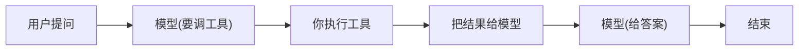
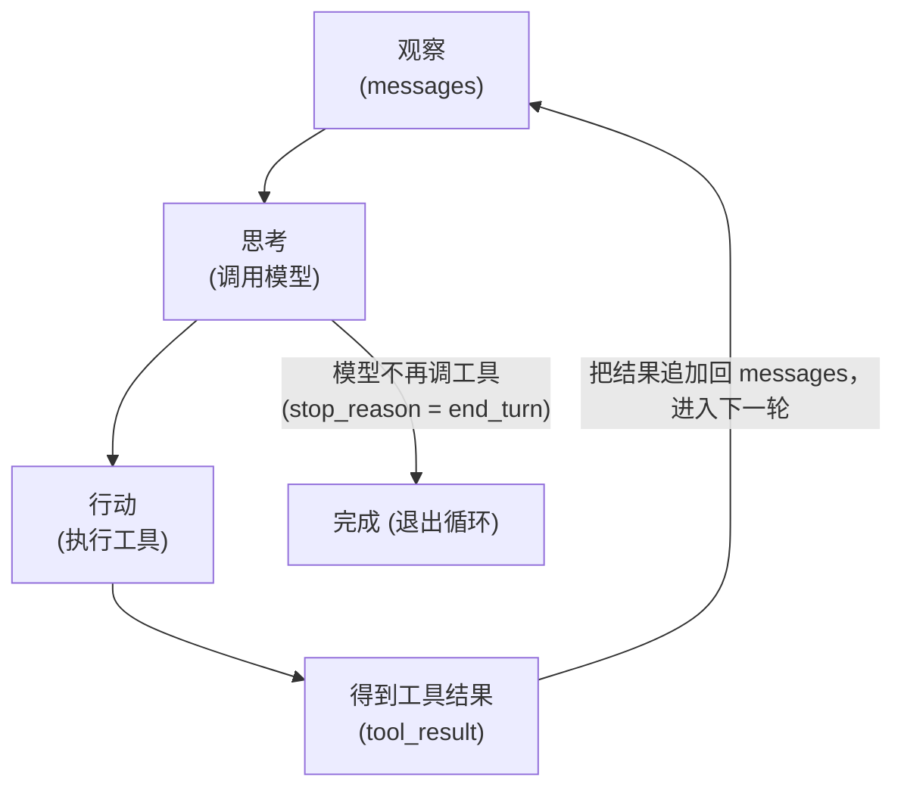
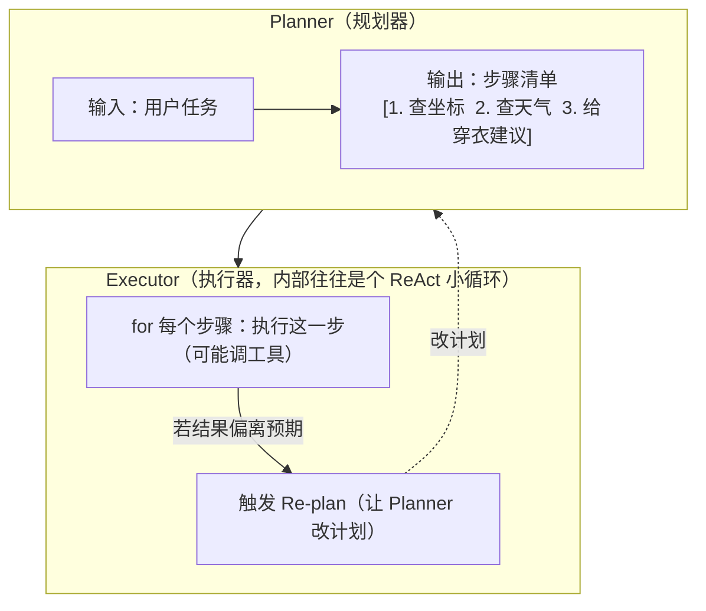
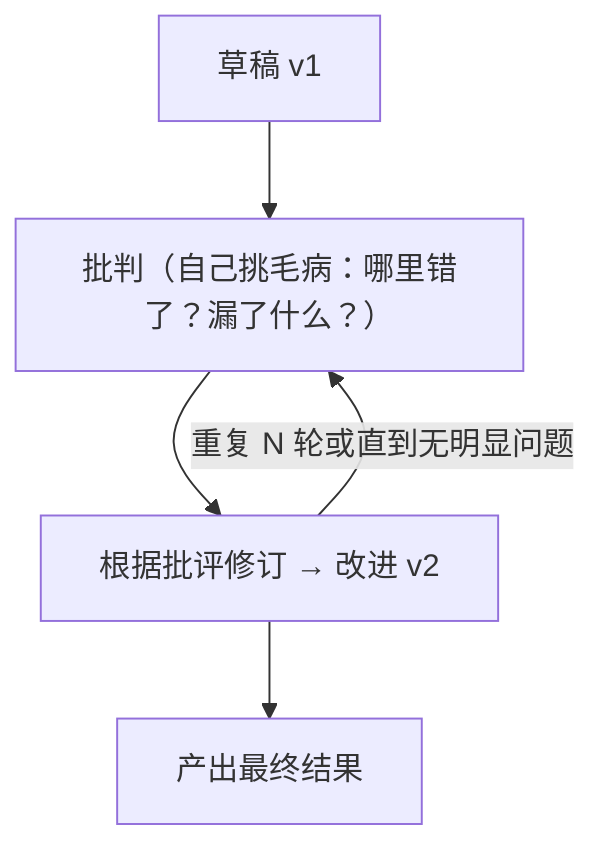

# 第 5 章 Agent 核心循环与推理范式

> 上一章你学会了一次工具调用的往返：模型说"我要调 `get_weather`"，你执行，把结果塞回去，模型给出最终答复。但真正的 Agent 不止一轮——它会**连续**地观察、思考、行动，直到任务真正完成。本章把那"一轮往返"扩展成一个**循环**，并讲清驱动这个循环的几种推理范式。

> **学习目标**
> - 理解 Agent 的本质就是一个 `while` 循环：观察 → 思考 → 行动 → 观察……直到停止。
> - 能**手写一个最小 Agent 循环**（TS + Python），复用第 4 章的工具调用，靠 `stop_reason` 决定何时退出。
> - 说清三种经典推理范式——**ReAct、Plan-and-Execute、Reflection**——的原理、适用场景与取舍。
> - 给循环装上"刹车"：最大步数、超时、各种 `stop_reason` 的处理（含 `pause_turn` 如何续跑）。
> - 用前端的事件循环 / 状态机来类比 Agent 循环，把新概念接到你已有的肌肉记忆上。

**前置知识**：第 4 章[结构化输出与函数调用](../01-基础篇/04-结构化输出与函数调用.md)（你需要知道一次 `tool_use` → 执行 → `tool_result` 的完整往返）。本章在此之上构建。

---

## 5.1 Agent 的本质：一个会自己循环的 `while`

先抛结论，再解释：

> **一个 Agent，本质上就是一个把"调用模型"放进 `while` 循环里、并允许模型在每轮调用工具的程序。**

第 4 章里，你做的是**一问一答加一次工具**：



这是**单步**的。但现实任务往往需要多步：查天气可能要先查城市的经纬度、再查该坐标的天气；改代码可能要先读文件、再搜索引用、再写回。模型一开始并不知道要调几次工具——它得**根据上一步的结果，决定下一步做什么**。

于是单步往返被自然地推广成一个循环：



- **观察（Observe）**：当前的对话历史 `messages`，包括用户的问题、模型之前的发言、上一轮工具返回的结果。
- **思考（Reason）**：把 `messages` 发给模型，模型决定"我现在要说话，还是要调某个工具"。
- **行动（Act）**：如果模型要调工具，你的代码去执行它（查数据库、调 API、读文件……）。
- **得到结果（Observe again）**：把工具结果作为新的一条消息追加进 `messages`，循环回到第一步。

什么时候停？**当模型这一轮不再要求调工具、而是直接给出了最终回答**——在 Claude 里，这表现为响应的 `stop_reason === "end_turn"`。

### 类比：这就是你熟悉的事件循环 / 状态机

前端工程师对"循环驱动"这件事其实非常熟悉，只是换了层皮：

| 前端概念 | Agent 循环里的对应物 |
| --- | --- |
| **事件循环（Event Loop）** | Agent 主循环：每一轮取一个"事件"（模型的决策）来处理，处理完再回到循环顶部 |
| **事件 / 回调** | 模型返回的 `tool_use`：相当于模型"派发"了一个需要你执行的回调 |
| **状态机的 state** | `messages` 历史：当前所处的"状态"，决定下一步动作 |
| **状态转移** | 每轮"思考→行动"：根据当前状态算出下一个状态 |
| **终止态（terminal state）** | `stop_reason === "end_turn"`：状态机走到了出口 |
| **`while(running)` + `running=false`** | 循环条件 + 退出标志 |

所以你可以把 Agent 循环读成这样一句话：**它是一个以"对话历史"为状态、以"模型决策"为事件、以"工具执行"为副作用的状态机，跑到 `end_turn` 这个终止态就停。** 后面要讲的 ReAct、Plan-and-Execute、Reflection，本质上都是**给这个状态机换不同的"转移规则"**——循环骨架是同一个。

---

## 5.2 手写一个最小 Agent 循环

光说不练假把式。我们把第 4 章那个"单次往返"改造成一个真正会循环的最小 Agent。

需求很简单：用户问"我所在城市现在适合穿什么？"——模型需要**先查城市坐标，再查该坐标的天气**，两次工具调用，最后才能回答。这正好逼出多轮循环。

### 思路拆解

1. 准备工具定义（`get_coordinates`、`get_weather`）和工具的实际实现。
2. 把用户消息放进 `messages`。
3. 进入 `while` 循环：
   - 调用模型，传入 `messages` 和 `tools`。
   - **把模型这一轮的完整回复（含 `tool_use` 块）追加进 `messages`**——这一步极易漏，漏了模型就"失忆"。
   - 看 `stop_reason`：
     - `end_turn` → 模型给出最终答案，**退出循环**。
     - `tool_use` → 取出所有 `tool_use` 块，逐个执行，把结果作为**一条** `user` 消息（里面是若干 `tool_result` 块）追加回去，继续循环。
     - 其他取值（`max_tokens` / `pause_turn` / `refusal`）→ 见 5.4 的处理。
4. 加一个 `maxSteps` 上限，防止万一陷入死循环。

> 下面的代码直接用 Anthropic Claude 的 SDK 写，因为循环逻辑和 `stop_reason` 的语义跟具体厂商强相关，讲原理时把它讲透更有价值。换到 OpenAI 时，对应概念是 `finish_reason === "tool_calls"` 触发执行、`"stop"` 表示结束，骨架一模一样。模型 ID（`claude-opus-4-8`）属易变信息，以[资源清单](../06-附录/03-资源与工具清单.md)为准。

### TypeScript

```typescript
import Anthropic from "@anthropic-ai/sdk";

const client = new Anthropic(); // 从 ANTHROPIC_API_KEY 读取密钥，绝不硬编码

// 1. 工具定义：name + description + input_schema（即第 4 章的格式）
const tools: Anthropic.Tool[] = [
  {
    name: "get_coordinates",
    description:
      "把城市名转换成经纬度。当你需要某个城市的坐标来查天气时调用。",
    input_schema: {
      type: "object",
      properties: { city: { type: "string", description: "城市名，如 '杭州'" } },
      required: ["city"],
    },
  },
  {
    name: "get_weather",
    description: "查询给定经纬度的当前天气。需要先有坐标才能调用。",
    input_schema: {
      type: "object",
      properties: {
        lat: { type: "number" },
        lon: { type: "number" },
      },
      required: ["lat", "lon"],
    },
  },
];

// 2. 工具的实际实现（这里用假数据；真实场景是查 API/数据库）
function executeTool(name: string, input: any): string {
  if (name === "get_coordinates") {
    return JSON.stringify({ lat: 30.27, lon: 120.16 }); // 杭州
  }
  if (name === "get_weather") {
    return JSON.stringify({ temp_c: 12, condition: "小雨", wind: "微风" });
  }
  return JSON.stringify({ error: `未知工具: ${name}` });
}

// 3. Agent 主循环
async function runAgent(userInput: string, maxSteps = 10): Promise<string> {
  // messages 就是 Agent 的"状态"，每轮都会增长
  const messages: Anthropic.MessageParam[] = [
    { role: "user", content: userInput },
  ];

  for (let step = 0; step < maxSteps; step++) {
    // —— 思考：把当前状态发给模型 ——
    const response = await client.messages.create({
      model: "claude-opus-4-8",
      max_tokens: 1024,
      tools,
      messages,
    });

    // 关键：把模型这一轮的完整回复追加进历史（含 tool_use 块），否则模型会"失忆"
    messages.push({ role: "assistant", content: response.content });

    // —— 看模型为什么停下来 ——
    if (response.stop_reason === "end_turn") {
      // 模型不再调工具，给出了最终答案 → 退出循环
      const finalText = response.content.find((b) => b.type === "text");
      return finalText && finalText.type === "text" ? finalText.text : "";
    }

    if (response.stop_reason === "tool_use") {
      // —— 行动：取出所有 tool_use 块，逐个执行 ——
      const toolResults: Anthropic.ToolResultBlockParam[] = [];
      for (const block of response.content) {
        if (block.type === "tool_use") {
          console.log(`[第 ${step + 1} 步] 调用工具 ${block.name}`, block.input);
          const result = executeTool(block.name, block.input);
          toolResults.push({
            type: "tool_result",
            tool_use_id: block.id, // 必须回填对应的 id，模型靠它匹配
            content: result,
          });
        }
      }
      // —— 观察：把所有工具结果作为「一条」user 消息追加回去 ——
      // （为什么必须放在同一条消息里，第 6 章并行工具调用会专门讲）
      messages.push({ role: "user", content: toolResults });
      continue; // 回到循环顶部，让模型基于新结果继续思考
    }

    // 其他 stop_reason（max_tokens / pause_turn / refusal）见 5.4
    throw new Error(`未处理的 stop_reason: ${response.stop_reason}`);
  }

  throw new Error(`超过最大步数 ${maxSteps}，强制停止（疑似死循环）`);
}

const answer = await runAgent("我在杭州，现在出门适合穿什么？");
console.log("最终答案：", answer);
```

### Python

```python
import json
import os
import anthropic

client = anthropic.Anthropic()  # 从 ANTHROPIC_API_KEY 读取密钥

# 1. 工具定义
tools = [
    {
        "name": "get_coordinates",
        "description": "把城市名转换成经纬度。当你需要某个城市的坐标来查天气时调用。",
        "input_schema": {
            "type": "object",
            "properties": {"city": {"type": "string", "description": "城市名，如 '杭州'"}},
            "required": ["city"],
        },
    },
    {
        "name": "get_weather",
        "description": "查询给定经纬度的当前天气。需要先有坐标才能调用。",
        "input_schema": {
            "type": "object",
            "properties": {"lat": {"type": "number"}, "lon": {"type": "number"}},
            "required": ["lat", "lon"],
        },
    },
]


# 2. 工具的实际实现（假数据）
def execute_tool(name: str, tool_input: dict) -> str:
    if name == "get_coordinates":
        return json.dumps({"lat": 30.27, "lon": 120.16})  # 杭州
    if name == "get_weather":
        return json.dumps({"temp_c": 12, "condition": "小雨", "wind": "微风"})
    return json.dumps({"error": f"未知工具: {name}"})


# 3. Agent 主循环
def run_agent(user_input: str, max_steps: int = 10) -> str:
    # messages 就是 Agent 的"状态"
    messages = [{"role": "user", "content": user_input}]

    for step in range(max_steps):
        # —— 思考：把当前状态发给模型 ——
        response = client.messages.create(
            model="claude-opus-4-8",
            max_tokens=1024,
            tools=tools,
            messages=messages,
        )

        # 关键：把模型这一轮的完整回复追加进历史（含 tool_use 块）
        messages.append({"role": "assistant", "content": response.content})

        # —— 看模型为什么停下来 ——
        if response.stop_reason == "end_turn":
            # 给出最终答案 → 退出循环
            for block in response.content:
                if block.type == "text":
                    return block.text
            return ""

        if response.stop_reason == "tool_use":
            # —— 行动：取出所有 tool_use 块逐个执行 ——
            tool_results = []
            for block in response.content:
                if block.type == "tool_use":
                    print(f"[第 {step + 1} 步] 调用工具 {block.name}", block.input)
                    result = execute_tool(block.name, block.input)
                    tool_results.append({
                        "type": "tool_result",
                        "tool_use_id": block.id,  # 必须回填，模型靠它匹配
                        "content": result,
                    })
            # —— 观察：所有工具结果放在「一条」user 消息里 ——
            messages.append({"role": "user", "content": tool_results})
            continue

        # 其他 stop_reason 见 5.4
        raise RuntimeError(f"未处理的 stop_reason: {response.stop_reason}")

    raise RuntimeError(f"超过最大步数 {max_steps}，强制停止（疑似死循环）")


answer = run_agent("我在杭州，现在出门适合穿什么？")
print("最终答案：", answer)
```

运行后你会看到类似的轨迹：

```
[第 1 步] 调用工具 get_coordinates { city: '杭州' }
[第 2 步] 调用工具 get_weather { lat: 30.27, lon: 120.16 }
最终答案： 杭州现在 12°C、有小雨，建议穿一件保暖外套，并带把伞……
```

注意循环跑了三轮：第 1、2 轮模型分别调了一个工具（`stop_reason === "tool_use"`），第 3 轮模型拿到天气后直接给答案（`stop_reason === "end_turn"`），循环退出。**模型自己决定了调几次工具、调什么顺序**——你的代码只负责忠实地执行并回填结果。这就是 Agent 循环的全部魔法。

### `messages` 历史是怎么长大的

把上面那段循环里 `messages` 的演变摊开看，更直观（这正是"状态机的 state 在转移"）：

```
初始：
  [ user: "我在杭州……" ]

第 1 轮模型返回 tool_use(get_coordinates)，追加 assistant + 执行后追加 user(tool_result)：
  [ user: "我在杭州……",
    assistant: [text?, tool_use(get_coordinates, id=t1)],
    user: [tool_result(t1, {lat,lon})] ]

第 2 轮模型返回 tool_use(get_weather)，再追加一对：
  [ ...,
    assistant: [tool_use(get_weather, id=t2)],
    user: [tool_result(t2, {temp,condition})] ]

第 3 轮模型返回 end_turn：
  [ ...,
    assistant: [text: "杭州现在 12°C……"] ]   ← 退出
```

每一轮都是「追加 assistant 回复 + 追加 user(tool_result)」这一对，直到某轮 assistant 不再带 `tool_use`。**Agent 没有隐藏的服务端状态**——整个"记忆"就是这个不断增长的 `messages` 数组，每次请求你都把它完整发回去。这也解释了为什么第 7 章[记忆与上下文管理](./07-记忆与上下文管理.md)如此重要：循环跑得越久，`messages` 越长，迟早会撑爆上下文窗口。

---

## 5.3 推理范式：循环里"怎么思考"

上面的最小循环用的是最朴素的策略：**走一步看一步**。但"怎么思考下一步"本身大有讲究，社区沉淀出了几种经典范式。它们不改循环骨架，只改"思考"那一格的玩法。

### 5.3.1 ReAct：边推理边行动

**ReAct = Reasoning + Acting**（推理 + 行动），是最经典、也是上面那个最小循环实际在用的范式。核心思想一句话：

> **让模型在每一步交替地"想一句"和"做一件事"——先用自然语言推理"我现在该干嘛、为什么"，再发出一个动作（调工具），看到结果后再推理下一步。**

它的轨迹长这样（经典 ReAct 论文里把每步显式标成 Thought / Action / Observation）：

```
Thought 1: 要知道穿什么，得先知道天气；要查天气，得先有坐标。先查坐标。
Action 1:  get_coordinates(city="杭州")
Observation 1: { lat: 30.27, lon: 120.16 }

Thought 2: 有坐标了，现在查这个坐标的天气。
Action 2:  get_weather(lat=30.27, lon=120.16)
Observation 2: { temp_c: 12, condition: "小雨" }

Thought 3: 12 度还下雨，建议外套 + 伞。可以回答了。
Answer:    杭州现在 12°C 有小雨，建议……
```

**为什么有效？** 把"推理"显式地穿插进来，相当于让模型在每次行动前"出声思考"，这能显著提升多步任务的正确率——模型不会盲目调工具，而是基于上一步结果做判断。在现代 Claude 模型里，你不需要手动让它输出 `Thought:` 前缀，开启**自适应思考**（`thinking: {type: "adaptive"}`）模型就会在工具调用之间自动进行推理；旧式的"在 prompt 里要求它先写 Thought 再写 Action"是早期模型的做法。

> **细节**：4.6 及以上的 Claude 模型用 `thinking: {type: "adaptive"}` 开启思考，**不要**用旧的 `budget_tokens`（新模型会报 400）。开启自适应思考后，工具调用之间的"交错思考"会自动发生，无需额外的 beta header。OpenAI 侧则有 reasoning 系列模型对应这种"先想后做"。

**5.2 那个最小循环就是一个 ReAct 循环**——你已经会写了。它是其他范式的基线。

### 5.3.2 Plan-and-Execute：先规划，再分步执行

ReAct 是"走一步想一步"，对长任务有个隐患：**容易走着走着就偏题或绕路**，因为它从不在全局层面规划。**Plan-and-Execute（先规划后执行）** 换了个思路：

> **先让模型把整个任务拆成一个步骤清单（Plan），再按清单逐步执行（Execute），执行中可以回头修订计划。**

结构上它通常是"两个角色 + 一个外层循环"：



**适用场景**：步骤多、依赖关系复杂、希望"先有个全局蓝图"的长任务。例如"调研三家竞品并产出对比报告"——先规划出"分别调研 A/B/C → 汇总 → 写报告"四步，比走一步看一步更不容易丢三落四。

下面给一个**简化的** Plan-and-Execute 骨架，重点展示"先要计划、再逐步执行"的形状（执行每一步时复用 5.2 的 `runAgent`）。

#### TypeScript

```typescript
// 第 1 阶段：规划——让模型输出一个步骤清单（用结构化输出强约束成数组）
async function makePlan(task: string): Promise<string[]> {
  const response = await client.messages.create({
    model: "claude-opus-4-8",
    max_tokens: 1024,
    // 结构化输出：强制返回 { steps: string[] }（详见第 4 章）
    output_config: {
      format: {
        type: "json_schema",
        schema: {
          type: "object",
          properties: { steps: { type: "array", items: { type: "string" } } },
          required: ["steps"],
          additionalProperties: false,
        },
      },
    },
    messages: [
      {
        role: "user",
        content: `把下面的任务拆成有序的执行步骤，每步一句话：\n${task}`,
      },
    ],
  });
  const text = response.content.find((b) => b.type === "text");
  return text && text.type === "text" ? JSON.parse(text.text).steps : [];
}

// 第 2 阶段：执行——逐步跑，每步复用 5.2 的 ReAct 循环
async function planAndExecute(task: string): Promise<string> {
  const steps = await makePlan(task);
  console.log("计划：", steps);

  const results: string[] = [];
  for (const [i, step] of steps.entries()) {
    console.log(`\n执行第 ${i + 1} 步：${step}`);
    // 把"已完成步骤的结果"作为上下文喂给当前步骤
    const context = results.length ? `已知信息：\n${results.join("\n")}\n\n` : "";
    const result = await runAgent(`${context}现在执行：${step}`);
    results.push(`步骤 ${i + 1} 结果：${result}`);
  }
  // 汇总
  return runAgent(`基于以下步骤结果，给出最终答复：\n${results.join("\n")}`);
}
```

#### Python

```python
import json


# 第 1 阶段：规划
def make_plan(task: str) -> list[str]:
    response = client.messages.create(
        model="claude-opus-4-8",
        max_tokens=1024,
        # 结构化输出：强制返回 { steps: [...] }
        output_config={
            "format": {
                "type": "json_schema",
                "schema": {
                    "type": "object",
                    "properties": {"steps": {"type": "array", "items": {"type": "string"}}},
                    "required": ["steps"],
                    "additionalProperties": False,
                },
            }
        },
        messages=[{"role": "user", "content": f"把下面的任务拆成有序的执行步骤，每步一句话：\n{task}"}],
    )
    for block in response.content:
        if block.type == "text":
            return json.loads(block.text)["steps"]
    return []


# 第 2 阶段：逐步执行，每步复用 5.2 的 run_agent
def plan_and_execute(task: str) -> str:
    steps = make_plan(task)
    print("计划：", steps)

    results: list[str] = []
    for i, step in enumerate(steps):
        print(f"\n执行第 {i + 1} 步：{step}")
        context = "已知信息：\n" + "\n".join(results) + "\n\n" if results else ""
        result = run_agent(f"{context}现在执行：{step}")
        results.append(f"步骤 {i + 1} 结果：{result}")

    return run_agent("基于以下步骤结果，给出最终答复：\n" + "\n".join(results))
```

> **代价**：Plan-and-Execute 多了一次"规划"调用，且计划一旦做死、执行时不灵活会出问题，所以实践中常配"重规划（re-plan）"——执行某步发现不对就回炉改计划。这也是为什么很多框架（如 LangGraph）把它做成可循环的图。

### 5.3.3 Reflection：让模型批判并改进自己

前两种都是"往前做"。**Reflection（反思 / 自我批判）** 加了一道"回头看"的工序：

> **模型先产出一版结果，然后扮演"批评者"审视自己的输出、挑毛病，再据此改一版——可以反复几轮，直到自己挑不出问题或达到次数上限。**



**适用场景**：对**质量**敏感、且"好坏可被语言描述"的任务——写作润色、代码 review 后自我修复、复杂推理的查错。比如让模型写一段代码后，再让它以 reviewer 身份找 bug，然后自己修。

最小实现就是一个"生成 → 批判 → 修订"的小循环：

#### TypeScript

```typescript
async function chat(prompt: string): Promise<string> {
  const r = await client.messages.create({
    model: "claude-opus-4-8",
    max_tokens: 2048,
    messages: [{ role: "user", content: prompt }],
  });
  const t = r.content.find((b) => b.type === "text");
  return t && t.type === "text" ? t.text : "";
}

async function reflect(task: string, rounds = 2): Promise<string> {
  let draft = await chat(`完成以下任务：\n${task}`); // 草稿 v1

  for (let i = 0; i < rounds; i++) {
    // —— 批判：让模型以挑剔的评审身份找问题 ——
    const critique = await chat(
      `你是一位严格的评审。任务是：${task}\n\n` +
        `下面是一份答案，请只列出它的具体问题（若确实没问题，回复"无明显问题"）：\n\n${draft}`,
    );
    if (critique.includes("无明显问题")) break; // 自己挑不出毛病了，提前结束

    // —— 改进：根据批评修订 ——
    draft = await chat(
      `任务：${task}\n\n原答案：\n${draft}\n\n评审意见：\n${critique}\n\n` +
        `请根据评审意见给出改进后的完整答案：`,
    );
    console.log(`第 ${i + 1} 轮反思后已修订`);
  }
  return draft;
}
```

#### Python

```python
def chat(prompt: str) -> str:
    r = client.messages.create(
        model="claude-opus-4-8",
        max_tokens=2048,
        messages=[{"role": "user", "content": prompt}],
    )
    for block in r.content:
        if block.type == "text":
            return block.text
    return ""


def reflect(task: str, rounds: int = 2) -> str:
    draft = chat(f"完成以下任务：\n{task}")  # 草稿 v1

    for i in range(rounds):
        # —— 批判 ——
        critique = chat(
            f"你是一位严格的评审。任务是：{task}\n\n"
            f'下面是一份答案，请只列出它的具体问题（若确实没问题，回复"无明显问题"）：\n\n{draft}'
        )
        if "无明显问题" in critique:
            break  # 提前结束

        # —— 改进 ——
        draft = chat(
            f"任务：{task}\n\n原答案：\n{draft}\n\n评审意见：\n{critique}\n\n"
            f"请根据评审意见给出改进后的完整答案："
        )
        print(f"第 {i + 1} 轮反思后已修订")
    return draft
```

> **代价**：每轮反思都是额外的模型调用，慢且贵；而且模型有时会"自我感觉良好"挑不出真问题，或反复在小处打转。所以一定要设**轮数上限**，并优先用在质量收益明显的场景。Reflection 也常与第 9 章[多 Agent 协作系统](./09-多agent协作系统.md)结合——用一个**独立的** Agent 当评审，往往比"自己批判自己"更狠、更客观。

### 5.3.4 三种范式对比

| 范式 | 一句话原理 | 适用场景 | 优点 | 缺点 |
| --- | --- | --- | --- | --- |
| **ReAct** | 交替"想一步、做一步" | 通用多步任务、需要边做边查（搜索、工具调用） | 简单、灵活、是默认基线；轨迹可解释 | 缺乏全局规划，长任务可能绕路或偏题 |
| **Plan-and-Execute** | 先列步骤清单，再逐步执行（可重规划） | 步骤多、依赖复杂的长任务（调研、报告、多文件改动） | 有全局蓝图，不易丢步骤；步骤可并行/复用 | 多一次规划调用；计划做死则不灵活，需配重规划 |
| **Reflection** | 产出后自我批判、再改进，循环 N 轮 | 对质量敏感、好坏可被描述的任务（写作、代码自查、复杂推理） | 显著提升输出质量与正确率 | 慢且贵；可能挑不出真问题或原地打转，须设轮数上限 |

**实战里它们常常组合使用**：一个 Plan-and-Execute 的执行器，内部每一步是个 ReAct 小循环；产出报告后再套一轮 Reflection 自查。别把它们当成互斥的选择题——它们是**可叠加的策略**，循环骨架始终是 5.2 那个。

---

## 5.4 终止条件与防护：给循环装刹车

让模型在循环里自己决定下一步，威力很大，风险也实在：**它可能停不下来**。一个没装刹车的 Agent 循环，轻则烧钱（每轮都是一次 API 调用），重则把你的限额跑干。生产级 Agent 必须有这几道防护。

### 5.4.1 最大步数（必备）

你已经在 5.2 见过了：`for (step = 0; step < maxSteps; step++)`。这是**最重要的一道刹车**。模型偶尔会陷入"调工具→拿结果→又调同样的工具"的怪圈，或者两个工具来回踢皮球。一个硬上限（比如 10～50 步，视任务复杂度）能保证循环一定会终止。

超限后别静默吞掉——记录日志、抛出明确错误，或返回"我尝试了 N 步仍未完成"，方便排查。

### 5.4.2 超时（推荐）

步数有限不代表时间有限——某一步的工具可能卡住（慢 API、死等的网络请求）。给整个循环加一个**墙钟超时**（wall-clock timeout）更稳妥：

#### TypeScript

```typescript
async function runAgentWithTimeout(
  userInput: string,
  maxSteps = 10,
  timeoutMs = 60_000, // 整个循环最多跑 60 秒
): Promise<string> {
  const deadline = Date.now() + timeoutMs;
  const messages: Anthropic.MessageParam[] = [
    { role: "user", content: userInput },
  ];

  for (let step = 0; step < maxSteps; step++) {
    if (Date.now() > deadline) {
      throw new Error(`循环超时（>${timeoutMs}ms），已跑 ${step} 步`);
    }
    // ……其余与 5.2 相同：调用模型、处理 stop_reason……
  }
  throw new Error(`超过最大步数 ${maxSteps}`);
}
```

#### Python

```python
import time


def run_agent_with_timeout(user_input: str, max_steps: int = 10, timeout_s: float = 60.0) -> str:
    deadline = time.monotonic() + timeout_s  # 用 monotonic，不受系统时钟调整影响
    messages = [{"role": "user", "content": user_input}]

    for step in range(max_steps):
        if time.monotonic() > deadline:
            raise RuntimeError(f"循环超时（>{timeout_s}s），已跑 {step} 步")
        # …… 其余与 5.2 相同 ……
    raise RuntimeError(f"超过最大步数 {max_steps}")
```

> 单次模型调用本身也该有超时——SDK 默认有（如 Python 默认 10 分钟）。但**循环级**的总超时是另一回事：它管的是"整个任务最多花多久"，必须自己加。

### 5.4.3 `stop_reason` 全家桶：每个取值都要有归宿

5.2 的循环只处理了 `end_turn` 和 `tool_use`，那是为了讲清主干。生产代码里，**模型这一轮停下来的原因不止这两种**，每个取值都得有明确处理，否则就是隐藏的 bug。Claude 的 `stop_reason` 取值与含义：

| `stop_reason` | 含义 | 你该怎么做 |
| --- | --- | --- |
| `end_turn` | 模型自然说完了，给出了最终答复 | 退出循环，返回文本 |
| `tool_use` | 模型要调一个或多个工具 | 执行工具，把 `tool_result` 回填，继续循环 |
| `max_tokens` | 撞到了 `max_tokens` 上限，回复被**截断** | 调大 `max_tokens` 重试，或改用流式；别当成完整回复用 |
| `stop_sequence` | 命中了你设的自定义停止序列 | 按你的业务逻辑处理 |
| `pause_turn` | 长时间运行的（服务端）操作被暂停，可续跑 | **把本轮回复原样发回去让它续跑**（见下） |
| `refusal` | 模型出于安全原因拒绝 | 别重试同样的 prompt；向用户说明，记录 `stop_details` |

其中 `pause_turn` 最容易踩坑，单独说。

### 5.4.4 处理 `pause_turn`：让长任务"接着跑"

当你用**服务端工具**（如 Claude 的内置代码执行、网页搜索）时，Anthropic 会在服务端跑一个采样小循环。如果它跑到了内部迭代上限，会以 `stop_reason: "pause_turn"` 把控制权交回给你——意思是"我还没干完，但先喘口气，你把这轮原样发回来我就接着跑"。

正确的续跑方式很有讲究：**把用户消息和模型这轮的回复（含未完成的 `server_tool_use` 块）一起作为新一轮请求发回去，不要额外加一句 "Continue" 或别的用户消息**——API 看到结尾是 `server_tool_use` 就知道要续跑。

#### TypeScript

```typescript
// 在主循环里处理 pause_turn（接 5.2 的 stop_reason 分支）
if (response.stop_reason === "pause_turn") {
  // 把这一轮的回复原样追加进 messages（5.2 里已经 push 过 assistant），
  // 然后直接 continue —— 下一轮请求会带上未完成的 server_tool_use 块，
  // 服务端据此自动续跑，无需添加任何额外的 user 消息。
  console.log(`[第 ${step + 1} 步] 服务端操作暂停，续跑中……`);
  continue;
}
```

#### Python

```python
# 在主循环里处理 pause_turn（接 5.2 的 stop_reason 分支）
if response.stop_reason == "pause_turn":
    # 这一轮的 assistant 回复（含未完成的 server_tool_use 块）已追加进 messages，
    # 直接 continue —— 下一轮请求带上它，服务端自动续跑。
    # 切记：不要额外 append 一条 {"role": "user", "content": "Continue"} 之类的消息！
    print(f"[第 {step + 1} 步] 服务端操作暂停，续跑中……")
    continue
```

> 为防 `pause_turn` 无限续跑，同样给它配一个 `maxContinuations`（比如 5），超过就停。本质上它和"最大步数"是同一类刹车。

### 5.4.5 其它防护（点到为止）

- **重复检测**：记录最近几轮的"工具名 + 参数"，如果模型连续多次发出**完全相同**的工具调用，大概率卡住了，可以提前终止或注入一条提示打破循环。
- **成本预算**：累加每轮的 token 用量，超过预算阈值就停（详见第 15 章成本与性能优化）。
- **危险操作确认**：删除、付款、发邮件这类不可逆动作，执行前要人类确认——这属于工具系统的职责，下一章第 6 章会专门讲 human-in-the-loop。

---

## 5.5 可观测预告：循环里每一步都要"留痕"

你可能已经注意到，前面代码里到处是 `console.log` / `print`——这不是凑数，而是 Agent 开发的刚需。

Agent 循环是个**黑盒套黑盒**：模型的决策不可控，工具的结果不可预期，循环跑了几轮、每轮调了什么、为什么最后给出这个答案——**不记录，出了问题你根本无从查起**。所以一条经验是：

> **循环里的每一步都应该留痕**：第几步、模型这轮的 `stop_reason`、调了哪个工具传了什么参数、工具返回了什么、耗时多少、用了多少 token。

最朴素的就是打日志（像上面那样）；生产环境则会用结构化的 **tracing**（链路追踪），把每一轮、每一次工具调用记成一个 span，串成一条可视化的调用链。这套东西——LangSmith、Langfuse、OpenTelemetry——是第 14 章[可观测性与调试](../03-工程篇/14-可观测性与调试.md)的主题。现在你只要记住：**写 Agent 循环时，顺手把每步的关键信息记下来**，将来调试会感激现在的自己。

---

## 5.6 前端视角：Agent 循环就是一个状态机

回到本章开头的类比，现在你写过循环了，可以把它落得更实。一个 Agent 循环和你在前端写过的东西高度同构：

- **它像 `useReducer` / 状态机库（XState）。** `messages` 是 state；模型返回的决策是 dispatch 的 action；"执行工具 + 追加结果"是 reducer 算出 next state；`end_turn` 是终止态。你完全可以用 XState 那套"状态 + 转移 + 终态"的思维来组织一个复杂 Agent。

- **它像事件循环。** 主循环每轮取一个"事件"（模型决策）处理，处理完回到顶部——和浏览器/Node 的 event loop 取宏任务的节奏一样。`pause_turn` 则像一个 `await`：当前任务让出控制权，下一轮再被唤醒接着跑。

- **不同推理范式 = 不同的"调度策略"。** ReAct 是"来一个处理一个"的朴素调度；Plan-and-Execute 像先把任务拆成一个队列再依次消费；Reflection 像给结果加了一道"重渲染前的 diff 校验"。骨架不变，策略可换。

- **流式输出是你的主场。** 这个循环每一步的产出（思考、工具调用、最终文本）都可以**流式地推给前端**，做成像 ChatGPT 那样逐字蹦、还能看到"正在调用 XX 工具"的体验。怎么把循环接到 SSE、怎么在 React/Vue 里渲染这种流式 Agent UI——这是第 12 章[流式输出与前端集成](../03-工程篇/12-流式输出与前端集成.md)的内容，也是前端工程师相比后端/算法同学的天然优势。

一句话：**你不是在学一个全新的东西，你是在用熟悉的"循环 + 状态机 + 事件驱动"思维，去驱动一个会调用模型和工具的新型 runtime。**

---

## 常见坑 / 最佳实践

- **忘记把 `assistant` 回复追加进 `messages`。** 最高频的 bug。每轮模型回复（尤其含 `tool_use` 块的那条）必须 `push` 回历史，否则下一轮模型看不到自己刚说过什么、刚发起了什么工具调用，会重复或错乱。
- **`tool_result` 没回填正确的 `tool_use_id`。** 模型靠 `id` 把结果和它发起的调用对上号。回错或漏回，模型会困惑甚至报错。
- **没有最大步数 / 超时。** 等于给模型一张没有额度上限的信用卡。任何 Agent 循环都必须有硬刹车。
- **只处理 `end_turn` 和 `tool_use`，漏了其他 `stop_reason`。** `max_tokens`（截断）当成完整答复用、`pause_turn` 不会续跑、`refusal` 不处理——都是线上事故的来源。
- **`pause_turn` 续跑时画蛇添足加 "Continue"。** 直接把原样回复发回去即可，多加用户消息反而打断服务端的续跑逻辑。
- **盲目套 Plan-and-Execute / Reflection。** 简单任务上，多出来的规划/反思调用纯属浪费钱和时间。先用 ReAct 跑通，确实有"绕路""质量不稳"的痛点再升级范式。
- **不留痕。** 循环里不打日志/不 tracing，出问题时只能干瞪眼。开发第一天就把每步的关键信息记下来。
- **新模型别再手写 ReAct prompt。** "请先输出 Thought 再输出 Action"是旧模型的玩法。现代模型开自适应思考（`thinking: {type: "adaptive"}`）即可，自己写一套 Thought/Action 解析既脆弱又没必要。

---

## 本章小结

1. **Agent 的本质是一个 `while` 循环**：观察（messages）→ 思考（调模型）→ 行动（执行工具）→ 观察（回填结果）……直到模型不再调工具（`stop_reason === "end_turn"`）。
2. **你已经会手写最小 Agent 循环了**：复用第 4 章的工具调用，加 `while` + `stop_reason` 判断 + `maxSteps`，每轮把 `assistant` 回复和 `tool_result` 追加进 `messages`。
3. **三种推理范式可叠加，不互斥**：ReAct（边想边做，默认基线）、Plan-and-Execute（先规划后执行，适合长任务）、Reflection（自我批判改进，适合质量敏感任务）。
4. **循环必须有刹车**：最大步数（必备）、墙钟超时（推荐）、完整处理所有 `stop_reason`（尤其 `pause_turn` 的续跑、`max_tokens` 的截断、`refusal` 的拒绝）。
5. **每一步都要留痕**，为第 14 章的可观测性打底；用前端的事件循环 / 状态机思维去理解和组织 Agent 循环，会非常顺手。

---

## 练习题

1. **（基础）** 把 5.2 的最小 Agent 循环跑起来（TS 或 Python 任选），把工具实现从假数据换成真实的天气/坐标 API（如 Open-Meteo 免费接口）。观察 `messages` 在每轮如何增长，打印出每一轮的 `stop_reason`。

2. **（基础）** 给 5.2 的循环补上 `max_tokens`、`refusal` 两个 `stop_reason` 分支的处理：`max_tokens` 时把上限调大重试一次，`refusal` 时打印 `stop_details` 并优雅返回。

3. **（进阶）** 实现 5.4.5 提到的"重复检测"：用一个 `Set`/`set` 记录最近 N 轮的"工具名+参数序列化字符串"，若检测到连续重复就提前终止并报告，防止模型卡死在同一个工具调用上。

4. **（进阶）** 把 5.3.3 的 Reflection 改造成"独立评审"：不再让同一个模型自己批判自己，而是用一个角色完全不同的 `chat()` 调用（甚至换一个更便宜的模型）当评审。对比"自我反思"和"独立评审"在挑出问题上的差异。

5. **（挑战）** 把 Plan-and-Execute 升级为支持**重规划**：在 `planAndExecute` 的执行循环里，每完成一步就让模型判断"当前计划是否还合理"，若不合理则重新生成剩余步骤的计划。思考：怎么防止它无限重规划？（提示：给重规划次数也加个上限，和最大步数同理。）

---

## 延伸阅读

- **ReAct 原始论文**：Yao et al., *"ReAct: Synergizing Reasoning and Acting in Language Models"*（关键词：ReAct、Thought/Action/Observation）。理解"推理与行动交替"的源头。
- **Plan-and-Solve / Plan-and-Execute**：搜索 "Plan-and-Solve Prompting" 与 LangGraph 官方文档里的 "Plan-and-Execute" 示例。
- **Reflexion**：Shinn et al., *"Reflexion: Language Agents with Verbal Reinforcement Learning"*——Reflection 范式的代表性工作。
- **Anthropic 官方文档**：搜索 "tool use"、"handling stop reasons"、"adaptive thinking"——`stop_reason` 各取值、`pause_turn` 续跑、自适应思考的权威说明（模型 ID / 参数以官方为准）。
- **OpenAI 官方文档**：function calling 与 `finish_reason` 的语义，对照理解"换厂商时骨架不变"。
- 本书后续：第 6 章[工具系统设计](./06-工具系统设计.md)（把循环里的"行动"那一格做扎实）、第 7 章[记忆与上下文管理](./07-记忆与上下文管理.md)（循环跑久了 `messages` 撑爆怎么办）、第 14 章[可观测性与调试](../03-工程篇/14-可观测性与调试.md)（把"留痕"工程化）。
