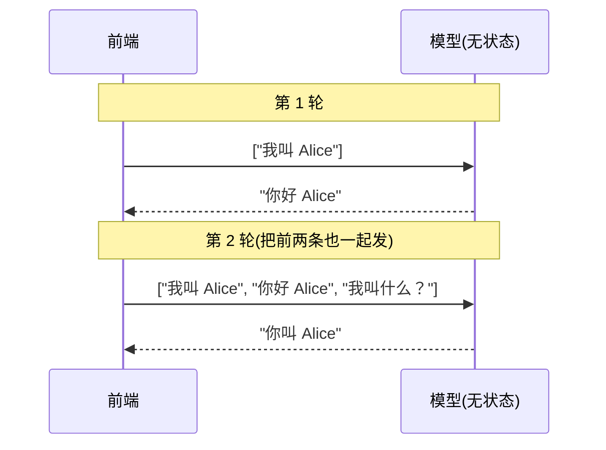
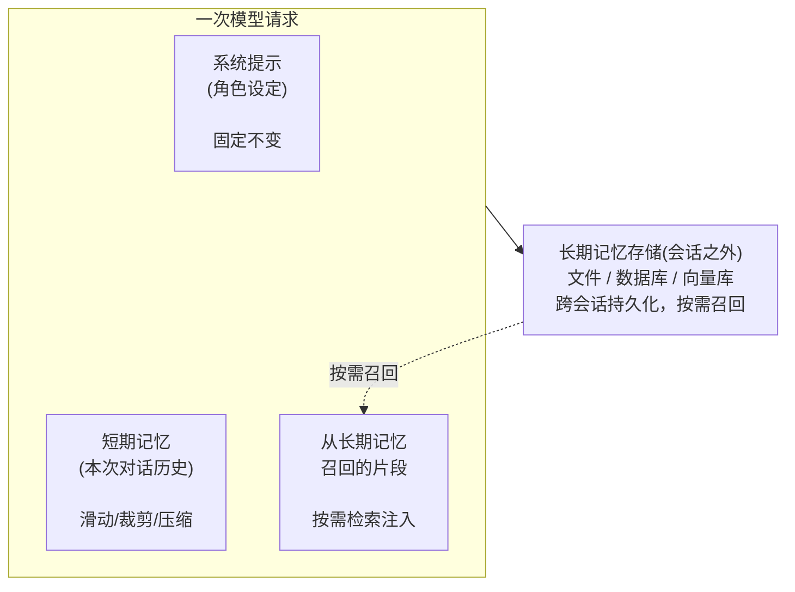
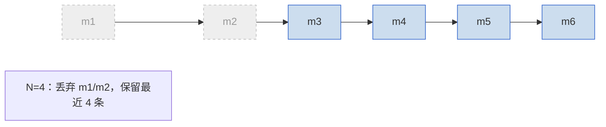
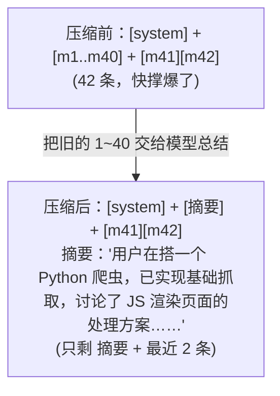
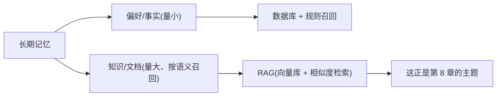

# 第 7 章 记忆与上下文管理

> 上一章我们让 Agent 学会了"用工具做事"。但你很快会发现一个尴尬的问题：它做完一件事，下一轮就忘了刚才发生了什么。模型本身是**无状态**的，记忆得你自己造。这一章讲清楚记忆从哪来、怎么管、怎么省钱。

> **学习目标**
> - 理解为什么 LLM 需要外挂记忆，以及上下文窗口的硬约束
> - 掌握短期记忆（对话历史）的三种管理手段：滑动窗口、按 token 裁剪、摘要压缩（compaction）
> - 掌握长期记忆的存储与召回策略：什么值得记、何时召回
> - 建立"上下文工程（context engineering）"的概念，知道它为什么是 Agent 工程的核心功夫
> - 能用 TypeScript / Python 各写一个可运行的简单记忆模块
> - 看清记忆与 RAG 的关系，为第 8 章铺路

> **前置知识**：第 2 章（Token、上下文窗口）、第 5 章（Agent 循环）、第 6 章（工具系统）。本章不需要任何机器学习背景。

---

## 7.1 为什么需要记忆：模型是无状态的

先纠正一个直觉。你调用 ChatGPT 网页版，它"记得"你上一句说了什么，于是你以为模型内部存了状态。**不是的。** 模型 API 本身完全无状态——每次请求都是独立的，模型不会在两次请求之间记住任何东西。网页版之所以"记得"，是因为前端每次都把**完整的对话历史**重新发给后端，后端再原样发给模型。

用前端的话说：

> 调用 LLM 像调用一个**纯函数** `f(messages) -> reply`。同样的 `messages` 进去，（在采样随机性之外）就是同样的逻辑产出。它没有 `this`，没有闭包，没有 React 的 `useState`。你想让它"有记忆"，就得每次把状态当参数传进去。

这一点在前几章的代码里其实已经体现了——我们每轮都把 `messages` 数组整个发出去：



模型"记得"Alice，纯粹是因为第 2 轮请求里带上了第 1 轮的内容。

### 矛盾就出在这里

既然"把历史全发过去"就能有记忆，那直接全发不就行了？两个硬约束让你不能这么干：

1. **上下文窗口有限。** 模型一次能接收的 token 数有上限。即便现在主流模型上下文已经很大（Claude Opus 4.8 / Sonnet 4.6 是 1M token，Claude Haiku 4.5 是 200K，OpenAI GPT-4.1 系列也到了百万级，具体以官方文档为准），一个跑了几小时的 Agent、一个翻了几百页文档的助手，照样能把窗口塞爆。

2. **token 是按量收费的，而且是平方级的痛。** 每一轮你都把全部历史重发一遍，意味着对话越长，每轮的输入 token 越多，单轮越贵。10 轮对话，第 10 轮要把前 9 轮全带上。把整个 1M 窗口塞满再发，一次输入就是 $5（按 Opus 4.8 输入 $5/百万 token 计；价格以官方为准）。无脑全量重发，是新手最容易踩的烧钱坑。

> ⚠️ 上下文窗口大 ≠ 可以无脑塞满。除了贵，过长上下文还会稀释模型注意力（业界俗称 "lost in the middle"：放在中间的信息容易被忽略）。**给模型对的信息，而不是所有信息**——这是本章和第 8 章共同的主线。

所以"记忆管理"的本质是：**在有限的、收费的上下文窗口里，决定每一轮带什么、丢什么、压什么。** 下面分短期和长期两块讲。

---

## 7.2 记忆的两层：短期 vs 长期

人脑有工作记忆（你正在想的事）和长期记忆（你昨天学的知识）。Agent 也照这个分：



| | 短期记忆 | 长期记忆 |
| --- | --- | --- |
| **是什么** | 当前这段对话的历史消息 | 跨会话保留的知识、事实、偏好 |
| **活多久** | 一个会话（一次任务）内 | 永久，直到你删它 |
| **存在哪** | 内存里的 `messages` 数组 | 文件 / 数据库 / 向量库 |
| **前端类比** | 组件 `state`、一次会话的内存 | `localStorage`、后端数据库 |
| **挑战** | 窗口塞不下，要裁剪/压缩 | 怎么决定"记什么"和"何时取" |

记住这张表，本章剩下的内容都是在填这两列的细节。

---

## 7.3 短期记忆：管好对话历史

短期记忆就是那个 `messages` 数组。管理它的目标只有一个：**别让它撑爆窗口，同时尽量不丢有用信息。** 有三种主流手段，从简单到讲究。

### 7.3.1 滑动窗口：只留最近 N 条

最朴素的做法：永远只保留最近的 N 条消息，更早的直接扔掉。像一个定长的环形缓冲区。



- **优点**：实现极简，token 上限可控。
- **缺点**：粗暴。丢掉的可能是关键信息（比如用户开头说的"我对花生过敏"）。
- **一个坑**：系统提示（system prompt）通常不在这个窗口里滑动——它是固定的角色设定，应该每轮都保留。滑动只针对 user/assistant 的对话轮次。

适用场景：闲聊机器人、客服 FAQ 这类"上下文不需要记太久"的应用。

### 7.3.2 按 token 裁剪：精确控制预算

滑动窗口按"条数"裁剪，但一条消息可能很长也可能很短。更精确的做法是**按 token 数裁剪**：从最新消息往回累加 token，到达预算上限就停，更早的丢弃。

要这么做你得能数 token。这里有个**重要的准确性提醒**：

> ⚠️ 不要用 `tiktoken`（那是 OpenAI 的分词器）去估算 Claude 的 token 数——它对 Claude 会**少算约 15%–20%**，代码和非英文文本上误差更大。每家模型的分词器不同，token 数是**模型相关的**。
> - **Claude**：用官方的 token 计数接口 `POST /v1/messages/count_tokens`（SDK：Python `client.messages.count_tokens(...)`，TS `client.messages.countTokens({...})`）。
> - **OpenAI**：用对应的官方分词器/接口。
> - 真要本地粗估也行，但务必标注"这是近似值，精确值以官方接口为准"。

裁剪时还有个细节：消息有结构（一条 `tool_use` 必须跟着它的 `tool_result`）。**裁剪不能把这种成对结构切断**，否则下一轮请求会报错。安全做法是按"完整的轮次"为单位裁剪，而不是按单条消息。

### 7.3.3 摘要压缩（compaction）：把旧对话压成一段话

滑动和裁剪都是"扔信息"。更聪明的做法是**压缩（compaction）**：当历史变长时，把较早的一批对话交给模型"总结成一段摘要"，用这段摘要替换掉原始的几十条消息。新对话继续追加，等又长了再压一次。



这是长对话场景的标准解法。它在"保留信息"和"控制 token"之间取了个平衡：旧细节被压缩但没完全丢，最近的对话保持原样。

**两种实现路径：**

1. **自己实现**：到达阈值时，自己发一个"请总结以下对话"的请求，拿回摘要替换旧消息。通用、框架无关，下面 7.6 的代码就是这么做的。

2. **用模型厂商的服务端压缩**：有些厂商提供内置的服务端 compaction，由 API 自动在接近阈值时帮你压缩历史，省去手写逻辑。
   - **Claude** 提供服务端 compaction（当前为 beta，支持 Fable 5 / Opus 4.8 / 4.7 / 4.6 / Sonnet 4.6；需要 beta 头 `compact-2026-01-12`）。用法是在 `client.beta.messages.create(...)` 上传 `context_management={"edits": [{"type": "compact_20260112"}]}`。
   - ⚠️ **有个极易踩的坑**：开启服务端压缩后，每轮你必须把响应里的**完整 `response.content`**（而不只是文本字符串）追加回 `messages`。因为压缩信息是以一个特殊的 `compaction` 内容块返回的，API 靠它在下一轮替换被压缩的历史；如果你只取文本字符串追加，压缩状态会被静默丢掉。
   - 这类参数、beta 头会变，**以官方文档为准**。

> **前端类比**：compaction 很像你写周报。你不会把这一周每一条 Slack 消息都贴进周报，而是总结成几条要点。摘要丢了细节，但保住了"发生过什么"的主干。

### 7.3.4 上下文清理（context editing）：清除过期的工具结果

还有一类"省 token"的手段，专门针对工具型 Agent。Agent 跑久了，`messages` 里会堆积大量**陈旧的工具结果**——比如十轮前那次 `grep` 返回的几百行内容，现在早就用不上了，却还占着上下文。

**上下文清理（context editing）** 就是把这些过期的工具结果（甚至旧的思考块）从历史里**清除**掉。注意它和 compaction 的区别：

- **compaction = 总结**：把旧对话压成摘要，信息变浓但还在。
- **context editing = 清除**：把指定类型的旧块直接删掉，信息没了，但对话结构还在。

Claude 提供了对应的 beta 能力（在 `client.beta.messages.*` 上传 `context_management.edits`，策略类型如 `clear_tool_uses_20250919` 清除旧工具结果、`clear_thinking_20251015` 清除思考块；需要 beta 头 `context-management-2025-06-27`）。具体参数以官方文档为准。

实践上，长跑 Agent 常常**三者并用**：context editing 修剪陈旧的工具结果，compaction 在接近窗口上限时总结历史，长期记忆负责跨会话持久化（下一节讲）。

---

## 7.4 长期记忆：跨会话的持久化

短期记忆活在内存里，会话一结束就没了。但很多场景需要"记住更久"：

- 客服助手记住"这个用户上次反馈过物流慢"。
- 编程助手记住"这个项目用 TypeScript 严格模式，禁止 `any`"。
- 个人助理记住"我老板叫张总，我每周一要交周报"。

这些不能塞在短期记忆里——下个会话就丢了。它们要写进**会话之外的持久化存储**。

> **前端类比**：短期记忆是组件 `state`（刷新就没），长期记忆是 `localStorage` 或后端数据库（刷新还在）。从"前端内存"到"后端持久化"这个跨越，你在做全栈时已经做过无数遍了。

### 7.4.1 存在哪：三种存储

| 存储 | 适合 | 类比 |
| --- | --- | --- |
| **文件**（如 JSON / Markdown） | 单用户、本地、量小；Agent 给自己写的"笔记" | 本地 `config.json` |
| **数据库**（Postgres / SQLite 等） | 多用户、结构化、要查询/过滤 | 你熟悉的后端 DB |
| **向量库** | 量大、要按"语义相似"召回（而非精确匹配） | 全文搜索引擎，但搜的是"意思" |

前两种你已经会了。向量库是新东西——它解决的是"我记了一万条笔记，怎么按意思而不是关键词把相关的几条捞出来"。这正是 **RAG** 的核心机制，第 8 章会完整展开。这里你只要记住：**向量库是长期语义记忆的一种主流存储方式。**

### 7.4.2 两个关键决策：记什么、何时召回

长期记忆真正难的不是"存"，而是这两个策略问题。

**决策一：什么值得记（写入策略）**

不是每句话都值得进长期记忆。无脑全记，会让记忆库迅速变成噪音垃圾场，召回时净捞出没用的东西。值得记的通常是：

- **持久的用户偏好/事实**："我用 Vue 不用 React"、"我对花生过敏"。
- **跨会话有用的结论**：一次排查后确认的根因、一个项目的约定。
- **明确要求记的**：用户说"记住……"。

不值得记的：一次性的闲聊、能从原始数据重新查到的东西、临时的中间结果。

谁来决定记什么？两条路线：
- **规则驱动**：你写代码判断（比如"用户消息里出现'记住'就存"）。简单可控。
- **模型驱动**：给模型一个"写记忆"的工具，让它自己判断什么值得记。更灵活，但要防它乱记。这其实就是第 6 章的工具调用——把"写记忆"做成一个工具。

**决策二：何时召回（召回策略）**

记下来的东西，不是每轮都全塞回上下文（那又回到了"全量重发"的烧钱老路）。要**按需召回**：

- **关键词/规则召回**：检测到用户提到某主题，就查相关记忆。
- **语义召回**：把当前问题转成向量，去向量库找最相似的几条记忆注入。这就是 RAG，第 8 章主菜。
- **每轮固定召回**：把一小撮"核心事实"（如用户档案）每轮都带上。适合数量很少、必须知道的信息。

> **一句话总结策略**：长期记忆 = **写得克制**（只记真正持久有用的）+ **取得精准**（只在需要时召回相关的几条）。写多了是噪音，取多了是浪费。

### 7.4.3 厂商的记忆能力（了解即可）

部分厂商把"长期记忆"做成了开箱即用的能力，原理仍是上面这套。例如 Claude 提供了一个**记忆工具（memory tool）**：声明 `{"type": "memory_20250818", "name": "memory"}` 后，模型可以自己读写一个 `/memories` 目录下的文件来跨会话存取信息——**但存储后端由你实现**（你来决定这些文件落在哪、怎么隔离多用户）。

> ⚠️ **安全红线**：长期记忆里**绝不要存** API Key、密码、token 等密钥；存 PII（个人身份信息）前要确认合规（GDPR/CCPA 等）。厂商提供的参考实现通常没有内置访问控制，多用户系统里你必须自己做**按用户隔离**和鉴权——别让 A 用户的记忆被 B 用户读到。

具体接口、工具类型字符串都会变，**以官方文档为准**。本章重点是原理：无论厂商怎么包装，长期记忆都逃不出"存哪 + 记什么 + 何时召回"这三件事。

---

## 7.5 上下文工程：把对的信息在对的时机放进上下文

前面讲的滑动、裁剪、压缩、召回，其实都在干同一件事，它有个名字叫**上下文工程（context engineering）**：

> **上下文工程**：在每一次模型请求里，精心决定放进上下文窗口的是哪些信息——把**对的信息**，在**对的时机**，以**对的形式**喂给模型。

这是 Agent 工程里最核心、也最被低估的功夫。为什么重要？因为模型的输出质量，**几乎完全取决于你喂给它的上下文**。同一个模型，上下文组织得好不好，效果天差地别：

- 上下文里塞了一堆无关历史 → 注意力被稀释，答非所问。
- 关键信息被裁剪掉了 → 模型"不知道"，开始瞎编。
- 工具结果格式混乱 → 模型读不懂，下一步乱来。

上下文工程要回答的问题，本章已经覆盖了大半：

| 问题 | 对应手段 |
| --- | --- |
| 历史太长怎么办？ | 滑动 / 裁剪 / 压缩（7.3） |
| 陈旧的工具结果占地方？ | 上下文清理（7.3.4） |
| 跨会话的知识从哪来？ | 长期记忆召回（7.4） |
| 私有/最新的外部知识怎么进来？ | RAG（第 8 章） |
| 系统提示怎么写才稳？ | 提示工程（第 3 章） |

> **前端类比**：上下文工程很像你做**性能优化时的"按需加载"**。你不会把整个应用的数据一次性全塞进首屏——你按路由懒加载、按可视区域虚拟滚动、按需请求。上下文窗口就是你的"首屏预算"：把当下这一步真正需要的信息加载进来，其余的留在外部存储里，需要时再取。

记住这个心智模型：**Agent 的每一轮，你都在为模型"组装"一份恰到好处的上下文。** 这件事做好了，Agent 就聪明；做砸了，再强的模型也救不回来。

---

## 7.6 双语代码：实现一个简单的记忆模块

理论讲完，上代码。我们实现一个 `MemoryManager`，它把本章的核心能力收进一个类里：

- **短期记忆**：维护对话历史，支持按消息条数的滑动窗口。
- **摘要压缩**：超过阈值时，把旧消息交给模型总结成一段摘要，替换原始消息。
- **长期记忆接口**：用一个可插拔的 `Store` 接口表示持久化层（文件 / DB / 向量库都能接），并演示写入与召回。

代码遵循全书约定：通过一层薄抽象 `summarize()` 调模型（方便换厂商），密钥从环境变量读，关键行有中文注释。

> 说明：为聚焦"记忆"逻辑，下面用一个占位的 `summarize()` 表示"调模型做总结"。把它换成第 2 章搭好的 `chat()` 薄抽象（Claude `claude-opus-4-8` / OpenAI `gpt-4.1` / 开源 `Qwen` 均可，以官方文档为准）即可真正跑起来。

### TypeScript

```typescript
// memory.ts —— 一个最小可用的记忆模块（短期窗口 + 摘要压缩 + 可插拔持久化）
import Anthropic from "@anthropic-ai/sdk";

const client = new Anthropic(); // 默认从环境变量 ANTHROPIC_API_KEY 读密钥，绝不硬编码

// 一条对话消息（简化版，只关心 role + 文本内容）
interface Message {
  role: "user" | "assistant";
  content: string;
}

// 长期记忆的存储接口：文件 / 数据库 / 向量库都可以实现它
// 这层抽象让你换存储时不用改记忆逻辑（依赖倒置）
interface MemoryStore {
  save(userId: string, fact: string): Promise<void>;
  // recall 返回与 query 相关的若干条记忆；
  // 简单实现可做关键词匹配，进阶实现接向量库做语义检索（见第 8 章）
  recall(userId: string, query: string, topK: number): Promise<string[]>;
}

// 薄抽象：调模型做"总结"。换厂商只改这一个函数
async function summarize(text: string): Promise<string> {
  const resp = await client.messages.create({
    model: "claude-opus-4-8", // 以官方文档为准；可换 OpenAI / 开源
    max_tokens: 1024,
    system: "你是对话摘要助手。把以下对话压缩成一段简洁摘要，保留关键事实、决定和未决问题，丢弃寒暄。",
    messages: [{ role: "user", content: text }],
  });
  const block = resp.content.find((b) => b.type === "text");
  return block && block.type === "text" ? block.text : "";
}

class MemoryManager {
  private history: Message[] = []; // 短期记忆：当前会话的对话历史
  private summary = ""; // 旧对话被压缩后的摘要

  constructor(
    private userId: string,
    private store: MemoryStore, // 长期记忆存储（注入进来）
    private maxTurns = 10, // 触发压缩的历史长度阈值（条数）
    private keepRecent = 4, // 压缩时保留最近几条原始消息
  ) {}

  // 追加一条消息，并在超过阈值时触发压缩
  async addMessage(msg: Message): Promise<void> {
    this.history.push(msg);
    if (this.history.length > this.maxTurns) {
      await this.compact();
    }
  }

  // 压缩：把"较早的一批消息"总结进 summary，只保留最近 keepRecent 条
  private async compact(): Promise<void> {
    const older = this.history.slice(0, -this.keepRecent); // 待压缩的旧消息
    const recent = this.history.slice(-this.keepRecent); // 保留的最近消息

    const olderText = older.map((m) => `${m.role}: ${m.content}`).join("\n");
    // 把已有摘要和新一批旧消息一起再总结，滚动更新摘要
    const merged = this.summary ? `${this.summary}\n${olderText}` : olderText;
    this.summary = await summarize(merged);
    this.history = recent; // 旧消息已被摘要替代，从历史里移除
  }

  // 组装本轮要发给模型的完整 messages：摘要(若有) + 召回的长期记忆 + 当前历史
  async buildContext(currentQuery: string): Promise<Message[]> {
    const messages: Message[] = [];

    if (this.summary) {
      // 把摘要作为一条 user 消息放在最前（也可放进 system，按需）
      messages.push({ role: "user", content: `【早前对话摘要】${this.summary}` });
    }

    // 按需召回长期记忆：只取与当前问题最相关的 topK 条，避免全量注入
    const memories = await this.store.recall(this.userId, currentQuery, 3);
    if (memories.length > 0) {
      messages.push({ role: "user", content: `【相关记忆】${memories.join("；")}` });
    }

    return [...messages, ...this.history];
  }

  // 写入长期记忆：克制地只记真正持久有用的事实
  async remember(fact: string): Promise<void> {
    await this.store.save(this.userId, fact);
  }
}

// —— 一个用内存 Map 的极简 Store 实现（生产环境换成 DB / 向量库）——
class InMemoryStore implements MemoryStore {
  private data = new Map<string, string[]>();
  async save(userId: string, fact: string): Promise<void> {
    const list = this.data.get(userId) ?? [];
    list.push(fact);
    this.data.set(userId, list);
  }
  async recall(userId: string, query: string, topK: number): Promise<string[]> {
    // 极简：关键词包含匹配。真实场景用向量相似度（第 8 章）
    const list = this.data.get(userId) ?? [];
    return list.filter((f) => f.includes(query) || query.includes(f)).slice(0, topK);
  }
}

// 用法示例
async function demo() {
  const mem = new MemoryManager("user-alice", new InMemoryStore());
  await mem.remember("用户用 Vue，不用 React");
  await mem.addMessage({ role: "user", content: "帮我搭个组件" });
  const ctx = await mem.buildContext("组件用什么框架？");
  console.log(ctx); // 会带上"用户用 Vue"这条召回的记忆
}
```

### Python

```python
# memory.py —— 一个最小可用的记忆模块（短期窗口 + 摘要压缩 + 可插拔持久化）
import os
from typing import Protocol
import anthropic

client = anthropic.Anthropic()  # 默认从环境变量 ANTHROPIC_API_KEY 读密钥，绝不硬编码


# 长期记忆的存储接口：文件 / 数据库 / 向量库都可以实现它（依赖倒置）
class MemoryStore(Protocol):
    def save(self, user_id: str, fact: str) -> None: ...
    # recall 返回与 query 相关的若干条记忆；
    # 简单实现做关键词匹配，进阶实现接向量库做语义检索（见第 8 章）
    def recall(self, user_id: str, query: str, top_k: int) -> list[str]: ...


# 薄抽象：调模型做"总结"。换厂商只改这一个函数
def summarize(text: str) -> str:
    resp = client.messages.create(
        model="claude-opus-4-8",  # 以官方文档为准；可换 OpenAI / 开源
        max_tokens=1024,
        system="你是对话摘要助手。把以下对话压缩成一段简洁摘要，保留关键事实、决定和未决问题，丢弃寒暄。",
        messages=[{"role": "user", "content": text}],
    )
    for block in resp.content:
        if block.type == "text":
            return block.text
    return ""


class MemoryManager:
    def __init__(
        self,
        user_id: str,
        store: MemoryStore,        # 长期记忆存储（注入进来）
        max_turns: int = 10,       # 触发压缩的历史长度阈值（条数）
        keep_recent: int = 4,      # 压缩时保留最近几条原始消息
    ):
        self.user_id = user_id
        self.store = store
        self.max_turns = max_turns
        self.keep_recent = keep_recent
        self.history: list[dict] = []  # 短期记忆：当前会话的对话历史
        self.summary = ""              # 旧对话被压缩后的摘要

    def add_message(self, msg: dict) -> None:
        """追加一条消息，超过阈值时触发压缩。"""
        self.history.append(msg)
        if len(self.history) > self.max_turns:
            self._compact()

    def _compact(self) -> None:
        """把较早的一批消息总结进 summary，只保留最近 keep_recent 条。"""
        older = self.history[:-self.keep_recent]   # 待压缩的旧消息
        recent = self.history[-self.keep_recent:]  # 保留的最近消息

        older_text = "\n".join(f"{m['role']}: {m['content']}" for m in older)
        # 把已有摘要和新一批旧消息一起再总结，滚动更新摘要
        merged = f"{self.summary}\n{older_text}" if self.summary else older_text
        self.summary = summarize(merged)
        self.history = recent  # 旧消息已被摘要替代，从历史里移除

    def build_context(self, current_query: str) -> list[dict]:
        """组装本轮发给模型的完整 messages：摘要 + 召回记忆 + 当前历史。"""
        messages: list[dict] = []

        if self.summary:
            messages.append({"role": "user", "content": f"【早前对话摘要】{self.summary}"})

        # 按需召回：只取与当前问题最相关的 top_k 条，避免全量注入
        memories = self.store.recall(self.user_id, current_query, top_k=3)
        if memories:
            messages.append({"role": "user", "content": "【相关记忆】" + "；".join(memories)})

        return messages + self.history

    def remember(self, fact: str) -> None:
        """写入长期记忆：克制地只记真正持久有用的事实。"""
        self.store.save(self.user_id, fact)


# —— 一个用内存 dict 的极简 Store 实现（生产环境换成 DB / 向量库）——
class InMemoryStore:
    def __init__(self):
        self.data: dict[str, list[str]] = {}

    def save(self, user_id: str, fact: str) -> None:
        self.data.setdefault(user_id, []).append(fact)

    def recall(self, user_id: str, query: str, top_k: int) -> list[str]:
        # 极简：关键词包含匹配。真实场景用向量相似度（第 8 章）
        facts = self.data.get(user_id, [])
        hit = [f for f in facts if f in query or query in f]
        return hit[:top_k]


# 用法示例
if __name__ == "__main__":
    mem = MemoryManager("user-alice", InMemoryStore())
    mem.remember("用户用 Vue，不用 React")
    mem.add_message({"role": "user", "content": "帮我搭个组件"})
    ctx = mem.build_context("组件用什么框架？")
    print(ctx)  # 会带上"用户用 Vue"这条召回的记忆
```

这个模块刻意写得简单，但骨架是完整的：你把 `InMemoryStore` 换成 Postgres/pgvector，把 `recall` 的关键词匹配换成向量检索，它就是一个生产可用的记忆层了。后者正是第 8 章要做的事。

---

## 7.7 记忆类型概览（给前端的对照表）

学术界对记忆有更细的分类，工程里你不一定都用得上，但听到时不至于发懵。这里给一张极简对照表：

| 记忆类型 | 是什么 | 前端类比 | 在 Agent 里 |
| --- | --- | --- | --- |
| **工作记忆** (working) | 当下这一步正在处理的信息 | 函数局部变量 | 当前轮的 prompt + 工具结果 |
| **情景记忆** (episodic) | "发生过的具体事件" | 操作日志 / 历史记录 | 对话历史、过往任务的轨迹 |
| **语义记忆** (semantic) | "事实和知识"（与发生时间无关） | 配置 / 知识库 | 用户偏好、领域知识、文档 |
| **过程记忆** (procedural) | "怎么做某事"的流程 | 函数 / 工作流定义 | 系统提示里的操作规范、工具的用法 |

不必死记。实践中你主要在做两件事：**管好"情景记忆"（对话历史，7.3）**，**召回"语义记忆"（事实知识，7.4 与第 8 章）**。其余两类大多藏在你的系统提示和当前请求里。

---

## 7.8 记忆与 RAG 的关系：自然过渡到第 8 章

回看 7.4：长期记忆里有一类叫"语义记忆"——事实和知识。当这类记忆**量大**、且要按**意思**（而非关键词）召回时，靠关键词匹配就不够了，需要一套专门的"按语义检索"机制。

这套机制就是 **RAG（检索增强生成，Retrieval-Augmented Generation）**：把知识切块、转成向量存进向量库，提问时把问题也转成向量，去库里找最相似的几块，注入上下文再让模型作答。

所以可以这样理解二者的关系：



> **一句话**：RAG 是"召回长期语义记忆"的一种主流、强大的实现方式。第 7 章告诉你"为什么要召回、何时召回"，第 8 章告诉你"具体怎么按语义召回"。

本书[项目一·智能知识库问答助手](../04-实战篇/项目1-智能知识库问答助手.md)就是这两章的落地：用 RAG 给模型外挂一个私有知识库，让它能基于你的文档准确作答。

---

## 7.9 常见坑 / 最佳实践

- **别无脑全量重发历史。** 这是最贵也最常见的坑。对话越长越贵，且过长会稀释注意力。用滑动 / 裁剪 / 压缩控制。
- **别用错分词器数 token。** `tiktoken` 不能用于 Claude（会少算 15%–20%）。用各厂商官方的 token 计数接口；本地估算要标注"近似值"。
- **裁剪别切断成对结构。** `tool_use` 必须跟着 `tool_result`，按完整轮次裁剪，不要按单条切。
- **系统提示别参与滑动窗口。** 它是固定角色设定，应每轮保留，只对 user/assistant 轮次做滑动/压缩。
- **服务端 compaction 要回传完整 `content`。** 用 Claude 服务端压缩时，每轮把整个 `response.content`（含 `compaction` 块）追加回 `messages`，只追加文本会静默丢失压缩状态。
- **长期记忆写得克制。** 只记持久有用的事实，别把一次性闲聊也存进去，否则召回时全是噪音。
- **长期记忆取得精准。** 按需召回相关的少量几条，别每轮把整个记忆库塞回去——那又回到了烧钱老路。
- **记忆里绝不存密钥，PII 要合规。** 多用户系统务必按用户隔离 + 鉴权，别让记忆串号。
- **缓存能省大钱。** 稳定不变的前缀（系统提示、固定工具列表）可用提示缓存（Claude 的 `cache_control: {type: "ephemeral"}`，前缀匹配）。注意缓存是**前缀匹配**——前缀里任何一字节变化都会让缓存失效，所以别把时间戳、随机 ID 放进系统提示。详见[第 15 章 成本与性能优化](../03-工程篇/15-成本与性能优化.md)。

---

## 7.10 本章小结

1. **模型是无状态的**，记忆得你自己造——每轮把状态（历史/召回的记忆）当参数传进去。
2. **短期记忆**是对话历史，受窗口和成本约束，三种管理手段：滑动窗口、按 token 裁剪、摘要压缩（compaction）；工具型 Agent 还可用上下文清理（context editing）清除陈旧工具结果。
3. **长期记忆**跨会话持久化（文件/DB/向量库），核心是两个策略：**记什么**（克制）和**何时召回**（精准）。
4. **上下文工程**是把"对的信息在对的时机放进上下文"，是 Agent 工程的核心功夫——类比前端的按需加载。
5. **记忆类型**分工作/情景/语义/过程，工程里你主要在管情景记忆、召回语义记忆。
6. **RAG 是召回长期语义记忆的主流方式**，第 8 章详解。

---

## 7.11 练习题

1. **（基础）** 给本章的 `MemoryManager` 加一个 `tokenBudget` 字段，把"按消息条数压缩"改成"按 token 数压缩"——历史 token 超预算时触发 compaction。提示：用模型厂商的官方 token 计数接口数 token，别用 `tiktoken` 数 Claude。

2. **（基础）** 列出三类"值得写进长期记忆"和三类"不值得写"的信息，并各举一个你做过的真实产品场景。

3. **（进阶）** 把 `InMemoryStore` 换成基于文件的 `FileStore`（用 JSON 持久化到本地）。再思考：如果要支持多用户，文件该怎么按用户隔离？哪些数据不该写进去（回顾安全红线）？

4. **（进阶）** 设计一个"模型驱动"的记忆写入方案：给模型一个 `remember(fact)` 工具（参考第 6 章），让它自己决定什么值得记。再想想怎么防止它乱记——给它什么样的工具描述和约束？

5. **（挑战）** 用一句话向一个只懂前端的同事解释：为什么"上下文窗口大了，就不用管记忆了"是错的？要求用一个前端类比。

---

## 7.12 延伸阅读

- **官方文档方向**：搜索各模型厂商的 "context management"、"compaction"、"context editing"、"memory tool"、"prompt caching"、"token counting" 文档，关注当前的参数名、beta 头和模型支持范围（这些变化快，务必以官方为准）。
- **概念方向**："context engineering"（上下文工程）、"lost in the middle"（长上下文的注意力衰减现象）是稳定且值得深读的概念。
- **本书相关章节**：[第 2 章 大语言模型基础](../01-基础篇/02-大语言模型基础.md)（Token 与上下文窗口）、[第 8 章 RAG 检索增强生成](./08-rag检索增强生成.md)（语义记忆召回）、[第 15 章 成本与性能优化](../03-工程篇/15-成本与性能优化.md)（提示缓存与省钱）、[项目一·智能知识库问答助手](../04-实战篇/项目1-智能知识库问答助手.md)（落地）。
