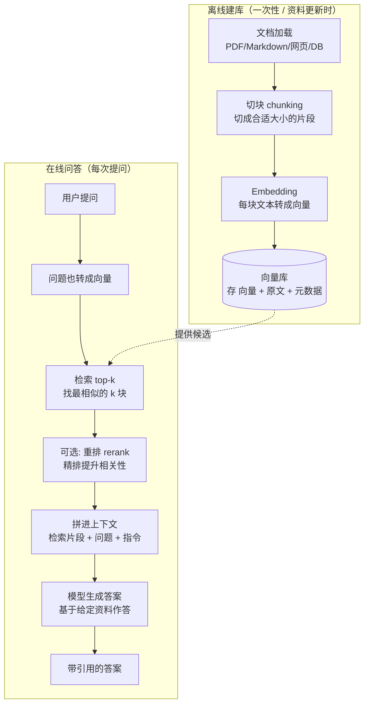

# 第 8 章 RAG 检索增强生成

> 第 7 章末尾我们埋了个钩子：当长期"语义记忆"量大、要按意思召回时，需要一套专门机制。这套机制就是 RAG。它也是你接下来要做的[项目一·智能知识库问答助手](../04-实战篇/项目1-智能知识库问答助手.md)的核心地基。这一章我们把它讲透，并给出从原理到可运行代码的完整路径。

> **学习目标**
> - 说清楚为什么需要 RAG：模型不知道你的私有/最新数据，且会幻觉
> - 掌握 RAG 全流程：加载 → 切块 → Embedding → 入库 → 检索 → （重排）→ 拼上下文 → 生成
> - 理解 Embedding 与余弦相似度（不需要数学背景），会做 Embedding 选型
> - 掌握切块策略、向量库选型、检索/重排/混合检索
> - 认识 Agentic RAG，理解它比一次性检索强在哪
> - 能用 TS / Python 各写一个最小可运行的 RAG（先手写余弦相似度讲原理，再用真实向量库）

> **前置知识**：第 2 章（Token、上下文窗口）、第 5 章（Agent 循环）、第 7 章（记忆与上下文管理）。向量数学零基础也能看懂。

---

## 8.1 为什么需要 RAG

大模型很强，但有两个改不掉的天生缺陷：

1. **它不知道你的私有数据和最新数据。** 模型的知识停在训练截止那一刻，且只包含公开语料。你公司内部的产品文档、昨天刚发的公告、用户的历史工单——它一概不知道。

2. **它会一本正经地胡说（幻觉，hallucination）。** 当被问到不知道的东西时，模型不会说"我不知道"，而是倾向于编一个**听起来很合理**的答案。这在客服、问答、法律、医疗等场景是致命的。

怎么办？两条路：

- **重新训练/微调模型**，把你的数据喂进去。贵、慢、数据一更新就过时，绝大多数团队不该走这条路。
- **RAG（检索增强生成，Retrieval-Augmented Generation）**：不动模型，而是**先从你的资料里检索出相关片段，连同问题一起喂给模型，让它"基于给定资料"作答。**

RAG 是性价比最高的方案，也是当前业界落地知识类 Agent 的主流做法。一句话概括：

> **RAG = 先查资料，再让模型基于查到的资料回答。** 模型从"凭记忆瞎答"变成"开卷考试"。

> **前端类比**：RAG 就像你做的**搜索框 + 数据库查询 + 结果渲染**——用户输入查询，你去数据库查出相关记录，再把记录"渲染"成页面。只不过 RAG 里：查询是"按语义"查（不是 `LIKE '%关键词%'`），"渲染"这一步交给了模型（它把检索结果组织成自然语言答案）。

RAG 还顺带解决了一个信任问题：因为答案有"出处"（检索到的片段），你可以让模型**附上引用**，用户能核对，幻觉大幅减少。

---

## 8.2 RAG 全流程图

RAG 分两个阶段：**离线建库**（把资料处理好存起来，做一次）和**在线问答**（用户来问时实时检索+生成，每次都做）。



文字版流程（背下来你就懂 RAG 了）：

**离线**：文档加载 → 切块 → Embedding → 存入向量库。
**在线**：用户提问 → 问题 Embedding → 检索 top-k → （重排）→ 拼进上下文 → 模型生成答案。

接下来逐个环节拆解，重点讲那些"做不好就翻车"的环节：Embedding、切块、向量库、检索。

---

## 8.3 Embedding：把文本变成向量

RAG 的魔法核心在这一步。**Embedding（嵌入）就是把一段文本转成一串数字（向量）**，比如把"今天天气真好"转成 `[0.12, -0.88, 0.05, ...]`（通常几百到几千维）。

关键性质是：**语义相近的文本，向量也相近；语义无关的，向量离得远。** 这是用海量语料训练出来的 Embedding 模型的能力。

```
"小猫"     → [0.21, 0.85, ...]  ┐
"猫咪"     → [0.23, 0.83, ...]  ┘ 这两个向量很接近（意思相近）

"小猫"     → [0.21, 0.85, ...]  ┐
"汽车引擎" → [-0.7, 0.10, ...]  ┘ 这两个向量离得远（意思无关）
```

> **前端类比**：Embedding 就像给每段文本算了一个**"语义指纹"或"语义坐标"**。把所有文本都放到同一个多维空间里，意思相近的就聚在一起。检索时，你拿问题的坐标，去找离它最近的几个点——这就是"按语义搜索"，而不是"按字面关键词搜索"。

### 怎么衡量"两个向量有多近"：余弦相似度

最常用的度量是**余弦相似度（cosine similarity）**：算两个向量夹角的余弦值。

- 夹角越小（方向越一致）→ 余弦值越接近 **1** → 越相似。
- 完全无关（垂直）→ 接近 **0**。
- 方向相反 → 接近 **-1**。

公式（看不懂可跳过，下面有代码）：`cos(A, B) = (A·B) / (|A| × |B|)`，即点积除以两个向量模长的乘积。

> **不用怕数学**：你完全不用手算。Embedding 模型把文本变成向量，余弦相似度就几行代码（8.8 会手写一遍让你看清原理）。理解到"向量近 = 意思近、用余弦值衡量"这个层面，做 RAG 就够了。

### Embedding 模型选型

Embedding 由专门的 Embedding 模型产出，**和你用来生成答案的对话模型是两回事**（一个负责"把文本变向量"，一个负责"基于资料写答案"）。常见选择：

| 类型 | 代表 | 说明 |
| --- | --- | --- |
| **闭源 API** | OpenAI `text-embedding-3-small` / `text-embedding-3-large` | 开箱即用、效果好；`small` 便宜够用，`large` 更准更贵。以官方文档为准。 |
| **闭源 API** | Voyage、Cohere 等 | 各有专长（如多语言、代码）。 |
| **开源自托管** | `bge`（智源）、`gte`（阿里）等 | 免费、数据不出门、可私有部署；需要自己跑推理（如经 Ollama / vLLM）。 |

> ⚠️ **关于 Anthropic 的说明（技术准确性）**：Anthropic **不提供**自己的文本 Embedding 接口。在用 Claude 做 RAG 时，标准做法是：**Embedding 用第三方**（OpenAI 的 `text-embedding-3-*`、Voyage，或开源 `bge`/`gte`），**生成答案用 Claude**（如 `claude-opus-4-8`）。别去找"Claude 的 embedding 模型"，没有这个东西。

**两条选型铁律：**

1. **建库和查询必须用同一个 Embedding 模型。** 不同模型产出的向量空间不通用，混用等于在两套坐标系里找最近点，结果全乱。换 Embedding 模型 = 整库重新建。

2. **维度要匹配。** 向量库里存的向量维度，必须和查询向量维度一致。换模型常常意味着维度变了。

> **前端类比**：把 Embedding 模型想成"编码器"。建库时用编码器 A 把文档编码存起来，查询时也必须用 A 把问题编码，才能在同一套编码规则下比对。拿编码器 B 的问题去比对编码器 A 的库，就像用 GBK 解码一段 UTF-8——乱码。

---

## 8.4 切块策略（chunking）

为什么要切块？因为你不能把一整本 500 页的手册做成**一个**向量——那样向量代表的"语义"太笼统，检索时要么整本命中要么整本不中，毫无精度。也不能把每个句子都做成一个向量——太碎，丢了上下文。所以要**切成"大小合适、语义自洽"的片段（chunk）**。

切块要调三个东西：

**1. 块大小（chunk size）**

- 太大：一块塞太多内容，向量语义模糊，且检索回来的片段长、占上下文、贵。
- 太小：一块没头没尾，缺乏上下文，模型读了也理解不了。
- 经验值：几百 token 一块是常见起点（具体看文档类型，没有万能数字，要试）。

**2. 重叠（overlap）**

相邻块之间留一点重叠（比如重叠几十个 token），防止一句关键的话正好被切在两块边界、哪块都不完整。

```
原文: ...... 句A | 句B 句C | 句D ......
无重叠切块:  [句A] [句B句C] [句D]      ← 边界信息可能割裂

有重叠切块:  [句A 句B] [句B 句C 句D] ...  ← 句B 在两块都出现，边界更平滑
```

**3. 按结构切，而不是死按字数切**

最容易翻车的是"每 N 个字符硬切一刀"——会把一句话、一个表格、一段代码拦腰斩断。更好的做法是**顺着文档的天然结构切**：按标题/章节分、按段落分、Markdown 按 `#` 层级分、代码按函数分。先按结构切，再对过大的块按字数细分。

> **常见坑预警**：切块是 RAG 里最朴素却最影响效果的一环。很多人 RAG 效果差，根因不是模型不行，而是**切块切烂了**——要么太大太笼统检索不准，要么硬切割断了语义。调 RAG，先回头看切块。

---

## 8.5 向量数据库选型

向量库负责两件事：**存**（向量 + 对应原文 + 元数据），**查**（给一个查询向量，快速找出最相似的 top-k）。"快速"是关键——库里上百万向量时，暴力逐个算余弦相似度太慢，向量库用近似最近邻（ANN）索引加速。

### 给前端工程师的首选推荐：pgvector

如果你已经在用 Postgres（很多全栈项目都用），**强烈推荐 pgvector**——它是 Postgres 的一个扩展，让你在熟悉的关系数据库里直接存向量、做相似度查询。

为什么前端/全栈工程师最该从它入手：

- **复用现有 DB**：不用多引入一个新中间件，少一套运维。
- **SQL 你已经会**：查询就是带个相似度排序的 `SELECT`，心智负担小。
- **元数据和向量在一张表**：原文、用户 ID、权限、向量放一起，过滤+检索一条 SQL 搞定，天然支持"只在某用户的文档里搜"。

```sql
-- pgvector 的查询长这样：按向量距离排序，取最近的 5 条
-- <=> 是余弦距离运算符（越小越相似）
SELECT content, metadata
FROM documents
WHERE user_id = $1                 -- 顺手做权限/元数据过滤
ORDER BY embedding <=> $2          -- $2 是查询向量
LIMIT 5;
```

看到没？这就是你熟悉的 SQL，只是多了个向量排序。这种"零新概念"的亲切感，是 pgvector 对前端最大的友好。

### 其他向量库简表

不是说只能用 pgvector，了解全貌方便选型：

| 向量库 | 类型 | 适合 | 一句话 |
| --- | --- | --- | --- |
| **pgvector** | Postgres 扩展 | 已用 Postgres、要复用 DB、量中等 | 前端最易上手，首选起点 |
| **Chroma** | 轻量嵌入式/本地 | 本地开发、原型、小项目 | 几行代码起步，学习成本最低 |
| **Qdrant** | 独立服务 | 中大规模、要高级过滤 | 开源、性能好、功能全 |
| **Milvus** | 独立服务/分布式 | 超大规模、海量向量 | 重型，运维成本高 |
| **Pinecone** | 托管云服务 | 不想运维、要快速上线 | 全托管，按量付费，省心但有厂商绑定 |

> **选型建议**：原型阶段用 Chroma（本地、零配置）跑通流程；要上线、且已有 Postgres，迁到 pgvector；量真的特别大、有专门团队，再考虑 Qdrant/Milvus；图省事不在乎成本，用 Pinecone。本章 8.8 的"真实向量库版"用 Chroma 演示，因为它最容易在本地跑起来。

---

## 8.6 检索：top-k、阈值、重排、混合检索

检索这一步决定了"喂给模型的资料对不对"。几个关键旋钮：

### top-k：取最相似的 k 块

最基本的检索就是取相似度最高的前 k 块。k 怎么定？

- k 太小：可能漏掉相关片段，模型资料不足。
- k 太大：塞进太多片段，可能混入不相关的，稀释注意力，还更贵。
- 经验：从 k=3~5 起步，按效果调。

### 相似度阈值：过滤掉"凑数"的结果

只取 top-k 有个问题：哪怕库里压根没有相关内容，它也会返回 k 个"最不离谱"的——但这 k 个可能相似度都很低，纯属凑数。加一个**相似度阈值**：低于阈值的直接丢弃。这样当真的没相关资料时，能返回"空"，让模型老实说"我不知道"，而不是拿一堆不相关的东西硬编。

### 重排（rerank）：用更精的模型二次排序

向量检索快但相对粗。**重排**是在向量检索拿到候选（比如 top-20）之后，用一个更精准但更慢的**重排模型（reranker）**对这 20 个重新打分排序，取真正最相关的 top-5。

```
向量检索（快, 粗）→ 候选 top-20 → 重排模型（慢, 精）→ 最终 top-5 → 喂给模型
```

两阶段（粗召回 + 精排）是提升 RAG 精度的常用招。重排模型也是第三方提供（如 Cohere、bge-reranker 等，以官方为准）。

### 混合检索（hybrid search）：向量 + 关键词

纯向量检索擅长"理解意思"，但有短板：遇到**精确的专有名词、产品型号、错误码、人名**时，语义相近的反而干扰它（你搜 "ERR_2048"，它可能给你一堆"语义相似"的其他错误码）。

**混合检索**把两者结合：
- **关键词检索（如 BM25）**：擅长精确词匹配，专有名词、代码、ID 很准。
- **向量检索**：擅长语义、同义、模糊表达。

把两路结果融合（常用 RRF 等融合算法），既能精确命中关键词，又能语义召回。这是生产级 RAG 的常见配置。

```
            ┌── BM25 关键词检索 ──┐
用户提问 ───┤                     ├── 融合排序 ── top-k
            └── 向量语义检索 ──────┘
```

> **前端类比**：纯向量检索像"模糊搜索/猜你想搜"，混合检索是在它基础上又加了一路"精确匹配"。就像电商搜索：既要能按"红色连衣裙"语义召回，也要能按精确的商品编号直达。

---

## 8.7 RAG 常见问题与对策

RAG 上线后，问题基本逃不出这四类。建立"症状 → 病因 → 药方"的排查直觉：

| 症状 | 可能病因 | 对策 |
| --- | --- | --- |
| **检索不到**（明明库里有，却没召回） | 切块切烂了；Embedding 模型不匹配中文/领域；查询和文档表述差异大 | 优化切块（按结构、加重叠）；换更合适的 Embedding 模型；用混合检索补关键词；查询改写 |
| **检索错**（召回了不相关的） | k 太大；没设阈值；纯向量被专有名词干扰 | 调小 k；加相似度阈值；加重排；用混合检索 |
| **上下文过长**（检索片段太多撑爆窗口/太贵） | k 太大、块太大 | 调小 k、减小块；只把最相关的少数片段入上下文；重排后取精 |
| **答非所问**（资料对但答得不对） | 提示没约束好；模型没"基于资料"作答 | 在提示里强约束"只依据给定资料回答，资料不足就说不知道"；要求附引用 |

最后一类尤其要强调：**提示词要把模型"焊死"在给定资料上。** 一句话的差别（"基于以下资料回答" vs "基于以下资料回答，若资料中没有答案，请明确说'资料中未提及'，不要编造"）就能大幅减少幻觉。这呼应了第 3 章提示工程的功夫。

---

## 8.8 双语代码：一个最小可运行的 RAG

我们分两步走，循序渐进：

1. **内存版（手写余弦相似度）**：不依赖任何向量库，把"Embedding → 存 → 检索 → 生成"的原理彻底讲清。
2. **真实向量库版（Chroma）**：把内存检索换成真正的向量库，更接近生产。

两版都遵守约定：Embedding 用 OpenAI `text-embedding-3-small`（开源 `bge`/`gte` 同理可换，以官方为准），**生成用 Claude `claude-opus-4-8`**（Anthropic 不提供 embedding，故 embedding 走 OpenAI）。密钥从环境变量读，关键行有注释。

### 第一步：内存版 RAG（手写余弦相似度，讲透原理）

#### TypeScript

```typescript
// rag_inmemory.ts —— 最小 RAG：内存存储 + 手写余弦相似度，讲清原理
import OpenAI from "openai";
import Anthropic from "@anthropic-ai/sdk";

const openai = new OpenAI();      // 读 OPENAI_API_KEY，用于 Embedding
const anthropic = new Anthropic(); // 读 ANTHROPIC_API_KEY，用于生成答案

// 一个知识块：原文 + 它的向量
interface Chunk {
  text: string;
  embedding: number[];
}

// —— 1. Embedding：把文本转成向量 ——
async function embed(text: string): Promise<number[]> {
  const resp = await openai.embeddings.create({
    model: "text-embedding-3-small", // Embedding 模型；以官方为准，可换开源 bge/gte
    input: text,
  });
  return resp.data[0].embedding;
}

// —— 2. 余弦相似度：手写一遍，看清"向量有多近"怎么算 ——
function cosineSimilarity(a: number[], b: number[]): number {
  let dot = 0, normA = 0, normB = 0;
  for (let i = 0; i < a.length; i++) {
    dot += a[i] * b[i];      // 点积
    normA += a[i] * a[i];    // |a|^2
    normB += b[i] * b[i];    // |b|^2
  }
  // 余弦相似度 = 点积 / (模长a × 模长b)，范围约 [-1, 1]，越大越相似
  return dot / (Math.sqrt(normA) * Math.sqrt(normB));
}

// —— 简易向量存储（内存版）——
class InMemoryRAG {
  private chunks: Chunk[] = [];

  // 建库：把每块文本 embed 后存起来
  async addDocuments(texts: string[]): Promise<void> {
    for (const text of texts) {
      const embedding = await embed(text);
      this.chunks.push({ text, embedding });
    }
  }

  // 检索：问题 embed 后，和每块算相似度，取 top-k
  async retrieve(query: string, topK = 3): Promise<string[]> {
    const queryVec = await embed(query); // 查询用同一个 Embedding 模型！
    return this.chunks
      .map((c) => ({ text: c.text, score: cosineSimilarity(queryVec, c.embedding) }))
      .sort((a, b) => b.score - a.score) // 按相似度降序
      .slice(0, topK)
      .map((c) => c.text);
  }
}

// —— 3. 生成：把检索到的资料拼进上下文，让 Claude 基于资料作答 ——
async function answer(query: string, contexts: string[]): Promise<string> {
  const contextText = contexts.map((c, i) => `[资料${i + 1}] ${c}`).join("\n");
  const resp = await anthropic.messages.create({
    model: "claude-opus-4-8", // 生成用 Claude；以官方为准
    max_tokens: 1024,
    // 关键：把模型"焊死"在给定资料上，资料不足就说不知道，减少幻觉
    system:
      "你是知识库问答助手。只依据下面提供的【资料】回答问题；" +
      "如果资料中没有答案，明确回答'资料中未提及'，绝不编造。回答时标注用了哪条资料。",
    messages: [{ role: "user", content: `${contextText}\n\n问题：${query}` }],
  });
  const block = resp.content.find((b) => b.type === "text");
  return block && block.type === "text" ? block.text : "";
}

// —— 串起来：完整的 RAG 流程 ——
async function main() {
  const rag = new InMemoryRAG();
  // 离线建库
  await rag.addDocuments([
    "本公司退货政策：商品签收后 7 天内可无理由退货，需保持包装完好。",
    "客服热线工作时间为周一至周五 9:00-18:00。",
    "会员等级分为普通、白银、黄金三档，黄金会员享受免运费。",
  ]);

  // 在线问答
  const query = "我买的东西能退吗？";
  const contexts = await rag.retrieve(query, 2); // 检索 top-2
  const reply = await answer(query, contexts);   // 基于检索结果生成
  console.log(reply); // 会基于"退货政策"那条作答，而非瞎编
}
```

#### Python

```python
# rag_inmemory.py —— 最小 RAG：内存存储 + 手写余弦相似度，讲清原理
import math
from openai import OpenAI
import anthropic

openai_client = OpenAI()            # 读 OPENAI_API_KEY，用于 Embedding
anthropic_client = anthropic.Anthropic()  # 读 ANTHROPIC_API_KEY，用于生成答案


# —— 1. Embedding：把文本转成向量 ——
def embed(text: str) -> list[float]:
    resp = openai_client.embeddings.create(
        model="text-embedding-3-small",  # Embedding 模型；以官方为准，可换开源 bge/gte
        input=text,
    )
    return resp.data[0].embedding


# —— 2. 余弦相似度：手写一遍，看清"向量有多近"怎么算 ——
def cosine_similarity(a: list[float], b: list[float]) -> float:
    dot = sum(x * y for x, y in zip(a, b))        # 点积
    norm_a = math.sqrt(sum(x * x for x in a))     # |a|
    norm_b = math.sqrt(sum(y * y for y in b))     # |b|
    # 余弦相似度 = 点积 / (模长a × 模长b)，范围约 [-1, 1]，越大越相似
    return dot / (norm_a * norm_b)


# —— 简易向量存储（内存版）——
class InMemoryRAG:
    def __init__(self):
        self.chunks: list[tuple[str, list[float]]] = []  # (原文, 向量)

    def add_documents(self, texts: list[str]) -> None:
        """建库：把每块文本 embed 后存起来。"""
        for text in texts:
            self.chunks.append((text, embed(text)))

    def retrieve(self, query: str, top_k: int = 3) -> list[str]:
        """检索：问题 embed 后和每块算相似度，取 top-k。"""
        query_vec = embed(query)  # 查询用同一个 Embedding 模型！
        scored = [
            (text, cosine_similarity(query_vec, vec)) for text, vec in self.chunks
        ]
        scored.sort(key=lambda x: x[1], reverse=True)  # 按相似度降序
        return [text for text, _ in scored[:top_k]]


# —— 3. 生成：把检索到的资料拼进上下文，让 Claude 基于资料作答 ——
def answer(query: str, contexts: list[str]) -> str:
    context_text = "\n".join(f"[资料{i + 1}] {c}" for i, c in enumerate(contexts))
    resp = anthropic_client.messages.create(
        model="claude-opus-4-8",  # 生成用 Claude；以官方为准
        max_tokens=1024,
        # 关键：把模型"焊死"在给定资料上，资料不足就说不知道，减少幻觉
        system=(
            "你是知识库问答助手。只依据下面提供的【资料】回答问题；"
            "如果资料中没有答案，明确回答'资料中未提及'，绝不编造。回答时标注用了哪条资料。"
        ),
        messages=[{"role": "user", "content": f"{context_text}\n\n问题：{query}"}],
    )
    for block in resp.content:
        if block.type == "text":
            return block.text
    return ""


# —— 串起来：完整的 RAG 流程 ——
if __name__ == "__main__":
    rag = InMemoryRAG()
    # 离线建库
    rag.add_documents([
        "本公司退货政策：商品签收后 7 天内可无理由退货，需保持包装完好。",
        "客服热线工作时间为周一至周五 9:00-18:00。",
        "会员等级分为普通、白银、黄金三档，黄金会员享受免运费。",
    ])

    # 在线问答
    query = "我买的东西能退吗？"
    contexts = rag.retrieve(query, top_k=2)  # 检索 top-2
    print(answer(query, contexts))            # 基于"退货政策"那条作答，而非瞎编
```

跑一下你会发现：问"我买的东西能退吗？"，虽然问句里**没有"退货"二字**，检索照样能命中"退货政策"那条——这就是**语义检索**的威力，关键词匹配做不到这一点。

### 第二步：真实向量库版（用 Chroma）

内存版讲清了原理，但有两个问题：每次启动都要重新 embed 建库（不持久化），且暴力遍历在数据量大时会慢。生产里换成真正的向量库。这里用 **Chroma**（本地最易跑），它帮你管好向量存储、持久化和相似度检索——你不用再手写余弦相似度了。

> 选 Chroma 演示是因为它本地零配置。要上线且已有 Postgres，把下面的存储换成 pgvector（参考 8.5 的 SQL），其余流程不变。

#### Python

```python
# rag_chroma.py —— 用真实向量库（Chroma）的 RAG
import chromadb
from openai import OpenAI
import anthropic

openai_client = OpenAI()
anthropic_client = anthropic.Anthropic()

# 持久化客户端：向量存到本地磁盘，重启不丢
chroma = chromadb.PersistentClient(path="./chroma_db")
collection = chroma.get_or_create_collection("knowledge_base")


def embed(text: str) -> list[float]:
    resp = openai_client.embeddings.create(model="text-embedding-3-small", input=text)
    return resp.data[0].embedding


def add_documents(texts: list[str]) -> None:
    """建库：embed 后存入 Chroma（向量库自己管索引和相似度，无需手写）。"""
    embeddings = [embed(t) for t in texts]
    collection.add(
        ids=[f"doc-{i}" for i in range(len(texts))],  # 每块唯一 id
        documents=texts,                               # 原文（Chroma 帮你存）
        embeddings=embeddings,                         # 对应向量
    )


def retrieve(query: str, top_k: int = 3) -> list[str]:
    """检索：把查询向量交给 Chroma，它返回最相似的 top-k 原文。"""
    query_vec = embed(query)  # 同一个 Embedding 模型
    results = collection.query(query_embeddings=[query_vec], n_results=top_k)
    return results["documents"][0]  # 取出原文列表


def answer(query: str, contexts: list[str]) -> str:
    context_text = "\n".join(f"[资料{i + 1}] {c}" for i, c in enumerate(contexts))
    resp = anthropic_client.messages.create(
        model="claude-opus-4-8",
        max_tokens=1024,
        system=(
            "你是知识库问答助手。只依据提供的【资料】回答；"
            "资料中没有就回答'资料中未提及'，绝不编造。"
        ),
        messages=[{"role": "user", "content": f"{context_text}\n\n问题：{query}"}],
    )
    for block in resp.content:
        if block.type == "text":
            return block.text
    return ""


if __name__ == "__main__":
    add_documents([
        "本公司退货政策：商品签收后 7 天内可无理由退货，需保持包装完好。",
        "客服热线工作时间为周一至周五 9:00-18:00。",
        "会员等级分为普通、白银、黄金三档，黄金会员享受免运费。",
    ])
    contexts = retrieve("我买的东西能退吗？", top_k=2)
    print(answer("我买的东西能退吗？", contexts))
```

#### TypeScript

```typescript
// rag_chroma.ts —— 用真实向量库（Chroma）的 RAG
// 依赖 chromadb 客户端 + 本地运行的 Chroma 服务（以官方文档为准）
import { ChromaClient } from "chromadb";
import OpenAI from "openai";
import Anthropic from "@anthropic-ai/sdk";

const openai = new OpenAI();
const anthropic = new Anthropic();
const chroma = new ChromaClient(); // 连本地 Chroma 服务

async function embed(text: string): Promise<number[]> {
  const resp = await openai.embeddings.create({ model: "text-embedding-3-small", input: text });
  return resp.data[0].embedding;
}

async function addDocuments(texts: string[]) {
  const collection = await chroma.getOrCreateCollection({ name: "knowledge_base" });
  const embeddings = await Promise.all(texts.map(embed));
  await collection.add({
    ids: texts.map((_, i) => `doc-${i}`),
    documents: texts,        // 原文，Chroma 帮你存
    embeddings,              // 对应向量
  });
}

async function retrieve(query: string, topK = 3): Promise<string[]> {
  const collection = await chroma.getOrCreateCollection({ name: "knowledge_base" });
  const queryVec = await embed(query); // 同一个 Embedding 模型
  const results = await collection.query({ queryEmbeddings: [queryVec], nResults: topK });
  return (results.documents[0] ?? []).filter((d): d is string => d !== null);
}

async function answer(query: string, contexts: string[]): Promise<string> {
  const contextText = contexts.map((c, i) => `[资料${i + 1}] ${c}`).join("\n");
  const resp = await anthropic.messages.create({
    model: "claude-opus-4-8",
    max_tokens: 1024,
    system:
      "你是知识库问答助手。只依据提供的【资料】回答；资料中没有就回答'资料中未提及'，绝不编造。",
    messages: [{ role: "user", content: `${contextText}\n\n问题：${query}` }],
  });
  const block = resp.content.find((b) => b.type === "text");
  return block && block.type === "text" ? block.text : "";
}

async function main() {
  await addDocuments([
    "本公司退货政策：商品签收后 7 天内可无理由退货，需保持包装完好。",
    "客服热线工作时间为周一至周五 9:00-18:00。",
    "会员等级分为普通、白银、黄金三档，黄金会员享受免运费。",
  ]);
  const contexts = await retrieve("我买的东西能退吗？", 2);
  console.log(await answer("我买的东西能退吗？", contexts));
}
```

对比两版你会发现：**向量库版把"存向量、建索引、算相似度"都接管了，你的代码只剩"embed + 调库 + 拼上下文 + 生成"。** 这就是工具/框架替你做的事——但因为你先手写过内存版，你清楚它底层在干嘛，换库、调参、排错时心里有底。

---

## 8.9 Agentic RAG：让 Agent 自己决定怎么查

前面的 RAG 是**一次性检索**：用户一问，检索一次，生成一次。这对简单问题够用，但遇到复杂问题就力不从心：

- 问题需要**多步**：先查 A，根据 A 的结果再查 B。
- 一次检索**没查到/查偏了**，应该换个查询词再试。
- 问题里有多个子问题，需要**分别检索**。

一次性 RAG 做不到这些——它只有一次机会。**Agentic RAG** 把检索变成 Agent 手里的一个**工具**（回顾第 6 章：工具就是给模型注册的"回调"），让模型在循环里（回顾第 5 章的 Agent 循环）**自己决定**：

- 要不要查？
- 查什么（自己生成查询词，甚至改写/拆分问题）？
- 查到的够不够？不够就**再查一次**（换个词、查另一个方面）。
- 信息齐了，再作答。

```
一次性 RAG:   问题 ──检索一次──→ 生成（只有一次机会）

Agentic RAG:  问题 → [模型决策: 要查吗?]
                       │是
                       ▼
                   检索工具 ──→ 结果回到模型
                       ▲              │
                       └─ 不够? 换查询再查 ─┘
                       │够了
                       ▼
                     生成答案
```

实现上，Agentic RAG 就是把"检索"做成一个工具交给 Agent：

```python
# 伪代码：把检索做成一个工具，交给第 6 章的工具调用循环
search_tool = {
    "name": "search_knowledge_base",
    "description": "在知识库中按语义检索相关资料。当你需要回答关于公司政策、"
                   "产品文档等私有信息时调用。可多次调用以查询不同方面。",
    "input_schema": {
        "type": "object",
        "properties": {"query": {"type": "string", "description": "检索用的查询语句"}},
        "required": ["query"],
    },
}
# 然后走第 6 章的 Agent 循环：模型决定何时调 search_knowledge_base、
# 用什么 query、要不要再调，直到信息够了才给最终答案。
# 工具的执行体就是 8.8 里的 retrieve()。
```

> **一句话**：一次性 RAG 是"开卷考试只让你翻一次书"，Agentic RAG 是"想翻几次翻几次，还能自己决定查哪一页"。代价是更多模型调用（更慢更贵），所以**简单问题用一次性 RAG，复杂/多步问题才上 Agentic RAG**。

这条线把第 5 章（循环）、第 6 章（工具）、本章（检索）串了起来——这正是 Agent 各能力组合的威力。

---

## 8.10 RAG 评测：怎么知道你的 RAG 好不好

RAG 上线前必须评测，否则你不知道是"检索差"还是"生成差"。分两层看：

**1. 检索质量（检索环节）**

- **召回率（recall）**：该检索到的相关片段，有多少被检索到了？（漏不漏）
- **精确率（precision）**：检索回来的片段里，有多少是真相关的？（准不准）

这两个是经典的信息检索指标。做法是准备一批"问题 → 应该命中哪些片段"的标注集，跑检索看命中情况。

**2. 答案质量（生成环节）**

- **答案是否有依据（faithfulness/groundedness）**：答案有没有"基于检索到的资料"，还是模型自己脑补的？这是 RAG 最该盯的指标——RAG 的全部意义就是让答案有出处。
- **答案是否切题、正确**：回答到点子上没有。

答案质量常用 **LLM-as-Judge**（让另一个模型当裁判打分）等方法评测。完整的评测方法论——离线评测集、LLM-as-Judge、回归测试——见[第 13 章 评测与测试](../03-工程篇/13-评测与测试.md)。

> **排错口诀**：RAG 答得不对时，先分清是哪一层坏了。把检索到的片段打印出来看：
> - 片段里**没有**答案 → 检索环节的问题（回 8.4 切块、8.6 检索去调）。
> - 片段里**有**答案但模型答错了 → 生成环节的问题（回 8.7 调提示词）。
> 不分层就瞎调参，是 RAG 调优最大的时间黑洞。

---

## 8.11 前端视角：RAG 在全栈里怎么落地

把 RAG 拆开看，每一块你都有对应的前端/全栈经验：

- **检索** ≈ 你写过的**搜索接口**——只不过查询从"关键词 LIKE"升级成"向量相似度"。
- **向量库** ≈ 你用过的**数据库**——pgvector 直接就是 Postgres，SQL 你都会。
- **生成** ≈ 把查询结果**"渲染"成答案**——只不过渲染器是模型，输出是自然语言而非 HTML。
- **离线建库** ≈ 你做过的**数据 ETL / 预处理任务**——加载、清洗、转换、入库。
- **流式返回答案** ≈ 你做过的 **SSE / 流式 UI**——RAG 答案通常也流式吐给前端，提升体验（见[第 12 章 流式输出与前端集成](../03-工程篇/12-流式输出与前端集成.md)）。

所以 RAG 对前端工程师不是天书——它是你熟悉的"搜索 + 数据库 + 渲染"换了内核。你的全栈能力（把这套东西接成一个能上线的产品）恰恰是很多算法背景的人不擅长的，这是你的优势。

---

## 8.12 常见坑 / 最佳实践

- **建库和查询必须用同一个 Embedding 模型。** 换模型 = 整库重建，维度也要对齐。这是新手最隐蔽的坑。
- **别找"Claude 的 embedding"——没有。** Anthropic 不提供 embedding 接口；用 OpenAI `text-embedding-3-*` 或开源 `bge`/`gte` 做 embedding，用 Claude 做生成。
- **切块是头号影响因素。** 按结构切、加重叠、别死按字数硬切。RAG 效果差先回头查切块。
- **提示词把模型焊死在资料上。** 明确"只依据资料回答，没有就说不知道"，并要求附引用，能大幅减少幻觉。
- **加相似度阈值。** 否则没相关资料时也会返回一堆凑数结果，逼着模型瞎编。
- **专有名词/型号/错误码场景用混合检索。** 纯向量对精确词不友好，补一路 BM25 关键词。
- **检索片段会占上下文、要花钱。** k 别贪大，块别贪大，必要时重排后取精。
- **评测要分层。** 先看检索到的片段对不对，再看生成答得对不对，别混在一起瞎调。
- **缓存固定前缀省钱。** 系统提示等不变部分可用提示缓存（如 Claude 的 `cache_control`，前缀匹配），但注意检索结果是每次变的、不可缓存。详见[第 15 章 成本与性能优化](../03-工程篇/15-成本与性能优化.md)。
- **简单问题别上 Agentic RAG。** 多轮检索更慢更贵，按问题复杂度选型。

---

## 8.13 本章小结

1. **RAG = 先检索相关资料，再让模型基于资料作答**，解决模型"不知道私有/最新数据"和"会幻觉"两大缺陷，比微调更轻、更省。
2. **全流程**：离线（加载 → 切块 → Embedding → 入库）+ 在线（提问 → Embedding → 检索 top-k →（重排）→ 拼上下文 → 生成）。
3. **Embedding** 把文本变向量，语义近则向量近，用余弦相似度衡量；建库查询必须同一模型；Anthropic 不提供 embedding，用第三方。
4. **切块**是头号影响因素：调块大小、加重叠、按结构切。
5. **向量库**前端首选 pgvector（复用 Postgres、SQL 即会）；原型用 Chroma；超大规模用 Qdrant/Milvus；省心用 Pinecone。
6. **检索**调 top-k、加阈值、用重排提精度、用混合检索（BM25+向量）补关键词短板。
7. **Agentic RAG** 把检索做成工具交给 Agent，自己决定查什么、查几次，处理复杂多步问题（呼应第 5、6 章）。
8. **评测分两层**：检索质量（召回/精确）+ 答案质量（是否有依据），排错先分层。

---

## 8.14 练习题

1. **（基础）** 跑通 8.8 的内存版 RAG。然后改问句为一个库里**没有**答案的问题（比如"你们卖手机吗？"），观察模型是否老实回答"资料中未提及"。如果它还是瞎编，试着加强 system 提示词。

2. **（基础）** 用一个前端类比向同事解释"为什么问'能退吗'能检索到'退货政策'，哪怕问句里没有'退货'二字"。

3. **（进阶）** 给内存版 RAG 的 `retrieve` 加一个相似度阈值参数 `minScore`，低于阈值的结果丢弃。再想：当所有结果都低于阈值（库里没相关资料）时，应该给生成环节传什么，才能让模型正确地说"不知道"？

4. **（进阶）** 给 8.8 的文档加一段长文本（比如一篇几百字的政策说明），实现一个简单的切块函数（按段落切 + 重叠），把它切块后入库。对比"整段一个 chunk"和"切块后多个 chunk"的检索效果差异。

5. **（挑战）** 把一次性 RAG 改成 Agentic RAG：参考第 6 章把 `retrieve` 做成一个工具交给模型，让它能多次检索。设计一个"必须查两次才能答"的问题（比如"对比黄金会员和白银会员的运费政策"，假设这两条分散在不同片段），验证 Agentic RAG 比一次性 RAG 强在哪。

---

## 8.15 延伸阅读

- **官方文档方向**：搜索 Embedding 提供方（OpenAI `text-embedding-3`、Voyage、开源 `bge`/`gte`）的文档确认当前模型名、维度与定价；搜索 pgvector、Chroma、Qdrant 等向量库的官方文档；rerank 模型搜 Cohere rerank、bge-reranker。这些都易变，**以官方为准**。
- **概念方向**："Retrieval-Augmented Generation"原始论文与综述、"hybrid search / BM25 + dense retrieval"、"RRF（Reciprocal Rank Fusion）"、"chunking strategies"、"RAG evaluation / faithfulness" 都是稳定且值得深读的关键词。
- **本书相关章节**：[第 7 章 记忆与上下文管理](./07-记忆与上下文管理.md)（RAG 是召回语义记忆的方式）、[第 5 章 Agent 核心循环与推理范式](./05-agent核心循环与推理范式.md) 与 [第 6 章 工具系统设计](./06-工具系统设计.md)（Agentic RAG 的基础）、[第 13 章 评测与测试](../03-工程篇/13-评测与测试.md)（RAG 评测）、[第 15 章 成本与性能优化](../03-工程篇/15-成本与性能优化.md)（缓存省钱）、[第 12 章 流式输出与前端集成](../03-工程篇/12-流式输出与前端集成.md)（流式返回答案）。
- **落地实践**：[项目一·智能知识库问答助手](../04-实战篇/项目1-智能知识库问答助手.md) 基于本章实现一个完整、可上线的 RAG 系统。
