# 第 9 章 多 Agent 协作系统

> 一句话：当单个 Agent 被"上下文太长、职责太杂、工具太多"压垮时，把它拆成几个各管一摊、能互相协作的 Agent，就像把一个巨型 React 组件拆成几个职责清晰的子组件，或把一个万能后端拆成几个微服务。

> **学习目标**
> - 说清楚单 Agent 在什么情况下会"力不从心"，以及多 Agent 解决的是哪类问题。
> - 掌握**克制原则**：能用单 Agent + 好工具解决就别拆——知道何时该上、何时"先别上"。
> - 看懂四种主流多 Agent 架构（编排者-工作者、流水线、群聊/辩论、层级），知道各自适用场景。
> - 理解 Handoff（控制权交接）与两种 Agent 间通信方式（共享状态/黑板 vs 消息传递），以及上下文隔离为什么重要。
> - 能用 TS + Python 各写一个可运行的 **Orchestrator-Worker（编排者-工作者）** 系统，含并行子任务、结果汇总、成本核算。

> **前置知识**：你应该已经学过[单 Agent 核心循环（第 5 章）](./05-agent核心循环与推理范式.md)——知道 Agent 是"调模型 → 看是否要用工具 → 执行工具 → 把结果喂回去 → 再调模型"的循环；学过[工具系统（第 6 章）](./06-工具系统设计.md)——知道工具就是给模型注册的回调函数；学过[记忆与上下文管理（第 7 章）](./07-记忆与上下文管理.md)——知道上下文窗口是有限的、会膨胀。本章在这些之上搭多 Agent。

---

## 9.1 单 Agent 的天花板

第 5 到 8 章里，我们一直在打磨**一个** Agent：给它一个循环、一堆工具、一段记忆、一个 RAG 检索器。这套组合能解决的问题已经很多了。但当任务变复杂、变长，单 Agent 会撞上几堵墙。

用前端的话说，这就像一个 `<App>` 组件什么都往里塞：状态、请求、渲染、业务逻辑全混在一起。一开始能跑，组件长到两千行之后，谁都不敢动。Agent 也有它的"两千行"。

具体是哪几堵墙：

**1. 上下文膨胀（context bloat）。** 一个 Agent 干得越久，对话历史越长：每一轮的思考、每一次工具调用的输入和返回，全都堆在上下文里。上下文窗口再大也是有限的（即便 [`claude-opus-4-8`](../06-附录/03-资源与工具清单.md) 有 1M token，塞满了也贵也慢）。更要命的是，无关信息越多，模型越容易"分心"——它要从一大堆历史里找当前该关注的部分，注意力被稀释。这就像一次 HTTP 请求的 payload 越堆越大，最后又慢又难维护。

**2. 职责混乱（role confusion）。** 你想让一个 Agent 又当研究员（查资料）、又当作家（写文章）、又当审校（挑毛病）。这三个角色的"心智模式"是冲突的：研究时要发散、要广撒网；写作时要收敛、要连贯；审校时要挑剔、要找茬。把三套要求塞进一个系统提示里，模型会在它们之间摇摆，哪个都做不到最好。

**3. 工具太多导致选择困难。** 第 6 章讲过，工具就是注册给模型的回调函数。但工具不是越多越好。当你挂了 30 个工具，模型每一步都要在 30 个里挑一个——schema 全都占着上下文，选错的概率也上升。这跟"一个函数接了二十个可选参数，调用方根本不知道该传哪些"是一个道理。

**4. 长任务难维持连贯。** "调研一个技术选型并写出对比报告"这种任务，可能要几十步。单 Agent 跑到第 30 步时，第 3 步定下的目标早被淹没在历史里了。它会跑偏、会重复、会忘记自己原本要干嘛。

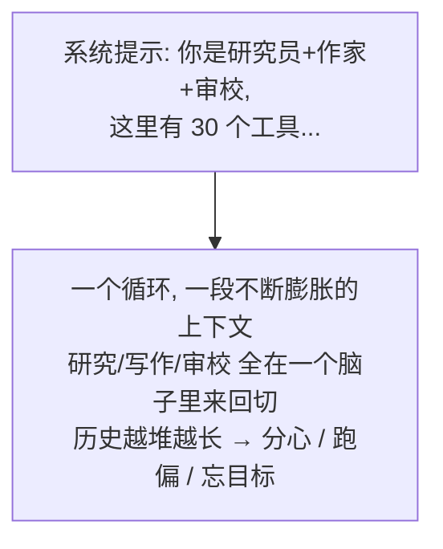

多 Agent 的核心思路只有一句：**分而治之**。把大任务拆成几个子任务，每个子任务交给一个**职责单一、上下文干净、只带必要工具**的专家 Agent。它们各干各的，再把结果汇总起来。

听起来很美，但先别急着拆——下一节就讲为什么。

---

## 9.2 何时需要多 Agent（以及何时"先别上"）

这是本章最重要的一节，先把结论摆在最前面：

> **克制原则：能用单 Agent + 好工具解决的，就别拆成多 Agent。**

多 Agent 不是"更高级"，它是"更复杂、更贵、更难调试"。每多一个 Agent，你就多一份系统提示要维护、多一次（甚至多次）模型调用要付钱、多一条出错路径要排查。很多团队一上来就搞五六个 Agent 互相调用，结果是：token 烧得飞快、延迟高得离谱、出了问题完全不知道是哪个 Agent 在哪一步搞砸的。

这和前端里"要不要拆微前端"是同一类决策。微前端能解决大团队、独立部署、技术栈隔离的问题；但如果你就一个五人小组做一个中后台，硬拆微前端只会让你天天处理跨应用通信、共享依赖、构建编排的破事——本来一个 SPA 就搞定了。**架构复杂度要匹配问题复杂度**，超配就是负债。

### 先尝试这些（在拆 Agent 之前）

遇到"单 Agent 不够用"的征兆时，先问：能不能不拆就解决？

- **上下文太长？** 先上[上下文压缩/裁剪（第 7 章）](./07-记忆与上下文管理.md)、提示缓存（呼应[第 15 章成本优化](../03-工程篇/15-成本与性能优化.md)），或把一些信息从"塞进上下文"改成"用工具按需查"。
- **工具太多？** 先做工具分组、或用"工具检索"（让模型先搜出相关工具再加载，而不是一股脑全挂上）。
- **职责有点杂？** 先把系统提示写清楚、分段，给明确的优先级。很多"职责混乱"其实是提示没写好。

把这些招用尽了还是不行，再考虑多 Agent。

### 该上多 Agent 的信号

满足下面几条中的若干条，多 Agent 才真正划算：

1. **任务能清晰拆成职责不同的子任务。** 比如"研究 → 写作 → 审校"，每个阶段需要不同的提示、不同的工具、甚至不同的模型。拆开后每个 Agent 的上下文都干净了。
2. **子任务之间相对独立，能并行。** 比如"同时调研 5 个竞品"——5 个子 Agent 并发跑，省时间（详见 9.7 节）。单 Agent 只能一个一个来。
3. **需要上下文隔离。** 某个子任务会产生大量中间垃圾（一堆搜索结果、一堆草稿），你不想让这些污染主流程的上下文。给它一个独立 Agent，干完只把结论交回来，垃圾留在它自己的上下文里——这正是下面要讲的隔离。
4. **不同子任务需要不同的"人格"或权限。** 比如审校 Agent 应该挑剔、且**只读**不能改；执行 Agent 可以动手但要受约束。分开更安全。
5. **任务长到单 Agent 会跑偏。** 用一个编排者守住总目标，子 Agent 只管自己那一小段，整体连贯性反而更好。

### 判断标准（一句话版）

> **拆 Agent 的收益必须大于"多付的 token、多出的延迟、多出来的调试成本"。** 拿不准时，先用单 Agent 把任务跑通，看它到底卡在哪——是上下文、是工具选择、还是职责冲突。对症下药，而不是一上来就堆 Agent。

记住：本章后面会给你完整的多 Agent 代码，但**会写**不等于**该用**。先学会判断。

---

## 9.3 多 Agent 架构模式

确定要上多 Agent 后，下一个问题是"怎么组织它们"。下面四种是业界最常见的模式。先看全景，再逐个拆。

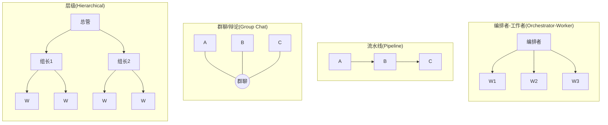

### 9.3.1 编排者-工作者（Orchestrator-Worker / Supervisor）

**一个主 Agent（编排者/管理者）负责理解总任务、拆解子任务、把子任务分派给若干专家子 Agent（工作者），收集它们的结果并汇总成最终答案。** 工作者之间通常不直接对话，全靠编排者协调。

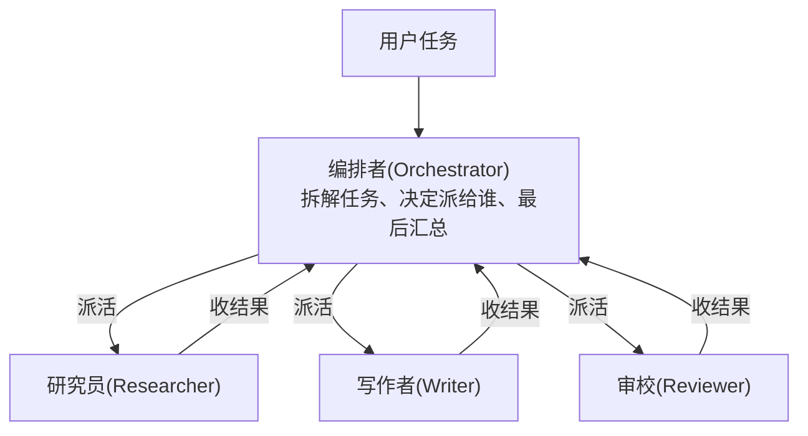

> 工作者: 职责单一、上下文独立、工具精简。

- **适用场景**：任务能拆成清晰的"专家分工"，且需要一个中心来统筹和汇总。比如"研究并写一篇报告"、"分析一份代码库的多个维度"。这是**最常用、最容易落地、也最适合入门**的模式，本章 9.6 节的实战代码就用它。
- **前端类比**：编排者就像 **BFF（Backend for Frontend）/ API 网关**——前端只跟它打交道，它在背后调度一堆微服务、把结果聚合成前端要的形状。工作者就是那些微服务。

### 9.3.2 流水线（Pipeline）

**把 Agent 串成一条处理链，上一个的输出是下一个的输入，像工厂流水线。** 顺序是**固定**的，不需要谁来动态调度。

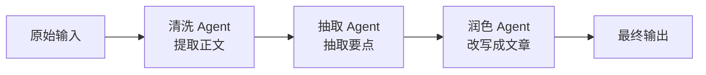

- **适用场景**：任务天然是固定的几道工序，且顺序明确。比如"网页正文提取 → 结构化抽取 → 生成摘要"。每一环职责单一，串起来就行。
- **和编排者的区别**：流水线的流程是**写死**的（A 永远接 B 接 C），不需要一个 Agent 来"决定下一步派给谁"；编排者则是**动态调度**（看任务内容决定派给哪些工作者、要不要并行）。流水线更简单、更可控、更便宜，能用流水线解决就别上编排者。
- **前端类比**：这就是中间件链（Express/Koa 的 `middleware`）或 RxJS 的 `pipe()`——数据流经一串处理函数，每个函数管一件事。

### 9.3.3 群聊 / 辩论（Group Chat / Debate）

**多个 Agent 在一个"共享对话"里轮流发言，可以互相质疑、补充、纠正，最后收敛出一个答案。** 通常还有一个"主持人"决定谁下一个说话、何时结束。

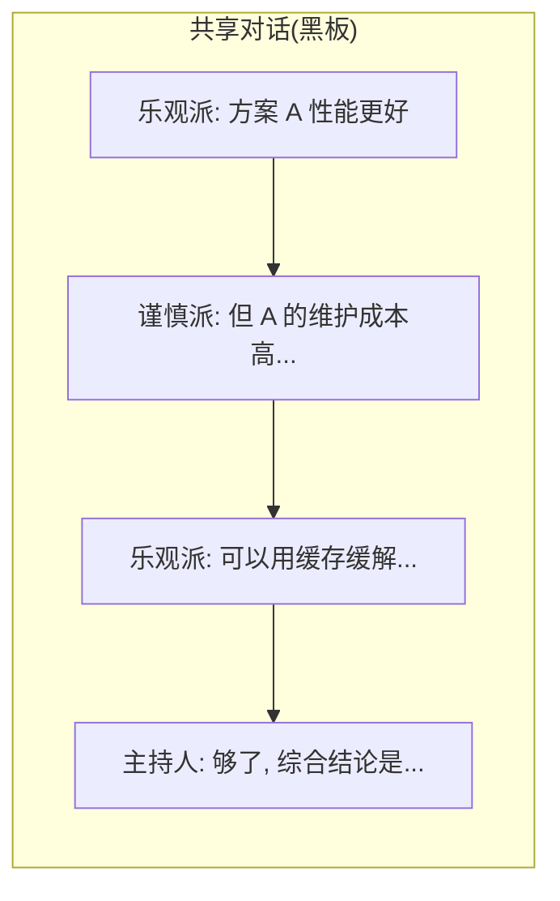

- **适用场景**：需要多视角碰撞的开放性问题——技术方案权衡、复杂决策、创意发散。"辩论"能逼出单 Agent 想不到的反方观点，减少一拍脑袋就定的错误。
- **代价**：很烧 token（每个 Agent 都要读完整对话再发言）、容易绕圈子、不好控制何时收敛。**别用它干有明确流程的活**——那是流水线或编排者的领域。
- **前端类比**：有点像一个共享的事件总线 / 协作白板，多个模块往同一块板子上写，互相看得见对方写了什么。

### 9.3.4 层级（Hierarchical）

**多 Agent 套娃：一个顶层管理者下面有几个中层组长，每个组长又管几个工作者。** 本质是"编排者-工作者"递归嵌套，工作者本身也可以是一个小编排者。

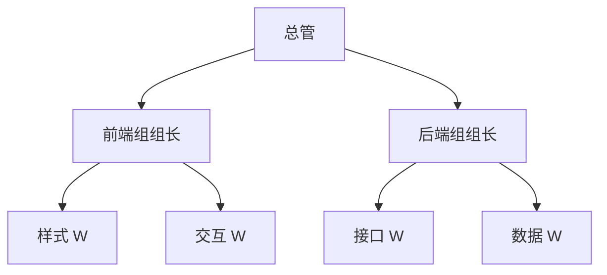

> 中层(前端组组长 / 后端组组长): 既是上层的工作者, 又是下层的编排者。

- **适用场景**：任务规模大到一层编排者管不过来——子任务本身还要再拆。比如"做一个完整产品调研"，下面分"市场组""技术组""竞品组"，每组内部再细分。
- **代价**：层级越深，延迟和成本叠加越狠，调试也越难（一个错误要顺着好几层往下查）。**绝大多数场景两层就够了，别盲目加深。**
- **前端类比**：组件树。`<App>` 下挂 `<Dashboard>`、`<Settings>`，每个容器组件下面又有自己的子组件——父组件协调子组件，层层往下。

> **怎么选？** 顺序：固定流程 → **流水线**；要中心调度+汇总 → **编排者-工作者**；要多视角碰撞 → **群聊/辩论**；规模大到一层管不过来 → **层级**。从最简单的开始，不够再升级。

---

## 9.4 Handoff：控制权交接

前面的模式里，编排者是"派活+收活"——它始终握着控制权。还有一种更轻的协作方式叫 **Handoff（控制权交接）**：一个 Agent 直接把整个任务**交给**另一个 Agent，自己退场，由接手者继续和用户对话。

这个概念在 OpenAI 的 Swarm（实验项目）和后来的 Agents SDK 里很典型。它的关键在于：handoff **不是"调用一个子 Agent 拿返回值"，而是"换人接管"**。

举个最直观的例子——客服系统：

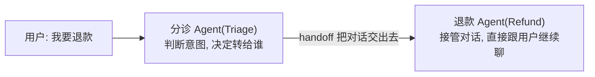

分诊 Agent 的职责很轻：判断用户想干嘛，然后转给对应的专家 Agent。一旦转交，后续对话就由退款 Agent 直接处理，分诊 Agent 不再参与。

**Handoff 在实现上的精髓：把"交接"做成一个工具。** 分诊 Agent 并没有什么特殊机制，它只是有一个叫 `transfer_to_refund_agent` 的工具。当模型决定调用这个工具时，你的代码就把"当前活跃的 Agent"从分诊换成退款——下一轮循环用退款 Agent 的系统提示和工具继续跑。

这正好复用了[第 6 章的工具循环](./06-工具系统设计.md)：模型返回 `stop_reason: "tool_use"`、你执行工具。只不过这个"工具"的副作用不是查天气，而是**切换 Agent**。

下面给一个最小可运行的 Handoff 骨架（只给 TS，Python 同理；这是为了讲清概念，9.6 节的完整 Orchestrator-Worker 才是本章主力代码）。

#### TypeScript

```typescript
// handoff.ts —— 最小 Handoff 骨架：分诊 Agent 把对话交给专家 Agent
import Anthropic from "@anthropic-ai/sdk";

const client = new Anthropic(); // 从 ANTHROPIC_API_KEY 读取密钥

// 一个 Agent = 一段系统提示 + 一组工具（含 handoff 工具）
interface AgentDef {
  name: string;
  system: string;
  tools: Anthropic.Tool[];
}

// handoff 工具：它的"执行结果"就是切到哪个 Agent，没有真正的副作用
const transferToRefund: Anthropic.Tool = {
  name: "transfer_to_refund_agent",
  description: "当用户想要退款、退货或查询退款进度时，把对话转交给退款专家。",
  input_schema: { type: "object", properties: {}, required: [] },
};

const triageAgent: AgentDef = {
  name: "triage",
  system: "你是客服分诊助手。判断用户意图，能自己回答就回答；遇到退款相关问题，调用转交工具交给退款专家，不要自己处理退款。",
  tools: [transferToRefund],
};

const refundAgent: AgentDef = {
  name: "refund",
  system: "你是退款专家。耐心处理退款请求，询问订单号，说明退款政策与到账时间。",
  tools: [], // 真实场景这里会挂查询订单、发起退款等工具
};

const agents: Record<string, AgentDef> = { triage: triageAgent, refund: refundAgent };

async function run(userMessage: string) {
  let active = agents.triage; // 当前活跃 Agent，初始是分诊
  const messages: Anthropic.MessageParam[] = [{ role: "user", content: userMessage }];

  // 复用第 6 章的工具循环，唯一区别：工具的作用是"换人"
  while (true) {
    const res = await client.messages.create({
      model: "claude-opus-4-8",
      max_tokens: 1024,
      system: active.system, // ★ 用当前活跃 Agent 的系统提示
      tools: active.tools,   // ★ 用当前活跃 Agent 的工具
      messages,
    });

    // 找出 handoff 工具调用
    const handoff = res.content.find(
      (b): b is Anthropic.ToolUseBlock =>
        b.type === "tool_use" && b.name.startsWith("transfer_to_"),
    );

    if (handoff) {
      // 把 assistant 的这一轮 + 工具结果都记进历史，保持上下文连贯
      messages.push({ role: "assistant", content: res.content });
      messages.push({
        role: "user",
        content: [{ type: "tool_result", tool_use_id: handoff.id, content: "已转交。" }],
      });
      active = agents.refund; // ★ 切换活跃 Agent —— 这就是 handoff
      console.log(`[handoff] 控制权 → ${active.name}`);
      continue; // 下一轮用新 Agent 的提示和工具继续
    }

    // 没有 handoff，说明当前 Agent 给出了最终回复
    const text = res.content.find((b) => b.type === "text");
    return text && text.type === "text" ? text.text : "";
  }
}

const answer = await run("你好，我上周买的东西想退款");
console.log(answer);
```

注意 handoff 和"调用子 Agent"的区别：handoff 之后，**对话历史是延续的**（退款 Agent 看得见用户原话），但**系统提示和工具换成了退款 Agent 的**。这跟编排者调用工作者拿一个返回值是两种不同的协作形态——一个是"换人接着聊"，一个是"派个活拿结果回来"。

---

## 9.5 Agent 间通信与上下文隔离

多个 Agent 要协作，就得交换信息。有两种基本方式。

### 9.5.1 共享状态（黑板模式）vs 消息传递

**共享状态 / 黑板模式（Blackboard）**：所有 Agent 读写同一块共享数据（一个对象、一份文档、一个数据库表）。Agent A 把结果写进黑板，Agent B 从黑板上读。

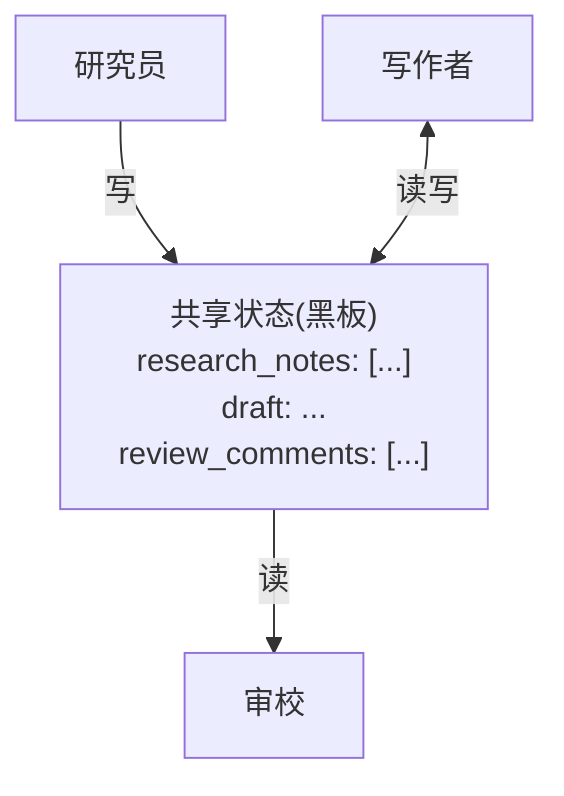

- **前端类比**：这就是 **Redux / Pinia / Zustand 那种全局 store**。各组件读写同一个 store，互相通过 store 间接通信。LangGraph 等框架里的"共享 state"本质就是黑板。
- **优点**：简单直接，所有人看得见全局；适合编排者-工作者（编排者把结果都写进一个 state）。
- **缺点**：所有人能读所有东西，容易耦合；并发写要小心冲突（跟前端多处 `dispatch` 改同一字段一个道理）。

**消息传递（Message Passing）**：Agent 之间显式地发消息，谁发给谁、发什么都是明确的。A 不直接读 B 的内部状态，只能收到 B 发来的消息。

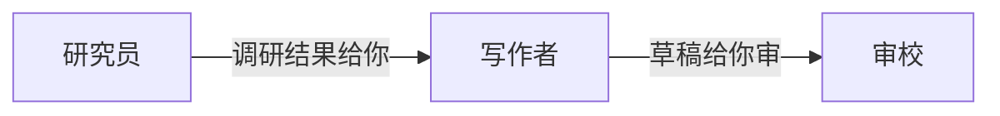

- **前端类比**：组件间的 `props` 下传 / `emit` 上抛，或者前后端之间的消息队列（如各 Agent 是独立服务时，用 MQ/事件总线通信）。
- **优点**：耦合低、边界清晰、容易追踪谁给谁发了什么（好调试）。
- **缺点**：要设计消息协议，链路长了消息会绕。

> 实战里两者常混用：编排者-工作者用黑板存共享结果、用消息传递分派任务和回传结论。怎么选不是教条——**信息要全局共享就用黑板，要点对点定向传就用消息**。

### 9.5.2 上下文隔离：每个子 Agent 独立上下文

这是多 Agent 最被低估、却最关键的好处：**每个子 Agent 有自己独立的上下文窗口，互不干扰。**

回到 9.1 节"上下文膨胀"的问题。研究员 Agent 为了查资料，可能产生几十条搜索结果、几千 token 的中间内容。如果这些全堆在一个共享上下文里，写作者和审校都得被迫"看"这些垃圾。但在多 Agent 里——

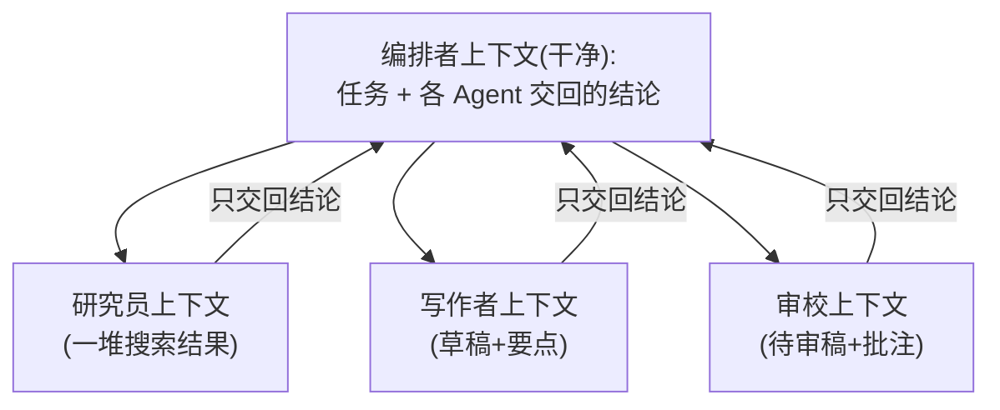

> 各自独立, 垃圾留在自己屋里, 只把结论交回编排者。

研究员的一堆搜索垃圾**留在研究员自己的上下文里**，它只把提炼好的结论交回编排者。编排者的上下文始终干净，只装"任务 + 各方结论"。这相当于给每个子任务一个独立的"工作内存"，干完打扫干净，只上交成品。

> **前端类比（重要）**：这正是**微服务/微前端的隔离思想**。每个微服务有自己的数据库、自己的进程，内部怎么折腾外部不关心，只通过 API 暴露结果。每个微前端有自己的运行时、自己的状态，互不污染。多 Agent 的上下文隔离 = 服务边界 = 关注点分离。一个 Agent 内部产生多少中间垃圾，都不会泄漏到别的 Agent。

这也是为什么 9.2 节说"需要上下文隔离"是该上多 Agent 的强信号——这个好处单 Agent 给不了。

---

## 9.6 实战：实现一个 Orchestrator-Worker 系统

现在动手。我们做一个最常用的编排者-工作者系统：**一个 supervisor 根据任务把子任务分派给三个专家 Agent——研究员（Researcher）、写作者（Writer）、审校（Reviewer）——收集结果并汇总。**

任务流程：

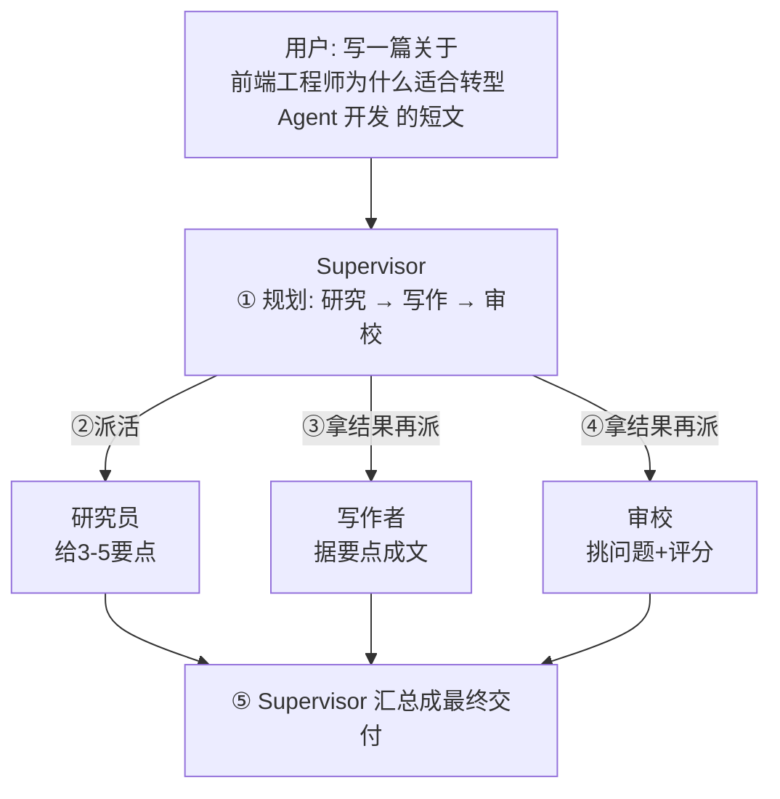

设计要点（对应前面讲的概念）：

- **每个 Worker 是一个独立的 Agent**：独立系统提示（独立人格）、独立上下文（隔离）、可带独立工具。这里为聚焦"协作"本身，Worker 的"工具"用一个极简模型调用代替——你完全可以把第 6 章的真实工具循环塞进去（研究员挂上 Web 搜索、审校挂上只读检查工具）。
- **通信用黑板**：一个共享的 `blackboard` 对象，存研究要点、草稿、审校意见。
- **Supervisor 串联**：本例用固定顺序（研究→写作→审校）演示最清晰的串行；9.7 节再讲并行。

为了"框架无关、便于换厂商"，所有模型调用走一层薄抽象 `chat()`（呼应全书约定）。换 OpenAI/开源模型时只改这一个函数。

### 9.6.1 完整代码

#### TypeScript

```typescript
// orchestrator-worker.ts
// 一个 Supervisor 调度 研究员/写作者/审校 三个专家 Agent，最后汇总。
import Anthropic from "@anthropic-ai/sdk";

const client = new Anthropic(); // 读 process.env.ANTHROPIC_API_KEY，绝不硬编码

// ── 0. 薄抽象：所有模型调用走这里，换厂商只改这一处 ──
//    返回纯文本 + 本次 token 用量（用于成本核算，见 9.8）
interface ChatResult {
  text: string;
  inputTokens: number;
  outputTokens: number;
}

async function chat(system: string, userPrompt: string): Promise<ChatResult> {
  const res = await client.messages.create({
    model: "claude-opus-4-8",
    max_tokens: 2048,
    system,
    messages: [{ role: "user", content: userPrompt }],
    // 复杂推理可开自适应思考：thinking: { type: "adaptive" }
    // 子 Agent 多为简单任务，可用更便宜的模型（如 claude-haiku-4-5）省钱
  });
  const textBlock = res.content.find((b) => b.type === "text");
  return {
    text: textBlock && textBlock.type === "text" ? textBlock.text : "",
    inputTokens: res.usage.input_tokens,
    outputTokens: res.usage.output_tokens,
  };
}

// ── 1. 黑板：Agent 间共享状态（前端类比：全局 store）──
interface Blackboard {
  task: string;
  researchNotes?: string;
  draft?: string;
  reviewComments?: string;
  // 累计 token，用于最后算账
  usage: { input: number; output: number };
}

function track(bb: Blackboard, r: ChatResult): string {
  bb.usage.input += r.inputTokens;
  bb.usage.output += r.outputTokens;
  return r.text;
}

// ── 2. 三个专家 Worker：各自独立的系统提示（独立人格）──
//    每次调用都是一段干净的、只含必要信息的上下文（上下文隔离）。

async function researcher(bb: Blackboard): Promise<void> {
  const system =
    "你是严谨的研究员。针对给定主题，列出 3-5 个最关键、最有说服力的要点。" +
    "每点一行，简洁、具体、可论证。只输出要点，不要展开成文章。";
  const out = await chat(system, `主题：${bb.task}`);
  bb.researchNotes = track(bb, out); // 只把"结论"写回黑板，搜索垃圾留在它自己那轮
}

async function writer(bb: Blackboard): Promise<void> {
  const system =
    "你是流畅的写作者。根据给定的研究要点，写一篇结构清晰、连贯的短文（300 字左右）。" +
    "不要堆砌要点，要组织成有逻辑的段落。";
  // 写作者的上下文只装它需要的：主题 + 要点，看不到研究员的中间过程
  const out = await chat(system, `主题：${bb.task}\n\n研究要点：\n${bb.researchNotes}`);
  bb.draft = track(bb, out);
}

async function reviewer(bb: Blackboard): Promise<void> {
  const system =
    "你是挑剔的审校，只评不改。检查给定草稿的事实准确性、逻辑连贯性、是否跑题。" +
    "用要点列出问题（没问题就说没问题），并给一个 1-10 的总分。";
  const out = await chat(system, `原始主题：${bb.task}\n\n待审草稿：\n${bb.draft}`);
  bb.reviewComments = track(bb, out);
}

// ── 3. Supervisor：规划 + 串联 + 汇总 ──
async function supervisor(task: string): Promise<{ final: string; usage: Blackboard["usage"] }> {
  const bb: Blackboard = { task, usage: { input: 0, output: 0 } };

  // 本例用固定顺序（最清晰）。真实编排者可以让模型动态决定派给谁、要不要并行（见 9.7）。
  console.log("① 研究员开工...");
  await researcher(bb);
  console.log("② 写作者开工...");
  await writer(bb);
  console.log("③ 审校开工...");
  await reviewer(bb);

  // ④ Supervisor 汇总：把各方结果整合成最终交付（结果汇总，见 9.8）
  console.log("④ Supervisor 汇总...");
  const summarySystem =
    "你是项目主管。根据草稿和审校意见，产出最终交付：如果审校分数 >= 8 且无重大问题，" +
    "直接给出润色后的终稿；否则，根据审校意见修订后再给终稿。只输出终稿正文。";
  const finalOut = await chat(
    summarySystem,
    `草稿：\n${bb.draft}\n\n审校意见：\n${bb.reviewComments}`,
  );
  const final = track(bb, finalOut);

  return { final, usage: bb.usage };
}

// ── 4. 跑起来 ──
const { final, usage } = await supervisor(
  "前端工程师为什么适合转型 AI Agent 开发？写一篇短文。",
);
console.log("\n===== 最终交付 =====\n" + final);

// 成本核算（价格以官方文档为准；这里用 opus-4-8 的 $5/$25 每百万 token 演示）
const cost = (usage.input / 1e6) * 5 + (usage.output / 1e6) * 25;
console.log(
  `\n[账单] 输入 ${usage.input} + 输出 ${usage.output} token，约 $${cost.toFixed(4)}（4 次模型调用）`,
);
```

#### Python

```python
# orchestrator_worker.py
# 一个 Supervisor 调度 研究员/写作者/审校 三个专家 Agent，最后汇总。
import os
import asyncio
from dataclasses import dataclass, field

from anthropic import AsyncAnthropic

client = AsyncAnthropic()  # 读 os.environ["ANTHROPIC_API_KEY"]，绝不硬编码


# ── 0. 薄抽象：所有模型调用走这里，换厂商只改这一处 ──
@dataclass
class ChatResult:
    text: str
    input_tokens: int
    output_tokens: int


async def chat(system: str, user_prompt: str) -> ChatResult:
    res = await client.messages.create(
        model="claude-opus-4-8",
        max_tokens=2048,
        system=system,
        messages=[{"role": "user", "content": user_prompt}],
        # 复杂推理可开自适应思考：thinking={"type": "adaptive"}
        # 子 Agent 多为简单任务，可换更便宜的模型（如 claude-haiku-4-5）省钱
    )
    text = next((b.text for b in res.content if b.type == "text"), "")
    return ChatResult(text, res.usage.input_tokens, res.usage.output_tokens)


# ── 1. 黑板：Agent 间共享状态（前端类比：全局 store）──
@dataclass
class Blackboard:
    task: str
    research_notes: str = ""
    draft: str = ""
    review_comments: str = ""
    usage: dict = field(default_factory=lambda: {"input": 0, "output": 0})


def track(bb: Blackboard, r: ChatResult) -> str:
    bb.usage["input"] += r.input_tokens
    bb.usage["output"] += r.output_tokens
    return r.text


# ── 2. 三个专家 Worker：各自独立的系统提示（独立人格 + 上下文隔离）──
async def researcher(bb: Blackboard) -> None:
    system = (
        "你是严谨的研究员。针对给定主题，列出 3-5 个最关键、最有说服力的要点。"
        "每点一行，简洁、具体、可论证。只输出要点，不要展开成文章。"
    )
    out = await chat(system, f"主题：{bb.task}")
    bb.research_notes = track(bb, out)  # 只把"结论"写回黑板，中间垃圾留在它自己那轮


async def writer(bb: Blackboard) -> None:
    system = (
        "你是流畅的写作者。根据给定的研究要点，写一篇结构清晰、连贯的短文（300 字左右）。"
        "不要堆砌要点，要组织成有逻辑的段落。"
    )
    out = await chat(system, f"主题：{bb.task}\n\n研究要点：\n{bb.research_notes}")
    bb.draft = track(bb, out)


async def reviewer(bb: Blackboard) -> None:
    system = (
        "你是挑剔的审校，只评不改。检查给定草稿的事实准确性、逻辑连贯性、是否跑题。"
        "用要点列出问题（没问题就说没问题），并给一个 1-10 的总分。"
    )
    out = await chat(system, f"原始主题：{bb.task}\n\n待审草稿：\n{bb.draft}")
    bb.review_comments = track(bb, out)


# ── 3. Supervisor：规划 + 串联 + 汇总 ──
async def supervisor(task: str):
    bb = Blackboard(task=task)

    # 本例固定顺序（最清晰）。真实编排者可让模型动态决定派给谁、要不要并行（见 9.7）。
    print("① 研究员开工...")
    await researcher(bb)
    print("② 写作者开工...")
    await writer(bb)
    print("③ 审校开工...")
    await reviewer(bb)

    print("④ Supervisor 汇总...")
    summary_system = (
        "你是项目主管。根据草稿和审校意见，产出最终交付：如果审校分数 >= 8 且无重大问题，"
        "直接给出润色后的终稿；否则，根据审校意见修订后再给终稿。只输出终稿正文。"
    )
    final_out = await chat(
        summary_system,
        f"草稿：\n{bb.draft}\n\n审校意见：\n{bb.review_comments}",
    )
    final = track(bb, final_out)
    return final, bb.usage


# ── 4. 跑起来 ──
async def main():
    final, usage = await supervisor(
        "前端工程师为什么适合转型 AI Agent 开发？写一篇短文。"
    )
    print("\n===== 最终交付 =====\n" + final)

    # 成本核算（价格以官方文档为准；用 opus-4-8 的 $5/$25 每百万 token 演示）
    cost = usage["input"] / 1e6 * 5 + usage["output"] / 1e6 * 25
    print(
        f"\n[账单] 输入 {usage['input']} + 输出 {usage['output']} token，"
        f"约 ${cost:.4f}（4 次模型调用）"
    )


if __name__ == "__main__":
    asyncio.run(main())
```

### 9.6.2 这段代码里藏着的几个关键设计

1. **`chat()` 薄抽象**：每个 Worker 不直接碰 SDK，全走 `chat()`。换成 OpenAI 或开源模型，只改 `chat()` 一处，三个 Agent 一行不用动——这就是全书"框架无关"原则的落地。
2. **独立系统提示 = 独立人格**：研究员"严谨发散"、写作者"流畅收敛"、审校"挑剔只读"。三套提示互不干扰，正好治了 9.1 节的"职责混乱"。
3. **上下文隔离**：写作者的 prompt 里只有"主题 + 要点"，它**完全看不到研究员的思考过程**。研究员产生多少中间内容都留在它自己那次调用里。这就是 9.5.2 节的隔离落地。
4. **黑板通信**：`Blackboard` 就是共享 store，三个 Worker 往里写、Supervisor 从里读。
5. **Supervisor 汇总带冲突处理逻辑**：汇总那一步的提示明确写了"分数 >= 8 直接润色，否则按意见修订"——这是结果汇总和冲突处理的雏形（9.8 详谈）。

> 想升级成"真编排者"？把 Supervisor 那段固定顺序换成"先让模型规划该派哪些 Worker、能否并行"，再用[第 6 章的工具循环](./06-工具系统设计.md)把每个 Worker 包成一个工具让 Supervisor 调用。本例用固定顺序是为了让你先看清骨架——**先跑通，再加复杂度**。

---

## 9.7 并行 vs 串行子任务

9.6 的例子是**串行**的：研究→写作→审校，一步接一步。因为它们有依赖——没研究就没法写，没草稿就没法审。

但很多子任务是**独立**的，可以**并行**跑。最典型的就是"同时调研多个对象"：调研竞品 A、B、C 互不依赖，没必要排队。

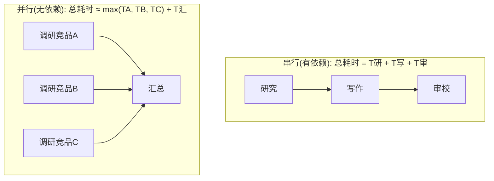

> 并行: 三个一起跑，省掉等待。

并行的实现，对前端工程师来说太熟了——就是 `Promise.all`（TS）/ `asyncio.gather`（Python），跟你并发发几个 `fetch` 一模一样。

#### TypeScript

```typescript
// 并行调研多个竞品：互不依赖的子任务并发跑
async function researchCompetitor(name: string): Promise<ChatResult> {
  const system = "你是竞品分析师。用 3 点概括给定产品的核心卖点与短板。";
  return chat(system, `产品：${name}`);
}

const competitors = ["竞品A", "竞品B", "竞品C"];
// ★ Promise.all 并发：三个调研同时进行，总耗时约等于最慢的那一个
const results = await Promise.all(competitors.map(researchCompetitor));
results.forEach((r, i) => console.log(`${competitors[i]}: ${r.text}`));
```

#### Python

```python
# 并行调研多个竞品：互不依赖的子任务并发跑
async def research_competitor(name: str) -> ChatResult:
    system = "你是竞品分析师。用 3 点概括给定产品的核心卖点与短板。"
    return await chat(system, f"产品：{name}")


competitors = ["竞品A", "竞品B", "竞品C"]
# ★ asyncio.gather 并发：三个调研同时进行，总耗时约等于最慢的那一个
results = await asyncio.gather(*(research_competitor(c) for c in competitors))
for name, r in zip(competitors, results):
    print(f"{name}: {r.text}")
```

**怎么判断能不能并行？** 看依赖：B 需不需要 A 的输出？需要就串行，不需要就并行。这跟前端里"两个请求有没有先后依赖"的判断完全一样。

> ⚠️ **并行省的是时间，不是钱，还可能撞限流。** 三个子任务并行，墙上时间从 `TA+TB+TC` 降到 `max(TA,TB,TC)`，但 token 一个不少，总成本和串行一样（甚至因为并发可能更难复用提示缓存）。而且并发太高会撞模型厂商的速率限制（RPM/TPM），可能收到 `429`。所以并行要：(1) 控制并发度（别一次甩 100 个，用信号量或分批），(2) 对 `429` 做带退避的重试（SDK 默认会重试部分错误，但高并发下要自己兜底）。

---

## 9.8 结果汇总与冲突处理

子任务跑完，结果怎么合？这分两种情况。

**情况一：结果互补，直接拼。** 各 Worker 负责不同部分，汇总就是按结构拼起来。比如"竞品A分析 + 竞品B分析 + 竞品C分析 → 一张对比表"。这种最简单，编排者按模板组装即可。

**情况二：结果冲突，要裁决。** 多个 Agent 对同一个问题给了不同答案（尤其在群聊/辩论模式，或多个 Worker 干了重叠的活）。这时编排者要当裁判。常见策略：

1. **让一个"汇总 Agent"读取所有结果，自己判断取舍。** 这是 9.6 代码里 Supervisor 汇总那步用的方法——把草稿和审校意见一起喂给它，让它综合决策。最灵活，但多一次模型调用。
2. **多数表决（majority vote）。** 同一个问题让 N 个 Agent 各答一次，取多数。适合有明确对错的判断题（如分类、是非）。
3. **置信度加权。** 让每个 Agent 输出答案时附带一个置信度，汇总时按置信度加权。
4. **规则裁决。** 用代码写死优先级，比如"审校说有重大事实错误，无条件打回重写"——不交给模型，更可控。

下面给一个"汇总 Agent 做裁决"的小例子（只给 TS，逻辑直白，Python 同理）：

#### TypeScript

```typescript
// 汇总 Agent：读取多个 Worker 的（可能冲突的）结论，裁决出一个最终答案
async function synthesize(question: string, workerAnswers: string[]): Promise<string> {
  const system =
    "你是汇总专家。下面是多个分析师对同一问题给出的、可能互相矛盾的结论。" +
    "请判断哪些可信、哪些有问题，综合出一个有依据的最终答案，并简要说明你为何这样取舍。";
  const body = workerAnswers.map((a, i) => `分析师${i + 1}：${a}`).join("\n\n");
  const out = await chat(system, `问题：${question}\n\n${body}`);
  return out.text;
}
```

> **冲突处理的原则**：不要假设 Agent 永远一致。多 Agent 越多，"各说各话"的概率越大。**汇总环节必须显式设计**——要么让一个裁判 Agent 收口，要么用规则兜底。把它当成必选项，不是可选项。

---

## 9.9 成本与延迟代价：得算账

多 Agent 最容易被忽视的代价就是：**它成倍地烧 token、也常常更慢。** 这一节专门把账摊开（详细的优化手段见[第 15 章 成本与性能优化](../03-工程篇/15-成本与性能优化.md)）。

**为什么 token 翻倍甚至更多？**

- 每个 Agent 都有自己的**系统提示**，每次调用都要带上——5 个 Agent 就是 5 份系统提示的开销。
- 编排者要把任务、子结果在 Agent 之间**反复传递**。研究要点要传给写作者，草稿要传给审校，这些内容被多次当作输入 token 计费。
- 群聊/辩论更夸张：每个 Agent 发言前要读**完整对话历史**，对话越长，每次发言的输入 token 越多，呈平方级增长。

举个直观对比：

```
单 Agent 做任务:     1 个系统提示 + 1 段历史      ≈ 基准成本 C
编排者+3 Worker:    4 个系统提示 + 多次内容传递   ≈ 3~5C 甚至更高
5 Agent 群聊 5 轮:   每轮每人读全历史            ≈ 远超 5C
```

**延迟呢？**

- **串行**多 Agent：延迟是各步**相加**（研究 3s + 写作 4s + 审校 2s = 9s），比单 Agent 一次调用慢得多。
- **并行**能缓解（取最慢那个），但只对无依赖的子任务有效。

**怎么省？**（呼应第 15 章）

1. **子 Agent 用更便宜的模型。** 研究员、审校这类相对简单的活，用 `claude-haiku-4-5`（最快最便宜）或 `claude-sonnet-4-6`（性价比），只在最关键的编排/汇总用 `claude-opus-4-8`。这是降本最有效的一招——**不是所有 Agent 都配得上最贵的模型**。
2. **提示缓存。** 各 Agent 固定不变的系统提示用提示缓存（`cache_control`），重复调用时省掉这部分输入成本（第 15 章详谈）。
3. **能不拆就不拆。** 回到 9.2 的克制原则——这才是省钱的根本。

> **一句话**：上多 Agent 前，先估一下 token 会涨几倍、延迟会增加多少。如果业务能接受、收益也够大，再上；否则回去优化单 Agent。**多 Agent 不是免费的智能，是用成本换能力。**

---

## 9.10 常见坑

多 Agent 系统出问题，往往栽在下面这几个地方：

- **无限委派 / 死循环。** A 把活交给 B，B 觉得该 A 干又交回 A，或者编排者反复派活不收口。**防御**：给委派设深度上限和总步数上限（比如最多委派 3 层、整个任务最多 N 步），到顶强制收口。这跟前端防递归渲染、防死循环 `useEffect` 一个道理。
- **子 Agent 上下文不共享导致重复劳动。** 隔离是好事，但隔离过头会让两个 Agent 各查一遍同样的资料、各踩一遍同样的坑。**防御**：把已经查到的、已经确定的关键信息显式放进黑板，分派子任务时带上，别让它从零开始。隔离的是"中间垃圾"，不是"已有结论"。
- **编排者变瓶颈。** 所有信息都过编排者，它的上下文会越来越大（又回到上下文膨胀），而且所有子任务都等它调度，它一慢全卡住。**防御**：编排者只存"结论"不存"过程"；能并行的别让它串行卡着；必要时用层级模式把调度压力分散到中层组长。
- **过早多 Agent 化。** 最常见、最该警惕的坑：问题根本不需要多 Agent，为了"显得高级"硬拆。结果是更贵、更慢、更难调。**防御**：9.2 的克制原则——先用单 Agent 跑通找瓶颈。
- **汇总环节缺失或太弱。** 子 Agent 结果一冲突就乱套。**防御**：把结果汇总和冲突处理当必选项设计（9.8）。
- **错误无处理、无观测。** 某个子 Agent 调用失败（超时、`429`、模型拒答），整个流程崩了还不知道是谁挂的。**防御**：每个子任务包好错误处理与重试；给每个 Agent 的输入输出打日志/trace（呼应[第 14 章可观测性](../03-工程篇/14-可观测性与调试.md)）——多 Agent 不可观测约等于不可维护。

---

## 9.11 前端视角：多 Agent ≈ 微服务 / 微前端

把本章的概念整体映射到前端工程师熟悉的体系，你会发现它一点都不陌生：

| 多 Agent 概念 | 前端/全栈对应 | 共同点 |
|---|---|---|
| 多 Agent 拆分 | 微服务 / 微前端拆分 | 按职责拆，各管一摊，独立演进 |
| 编排者（Supervisor） | BFF / API 网关 | 对外统一入口，对内调度+聚合 |
| 工作者（Worker） | 后端微服务 / 微前端子应用 | 职责单一、边界清晰 |
| 上下文隔离 | 服务边界 / 进程隔离 / 模块沙箱 | 内部状态互不污染 |
| 黑板（共享状态） | Redux / Pinia 全局 store | 多方读写同一份共享数据 |
| 消息传递 | props/emit、服务间调用、消息队列 | 点对点定向通信 |
| Handoff（控制权交接） | 路由跳转 / 会话转接 | 换一个处理者接管 |
| 委派深度/步数上限 | 防递归、超时、熔断 | 给失控路径设硬边界 |
| 成本/延迟核算 | 接口性能预算、QPS 成本估算 | 拆分有代价，要先算账 |

> 你做前端架构时积累的那套判断——**"这个该不该拆成独立模块？拆了通信成本值不值？"**——直接平移到多 Agent 设计上就成立。架构直觉是通用的，换的只是组件从"代码模块"变成了"Agent"。

---

## 9.12 本章小结

1. **单 Agent 有天花板**：上下文膨胀、职责混乱、工具太多选择困难、长任务难维持连贯。多 Agent 用"分而治之"来突破。
2. **克制是第一原则**：多 Agent 更复杂、更贵、更难调。能用单 Agent + 好工具（压缩上下文、工具分组、写好提示）解决就别拆。拆的收益必须大于多付的成本。
3. **四种架构各有适用场景**：固定流程用流水线，要中心调度+汇总用编排者-工作者，要多视角碰撞用群聊/辩论，规模大到一层管不过来用层级。从最简单的开始。
4. **Handoff 是"换人接管"**，实现上就是把"切换活跃 Agent"做成一个工具，复用工具循环。
5. **通信两条路**：黑板（共享 store，全局可见）vs 消息传递（点对点）。**上下文隔离**是多 Agent 最关键的红利——每个子 Agent 独立上下文，垃圾留在自己屋里，类比微服务/微前端。
6. **并行省时间不省钱**：无依赖的子任务用 `Promise.all`/`asyncio.gather` 并发，但 token 不减，且要防限流；**汇总与冲突处理必须显式设计**；多 Agent 成本常成倍增长，上线前要算账。

---

## 9.13 练习题

1. **（判断题）** 给你三个场景，判断该用单 Agent 还是多 Agent，并说明理由：(a) 把用户输入分类成 5 个类别之一；(b) 同时分析 8 家公司的财报并生成横向对比；(c) 一个客服机器人，要根据问题类型转给售前/售后/技术支持三类专家。
2. **（改造题）** 把 9.6 的 Orchestrator-Worker 系统从"固定串行"改成"研究阶段并行"：让研究员同时从"技术角度"和"职业角度"两个子主题调研，写作者再综合两份要点成文。用 `Promise.all`/`asyncio.gather` 实现，并对比改造前后的墙上耗时。
3. **（实现题）** 给 9.6 的系统加一个**委派深度上限**和**总步数上限**，当审校连续两次打回草稿时，强制收口输出当前最佳版本，避免"写作-审校"无限循环。
4. **（成本题）** 把 9.6 里研究员和审校的模型从 `claude-opus-4-8` 换成 `claude-haiku-4-5`（编排/写作仍用 opus），跑同一个任务，记录两种配置的 token 用量和估算成本，算出降本比例。再思考：审校换成便宜模型后，质量有没有可感知的下降？
5. **（设计题）** 设计一个"代码审查"多 Agent 系统：要审查安全性、性能、可读性三个维度。画出架构图（选编排者-工作者还是别的？），说明每个 Agent 的职责、用什么模型、用黑板还是消息传递、如何汇总三个维度的意见并处理它们之间的冲突（比如"为了性能牺牲可读性"该听谁的）。

---

## 9.14 延伸阅读

- **Anthropic 工程博客**：关于如何构建多 Agent 研究系统、以及"何时该用多 Agent、何时别用"的实践文章（关键词：Anthropic "Building a multi-agent research system" / "Building effective agents"）。后者尤其强调克制原则，和本章 9.2 一脉相承。
- **OpenAI Swarm / Agents SDK**：理解 **Handoff** 概念的最佳出处（关键词：OpenAI Swarm handoff、OpenAI Agents SDK handoffs）。看它如何把"控制权交接"做成轻量原语。
- **框架对多 Agent 的支持**：LangGraph 的 Supervisor / Hierarchical 多 Agent 范式、CrewAI 的角色分工、AutoGen 的群聊（Group Chat）——这些把本章模式做成了开箱即用的抽象。具体横评见[第 10 章 Agent 框架选型](../03-工程篇/10-agent框架选型.md)。
- **黑板模式（Blackboard pattern）**：一个有几十年历史的经典 AI/软件架构模式，多 Agent 的共享状态正是它的现代化身（关键词：blackboard system / blackboard architectural pattern）。
- **成本与延迟优化**：多 Agent 的省钱手段（模型分级、提示缓存、并发控制）详见[第 15 章 成本与性能优化](../03-工程篇/15-成本与性能优化.md)。
- **动手实战**：把本章学到的编排、角色分工、通信、汇总全部串起来落地，见[项目三 · 多 Agent 协作研究系统](../04-实战篇/项目3-多agent协作研究系统.md)——它是本章的完整工程化版本。
