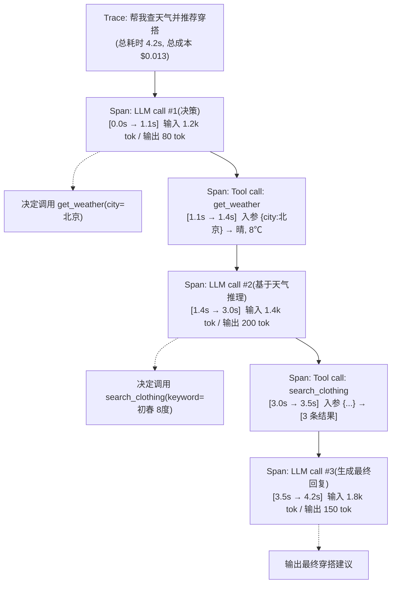
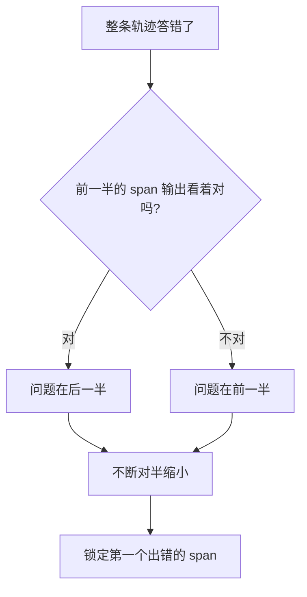

# 第 14 章 可观测性与调试

> 前面几章你已经能搭出一个会推理、会用工具、有记忆的 Agent 了。但当你把它放到线上、用户量上来之后，你会遇到一类全新的、让人崩溃的问题：**它出错了，你却复现不出来，也说不清它当时到底想了什么、干了什么。** 这一章讲怎么给 Agent 装上"行车记录仪"——让每一次运行都可观测、可回放、可调试。

> **学习目标**
> - 理解为什么 Agent 比传统后端更需要可观测性（黑盒、多步、非确定性）
> - 掌握该记录哪些东西：模型调用、工具调用、整条轨迹、提示与模型版本
> - 建立 **Trace / Span** 的心智模型，并理解它和 OpenTelemetry 的关系
> - 了解主流 Agent 可观测工具（LangSmith、Langfuse、Helicone、Phoenix 等）的定位与选型
> - 能用双语手写一个最小可用的 tracing 包装器，并知道怎么对接 Langfuse
> - 掌握定位坏 case 的调试套路，以及该盯哪些线上指标

> **前置知识**：第 5 章（Agent 核心循环）、第 6 章（工具系统）、第 7 章（记忆与上下文）。本章会呼应第 13 章（评测与测试）——可观测和评测是一对孪生兄弟。会写 TypeScript、了解 `try/catch` 和高阶函数。

---

## 14.1 为什么 Agent 特别需要可观测性

先从前端的经验出发。你的 React 应用线上报错，你怎么排查？大概率是这套组合拳：

- **Sentry**：抓到一个异常，带堆栈、带用户信息、带面包屑（breadcrumb），告诉你"哪行代码炸了"。
- **Performance trace**：浏览器 Performance 面板或 RUM 工具，告诉你"这个交互慢在哪一步"。
- **日志**：`console.log` 或结构化日志，告诉你"程序当时走到了哪、变量是什么"。

传统后端也是这一套：一个 HTTP 请求进来，要么成功返回 200，要么抛异常被捕获，链路基本是**确定的、可复现的**——同样的输入，几乎必然走同样的代码路径，得到同样的结果。出了 bug，你本地敲一遍就复现了。

**Agent 把这套假设全打破了。** 它有三个让人头疼的特性：

```
传统后端请求                          Agent 一次运行
─────────────                        ─────────────
确定的代码路径                         模型决定下一步做什么（非确定）
一进一出                              多步循环：想→调工具→看结果→再想…
出错 = 抛异常                         "出错" = 答非所问 / 工具用错 / 绕远路
本地能复现                            同样输入，下次可能走完全不同的路径
```

1. **它是个黑盒。** 模型为什么决定调这个工具、为什么这么填参数、为什么得出这个结论——这些发生在模型内部，你的代码里看不到。你只看到"输入 messages，输出一段文字加几个工具调用"。

2. **它是多步的。** 一次"运行"不是一次模型调用，而是第 5 章讲的那个循环：思考 → 调工具 → 看结果 → 再思考 → ……可能十几步。任何一步出问题，最终结果都会跑偏，但你不知道是哪一步。

3. **它是非确定性的。** 模型采样本身带随机性，加上工具结果会变（搜索结果、数据库内容、当前时间），**同样的用户输入，这次和下次可能走完全不同的路径。** 用户截图说"它答错了"，你照着输入跑一遍——结果它答对了。复现不出来，等于没法修。

所以，当用户问"**它为什么这么干？**"（Why did it do that?），你需要的不是一行异常堆栈，而是**整条决策轨迹**：它每一步想了什么、调了什么工具、工具返回了什么、最后怎么得出结论。这就是 Agent 可观测性要解决的核心问题。

> 一句话总结前端视角：**Agent 的可观测性 ≈ Sentry + Performance trace + 结构化日志，只不过观测的对象从"一次 HTTP 请求"变成了"一条 Agent 决策轨迹"。** 工具栈似曾相识，但记录的内容和组织方式不一样。

---

## 14.2 该记录什么

可观测性的第一步是"埋点"——决定记录哪些数据。Agent 系统里，下面这几类是必须记的：

**1. 每一次模型调用（LLM call）**

这是最核心的一类。每次调 `messages.create()`（或你封装的 `chat()`），记下：

- **完整输入**：`model`、完整的 `messages` 数组、`system`、`tools`、温度/effort 等参数。注意是**完整**的——很多坑就坑在"我以为发过去的是 A，其实发过去的是 B"。
- **完整输出**：模型返回的文本、`tool_use` 块、`stop_reason`。
- **token 用量**：输入 token、输出 token，以及（如果用了缓存）缓存命中的 token。这直接关系到成本，第 15 章会重点用到。
- **耗时**：这次调用花了多久（尤其首字延迟，见 15 章）。
- **成本**：用量 × 单价算出来的钱。

**2. 每一个工具调用（tool call）**

Agent 调一个工具时，记下：

- **工具名 + 参数**：模型决定调哪个工具、填了什么参数。
- **返回结果**：工具执行后返回了什么。
- **是否出错 + 错误信息**：工具抛异常了吗？返回的是 `is_error: true` 吗？

**3. 整条 Agent 轨迹（trace）**

把上面这些"单步"串成一条完整的运行记录：从用户输入开始，经过 N 轮"模型调用 + 工具调用"，到最终输出。这条轨迹是你回答"它为什么这么干"的依据。下一节专门讲怎么组织它。

**4. 版本信息**

这是最容易被忽略、但排查线上问题时最关键的一类：

- **提示版本**：这次用的 system prompt 是哪一版？（你应该像第 3 章建议的那样给提示打版本号。）
- **模型版本**：用的是 `claude-opus-4-8` 还是 `claude-sonnet-4-6`？

> 为什么版本这么重要？因为线上问题常常是"上周好好的，这周开始抽风"。如果你记了版本，一对比就发现"哦，周二改了提示 / 切了模型"。没记版本，你只能两眼一抹黑地猜。

下面用一张表把"埋点清单"收拢一下：

| 记录什么 | 关键字段 | 主要用途 |
| --- | --- | --- |
| 模型调用 | 输入 messages、输出、token、耗时、成本 | 调试 + 成本/延迟监控 |
| 工具调用 | 工具名、参数、结果、错误 | 调试工具用错 |
| 整条轨迹 | 把上面串成时间线 | 回答"它为什么这么干" |
| 提示版本 | prompt 版本号 | 定位"改了提示导致回归" |
| 模型版本 | `model` 字符串 | 定位"换了模型导致回归" |
| 用户反馈 | 👍/👎、纠错 | 找出坏 case，沉淀进评测集 |

---

## 14.3 Trace / Span 模型：给 Agent 运行画一棵树

记录了一堆"单步"数据，怎么组织成能看懂的东西？业界的标准答案是 **Trace / Span 模型**——它其实就是分布式追踪（distributed tracing）那一套，前端做过性能优化的同学一眼就懂。

### 先用前端类比

打开 Chrome Performance 面板，你会看到一条**调用链火焰图**：最外层是一次用户交互，往里一层层展开是各个函数调用，每个调用是一个带起止时间的"条"，嵌套关系一目了然。

Agent 的 Trace / Span 就是同一个东西：

- **Trace（追踪）**：一次完整的 Agent 运行。等于前端的"一次用户交互"或"一次页面加载"。
- **Span（跨度）**：运行中的某一步。等于火焰图里的一个"条"——它有名字、有开始/结束时间、有输入输出、可以嵌套子 span。

一次 Agent 运行画成树，大概长这样：



看着这棵树，"它为什么这么干"就有答案了：你能看到每一步的输入输出、每一步花了多少时间和钱、在哪一步开始跑偏。这正是调试 Agent 时最想要的视图。

### 一点术语

- 一个 span 通常带这些字段：`name`（这步叫什么）、`start_time` / `end_time`、`input`、`output`、`metadata`（比如 token 数、模型名）、`parent_id`（父 span，用来还原嵌套）。
- 顶层那个没有父 span 的，就是 trace 的根。

### 和 OpenTelemetry 的关系

你可能听过 **OpenTelemetry（OTel）**——它是云原生领域可观测性的事实标准，定义了 trace/span/metrics/logs 的通用数据模型和协议。后端同学对它应该不陌生。

那 Agent 可观测和 OTel 什么关系？

- Trace/Span 模型**本来就是 OTel（以及更早的 Dapper 论文）那套**，Agent 可观测只是把它套用到"LLM 调用 + 工具调用"上。
- 社区正在推进 **OpenTelemetry GenAI 语义约定（Semantic Conventions）**——给"一次 LLM 调用该记哪些字段"定标准（比如 span 名、模型名、token 数怎么命名）。它还在演进中，**具体字段名以官方约定为准**，但方向很明确：让 Agent 的 trace 能被通用的 OTel 后端（Jaeger、Grafana Tempo 等）接收。
- 实践含义：如果你公司已经有 OTel 体系，Agent 的 trace 最好也按 OTel 标准吐出去，复用现有的观测基础设施，而不是另起炉灶。下一节的工具大多支持导出 OTel 格式。

---

## 14.4 工具选型：别自己造轮子（但要懂原理）

手写 tracing 能让你理解原理（下一节就动手），但生产环境通常用现成工具——它们帮你做了存储、UI、检索、聚合统计这些重活。主流选项：

| 工具 | 定位 | 开源/自托管 | 一句话特点 |
| --- | --- | --- | --- |
| **Langfuse** | LLM/Agent 可观测平台 | ✅ 开源，可自托管 | 功能全面、对接简单，本书推荐自托管入门 |
| **LangSmith** | LangChain 官方平台 | ❌ 托管为主 | 和 LangChain/LangGraph 生态深度集成 |
| **Helicone** | LLM 网关 + 可观测 | ✅ 开源，可自托管 | 以代理（proxy）方式接入，改个 `base_url` 就能记 |
| **Phoenix / Arize** | LLM 可观测 + 评测 | ✅ Phoenix 开源 | 原生拥抱 OpenTelemetry，评测能力强 |
| **OpenTelemetry GenAI** | 标准/协议 | ✅ 标准本身 | 不是产品，是"大家都遵守的格式"，上面的工具多支持导出 |

选型建议（**功能与价格以各家官方为准，变化很快**）：

- **想快速上手、又怕数据出公司**：选 **Langfuse 自托管**。它开源、Docker 一键起、SDK 简单，本章后面会演示对接。
- **已经在用 LangChain / LangGraph**：**LangSmith** 几乎零成本接入，trace 自动就有了。
- **只想最小侵入地记 LLM 调用、不想改业务代码**：**Helicone** 这种网关式的最省事——把 SDK 的 `base_url` 指向它，它在中间帮你记。
- **重视评测、已有 OTel 体系**：**Phoenix / Arize**，它和 OTel、评测流程结合得好。

> 选型的本质不是"哪个最强"，而是"哪个和你现有的栈最搭、数据合规上能接受"。和选前端监控（Sentry vs 自建 vs 云厂商 APM）是一个道理。

无论选哪个，它们的**数据模型都是 Trace/Span**——你理解了上一节，看任何一家的 UI 都不会陌生。

---

## 14.5 动手：手写一个最小 tracing

理解 Trace/Span 最快的方式是自己实现一个最小版。目标：

1. 一个包装器，自动记录每次 **LLM 调用** 和 **工具调用** 为结构化的 span。
2. 所有 span 挂在同一个 trace 下。
3. 能把这条 trace 打印成一棵可读的树。

这套东西不到一百行，但能让你彻底搞懂现成工具在做什么。我们先通过一层薄抽象 `chat()` 调用模型（沿用全书惯例，便于切换厂商），再给它和工具都套上 tracing。

#### TypeScript

```typescript
// tracing.ts —— 一个最小可用的 Trace/Span 记录器
import { randomUUID } from "node:crypto";

// 一个 span：运行中的一步（一次 LLM 调用或一次工具调用）
interface Span {
  id: string;
  name: string;
  type: "llm" | "tool";
  startMs: number;
  endMs?: number;
  input: unknown;
  output?: unknown;
  error?: string;
  metadata?: Record<string, unknown>; // 比如 token 数、模型名
}

// 一个 trace：一次完整的 Agent 运行，挂着一串 span
class Trace {
  id = randomUUID();
  name: string;
  spans: Span[] = [];
  startMs = Date.now();

  constructor(name: string) {
    this.name = name;
  }

  // 开一个 span，返回一个"收尾函数"，执行完调用它来记录结果
  startSpan(name: string, type: Span["type"], input: unknown) {
    const span: Span = { id: randomUUID(), name, type, startMs: Date.now(), input };
    this.spans.push(span);
    return {
      end: (output: unknown, metadata?: Record<string, unknown>) => {
        span.endMs = Date.now();
        span.output = output;
        span.metadata = metadata;
      },
      fail: (error: string) => {
        span.endMs = Date.now();
        span.error = error;
      },
    };
  }

  // 把整条 trace 打印成一棵可读的树
  print() {
    const total = Date.now() - this.startMs;
    console.log(`\nTrace: ${this.name}  (总耗时 ${total}ms, 共 ${this.spans.length} 步)`);
    for (const s of this.spans) {
      const dur = s.endMs ? `${s.endMs - s.startMs}ms` : "未结束";
      const tag = s.error ? "❌ 出错" : s.type === "llm" ? "🧠 LLM" : "🔧 工具";
      console.log(`├─ ${tag} ${s.name}  [${dur}]`);
      console.log(`│    输入: ${JSON.stringify(s.input).slice(0, 120)}`);
      if (s.error) console.log(`│    错误: ${s.error}`);
      else console.log(`│    输出: ${JSON.stringify(s.output).slice(0, 120)}`);
      if (s.metadata) console.log(`│    元数据: ${JSON.stringify(s.metadata)}`);
    }
  }
}

// 给一次 LLM 调用套上 tracing
async function tracedChat(trace: Trace, params: any, chat: (p: any) => Promise<any>) {
  // 注意：input 记的是完整参数（model、messages、tools），别只记一部分
  const span = trace.startSpan(`LLM: ${params.model}`, "llm", params);
  try {
    const res = await chat(params);
    span.end(res.content, {
      model: params.model,
      inputTokens: res.usage?.input_tokens,
      outputTokens: res.usage?.output_tokens,
      // 缓存命中 token，用于成本分析（见第 15 章）
      cacheReadTokens: res.usage?.cache_read_input_tokens,
      stopReason: res.stop_reason,
    });
    return res;
  } catch (e) {
    span.fail(String(e));
    throw e;
  }
}

// 给一次工具调用套上 tracing
async function tracedTool(
  trace: Trace,
  name: string,
  input: unknown,
  fn: (input: any) => Promise<unknown>,
) {
  const span = trace.startSpan(`Tool: ${name}`, "tool", input);
  try {
    const result = await fn(input);
    span.end(result);
    return result;
  } catch (e) {
    span.fail(String(e)); // 工具抛错也要记下来，别让它消失
    throw e;
  }
}
```

用起来是这样（把它套进第 5 章的 Agent 循环）：

```typescript
const trace = new Trace("帮我查北京天气");

// 第一轮：让模型决策（Claude 默认推荐 claude-opus-4-8）
const res = await tracedChat(trace, {
  model: "claude-opus-4-8",
  max_tokens: 1024,
  tools: [weatherTool],
  messages,
}, chat);

// 如果模型要调工具，执行并记录
if (res.stop_reason === "tool_use") {
  const toolUse = res.content.find((b: any) => b.type === "tool_use");
  await tracedTool(trace, toolUse.name, toolUse.input, getWeather);
  // …… 把结果塞回 messages，继续下一轮（省略）
}

trace.print(); // 运行结束，打印整条轨迹
```

#### Python

```python
# tracing.py —— 一个最小可用的 Trace/Span 记录器
import time
import json
import uuid
from dataclasses import dataclass, field
from typing import Any, Callable, Literal, Optional


@dataclass
class Span:
    name: str
    type: Literal["llm", "tool"]
    input: Any
    id: str = field(default_factory=lambda: str(uuid.uuid4()))
    start_ms: float = field(default_factory=lambda: time.time() * 1000)
    end_ms: Optional[float] = None
    output: Any = None
    error: Optional[str] = None
    metadata: Optional[dict] = None


class Trace:
    """一次完整的 Agent 运行，挂着一串 span。"""

    def __init__(self, name: str):
        self.id = str(uuid.uuid4())
        self.name = name
        self.spans: list[Span] = []
        self.start_ms = time.time() * 1000

    def start_span(self, name: str, type: str, input: Any) -> Span:
        span = Span(name=name, type=type, input=input)
        self.spans.append(span)
        return span

    @staticmethod
    def end_span(span: Span, output: Any, metadata: Optional[dict] = None) -> None:
        span.end_ms = time.time() * 1000
        span.output = output
        span.metadata = metadata

    @staticmethod
    def fail_span(span: Span, error: str) -> None:
        span.end_ms = time.time() * 1000
        span.error = error

    def print(self) -> None:
        total = round(time.time() * 1000 - self.start_ms)
        print(f"\nTrace: {self.name}  (总耗时 {total}ms, 共 {len(self.spans)} 步)")
        for s in self.spans:
            dur = f"{round(s.end_ms - s.start_ms)}ms" if s.end_ms else "未结束"
            tag = "❌ 出错" if s.error else ("🧠 LLM" if s.type == "llm" else "🔧 工具")
            print(f"├─ {tag} {s.name}  [{dur}]")
            print(f"│    输入: {json.dumps(s.input, ensure_ascii=False)[:120]}")
            if s.error:
                print(f"│    错误: {s.error}")
            else:
                print(f"│    输出: {json.dumps(s.output, ensure_ascii=False, default=str)[:120]}")
            if s.metadata:
                print(f"│    元数据: {json.dumps(s.metadata, ensure_ascii=False)}")


def traced_chat(trace: Trace, params: dict, chat: Callable[[dict], Any]) -> Any:
    """给一次 LLM 调用套上 tracing。input 记完整参数，别只记一部分。"""
    span = trace.start_span(f"LLM: {params['model']}", "llm", params)
    try:
        res = chat(params)
        usage = getattr(res, "usage", None)
        trace.end_span(span, res.content, metadata={
            "model": params["model"],
            "input_tokens": getattr(usage, "input_tokens", None),
            "output_tokens": getattr(usage, "output_tokens", None),
            # 缓存命中 token，用于成本分析（见第 15 章）
            "cache_read_tokens": getattr(usage, "cache_read_input_tokens", None),
            "stop_reason": res.stop_reason,
        })
        return res
    except Exception as e:
        trace.fail_span(span, str(e))
        raise


def traced_tool(trace: Trace, name: str, input: Any, fn: Callable[[Any], Any]) -> Any:
    """给一次工具调用套上 tracing。工具抛错也要记下来。"""
    span = trace.start_span(f"Tool: {name}", "tool", input)
    try:
        result = fn(input)
        trace.end_span(span, result)
        return result
    except Exception as e:
        trace.fail_span(span, str(e))
        raise
```

这版手写的核心就两件事：**用 `startSpan` 开一个 span、用收尾函数记结果**，所有 span 挂在 `Trace` 下。现成工具无非是把"打印成树"换成"上报到服务器 + 漂亮的 Web UI + 可检索"。

### 对接 Langfuse（示意）

真上生产，把上面的"打印"换成上报。以 Langfuse 为例，它的 SDK 模型和我们手写的几乎一一对应——也是 trace 套 span（它叫 `span` 和 `generation`，后者专指 LLM 调用）。下面是**示意代码，确切 API 以 Langfuse 官方文档为准**：

#### Python

```python
# 用 Langfuse SDK 记录（示意，API 以官方文档为准）
from langfuse import Langfuse

# 密钥从环境变量读，绝不硬编码
langfuse = Langfuse(
    public_key=os.environ["LANGFUSE_PUBLIC_KEY"],
    secret_key=os.environ["LANGFUSE_SECRET_KEY"],
    host=os.environ.get("LANGFUSE_HOST", "http://localhost:3000"),  # 自托管地址
)

# 开一条 trace
trace = langfuse.trace(name="帮我查北京天气", user_id="user_123")

# 记一次 LLM 调用（generation 专门表示模型调用，能自动算 token/成本）
generation = trace.generation(
    name="决策",
    model="claude-opus-4-8",
    input=messages,
)
res = chat({"model": "claude-opus-4-8", "messages": messages, "max_tokens": 1024})
generation.end(
    output=res.content,
    usage={"input": res.usage.input_tokens, "output": res.usage.output_tokens},
)

# 记一次工具调用（普通 span）
span = trace.span(name="get_weather", input={"city": "北京"})
result = get_weather({"city": "北京"})
span.end(output=result)
```

#### TypeScript

```typescript
// 用 Langfuse SDK 记录（示意，API 以官方文档为准）
import { Langfuse } from "langfuse";

const langfuse = new Langfuse({
  publicKey: process.env.LANGFUSE_PUBLIC_KEY!,
  secretKey: process.env.LANGFUSE_SECRET_KEY!,
  baseUrl: process.env.LANGFUSE_HOST ?? "http://localhost:3000",
});

const trace = langfuse.trace({ name: "帮我查北京天气", userId: "user_123" });

// generation = LLM 调用，能自动算 token / 成本
const generation = trace.generation({ name: "决策", model: "claude-opus-4-8", input: messages });
const res = await chat({ model: "claude-opus-4-8", messages, max_tokens: 1024 });
generation.end({
  output: res.content,
  usage: { input: res.usage.input_tokens, output: res.usage.output_tokens },
});

// span = 工具调用
const span = trace.span({ name: "get_weather", input: { city: "北京" } });
const result = await getWeather({ city: "北京" });
span.end({ output: result });
```

看出来了吧：**和手写版是同构的**。理解了 Trace/Span，换任何一家 SDK 都是改改方法名的事。

---

## 14.6 调试套路：从"复现不出来"到"精准定位"

有了轨迹，调试 Agent 就有了抓手。下面是一套实战套路。

### 1. 尽量复现：固定输入，缓存随机源

前面说了，Agent 的随机性来自两处：模型采样、工具结果会变。彻底固定模型采样很难（即便温度设 0，新模型也不保证逐字一致），但你能**固定其他变量**：

- **固定输入**：把出问题那次的完整 `messages`（从 trace 里捞出来）原样重放。
- **缓存/打桩工具结果**：调试时，把工具返回值固定下来（mock 掉），别每次真去搜网、查库。这样至少排除了"工具结果变了"这个变量。
- **固定时间等环境**：如果 prompt 里有当前时间，调试时也固定成那一刻。

复现不一定 100% 成功，但把变量逐个固定，能让"偶现"变成"高概率出现"，就好查多了。

### 2. 看完整 prompt，而不是你以为的 prompt

最高频的 bug 来源：**实际发给模型的 prompt 和你以为的不一样。** 模板拼错了、历史截断了、某个变量没插值进去、工具结果太长被挤掉了……这些只有看**真实发出去的完整 messages**才能发现。这正是 14.2 强调"记完整输入"的原因。

> 前端类比：就像调接口时，你得看 Network 面板里**真正发出去的 request payload**，而不是看你代码里"应该发"的那个对象。两者经常对不上。

### 3. 看模型的思考（thinking）

如果你开了模型的思考能力（Claude 用 `thinking: {type: "adaptive"}`，配 `display: "summarized"` 可拿到思考摘要；不同模型机制不同，以官方为准），把思考内容也记进 trace。当模型决策诡异时，思考摘要常常直接告诉你"它当时是怎么想歪的"。

### 4. 二分定位坏 span

一条十几步的 trace，错在哪一步？用**二分查找**的思路：



锁定"**第一个开始跑偏的 span**"是关键——它往往是根因，后面的步骤只是被它带歪的连锁反应。比如你发现"LLM call #2 在天气明明是晴天的情况下却说要带伞"，那根因就在第 2 步的输入或推理，不用再管后面。

### 5. 把坏 case 沉淀进评测集（呼应第 13 章）

这是闭环的最后一步，也是最容易被跳过、却最有价值的一步：

**每修好一个线上坏 case，就把它（输入 + 期望输出）加进你的评测集。**

为什么？因为 Agent 是非确定的、提示是会改的、模型是会升级的。今天修好的 bug，下次改提示可能又冒出来。只有把它变成一条评测用例，你的评测套件（第 13 章）才能在每次改动后自动帮你守住——这就是回归测试在 Agent 世界里的样子。

> **可观测 → 评测，是一条完整的飞轮**：线上可观测帮你**发现**坏 case，评测集帮你**锁住**不再回归。第 13 章和本章合起来才是完整的质量保障。

---

## 14.7 线上该盯哪些指标

调试是"出事后查"，监控是"出事前/出事时报警"。Agent 上线后，建议盯这几类指标（大多能从你记录的 trace 聚合出来）：

| 指标 | 怎么算 | 为什么重要 |
| --- | --- | --- |
| **延迟 P50 / P95** | 单次运行总耗时的中位数 / 95 分位 | P95 反映"最差那批用户"的体验，比平均值有用 |
| **错误率** | 运行失败（抛异常 / 超步数 / 工具全挂）占比 | 系统健康度的第一信号 |
| **token / 成本** | 按 trace 累加 token，乘单价 | 直接是钱，失控会很疼（第 15 章） |
| **工具成功率** | 每个工具：成功调用 / 总调用 | 某个工具成功率骤降 = 该工具或其依赖出问题了 |
| **用户反馈** | 👍/👎 率、人工纠错数 | 唯一能反映"答得好不好"的信号，机器指标测不出来 |

> 为什么要 **P95** 而不是平均延迟？因为 Agent 的耗时分布很"长尾"——大部分请求一两秒，少数复杂请求要十几秒。平均值会被拉平，看不出"有一批用户在干等"。这和前端盯首屏 P95、而不是平均首屏，是同一个道理。

注意最后一行：**用户反馈是机器指标测不出来的维度。** 延迟、错误率都正常，不代表答得对、答得好。给用户一个 👍/👎 按钮，把负反馈的那些 trace 捞出来,正是 14.6 第 5 步"沉淀进评测集"的最佳输入源。

---

## 14.8 前端视角小结

把这一章的对应关系收一下，方便你用已有的前端经验快速理解：

| Agent 可观测 | 前端的对应物 |
| --- | --- |
| 一条 Trace | 一次用户交互 / 一次页面加载 |
| 一个 Span | Performance 火焰图里的一个"条" |
| 记录完整 prompt | 看 Network 面板里真实的 request payload |
| 错误 span + 错误信息 | Sentry 抓到的异常 + 堆栈 |
| 延迟 P95、token 成本 | RUM 的性能指标、CDN/带宽账单 |
| 用户 👍/👎 | 产品埋点里的满意度反馈 |
| 把坏 case 进评测集 | 给修复的 bug 补一个回归测试 |

核心就一句：**你已经会的那套前端监控思路，几乎可以平移到 Agent，只是观测对象从"请求"变成了"决策轨迹"。**

---

## 常见坑 / 最佳实践

- **只记摘要、不记完整输入。** "我以为发了 A 其实发了 B"是头号 bug 来源。trace 里务必存**完整** messages / tools，哪怕占空间。
- **工具抛错被吞掉。** 工具里 `try/catch` 后只 `console.log` 一下就吃掉异常，trace 里看不到——一定要把错误记进 span。
- **不记版本。** 不记提示版本和模型版本，线上回归时你无从对比"是不是改了什么"。
- **敏感数据直接进 trace。** 用户隐私、密钥、PII 会原样落到可观测平台。该脱敏的脱敏，合规该过的过（这点和前端日志脱敏一样）。
- **采样策略缺失。** 全量记录高 QPS 系统会很贵。可以对正常请求采样记录、对出错/负反馈请求全量记录。
- **trace 记了却没人看。** 光埋点不建立"出问题先看 trace"的习惯，等于白记。把 trace 链接接进报警、接进客诉工单。
- **自己造平台。** 学原理用手写版，生产环境优先用成熟工具（Langfuse 等），别花几个月重造一个半成品的可观测平台。

---

## 本章小结

- Agent 因为**黑盒、多步、非确定性**，比传统后端更难调试——出问题常常复现不出来。
- 解法是记录**整条决策轨迹**：每次模型调用（完整输入输出、token、耗时、成本）、每次工具调用（参数、结果、错误）、提示版本、模型版本。
- 组织轨迹用 **Trace / Span 模型**：一次运行是一个 trace，每一步是一个 span，可嵌套——就是前端性能 trace / 调用链那一套，也是 OpenTelemetry 的数据模型。
- 工具上，**Langfuse（开源可自托管）** 适合入门，**LangSmith** 适合 LangChain 生态，**Helicone** 网关式最省事，**Phoenix/Arize** 评测强、亲 OTel；选型看你的栈和合规，**功能价格以官方为准**。
- 调试套路：**复现（固定输入/缓存工具）→ 看完整 prompt → 看思考 → 二分定位坏 span → 把坏 case 沉淀进评测集**（呼应第 13 章）。
- 线上盯：**延迟 P50/P95、错误率、token/成本、工具成功率、用户反馈**。
- 前端视角：可观测 ≈ **Sentry + Performance trace + 结构化日志**，对象换成 Agent 轨迹。

---

## 练习题

1. **（入门）** 把本章手写的 `Trace` / `tracedChat` / `tracedTool` 接进你在第 5 章写的 Agent 循环，跑一个"查天气 + 推荐"的多步任务，最后 `print()` 出整条轨迹。确认你能在输出里看到：每一步的输入输出、每步耗时、总成本。

2. **（入门）** 在 `tracedTool` 里故意让某个工具抛异常，确认这个错误被记进了对应的 span，并在打印的树里以"❌ 出错"标出来。思考：如果工具里把异常吞掉了，trace 会变成什么样？

3. **（进阶）** 给 `Trace` 加一个 `toJSON()` 方法，把整条轨迹序列化成 JSON。再写一个函数，从这段 JSON 里算出：总 token、总成本、最慢的那个 span。这其实就是线上指标聚合的雏形。

4. **（进阶）** 选一个开源工具（推荐 Langfuse），用 Docker 在本地起一个实例，把你的 Agent trace 上报上去，在它的 Web UI 里查看一条 trace。对比它的 UI 和你手写 `print()` 的差异——它多做了哪些事？

5. **（综合）** 设计一个"坏 case 飞轮"：当用户点 👎 时，自动把那条 trace 的输入 + 模型输出存进一个文件；再写一个脚本，把这些文件转成第 13 章评测集的格式。说说这个闭环为什么能持续提升 Agent 质量。

---

## 延伸阅读

- **OpenTelemetry** 官方文档：trace / span / 语义约定（Semantic Conventions），尤其关注演进中的 **GenAI Semantic Conventions**。
- **Langfuse** 官方文档：自托管部署、SDK（trace / span / generation 的概念）、评测集成。关键词：Langfuse self-hosting、observations。
- **LangSmith** 文档：与 LangChain / LangGraph 的 tracing 集成。
- Google 的 **Dapper** 论文：分布式追踪的开山之作，理解 trace/span 模型的源头。
- 本书 **第 13 章（评测与测试）**：可观测发现的坏 case 如何沉淀为评测用例，与本章构成质量飞轮。
- 本书 **第 15 章（成本与性能优化）**：本章记录的 token / 延迟数据，正是下一章优化的依据。
