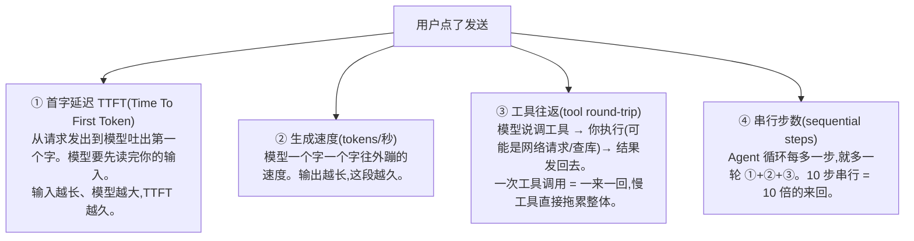
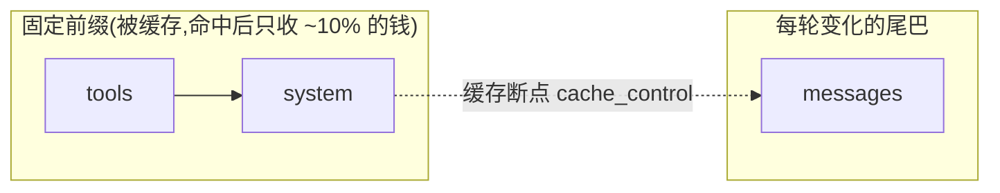

# 第 15 章 成本与性能优化

> 上一章你学会了把 Agent 的每一次运行都记录下来——token、延迟、成本一清二楚。这一章我们就拿着这些数据动手优化：让 Agent **更省钱、更快、体感更好**。这不是锦上添花的可选项；一个 Agent 多步循环，token 和延迟会被成倍放大，不优化的话，Demo 能跑、上线就亏。

> **学习目标**
> - 算清楚"一次 Agent 运行到底花多少钱"，理解多步、多 Agent 为什么会放大成本
> - 拆解延迟从哪来：首字延迟（TTFT）、生成速度、工具往返、串行步数
> - 掌握一整套省钱/提速手段：提示缓存、模型分级、控上下文、并行、流式、批处理、限步数、effort 调档
> - 理解 Claude 提示缓存的前缀匹配原理，以及怎么验证命中
> - 能用双语写一个成本估算/统计小工具
> - 建立成本监控与预算告警的意识（呼应第 14 章）

> **前置知识**：第 2 章（token、上下文窗口、模型调用）、第 6 章（工具与并行）、第 7 章（上下文管理）、第 12 章（流式）、第 14 章（可观测）。会写 TypeScript、了解 Promise 并发。

---

## 15.1 成本从哪来：一次 Agent 运行的账怎么算

先把计费模型讲清楚。几乎所有大模型都是**按 token 计费，且输入和输出分开定价**——而且**输出通常比输入贵好几倍**。以本书默认的 Claude 为参考（**价格以官方为准，会变**）：

| 模型 | 输入 $/百万 token | 输出 $/百万 token | 上下文 |
| --- | --- | --- | --- |
| `claude-opus-4-8`（默认推荐） | $5 | $25 | 1M |
| `claude-sonnet-4-6`（性价比） | $3 | $15 | 1M |
| `claude-haiku-4-5`（最快最便宜） | $1 | $5 | 200K |

> 前端类比：这有点像云函数/带宽计费——**用多少算多少**。但 LLM 有个反直觉的点：**输出 token 比输入贵约 5 倍**（Opus 是 $25 vs $5）。所以"让模型少废话"不只是体验问题，是真金白银。

### 一次模型调用的成本

单次调用很简单：

```
单次成本 = 输入 token × 输入单价 + 输出 token × 输出单价
```

比如一次 Opus 调用，输入 2000 token、输出 500 token：

```
= 2000 × ($5 / 1,000,000) + 500 × ($25 / 1,000,000)
= $0.010 + $0.0125
= $0.0225   （约 1.6 分钱人民币）
```

### Agent 多步会放大成本

但 Agent 不是调一次就完事——它是第 5 章那个循环，可能调好几次。**而且关键在于：每一轮都要把全部历史重新发一遍**（模型无状态，第 7 章讲过）。这意味着输入 token 是**累加放大**的：

```
一个 5 步的 Agent 任务（每步都带上之前的全部历史）：

步骤   输入(累积历史)   输出      这步输入token
─────  ──────────────  ────      ────────────
 1     系统+用户         决策       2,000
 2     +工具结果1        决策       2,800   ← 历史变长了
 3     +工具结果2        决策       3,600
 4     +工具结果3        决策       4,500
 5     +工具结果4        最终答案    5,400
                                  ─────────
                          输入合计  18,300 token（不是 2,000！）
```

看到没——**5 步任务的总输入 token 远不止单步的 5 倍，因为历史在滚雪球。** 一个跑十几步、还带大段工具结果的 Agent，单次任务输入轻松到几万 token。这就是为什么"Demo 便宜、上线烧钱"。

**多 Agent 更狠**（第 9 章）。如果你有一个主 Agent 调度好几个子 Agent，每个子 Agent 自己又是一个多步循环——成本是**相乘**的，不是相加。一个主 + 3 个子 Agent，整体花费可能是单 Agent 的好几倍。多 Agent 强大，但账要算清楚再上。

### 怎么算"一次 Agent 运行的成本"

方法就是上一章 trace 的直接应用：**把这次运行里每一次模型调用的 token 累加，乘上对应单价，求和。** 本章 15.10 会给一个现成的小工具。先记住公式：

```
一次运行成本 = Σ（每次 LLM 调用的输入 token × 输入单价 + 输出 token × 输出单价）
```

如果用了缓存，命中部分按更低的"缓存读取价"算——下一节就讲。

---

## 15.2 延迟从哪来：用户在等什么

成本是给你看的账单，延迟是给用户的体感。Agent 的延迟由这几块构成：



关键洞察：

- **TTFT 和生成速度是"模型内"的延迟**——优化它靠选模型、控输入长度、用流式（让用户早点看到第一个字）。
- **工具往返和串行步数是"模型外"的延迟**——优化它靠并行、减少不必要的步骤。
- **对用户体感影响最大的往往是 TTFT。** 用户盯着空白屏幕等三秒和等零点五秒（哪怕总时长一样），感受天差地别。这正是流式（15.7）和并行（15.6）的价值所在。

> 前端类比：① TTFT ≈ TTFB（首字节时间），② 生成速度 ≈ 下载速度，③ 工具往返 ≈ 串联的 API 请求，④ 串行步数 ≈ 请求瀑布流（waterfall）。优化 Agent 延迟，和优化前端首屏的思路是一模一样的：**减少串行往返、让关键内容先出来。**

---

下面进入正题：**逐条讲省钱/提速的手段。** 每条都给做法和代码/配置要点。

## 15.3 提示缓存（Prompt Caching）：最高性价比的优化

如果只能学一个优化，学这个。它能在合适的场景下**省下约 90% 的输入成本**，还顺带降低延迟。

### 它解决什么问题

回到 15.1 那个"历史滚雪球"的问题：每一轮都把一大段相同的前缀（系统提示、工具定义、之前的历史）重新发、重新计费。提示缓存的思路是：**这段固定不变的前缀，模型第一次处理后缓存起来，后续请求直接复用,只对没缓存的新内容收全价。**

### 前缀匹配原理（必须搞懂）

这是用好缓存的关键，也是最容易踩坑的地方：

> **提示缓存是"前缀匹配"——从头开始逐字节比对。前缀里任何一个字节变了，从那个位置往后的缓存全部失效。**

请求的渲染顺序是 `tools → system → messages`（第 3 章提过）。所以缓存的命中逻辑是：



**核心纪律：把稳定的东西放前面、易变的东西放后面。**

- ✅ 放前面（适合缓存）：固定的系统提示、确定的工具列表、不变的少样本示例、大段背景文档。
- ❌ 别放前缀里：当前时间戳、随机 ID、每次都不同的用户问题。**这些一旦混进前缀，缓存每次都失效，等于白缓存。**

### Claude 怎么用

Claude 用 `cache_control: {type: "ephemeral"}` 标记缓存断点。最省事的方式是用**自动缓存**（顶层 `cache_control`，自动缓存最后一个可缓存块）；要精细控制就标在具体内容块上。

> **已核实的关键事实**（Claude，截至 2026）：
> - 缓存**读取**约为基础输入价的 **0.1 倍**（即省约 90%）；缓存**写入**（第一次建缓存）约 1.25 倍（5 分钟 TTL）或 2 倍（1 小时 TTL）。
> - 默认 TTL 5 分钟，可设 `{"type": "ephemeral", "ttl": "1h"}` 延长到 1 小时。
> - 一次请求最多 **4 个**缓存断点。
> - **有最小可缓存长度**：Opus 4.8 约需 4096 token 前缀，Sonnet 4.6 约 2048 token——前缀太短不会缓存（不报错，就是没命中）。

#### Python

```python
import anthropic

client = anthropic.Anthropic()

# 把大段固定内容（这里是一份长文档）放进 system，标记为可缓存
response = client.messages.create(
    model="claude-opus-4-8",
    max_tokens=1024,
    system=[
        {
            "type": "text",
            "text": LARGE_FIXED_DOCUMENT,            # 比如 50KB 的固定背景资料
            "cache_control": {"type": "ephemeral"},  # ← 缓存断点：这之前的内容被缓存
        }
    ],
    # 每次变化的用户问题放在 messages 里，在断点之后，不影响缓存命中
    messages=[{"role": "user", "content": "根据上面的文档，总结三个要点"}],
)
```

#### TypeScript

```typescript
import Anthropic from "@anthropic-ai/sdk";

const client = new Anthropic();

const response = await client.messages.create({
  model: "claude-opus-4-8",
  max_tokens: 1024,
  system: [
    {
      type: "text",
      text: LARGE_FIXED_DOCUMENT, // 大段固定内容
      cache_control: { type: "ephemeral" }, // ← 缓存断点
    },
  ],
  messages: [{ role: "user", content: "根据上面的文档，总结三个要点" }],
});
```

> OpenAI 等厂商也有各自的缓存机制（部分是自动前缀缓存，无需手动标记），原理类似但接口不同，**以各自官方文档为准**。本书代码以 Claude 为例。

### 怎么验证命中了

**这一步千万别省。** 你以为开了缓存，实际可能因为某个易变内容混进前缀而从未命中。看响应里的 `usage`：

```python
print(response.usage.cache_creation_input_tokens)  # 这次写进缓存的 token（付了 ~1.25 倍写入费）
print(response.usage.cache_read_input_tokens)      # 这次从缓存命中的 token（只付 ~0.1 倍）
print(response.usage.input_tokens)                 # 没缓存、按全价算的 token
```

判断方法：

- 第一次请求：`cache_creation_input_tokens` 大于 0（建了缓存），`cache_read_input_tokens` 为 0。
- 后续相同前缀的请求：`cache_read_input_tokens` 应该大于 0（命中了）。
- **如果重复请求 `cache_read_input_tokens` 一直是 0**——说明有"隐形破坏者"在作祟。最常见的元凶：system 里写了 `datetime.now()`、塞了 UUID、JSON 序列化时 key 顺序不固定、或者工具列表每次都变。逐个排查前缀里有没有每次都变的东西。

> 这和第 14 章"看完整 prompt"是一回事：**怀疑缓存没命中时，把两次请求真正发出去的前缀逐字节 diff 一下**，破坏者立刻现形。

---

## 15.4 模型分级：贵的活给贵模型，杂活给便宜模型

不是每一步都需要最强的模型。一个 Agent 任务里，常常混着"难推理"和"简单杂活"：

- **难任务**（复杂推理、最终方案、关键决策）→ 用强模型（`claude-opus-4-8`）。
- **简单子任务**（分类、改写、抽个字段、判断意图、格式化）→ 用便宜模型（`claude-haiku-4-5`，或各家的 mini/小杯）。

回顾价格：Haiku 输入 $1/输出 $5，Opus 输入 $5/输出 $25——**差 5 倍**。把那些简单杂活从 Opus 换到 Haiku，成本立省 80%，而且 Haiku 更快，延迟也降了。

### 路由策略

怎么决定哪步用哪个模型？常见做法：

1. **按任务类型静态路由**：你心里清楚某个子任务很简单，代码里直接给它指定便宜模型。最简单、最可控，**优先用这个**。
2. **用便宜模型做"分诊"**：先用 Haiku 判断"这个请求难不难/属于哪类",再决定要不要升级到 Opus。
3. **多 Agent 分工**：主 Agent 用强模型做调度，子 Agent 按活的难易分配模型（呼应第 9 章）。

```typescript
// 静态路由：按子任务难易选模型（沿用全书的薄抽象 chat()）
async function classifyIntent(text: string) {
  // 意图分类是简单活，用最便宜的模型
  return chat({ model: "claude-haiku-4-5", max_tokens: 64, messages: [/* ... */] });
}

async function solveComplexTask(context: string) {
  // 复杂推理是难活，用最强的模型
  return chat({ model: "claude-opus-4-8", max_tokens: 4096, messages: [/* ... */] });
}
```

> ⚠️ **别为了省钱无脑全用便宜模型。** 便宜模型在难任务上会出错，错了要么重试（更贵）、要么坑用户（更亏）。模型分级的精髓是"**把对的活给对的模型**"，不是一刀切。
>
> 另外提醒一个缓存的坑（呼应 15.3）：**会话中途换模型会让提示缓存失效**（缓存是按模型隔离的）。所以"分级"更适合让不同子任务/子 Agent 各自固定用一个模型，而不是在同一条对话里来回切。

---

## 15.5 控制上下文长度：少喂点，喂准点

输入 token 是成本和 TTFT 的大头。控制上下文长度有几个抓手，很多在前面章节展开过，这里串起来：

- **裁剪/压缩历史**（呼应第 7 章）：对话太长时，用滑动窗口丢掉远古消息，或用 compaction 把老历史摘要成一小段。别无脑把整段历史一直带着。
- **RAG 只取相关片段**（呼应第 8 章）：别把整个知识库塞进 prompt，先检索出最相关的几段再注入。这是 RAG 省 token 的核心价值之一。
- **控制工具结果大小**：这是最容易被忽略的一条。工具返回一大坨 JSON（比如一个 API 返回 200 条记录），原样塞回 messages，既贵又占窗口，还可能稀释模型注意力。**在工具侧就裁剪/摘要**：只返回模型真正需要的字段和条数。

```typescript
// 反例：把整个 API 响应原样返回（可能是几十 KB）
async function searchProducts(query: string) {
  const res = await fetch(`/api/search?q=${query}`);
  return await res.json(); // ❌ 200 条全量记录，每条几十个字段
}

// 正例：只挑模型需要的字段和条数返回
async function searchProductsLean(query: string) {
  const res = await fetch(`/api/search?q=${query}`);
  const data = await res.json();
  return data.results.slice(0, 5).map((p: any) => ({
    name: p.name,
    price: p.price, // ✅ 只留 3 个关键字段、前 5 条
    rating: p.rating,
  }));
}
```

> 这一条经常是降本最快的一刀：很多 Agent 的 token 被"塞进去又用不上的工具结果"白白吃掉了。第 14 章的 trace 能帮你一眼看出哪个工具返回得最臃肿。

---

## 15.6 并行：能同时做的别排队

回到 15.2 的延迟拆解——**串行步数**是大头。如果几个操作之间没有依赖，就让它们**并发**跑，而不是一个等一个。

两种常见并行机会：

1. **并行工具调用**：模型一次可能要求调用多个工具（第 6 章讲过，Claude 默认就支持一条消息里多个 `tool_use`）。这些工具如果互不依赖，并发执行，把 N 次串行往返压成 1 次。
2. **并行子 Agent**：多个独立的子任务，分给多个子 Agent 同时做（呼应第 9 章）。

#### TypeScript

```typescript
// 模型在一条回复里要求调用多个互不依赖的工具 → 并发执行
const toolUses = res.content.filter((b: any) => b.type === "tool_use");

// ❌ 串行：每个等前一个完成，总耗时 = 各工具耗时之和
// for (const t of toolUses) { await execTool(t); }

// ✅ 并发：同时发起，总耗时 ≈ 最慢的那个工具
const results = await Promise.all(
  toolUses.map((t: any) => execTool(t.name, t.input)),
);
// 注意：并行执行的多个工具结果，要放进【同一条】 user 消息发回去（第 6 章）
```

#### Python

```python
import asyncio

# 并发执行互不依赖的工具调用
tool_uses = [b for b in res.content if b.type == "tool_use"]

results = await asyncio.gather(
    *(exec_tool(t.name, t.input) for t in tool_uses)
)
# 同样：所有 tool_result 放进同一条 user 消息发回去
```

> 前端类比：这就是把请求瀑布流（一个接一个）改成 `Promise.all`（一起发）。你天天做的事。
>
> ⚠️ 注意辨别**真的能并行吗**。如果工具 B 需要工具 A 的结果（"先查用户 ID，再用 ID 查订单"），那它们有依赖，只能串行。盲目并行会出错。

---

## 15.7 流式：不省钱，但救体感

流式（streaming，第 12 章详讲）不减少 token、不降低总耗时，但它**极大改善体感**——让用户在第一个字生成出来时就开始看到输出，而不是干等整段生成完。

```
非流式：用户等 ███████████████ 4 秒空白，然后一次性看到全部
流式：  用户等 ██ 0.5 秒，开始逐字看到输出，边生成边读
```

回到 15.2 的洞察：**用户对 TTFT（第一个字）的敏感度远高于总时长。** 流式把感知延迟从"总生成时间"降到了"首字延迟"。对任何有人在等的交互式场景（聊天、写作助手），流式几乎是必选项。

```typescript
// Claude 流式（要点；完整见第 12 章）
const stream = client.messages.stream({
  model: "claude-opus-4-8",
  max_tokens: 4096,
  messages,
});
for await (const event of stream) {
  if (event.type === "content_block_delta" && event.delta.type === "text_delta") {
    process.stdout.write(event.delta.text); // 逐字输出给用户
  }
}
```

> 一个实用提醒：当 `max_tokens` 设得很大时，**非流式请求容易触发 SDK 的 HTTP 超时**（长连接被中断）。所以大输出请求本来就该用流式——它既改善体感，又避免超时。

---

## 15.8 批处理 Batch API：离线任务半价

如果你的任务**不需要实时返回**（批量分类、离线数据清洗、批量生成摘要、跑评测集），用 **Batch API**——它以**半价**处理请求。

> **已核实**（Claude）：Batch API 价格是标准价的 **50%**。流程是：`client.messages.batches.create(...)` 提交一批请求 → 轮询 `processing_status` 直到 `"ended"` → 取结果。大部分批次 1 小时内完成，最长 24 小时。**结果是乱序的，按 `custom_id` 对应回去，别按顺序取。**

#### Python

```python
import anthropic
from anthropic.types.message_create_params import MessageCreateParamsNonStreaming
from anthropic.types.messages.batch_create_params import Request

client = anthropic.Anthropic()

# 提交一批离线任务（每条用 custom_id 标识）
batch = client.messages.batches.create(
    requests=[
        Request(
            custom_id=f"item-{i}",
            params=MessageCreateParamsNonStreaming(
                model="claude-haiku-4-5",  # 离线分类用便宜模型，再叠加 50% 批处理价
                max_tokens=64,
                messages=[{"role": "user", "content": f"给这条评论分类正/负：{text}"}],
            ),
        )
        for i, text in enumerate(reviews)
    ]
)

# 轮询直到完成
while True:
    batch = client.messages.batches.retrieve(batch.id)
    if batch.processing_status == "ended":
        break
    time.sleep(30)

# 取结果——按 custom_id 对回去，结果是乱序的！
results = {}
for r in client.messages.batches.results(batch.id):
    if r.result.type == "succeeded":
        text = next((b.text for b in r.result.message.content if b.type == "text"), "")
        results[r.custom_id] = text
```

> 算一笔账：批处理（50%）+ 便宜模型（Haiku 比 Opus 省 80%）叠加起来，离线大批量任务的成本可能只有"实时 + Opus"的十分之一。离线任务**一定要想到 Batch API**。
>
> 适用判断很简单：**用户在等结果吗？** 等 → 实时；不等（跑完发邮件/落库就行）→ 批处理。

---

## 15.9 限制步数与输出：给 Agent 装个保险丝

Agent 失控时最烧钱的两种情况：**输出太长**和**循环停不下来**。都要设上限。

**1. 合理设置 `max_tokens`**

`max_tokens` 是单次回复的输出上限。设太低会把回复截断（`stop_reason: "max_tokens"`），还得重试更亏；设太高则可能放任模型啰嗦。给一个**够用又不浪费**的值：

- 分类、抽字段这种短输出：`max_tokens` 设小，如 64~256。
- 正常对话回复：非流式默认约 16000、流式默认约 64000（够大避免截断，又不至于超时）。
- 别无脑设到模型上限——那只是给"模型万一开始啰嗦"留了过大的空间。

**2. 最大循环步数**

Agent 循环（第 5 章）一定要有"最多跑几步"的硬上限,否则一个推理跑偏的 Agent 可能无限调工具、无限烧钱：

```typescript
const MAX_STEPS = 10; // 硬上限：超过就停，别让它无限循环

let messages = [{ role: "user", content: userInput }];
for (let step = 0; step < MAX_STEPS; step++) {
  const res = await chat({ model: "claude-opus-4-8", max_tokens: 4096, tools, messages });
  if (res.stop_reason === "end_turn") break; // 正常结束
  // ……执行工具、把结果塞回 messages（省略）……
}
// 循环跑满 MAX_STEPS 还没结束 → 当作异常处理（告诉用户、记进 trace）
```

> 这就像给递归函数加深度限制、给 `while` 循环加退出条件。**没有上限的 Agent 循环 = 没有 base case 的递归**，迟早出事。第 14 章的"超步数"正是要监控的错误类型之一。

---

## 15.10 effort 调档：让模型"少想点"省 token

Claude 提供了一个直接控制"模型花多少力气"的旋钮：**effort（努力程度）**。

> **已核实**（Claude）：通过 `output_config: {effort: "low" | "medium" | "high" | "xhigh" | "max"}` 设置（注意是嵌在 `output_config` 里，不是顶层）。**effort 越低，模型思考越少、工具调用更精简、前言更少、确认更短，token 消耗更少、更快**；effort 越高越彻底但越贵越慢。可与自适应思考 `thinking: {type: "adaptive"}` 配合。

实践建议：

- **简单/对延迟敏感的子任务**：调到 `low`，省 token 又快。子 Agent 跑杂活尤其适合。
- **大多数任务**：`high` 往往是质量和成本的甜点。
- **正确性压倒一切的难任务**：才上 `max`。

```python
# 简单子任务用低 effort，省 token、更快
response = client.messages.create(
    model="claude-opus-4-8",
    max_tokens=1024,
    output_config={"effort": "low"},   # ← 让模型别想太多
    messages=[{"role": "user", "content": "把这段话改写得更正式"}],
)
```

```typescript
// TypeScript 同理
const response = await client.messages.create({
  model: "claude-opus-4-8",
  max_tokens: 1024,
  output_config: { effort: "low" }, // 简单活，低 effort
  messages: [{ role: "user", content: "把这段话改写得更正式" }],
});
```

> 注意 `effort` 是 Claude 的特性，且各版本支持的档位不同（如 `max` 是 Opus 4.6+ / Sonnet 4.6 才有，`xhigh` 是 Opus 4.7+）。其他厂商有各自类似的"推理强度"控制，**以官方为准**。把它理解成"模型版的画质档位"：高画质更精细但更耗资源。

---

## 15.11 成本监控与预算告警（呼应第 14 章）

优化做完了，还得持续盯着——否则一次提示改动、一个工具返回变臃肿，成本就可能悄悄翻倍。这部分直接复用第 14 章记录的数据：

- **按 trace 累计成本**：每条运行轨迹算出花了多少钱（用 15.10 后面那个小工具），聚合成"日成本""人均成本""每会话成本"。
- **设预算告警**：定个阈值——"日成本超过 $X""单次运行超过 $Y""单用户单日超过 $Z"就报警。这跟前端给 CDN/带宽账单设告警是一回事。
- **盯异常的单次成本**：某次运行成本远超平常，往往意味着"循环失控""工具返回爆炸""缓存没命中"。把这些当作第 14 章的坏 case 捞出来查。

> 成本监控的本质：**让账单变化可见、可报警，而不是月底看到账单才心头一惊。** 这正是上一章可观测性的价值落地。

---

## 15.12 动手：一个成本估算/统计小工具

把这一章的账落到代码上。下面这个小工具做两件事：按 token 单价**估算单次调用成本**，以及**累计一次 Agent 运行的总花费**(包括缓存命中的折扣价)。

#### TypeScript

```typescript
// cost.ts —— 成本估算/统计小工具
// 单价表：$/百万 token（价格以官方为准，会变，集中放一处便于更新）
const PRICING: Record<string, { input: number; output: number; cacheRead: number }> = {
  "claude-opus-4-8": { input: 5, output: 25, cacheRead: 0.5 }, // 缓存读取约为输入价 0.1 倍
  "claude-sonnet-4-6": { input: 3, output: 15, cacheRead: 0.3 },
  "claude-haiku-4-5": { input: 1, output: 5, cacheRead: 0.1 },
};

interface Usage {
  inputTokens: number;
  outputTokens: number;
  cacheReadTokens?: number; // 命中缓存的 token，按 cacheRead 价算
}

// 算一次模型调用的成本（美元）
function costOfCall(model: string, usage: Usage): number {
  const p = PRICING[model];
  if (!p) throw new Error(`未知模型单价: ${model}`);
  const cacheRead = usage.cacheReadTokens ?? 0;
  const billedInput = usage.inputTokens - cacheRead; // 未命中缓存的输入按全价
  return (
    (billedInput * p.input + cacheRead * p.cacheRead + usage.outputTokens * p.output) /
    1_000_000
  );
}

// 累计一次 Agent 运行（多次调用）的总成本
class RunCostTracker {
  private calls: { model: string; usage: Usage; cost: number }[] = [];

  record(model: string, usage: Usage) {
    this.calls.push({ model, usage, cost: costOfCall(model, usage) });
  }

  summary() {
    const total = this.calls.reduce((sum, c) => sum + c.cost, 0);
    const tokens = this.calls.reduce(
      (sum, c) => sum + c.usage.inputTokens + c.usage.outputTokens,
      0,
    );
    return { totalCostUsd: total, totalTokens: tokens, numCalls: this.calls.length };
  }
}

// 用法：接进第 14 章的 trace，每次 LLM 调用后 record 一下
const tracker = new RunCostTracker();
tracker.record("claude-opus-4-8", { inputTokens: 2000, outputTokens: 500 });
tracker.record("claude-haiku-4-5", { inputTokens: 800, outputTokens: 64, cacheReadTokens: 600 });
console.log(tracker.summary());
// → { totalCostUsd: 0.0226..., totalTokens: 3364, numCalls: 2 }
```

#### Python

```python
# cost.py —— 成本估算/统计小工具
from dataclasses import dataclass, field
from typing import Optional

# 单价表：$/百万 token（价格以官方为准，会变）
PRICING = {
    "claude-opus-4-8":   {"input": 5, "output": 25, "cache_read": 0.5},  # 缓存读取约输入价 0.1 倍
    "claude-sonnet-4-6": {"input": 3, "output": 15, "cache_read": 0.3},
    "claude-haiku-4-5":  {"input": 1, "output": 5,  "cache_read": 0.1},
}


@dataclass
class Usage:
    input_tokens: int
    output_tokens: int
    cache_read_tokens: int = 0  # 命中缓存的 token，按 cache_read 价算


def cost_of_call(model: str, usage: Usage) -> float:
    """算一次模型调用的成本（美元）。"""
    p = PRICING.get(model)
    if not p:
        raise ValueError(f"未知模型单价: {model}")
    billed_input = usage.input_tokens - usage.cache_read_tokens  # 未命中缓存的按全价
    return (
        billed_input * p["input"]
        + usage.cache_read_tokens * p["cache_read"]
        + usage.output_tokens * p["output"]
    ) / 1_000_000


@dataclass
class RunCostTracker:
    """累计一次 Agent 运行（多次调用）的总成本。"""
    calls: list = field(default_factory=list)

    def record(self, model: str, usage: Usage) -> None:
        self.calls.append({"model": model, "usage": usage, "cost": cost_of_call(model, usage)})

    def summary(self) -> dict:
        total = sum(c["cost"] for c in self.calls)
        tokens = sum(c["usage"].input_tokens + c["usage"].output_tokens for c in self.calls)
        return {"total_cost_usd": total, "total_tokens": tokens, "num_calls": len(self.calls)}


# 用法：接进第 14 章的 trace，每次 LLM 调用后 record
tracker = RunCostTracker()
tracker.record("claude-opus-4-8", Usage(input_tokens=2000, output_tokens=500))
tracker.record("claude-haiku-4-5", Usage(input_tokens=800, output_tokens=64, cache_read_tokens=600))
print(tracker.summary())
# → {'total_cost_usd': 0.0226..., 'total_tokens': 3364, 'num_calls': 2}
```

这个工具和第 14 章的 tracing 是天生一对：**trace 负责采集每次调用的 token，cost tracker 负责把 token 换算成钱。** 把它接进你的 Agent，每次运行就能输出"这次花了多少钱、调了几次、命中多少缓存"。

> ⚠️ 注意 `cacheReadTokens` 不会重复计入 `inputTokens` 的全价部分——上面的代码用 `billedInput = inputTokens - cacheReadTokens` 把命中缓存的那部分挪到折扣价里算。这是验证缓存省钱效果的关键：命中越多，全价输入越少。

---

## 15.13 前端视角小结

这一章所有的优化，都能在你的前端经验里找到对应：

| Agent 优化 | 前端的对应物 |
| --- | --- |
| 提示缓存 | HTTP 缓存 / CDN 缓存：命中就不重新算 |
| 模型分级 | 该用重组件的地方用重组件，简单的用轻量方案 |
| 控制上下文长度 | 减小请求 payload、按需加载（lazy load）、分页 |
| 控制工具结果大小 | 接口只返回前端要用的字段（别 over-fetch） |
| 并行工具/子 Agent | `Promise.all` 替代请求瀑布流 |
| 流式 | 骨架屏 / 渐进式渲染：让首屏内容尽早出来 |
| 批处理 Batch API | 把多个小请求合并成一个批量请求 |
| 限制 max_tokens / 步数 | 给递归加深度上限、给请求加超时 |
| 成本监控告警 | 给带宽/CDN 账单设阈值告警 |

核心就一句：**像优化前端的包体积、首屏、请求数一样，去优化 Agent 的 token、延迟、调用次数。** 你已经会的那套性能优化直觉，几乎可以原样平移。

---

## 常见坑 / 最佳实践

- **缓存命中没验证。** 开了 `cache_control` 不代表命中了。务必看 `cache_read_input_tokens`，并排查前缀里有没有 `datetime.now()`、UUID、不固定顺序的 JSON。
- **把易变内容放进缓存前缀。** 时间戳、随机 ID、用户问题放进 system/前缀 → 缓存每次失效。固定的放前面、变的放后面。
- **会话中途换模型/换工具列表导致缓存全失效。** 缓存按模型隔离、前缀逐字节匹配。让每条对话固定模型和工具集。
- **无脑全用便宜模型。** 难任务用便宜模型出错率高，重试/纠错反而更贵。要"对的活给对的模型"。
- **工具返回一大坨没裁剪。** over-fetch 的工具结果是 token 黑洞。在工具侧只返回需要的字段和条数。
- **`max_tokens` 设太低或没设循环上限。** 截断要重试更亏；没有步数上限的 Agent 可能无限烧钱。
- **离线任务用实时接口。** 不实时的批量任务忘了用 Batch API，白白多花一倍钱。
- **盲目并行有依赖的工具。** 工具 B 依赖工具 A 的结果时不能并行,会出错。先判断依赖关系。
- **只优化成本不看质量。** 省到答错了就本末倒置。优化前后都该用第 13 章的评测集守住质量底线。

---

## 本章小结

- 成本按 **token 计费、输入输出分开定价**，且**输出通常贵约 5 倍**。Agent **多步会让输入 token 累加放大**，多 Agent 是相乘——Demo 便宜上线烧钱的根源。
- 延迟来自四块：**首字延迟 TTFT、生成速度、工具往返、串行步数**。对体感影响最大的是 TTFT。
- 省钱/提速手段（逐条）：
  - **提示缓存**——`cache_control: {type: "ephemeral"}` 前缀缓存，命中省约 90%；稳定内容放前面，用 `cache_read_input_tokens` 验证命中。
  - **模型分级**——杂活给 Haiku，难活给 Opus，静态路由最稳。
  - **控上下文**——裁剪/压缩历史、RAG 只取相关片段、工具结果在工具侧瘦身。
  - **并行**——互不依赖的工具/子 Agent 用 `Promise.all` / `asyncio.gather` 并发。
  - **流式**——不省钱但救体感，把感知延迟降到首字延迟。
  - **批处理**——离线任务用 Batch API，半价，按 `custom_id` 取乱序结果。
  - **限步数/输出**——合理 `max_tokens` + 最大循环步数，防失控。
  - **effort 调档**——简单子任务用 `low`，少想点省 token。
- **成本监控与预算告警**复用第 14 章的数据，让账单变化可见、可报警。

---

## 练习题

1. **（入门）** 用 15.12 的 cost tracker，给你在第 5 章写的 Agent 接上成本统计。跑一个多步任务，打印"这次运行花了多少钱、调了几次模型"。再手动验算其中一次调用的成本对不对。

2. **（入门）** 给一段大于 4096 token 的固定背景文档加上 `cache_control: {type: "ephemeral"}`，连续发两次相同前缀的请求。打印两次的 `cache_creation_input_tokens` 和 `cache_read_input_tokens`，确认第二次命中了缓存。然后故意在 system 开头插一个 `当前时间: {now}`，再跑两次——观察缓存为什么不命中了。

3. **（进阶）** 实现一个简单的"模型路由器"：输入一个任务描述，先用 Haiku 判断它是"简单"还是"复杂"，简单的就用 Haiku 处理，复杂的升级到 Opus。用 cost tracker 对比"全程 Opus"和"路由"两种方式在一批混合任务上的总成本差异。

4. **（进阶）** 拿一个会返回大量数据的工具（比如搜索接口返回几十条），写两个版本：一个原样返回全部 JSON，一个只返回前 5 条的 3 个关键字段。用同一个 Agent 任务跑这两个版本，对比输入 token 和成本的差异。

5. **（综合）** 设计一个"离线评测降本"方案：你有 1000 条评测用例要跑（呼应第 13 章）。说明你会怎么组合 **Batch API + 便宜模型 + 提示缓存（共享的评测 system prompt）** 三种手段，并估算相比"实时 + Opus + 无缓存"能省多少（给出数量级即可）。

---

## 延伸阅读

- **Anthropic 官方文档**：Prompt Caching（`cache_control`、`cache_read_input_tokens`、最小缓存长度）、Effort（`output_config.effort` 档位与取舍）、Batch Processing（提交/轮询/取结果、50% 定价）、Pricing（各模型最新单价）。关键词均以官方文档为准。
- **OpenAI 文档**：Prompt Caching（自动前缀缓存）、Batch API，与 Claude 思路相似但接口不同。
- 本书 **第 7 章（记忆与上下文管理）**：裁剪/压缩历史的具体手段。
- 本书 **第 8 章（RAG）**：只检索相关片段以控制上下文长度。
- 本书 **第 9 章（多 Agent 协作）**：多 Agent 的成本放大与并行机会。
- 本书 **第 12 章（流式）**：流式输出的完整实现。
- 本书 **第 14 章（可观测性与调试）**：成本监控所依赖的 token / 延迟数据从哪来。
- 本书 **第 13 章（评测与测试）**：优化前后用评测守住质量底线。
