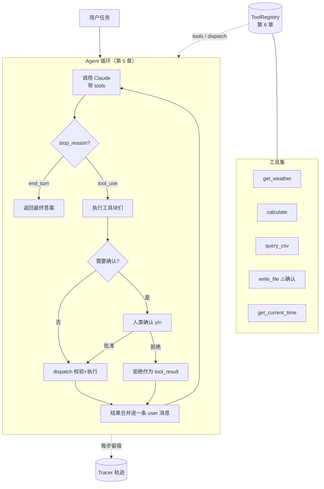

# 项目二 · 自动化工具调用 Agent（工具进阶）

> 项目一让模型"会查资料"，这个项目让模型"会动手"。我们把[第 5 章](../02-核心能力篇/05-agent核心循环与推理范式.md)的 Agent 循环和[第 6 章](../02-核心能力篇/06-工具系统设计.md)的工具系统组装成一个**能自主完成多步任务的个人助理**：它能查天气、做计算、查本地 CSV 数据、调外部 API、读写文件——并且在动手做"危险操作"（写文件、调外部 API）前，会**停下来等你确认**。
>
> 如果说项目一是"RAG 入门"，这个就是"工具进阶"：你将把第 5、6 章那些零散的代码片段，收束成一个能跑通真实任务的完整 Agent。代码以 TypeScript 为主线，关键环节给 Python 对照。

> **学习目标**
> - 把[第 6 章的 `ToolRegistry`](../02-核心能力篇/06-工具系统设计.md) 和[第 5 章的 Agent 循环](../02-核心能力篇/05-agent核心循环与推理范式.md)组装成一个完整、可运行的 Agent。
> - 设计并实现 4 个**真实可用**的工具：天气、计算、CSV 查询、文件写入——含 schema、参数校验、错误处理（错误作为 `tool_result` 返回）。
> - 完善 Agent 循环：支持多步、并行工具调用、最大步数刹车、完整的 `stop_reason` 处理。
> - 实现 **human-in-the-loop**：危险/不可逆操作执行前人类确认（呼应[第 16 章 安全与防护](../03-工程篇/16-安全与防护.md)）。
> - 给每一步**留痕**（trace），为调试和[第 14 章 可观测性](../03-工程篇/14-可观测性与调试.md)打底。
> - 看懂一段真实的多步推理轨迹，理解 Agent "自己决定调几次、调什么"是怎么发生的。

> **前置知识**：[第 5 章 Agent 核心循环与推理范式](../02-核心能力篇/05-agent核心循环与推理范式.md)、[第 6 章 工具系统设计](../02-核心能力篇/06-工具系统设计.md)（本项目直接复用其 `ToolRegistry`）、[第 4 章 结构化输出与函数调用](../01-基础篇/04-结构化输出与函数调用.md)。

---

## 1. 需求：几个真实任务场景

先看这个助理要能干什么。这些不是堆功能，每个场景都在逼出一种能力：

| 场景 | 用户会怎么说 | 需要的能力 |
| --- | --- | --- |
| S1 | "帮我查上海现在的天气，并算出比北京高几度。" | **多步 + 多工具**：查两次天气（可并行）→ 做减法计算 |
| S2 | "统计 `sales.csv` 里各地区的总销售额，写进 `report.txt`。" | **数据查询 + 写文件**：读 CSV 聚合 → 写文件（需确认） |
| S3 | "现在几点了？把'记得交周报'追加到 `todo.txt`。" | **调 API + 写文件**：取当前时间 → 追加文件（需确认） |
| S4 | "查一下杭州天气，如果下雨就在 `notes.txt` 里记一句'记得带伞'。" | **条件分支**：查天气 → 根据结果决定要不要写文件 |

这几个场景共同体现了 Agent 的本质（[5.1](../02-核心能力篇/05-agent核心循环与推理范式.md)）：**模型一开始并不知道要调几次工具、按什么顺序、根据中间结果做什么决策——它在循环里走一步看一步。** 你的代码只负责忠实执行工具、回填结果，并在危险动作前踩一脚刹车。

### 功能边界（不镀金）

- ✅ 4 个工具：`get_weather`（外部 API）、`calculate`（计算）、`query_csv`（本地数据）、`write_file`（写文件）。再加一个 `get_current_time`（取时间，演示"无副作用的小 API"）。
- ✅ 多步循环、并行工具调用、最大步数、HITL 确认、每步 trace。
- ❌ 不做多会话记忆持久化（[第 7 章](../02-核心能力篇/07-记忆与上下文管理.md)）、不做多 Agent 协作（[第 9 章](../02-核心能力篇/09-多agent协作系统.md)）——这些放在"扩展方向"。
- ❌ 不做花哨 UI——CLI 跑通，把多步轨迹打清楚比界面重要。

---

## 2. 架构图

整个 Agent 就三大块：**循环（loop）+ 工具注册表（registry）+ 执行器/审批（dispatcher + approval）**。再挂一个 **tracer** 把每步记下来。



文字版：用户给任务 → 循环里反复调 Claude →

- `stop_reason: "end_turn"` → 任务完成，返回答案。
- `stop_reason: "tool_use"` → 取出工具块，**需要确认的先问人**（批准才执行，拒绝就把"拒绝"回给模型），其余经 `registry.dispatch` 校验+执行 → **所有结果合并进一条 user 消息**（[6.5](../02-核心能力篇/06-工具系统设计.md) 的铁律）→ 回到循环顶部。

每一步都写进 tracer。注册表、循环、审批、留痕——四个关注点彻底分开，这正是[第 6 章 6.8](../02-核心能力篇/06-工具系统设计.md) "循环骨架保持干净、脏活收进注册表"的设计回报。

---

## 3. 目录结构

```
tool-agent/
├── package.json
├── tsconfig.json
├── .env.example          # ANTHROPIC_API_KEY 等
├── data/
│   └── sales.csv         # 给 query_csv 用的示例数据
├── workspace/            # write_file 的沙箱目录（只允许写这里）
└── src/
    ├── config.ts         # 环境变量、模型名、最大步数等
    ├── llm.ts            # Anthropic 客户端
    ├── registry.ts       # 第 6 章的 ToolRegistry（校验/执行/容错）
    ├── tools/
    │   ├── weather.ts    # get_weather（调外部 API）
    │   ├── calculate.ts  # calculate（安全表达式求值）
    │   ├── csv.ts        # query_csv（查本地 CSV）
    │   ├── file.ts       # write_file（写沙箱文件，需确认）
    │   ├── time.ts       # get_current_time
    │   └── index.ts      # 把工具注册进 registry
    ├── tracer.ts         # 每步留痕（呼应第 14 章）
    ├── agent.ts          # Agent 主循环（多步/并行/刹车/审批/留痕）
    └── cli.ts            # 命令行入口 + 人类确认实现
```

> Python 读者：等价 `tool_agent/` 包，`registry.py`（直接用第 6 章的）、`tools/`、`tracer.py`、`agent.py`、`cli.py`。关键文件给对照。

---

## 4. 准备：配置与客户端

`.env.example`：

```bash
ANTHROPIC_API_KEY=sk-ant-xxx
CHAT_MODEL=claude-opus-4-8      # 以官方文档为准
MAX_STEPS=12                    # 循环最大步数（刹车）
# get_weather 用免费的 Open-Meteo，无需 key；若换收费天气 API 再加 key
```

#### TypeScript

```typescript
// src/config.ts
import "dotenv/config";

export const config = {
  anthropicKey: (() => {
    const k = process.env.ANTHROPIC_API_KEY;
    if (!k) throw new Error("缺少 ANTHROPIC_API_KEY");
    return k;
  })(),
  chatModel: process.env.CHAT_MODEL ?? "claude-opus-4-8",
  maxSteps: Number(process.env.MAX_STEPS ?? 12),
  workspaceDir: "workspace", // 文件工具只允许在此目录读写（安全边界）
};
```

```typescript
// src/llm.ts —— Anthropic 客户端（密钥从环境变量读，绝不硬编码）
import Anthropic from "@anthropic-ai/sdk";
import { config } from "./config.js";

export const anthropic = new Anthropic({ apiKey: config.anthropicKey });
```

#### Python

```python
# config.py / llm.py 合并示意
import os
import anthropic

client = anthropic.Anthropic()  # 读 ANTHROPIC_API_KEY
CHAT_MODEL = os.environ.get("CHAT_MODEL", "claude-opus-4-8")
MAX_STEPS = int(os.environ.get("MAX_STEPS", 12))
WORKSPACE_DIR = "workspace"     # 文件工具的沙箱目录
```

---

## 5. 工具集设计与实现

这是本项目的重头戏。每个工具都按[第 6 章 6.2](../02-核心能力篇/06-工具系统设计.md) 的原则设计：**清晰命名、描述里写清"何时该调用"、参数 schema 精简、错误作为 `tool_result` 返回**。我们沿用第 6 章的 `ToolDef`/`ToolRegistry`，工具只需提供 `name`/`description`/`schema`/`execute`，外加 `readOnly`（能否并行）和 `needsApproval`（是否要确认）两个标记。

先把第 6 章的注册表搬过来（这里只列签名，完整实现见 [6.8](../02-核心能力篇/06-工具系统设计.md)，本项目直接复用）：

```typescript
// src/registry.ts —— 直接复用第 6 章 6.8 的 ToolRegistry
// 关键能力回顾：
//   register(def)          注册工具
//   toAnthropicTools()     导出 { name, description, input_schema } 给模型
//   needsApproval(name)    该工具是否需要人类确认
//   isReadOnly(name)       该工具是否只读（可并行）
//   dispatch(id, name, in) 校验 → 执行 → 任何错误转成带 is_error 的 tool_result
export { ToolRegistry, type ToolDef } from "../../ch06/registry.js"; // 示意：用你第 6 章写好的那份
```

> 为避免重复，下面每个工具只写 `name`/`description`/`schema`/`execute`/标记，注册进 registry 的胶水代码统一放在 5.6。

### 5.1 `get_weather`：调外部 API（只读，可并行）

查天气用免费的 [Open-Meteo](https://open-meteo.com)（无需 key）。它需要经纬度，所以这个工具内部先把城市名转成坐标（地理编码），再查天气——把"两步外部调用"封装成对模型透明的一个工具。

> **设计选择**：第 5 章演示时把"查坐标"和"查天气"拆成两个工具，是为了刻意逼出多步循环讲原理。**真实项目里，能在一个工具内部完成的、对模型无决策价值的中间步骤，就别暴露给模型**——拆太碎会增加循环轮次、徒增 token 和出错面。这正是 [6.3](../02-核心能力篇/06-工具系统设计.md) "工具粒度取舍"的实战判断。

#### TypeScript

```typescript
// src/tools/weather.ts
import { z } from "zod";

export const weatherTool = {
  name: "get_weather",
  description:
    "查询某个城市的当前天气，返回摄氏温度和天气状况。当用户问及天气、气温、" +
    "是否下雨，或需要根据天气给出建议（穿衣、带伞、出行）时调用。",
  schema: z.object({
    city: z.string().describe("城市名，中文或英文，如 '上海' 或 'Shanghai'"),
  }),
  readOnly: true, // 只读 → 多个城市可并行查
  async execute({ city }: { city: string }): Promise<string> {
    // 1. 地理编码：城市名 → 经纬度
    const geoResp = await fetch(
      `https://geocoding-api.open-meteo.com/v1/search?name=${encodeURIComponent(city)}&count=1`,
    );
    const geo = await geoResp.json();
    if (!geo.results?.length) {
      // 错误信息写给模型看：告诉它哪里错、怎么改（第 6 章 6.4）
      throw new Error(`找不到城市 "${city}"，请确认城市名是否正确。`);
    }
    const { latitude, longitude, name } = geo.results[0];

    // 2. 查当前天气
    const wResp = await fetch(
      `https://api.open-meteo.com/v1/forecast?latitude=${latitude}&longitude=${longitude}&current=temperature_2m,precipitation,weather_code`,
    );
    const w = (await wResp.json()).current;
    return JSON.stringify({
      city: name,
      temperature_c: w.temperature_2m, // 摄氏度
      precipitation_mm: w.precipitation, // 降水量，>0 表示在下雨
      is_raining: w.precipitation > 0,
    });
  },
};
```

#### Python

```python
# tools/weather.py
import json
import requests
from pydantic import BaseModel, Field


class WeatherParams(BaseModel):
    city: str = Field(description="城市名，中文或英文，如 '上海'")


def get_weather(p: WeatherParams) -> str:
    # 1. 地理编码
    geo = requests.get(
        "https://geocoding-api.open-meteo.com/v1/search",
        params={"name": p.city, "count": 1}, timeout=20,
    ).json()
    if not geo.get("results"):
        raise ValueError(f'找不到城市 "{p.city}"，请确认城市名是否正确。')
    r = geo["results"][0]

    # 2. 查天气
    cur = requests.get(
        "https://api.open-meteo.com/v1/forecast",
        params={"latitude": r["latitude"], "longitude": r["longitude"],
                "current": "temperature_2m,precipitation,weather_code"}, timeout=20,
    ).json()["current"]
    return json.dumps({
        "city": r["name"],
        "temperature_c": cur["temperature_2m"],
        "precipitation_mm": cur["precipitation"],
        "is_raining": cur["precipitation"] > 0,
    })

WEATHER_DESC = ("查询某个城市的当前天气，返回摄氏温度和天气状况。当用户问及天气、气温、"
                "是否下雨，或需要根据天气给出建议时调用。")
```

### 5.2 `calculate`：做计算（只读）

让模型做算术很危险——它会"心算"，偶尔算错。把计算交给一个真正的求值工具，模型只负责列式子。**注意安全**：绝不能用 `eval()` 直接跑模型给的字符串（[第 16 章](../03-工程篇/16-安全与防护.md)会专门讲注入风险）。这里用一个只允许数字和四则运算/括号的安全求值。

#### TypeScript

```typescript
// src/tools/calculate.ts
import { z } from "zod";

export const calculateTool = {
  name: "calculate",
  description:
    "计算一个数学表达式并返回结果。当需要做加减乘除、百分比、比较大小等" +
    "算术时调用，不要自己心算。仅支持数字与 + - * / ( ) 运算。",
  schema: z.object({
    expression: z.string().describe("数学表达式，如 '(23.5 - 18.2)' 或 '100 * 1.05'"),
  }),
  readOnly: true,
  execute({ expression }: { expression: string }): string {
    // 安全：只允许数字、四则运算符、小数点、括号、空格。其余一律拒绝（防注入）
    if (!/^[\d+\-*/().\s]+$/.test(expression)) {
      throw new Error("表达式含非法字符，仅允许数字和 + - * / ( ) 。");
    }
    // 用 Function 而非全局 eval，作用域更隔离；输入已被正则白名单严格限制
    const result = Function(`"use strict"; return (${expression});`)();
    if (typeof result !== "number" || !Number.isFinite(result)) {
      throw new Error("表达式无法求出有限数值，请检查。");
    }
    return JSON.stringify({ expression, result });
  },
};
```

#### Python

```python
# tools/calculate.py
import ast
import json
import operator
from pydantic import BaseModel, Field

# 安全求值：只允许四则运算的 AST 节点，杜绝 eval 注入（第 16 章）
_OPS = {ast.Add: operator.add, ast.Sub: operator.sub,
        ast.Mult: operator.mul, ast.Div: operator.truediv,
        ast.USub: operator.neg}


def _safe_eval(node):
    if isinstance(node, ast.Constant) and isinstance(node.value, (int, float)):
        return node.value
    if isinstance(node, ast.BinOp) and type(node.op) in _OPS:
        return _OPS[type(node.op)](_safe_eval(node.left), _safe_eval(node.right))
    if isinstance(node, ast.UnaryOp) and type(node.op) in _OPS:
        return _OPS[type(node.op)](_safe_eval(node.operand))
    raise ValueError("表达式含不支持的运算。")


class CalcParams(BaseModel):
    expression: str = Field(description="数学表达式，如 '(23.5 - 18.2)'")


def calculate(p: CalcParams) -> str:
    tree = ast.parse(p.expression, mode="eval")  # 解析成 AST 再受控求值
    result = _safe_eval(tree.body)
    return json.dumps({"expression": p.expression, "result": result})

CALC_DESC = ("计算一个数学表达式并返回结果。需要做加减乘除、比较大小等算术时调用，"
             "不要自己心算。仅支持数字与 + - * / ( ) 运算。")
```

### 5.3 `query_csv`：查本地数据（只读）

让模型能查一个本地 CSV——典型的"本地数据库/数据文件"工具。我们提供两种操作：取列的总和（`sum`）、按某列分组求和（`group_sum`）。用 `enum` 约束操作类型（[6.2.3](../02-核心能力篇/06-工具系统设计.md)）。

示例 `data/sales.csv`：

```csv
region,product,amount
华东,A,1200
华北,B,800
华东,B,1500
华南,A,600
华北,A,900
```

#### TypeScript

```typescript
// src/tools/csv.ts
import { z } from "zod";
import { readFile } from "node:fs/promises";
import path from "node:path";

// 极简 CSV 解析（生产用 csv-parse 等库；这里为自包含手写一个）
function parseCsv(text: string): Record<string, string>[] {
  const [header, ...lines] = text.trim().split("\n");
  const cols = header.split(",").map((c) => c.trim());
  return lines.map((line) => {
    const cells = line.split(",");
    return Object.fromEntries(cols.map((c, i) => [c, (cells[i] ?? "").trim()]));
  });
}

export const csvTool = {
  name: "query_csv",
  description:
    "查询本地 CSV 数据文件并做聚合统计。当用户要统计、汇总、分组某个数据文件" +
    "（如销售额、数量）时调用。支持对某数值列求总和，或按某列分组后求和。",
  schema: z.object({
    file: z.string().describe("CSV 文件名，如 'sales.csv'（位于 data/ 目录）"),
    operation: z.enum(["sum", "group_sum"]).describe("sum=对某列求总和；group_sum=按列分组求和"),
    value_column: z.string().describe("要求和的数值列名，如 'amount'"),
    group_column: z.string().optional().describe("group_sum 时的分组列名，如 'region'"),
  }),
  readOnly: true,
  async execute(input: {
    file: string;
    operation: "sum" | "group_sum";
    value_column: string;
    group_column?: string;
  }): Promise<string> {
    // 安全：只允许读 data/ 下、且不含路径穿越的文件名
    const safe = path.basename(input.file);
    const rows = parseCsv(await readFile(path.join("data", safe), "utf-8"));

    if (rows.length === 0) throw new Error(`文件 ${safe} 为空或无法解析。`);
    if (!(input.value_column in rows[0])) {
      throw new Error(`列 "${input.value_column}" 不存在，可用列：${Object.keys(rows[0]).join(", ")}`);
    }

    if (input.operation === "sum") {
      const total = rows.reduce((s, r) => s + Number(r[input.value_column] || 0), 0);
      return JSON.stringify({ operation: "sum", value_column: input.value_column, total });
    }
    // group_sum
    if (!input.group_column) throw new Error("group_sum 需要提供 group_column。");
    const groups: Record<string, number> = {};
    for (const r of rows) {
      const key = r[input.group_column!] ?? "(空)";
      groups[key] = (groups[key] ?? 0) + Number(r[input.value_column] || 0);
    }
    return JSON.stringify({ operation: "group_sum", group_column: input.group_column, groups });
  },
};
```

#### Python

```python
# tools/csv_tool.py
import csv
import json
import os
from typing import Optional
from pydantic import BaseModel, Field


class CsvParams(BaseModel):
    file: str = Field(description="CSV 文件名，如 'sales.csv'（位于 data/ 目录）")
    operation: str = Field(description="sum=对某列求总和；group_sum=按列分组求和")
    value_column: str = Field(description="要求和的数值列名，如 'amount'")
    group_column: Optional[str] = Field(default=None, description="group_sum 时的分组列名")


def query_csv(p: CsvParams) -> str:
    safe = os.path.basename(p.file)  # 防路径穿越
    with open(os.path.join("data", safe), encoding="utf-8") as f:
        rows = list(csv.DictReader(f))
    if not rows:
        raise ValueError(f"文件 {safe} 为空或无法解析。")
    if p.value_column not in rows[0]:
        raise ValueError(f'列 "{p.value_column}" 不存在，可用列：{", ".join(rows[0].keys())}')

    if p.operation == "sum":
        total = sum(float(r[p.value_column] or 0) for r in rows)
        return json.dumps({"operation": "sum", "value_column": p.value_column, "total": total})

    if not p.group_column:
        raise ValueError("group_sum 需要提供 group_column。")
    groups: dict[str, float] = {}
    for r in rows:
        key = r.get(p.group_column) or "(空)"
        groups[key] = groups.get(key, 0) + float(r[p.value_column] or 0)
    return json.dumps({"operation": "group_sum", "group_column": p.group_column, "groups": groups})

CSV_DESC = ("查询本地 CSV 数据文件并做聚合统计。当用户要统计、汇总、分组某个数据文件时调用。"
            "支持对某数值列求总和，或按某列分组后求和。")
```

### 5.4 `write_file`：写文件（⚠️ 需要确认、非只读）

写文件是**不可逆、有副作用**的操作——典型需要 human-in-the-loop 的工具（[6.6](../02-核心能力篇/06-工具系统设计.md)）。两条防线：

1. **沙箱**：只允许写 `workspace/` 目录内，杜绝路径穿越覆盖系统文件（安全边界，[第 16 章](../03-工程篇/16-安全与防护.md)）。
2. **审批**：标 `needsApproval: true`，循环执行前会停下来问人。

#### TypeScript

```typescript
// src/tools/file.ts
import { z } from "zod";
import { writeFile, appendFile, mkdir } from "node:fs/promises";
import path from "node:path";
import { config } from "../config.js";

export const writeFileTool = {
  name: "write_file",
  description:
    "把内容写入 workspace 目录下的文件。当用户要求保存、写入、记录、生成文件" +
    "（如报告、待办、笔记）时调用。这是不可逆的写操作，执行前会请用户确认。",
  schema: z.object({
    filename: z.string().describe("文件名，如 'report.txt'（只能写在 workspace 目录）"),
    content: z.string().describe("要写入的文本内容"),
    mode: z.enum(["overwrite", "append"]).describe("overwrite=覆盖写；append=追加到末尾"),
  }),
  needsApproval: true, // ← 危险/不可逆，执行前需人类确认
  readOnly: false, // 有副作用，不可并行
  async execute(input: { filename: string; content: string; mode: "overwrite" | "append" }): Promise<string> {
    // 安全：basename 去掉任何目录部分，强制落在 workspace 内（防 ../../etc/passwd 这类穿越）
    const safeName = path.basename(input.filename);
    const target = path.join(config.workspaceDir, safeName);
    await mkdir(config.workspaceDir, { recursive: true });

    if (input.mode === "append") {
      await appendFile(target, input.content + "\n", "utf-8");
    } else {
      await writeFile(target, input.content, "utf-8");
    }
    return JSON.stringify({ written: true, path: target, mode: input.mode, bytes: input.content.length });
  },
};
```

#### Python

```python
# tools/file_tool.py
import json
import os
from pydantic import BaseModel, Field

WORKSPACE_DIR = "workspace"


class WriteFileParams(BaseModel):
    filename: str = Field(description="文件名，如 'report.txt'（只能写在 workspace 目录）")
    content: str = Field(description="要写入的文本内容")
    mode: str = Field(description="overwrite=覆盖写；append=追加到末尾")


def write_file(p: WriteFileParams) -> str:
    safe = os.path.basename(p.filename)  # 防路径穿越
    os.makedirs(WORKSPACE_DIR, exist_ok=True)
    target = os.path.join(WORKSPACE_DIR, safe)
    with open(target, "a" if p.mode == "append" else "w", encoding="utf-8") as f:
        f.write(p.content + ("\n" if p.mode == "append" else ""))
    return json.dumps({"written": True, "path": target, "mode": p.mode, "bytes": len(p.content)})

WRITE_DESC = ("把内容写入 workspace 目录下的文件。当用户要求保存、写入、记录、生成文件时调用。"
              "这是不可逆的写操作，执行前会请用户确认。")
```

### 5.5 `get_current_time`：取当前时间（只读）

一个最小的"无副作用 API"工具，让模型能拿到它训练时不知道的"现在"。

#### TypeScript

```typescript
// src/tools/time.ts
import { z } from "zod";

export const timeTool = {
  name: "get_current_time",
  description: "获取当前日期和时间。当用户问'现在几点''今天几号'或需要时间戳时调用。",
  schema: z.object({}), // 无参数
  readOnly: true,
  execute(): string {
    return JSON.stringify({ iso: new Date().toISOString(), local: new Date().toLocaleString("zh-CN") });
  },
};
```

### 5.6 注册进 registry

把五个工具登记进第 6 章的 `ToolRegistry`。`register()` 支持链式（[6.8](../02-核心能力篇/06-工具系统设计.md)）。

#### TypeScript

```typescript
// src/tools/index.ts
import { ToolRegistry } from "../registry.js";
import { weatherTool } from "./weather.js";
import { calculateTool } from "./calculate.js";
import { csvTool } from "./csv.js";
import { writeFileTool } from "./file.js";
import { timeTool } from "./time.js";

export const registry = new ToolRegistry()
  .register(weatherTool)
  .register(calculateTool)
  .register(csvTool)
  .register(writeFileTool) // needsApproval=true
  .register(timeTool);
```

#### Python

```python
# tools/index.py —— 用第 6 章的 ToolDef/ToolRegistry 登记
from registry import ToolRegistry, ToolDef
from tools.weather import WeatherParams, get_weather, WEATHER_DESC
from tools.calculate import CalcParams, calculate, CALC_DESC
from tools.csv_tool import CsvParams, query_csv, CSV_DESC
from tools.file_tool import WriteFileParams, write_file, WRITE_DESC
import json, datetime
from pydantic import BaseModel

class TimeParams(BaseModel):
    pass

registry = (
    ToolRegistry()
    .register(ToolDef(name="get_weather", description=WEATHER_DESC,
                      params_model=WeatherParams, execute=get_weather, read_only=True))
    .register(ToolDef(name="calculate", description=CALC_DESC,
                      params_model=CalcParams, execute=calculate, read_only=True))
    .register(ToolDef(name="query_csv", description=CSV_DESC,
                      params_model=CsvParams, execute=query_csv, read_only=True))
    .register(ToolDef(name="write_file", description=WRITE_DESC,
                      params_model=WriteFileParams, execute=write_file,
                      needs_approval=True, read_only=False))  # ← 需确认
    .register(ToolDef(name="get_current_time",
                      description="获取当前日期和时间。问'现在几点''今天几号'时调用。",
                      params_model=TimeParams,
                      execute=lambda _: json.dumps({"iso": datetime.datetime.now().isoformat()}),
                      read_only=True))
)
```

---

## 6. 留痕：Tracer（呼应第 14 章）

Agent 循环是黑盒套黑盒（[5.5](../02-核心能力篇/05-agent核心循环与推理范式.md)）——不留痕，出问题无从查起。先写一个最小 tracer：每步记 `stop_reason`、调了哪些工具、参数、结果、耗时。生产里会换成结构化 tracing（LangSmith / Langfuse / OpenTelemetry），那是[第 14 章](../03-工程篇/14-可观测性与调试.md)的主题；现在先把"每步记下来"的习惯养成。

#### TypeScript

```typescript
// src/tracer.ts —— 最小轨迹记录
export interface TraceEntry {
  step: number;
  stopReason: string | null;
  toolCalls: { name: string; input: unknown; output?: string; isError?: boolean; ms?: number }[];
  ms: number; // 本步模型调用耗时
}

export class Tracer {
  entries: TraceEntry[] = [];

  record(entry: TraceEntry) {
    this.entries.push(entry);
    // 实时打印（开发期看轨迹用）
    console.log(`\n── 第 ${entry.step} 步 ── stop_reason=${entry.stopReason} (${entry.ms}ms)`);
    for (const t of entry.toolCalls) {
      const tag = t.isError ? "✗ 失败" : "✓";
      console.log(`   ${tag} ${t.name}(${JSON.stringify(t.input)})${t.ms ? ` ${t.ms}ms` : ""}`);
      if (t.output) console.log(`     → ${t.output.slice(0, 200)}`);
    }
  }

  summary() {
    const toolCount = this.entries.reduce((n, e) => n + e.toolCalls.length, 0);
    console.log(`\n[轨迹] 共 ${this.entries.length} 步，${toolCount} 次工具调用。`);
  }
}
```

---

## 7. Agent 主循环：多步 + 并行 + 刹车 + 审批 + 留痕

现在把第 5 章的循环和第 6 章的工具系统真正合体。相比第 5 章的最小循环，这里多了四件事，每件都呼应前面章节：

1. **并行工具调用**：一轮里多个 `tool_use` 并发执行（只读的才并行），结果合并进**一条** user 消息（[6.5](../02-核心能力篇/06-工具系统设计.md) 铁律）。
2. **审批门**：执行前判断 `needsApproval`，需要就阻塞等人类确认（[6.6](../02-核心能力篇/06-工具系统设计.md)）。
3. **最大步数 + `stop_reason` 全处理**：刹车 + `end_turn`/`tool_use`/`max_tokens`/`refusal` 都有归宿（[5.4](../02-核心能力篇/05-agent核心循环与推理范式.md)）。
4. **每步留痕**：交给 tracer。

#### TypeScript

```typescript
// src/agent.ts —— Agent 主循环
import Anthropic from "@anthropic-ai/sdk";
import { anthropic } from "./llm.js";
import { config } from "./config.js";
import { registry } from "./tools/index.js";
import { Tracer } from "./tracer.js";

const SYSTEM_PROMPT = `你是一个能调用工具自主完成任务的个人助理。
- 把复杂任务拆成步骤，按需调用工具；多个互不依赖的查询可一次性并行调用。
- 不要自己心算，算术交给 calculate 工具。
- 完成任务后，用简洁中文向用户总结结果。`;

// askUser 由上层注入（CLI/前端）：返回用户是否批准某次危险调用
type AskUser = (name: string, input: unknown) => Promise<boolean>;

export async function runAgent(task: string, askUser: AskUser): Promise<string> {
  const tracer = new Tracer();
  const tools = registry.toAnthropicTools(); // 第 6 章导出的 { name, description, input_schema }[]
  const messages: Anthropic.MessageParam[] = [{ role: "user", content: task }];

  for (let step = 1; step <= config.maxSteps; step++) {
    // —— 思考：调用模型 ——
    const t0 = Date.now();
    const response = await anthropic.messages.create({
      model: config.chatModel,
      max_tokens: 2048,
      system: SYSTEM_PROMPT,
      tools,
      // 开启自适应思考：让模型在工具调用之间自动推理（4.6+ 模型用这个，不要 budget_tokens）
      thinking: { type: "adaptive" },
      messages,
    });
    const modelMs = Date.now() - t0;

    // 关键：把模型这一轮完整回复追加进历史（含 tool_use 块），否则模型"失忆"（5.2 头号坑）
    messages.push({ role: "assistant", content: response.content });

    // —— end_turn：给出最终答案，退出 ——
    if (response.stop_reason === "end_turn") {
      tracer.record({ step, stopReason: "end_turn", toolCalls: [], ms: modelMs });
      tracer.summary();
      const text = response.content.find((b) => b.type === "text");
      return text && text.type === "text" ? text.text : "(无文本回复)";
    }

    // —— tool_use：执行工具 ——
    if (response.stop_reason === "tool_use") {
      const toolUses = response.content.filter(
        (b): b is Anthropic.ToolUseBlock => b.type === "tool_use",
      );

      // 1) 审批：需要确认的工具，先逐个问人（串行，因为要交互）
      //    被拒的直接生成"拒绝"结果，批准的留待执行
      const approvals = new Map<string, boolean>();
      for (const block of toolUses) {
        if (registry.needsApproval(block.name)) {
          approvals.set(block.id, await askUser(block.name, block.input)); // 阻塞等待
        } else {
          approvals.set(block.id, true);
        }
      }

      // 2) 执行：只读工具并行，其余串行；被拒的转成 is_error 结果（6.6）
      const traceCalls: Tracer["entries"][number]["toolCalls"] = [];
      const runOne = async (block: Anthropic.ToolUseBlock) => {
        if (!approvals.get(block.id)) {
          traceCalls.push({ name: block.name, input: block.input, isError: true, output: "用户拒绝" });
          return registry["errorResult"](block.id, `用户拒绝了操作 ${block.name}，请改用其他方式或询问用户。`);
        }
        const ts = Date.now();
        const result = await registry.dispatch(block.id, block.name, block.input); // 校验+执行+容错
        const isErr = (result as { is_error?: boolean }).is_error === true;
        traceCalls.push({
          name: block.name, input: block.input,
          output: String((result as { content?: string }).content ?? ""),
          isError: isErr, ms: Date.now() - ts,
        });
        return result;
      };

      const readOnly = toolUses.filter((b) => registry.isReadOnly(b.name));
      const sideEffect = toolUses.filter((b) => !registry.isReadOnly(b.name));
      const parallelResults = await Promise.all(readOnly.map(runOne)); // 只读 → 并行
      const serialResults: Anthropic.ToolResultBlockParam[] = [];
      for (const b of sideEffect) serialResults.push(await runOne(b)); // 有副作用 → 串行

      // 3) 所有结果合并进【一条】 user 消息（6.5 铁律：拆开会让模型以后不敢并行）
      messages.push({ role: "user", content: [...parallelResults, ...serialResults] });
      tracer.record({ step, stopReason: "tool_use", toolCalls: traceCalls, ms: modelMs });
      continue;
    }

    // —— 其余 stop_reason 都要有归宿（5.4）——
    if (response.stop_reason === "max_tokens") {
      throw new Error("回复被 max_tokens 截断，请调大 max_tokens 或拆分任务。");
    }
    if (response.stop_reason === "refusal") {
      tracer.record({ step, stopReason: "refusal", toolCalls: [], ms: modelMs });
      return "模型出于安全原因拒绝了该请求。";
    }
    throw new Error(`未处理的 stop_reason: ${response.stop_reason}`);
  }

  throw new Error(`超过最大步数 ${config.maxSteps}，强制停止（疑似死循环）`);
}
```

#### Python

```python
# agent.py —— Agent 主循环（多步/并行/刹车/审批/留痕）
import json
import time
from typing import Callable
from llm import client, CHAT_MODEL, MAX_STEPS
from tools.index import registry

SYSTEM_PROMPT = """你是一个能调用工具自主完成任务的个人助理。
- 把复杂任务拆成步骤，按需调用工具；多个互不依赖的查询可一次性并行调用。
- 不要自己心算，算术交给 calculate 工具。
- 完成任务后，用简洁中文向用户总结结果。"""


def run_agent(task: str, ask_user: Callable[[str, dict], bool]) -> str:
    tools = registry.to_anthropic_tools()
    messages = [{"role": "user", "content": task}]

    for step in range(1, MAX_STEPS + 1):
        response = client.messages.create(
            model=CHAT_MODEL,
            max_tokens=2048,
            system=SYSTEM_PROMPT,
            tools=tools,
            thinking={"type": "adaptive"},  # 自适应思考（4.6+ 用这个，不要 budget_tokens）
            messages=messages,
        )
        # 把完整回复追加进历史（含 tool_use 块），否则模型失忆
        messages.append({"role": "assistant", "content": response.content})

        if response.stop_reason == "end_turn":
            print(f"\n[轨迹] 共 {step} 步")
            for b in response.content:
                if b.type == "text":
                    return b.text
            return "(无文本回复)"

        if response.stop_reason == "tool_use":
            tool_uses = [b for b in response.content if b.type == "tool_use"]
            tool_results = []
            for block in tool_uses:
                # 审批门（6.6）：需要确认的先问人
                if registry.needs_approval(block.name) and not ask_user(block.name, block.input):
                    tool_results.append(registry._error(
                        block.id, f"用户拒绝了操作 {block.name}，请改用其他方式。"))
                    print(f"   ✗ {block.name} 被用户拒绝")
                    continue
                # 校验+执行+容错（dispatch 全包了）
                t0 = time.time()
                result = registry.dispatch(block.id, block.name, block.input)
                print(f"   ✓ {block.name}({block.input}) {int((time.time()-t0)*1000)}ms")
                tool_results.append(result)
            # 所有结果放进【一条】 user 消息（6.5 铁律）
            messages.append({"role": "user", "content": tool_results})
            continue

        if response.stop_reason == "max_tokens":
            raise RuntimeError("回复被截断，请调大 max_tokens。")
        if response.stop_reason == "refusal":
            return "模型出于安全原因拒绝了该请求。"
        raise RuntimeError(f"未处理的 stop_reason: {response.stop_reason}")

    raise RuntimeError(f"超过最大步数 {MAX_STEPS}，强制停止。")
```

> **Python 版的并行**：上面 Python 版为聚焦清晰，工具按顺序执行。要并行只读工具，把读工具用 `asyncio.gather` 并发（[6.5](../02-核心能力篇/06-工具系统设计.md) 的 Python 示例），再把所有结果合并进一条消息——铁律不变。
>
> **关于 `thinking: {type: "adaptive"}`**：这是现代 Claude（4.6+）开启"边想边做"的方式，模型会在工具调用之间自动推理，不用你在 prompt 里手写 `Thought:`（[5.3.1](../02-核心能力篇/05-agent核心循环与推理范式.md)）。**不要**用旧的 `budget_tokens`，新模型会报 400。

---

## 8. CLI 入口 + 人类确认

`askUser` 是 HITL 的"人类"那一侧。CLI 里就是在终端打印待确认的操作、读一个 y/n。前端工程师可以把它做成一个漂亮的确认弹窗（[6.6](../02-核心能力篇/06-工具系统设计.md) 说的"体验远胜命令行确认"）。

#### TypeScript

```typescript
// src/cli.ts
import { createInterface } from "node:readline/promises";
import { runAgent } from "./agent.js";

const rl = createInterface({ input: process.stdin, output: process.stdout });

// 人类确认：打印模型想干什么 + 参数，等用户 y/n
async function askUser(name: string, input: unknown): Promise<boolean> {
  console.log(`\n⚠️  Agent 想执行需确认的操作：${name}`);
  console.log(`    参数：${JSON.stringify(input, null, 2)}`);
  const ans = (await rl.question("    批准吗？(y/n) ")).trim().toLowerCase();
  return ans === "y" || ans === "yes";
}

async function main() {
  const task = process.argv.slice(2).join(" ");
  if (!task) {
    console.log('用法：npx tsx src/cli.ts "帮我查上海天气并算出比北京高几度"');
    process.exit(1);
  }
  console.log(`任务：${task}`);
  const answer = await runAgent(task, askUser);
  console.log(`\n最终答案：\n${answer}`);
  rl.close();
}

main().catch((e) => { console.error(e); process.exit(1); });
```

#### Python

```python
# cli.py
import sys
from agent import run_agent


def ask_user(name: str, tool_input: dict) -> bool:
    print(f"\n⚠️  Agent 想执行需确认的操作：{name}")
    print(f"    参数：{tool_input}")
    return input("    批准吗？(y/n) ").strip().lower() in ("y", "yes")


if __name__ == "__main__":
    task = " ".join(sys.argv[1:])
    if not task:
        print('用法：python cli.py "帮我查上海天气并算出比北京高几度"')
        sys.exit(1)
    print(f"任务：{task}")
    print(f"\n最终答案：\n{run_agent(task, ask_user)}")
```

---

## 9. 运行步骤 + 示例对话轨迹

### 9.1 运行

```bash
# 安装依赖（TS 主线）
npm i @anthropic-ai/sdk zod zod-to-json-schema dotenv
npm i -D typescript @types/node tsx

# 配置密钥
cp .env.example .env   # 填 ANTHROPIC_API_KEY

# 准备示例数据
mkdir -p data workspace
# 把 5.3 的 sales.csv 内容存到 data/sales.csv

# 跑任务
npx tsx src/cli.ts "帮我查上海现在的天气，并算出比北京高几度"
```

> Python 主线：`pip install anthropic pydantic requests python-dotenv`，然后 `python cli.py "..."`。

### 9.2 示例轨迹一：多步 + 并行（场景 S1）

任务：**"帮我查上海现在的天气，并算出比北京高几度"**。看 Agent 怎么自己拆解：

```
任务：帮我查上海现在的天气，并算出比北京高几度

── 第 1 步 ── stop_reason=tool_use (1820ms)
   ✓ get_weather({"city":"上海"}) 340ms
     → {"city":"Shanghai","temperature_c":24.5,"precipitation_mm":0,"is_raining":false}
   ✓ get_weather({"city":"北京"}) 355ms
     → {"city":"Beijing","temperature_c":19.2,"precipitation_mm":0,"is_raining":false}

── 第 2 步 ── stop_reason=tool_use (1450ms)
   ✓ calculate({"expression":"24.5 - 19.2"}) 1ms
     → {"expression":"24.5 - 19.2","result":5.3}

── 第 3 步 ── stop_reason=end_turn (980ms)

[轨迹] 共 3 步，3 次工具调用。

最终答案：
上海现在 24.5°C，北京 19.2°C，上海比北京高 5.3°C。两地目前都没有降雨。
```

注意三个细节，全是前面章节的知识在起作用：

- **第 1 步一口气并行查了两个城市**——模型判断"查上海和查北京互不依赖"，在同一轮发了两个 `tool_use` 块，我们并发执行、结果合进一条消息（[6.5](../02-核心能力篇/06-工具系统设计.md)）。
- **第 2 步才做减法**——它得先拿到两个温度，这一步**依赖**上一步结果，所以是新一轮。模型自己分清了"能并行的"和"有依赖的"。
- **算术交给了 `calculate`**——没有心算，5.3 这个数是工具算的，可靠。

### 9.3 示例轨迹二：写文件 + 人类确认（场景 S2）

任务：**"统计 data/sales.csv 里各地区的总销售额，写进 report.txt"**：

```
任务：统计 data/sales.csv 里各地区的总销售额，写进 report.txt

── 第 1 步 ── stop_reason=tool_use (1600ms)
   ✓ query_csv({"file":"sales.csv","operation":"group_sum","value_column":"amount","group_column":"region"}) 2ms
     → {"operation":"group_sum","group_column":"region","groups":{"华东":2700,"华北":1700,"华南":600}}

⚠️  Agent 想执行需确认的操作：write_file
    参数：{
      "filename": "report.txt",
      "content": "各地区销售额统计\n华东：2700\n华北：1700\n华南：600",
      "mode": "overwrite"
    }
    批准吗？(y/n) y

── 第 2 步 ── stop_reason=tool_use (1400ms)
   ✓ write_file({"filename":"report.txt",...}) 3ms
     → {"written":true,"path":"workspace/report.txt","mode":"overwrite","bytes":...}

── 第 3 步 ── stop_reason=end_turn (760ms)

最终答案：
已统计完成并写入 workspace/report.txt：华东 2700、华北 1700、华南 600。
```

这里 **`write_file` 执行前停下来等你确认**——这就是 human-in-the-loop（[6.6](../02-核心能力篇/06-工具系统设计.md)）。如果你输入 `n`，模型会收到一个 `is_error` 的"用户拒绝"结果，然后优雅地换个说法（比如把统计结果直接告诉你、不写文件），而不是硬来。试试看，体会"把拒绝作为 `tool_result` 回给模型"的效果。

### 9.4 示例轨迹三：条件分支（场景 S4）

任务：**"查一下杭州天气，如果下雨就在 notes.txt 里记一句'记得带伞'"**。这考验模型**根据中间结果做决策**：

```
── 第 1 步 ── stop_reason=tool_use     ✓ get_weather({"city":"杭州"})  → is_raining: true
⚠️  Agent 想执行需确认的操作：write_file  参数：{"filename":"notes.txt","content":"记得带伞","mode":"append"}
    批准吗？(y/n) y
── 第 2 步 ── stop_reason=tool_use     ✓ write_file(...)  → written: true
── 第 3 步 ── stop_reason=end_turn
最终答案：杭州正在下雨，已在 notes.txt 记下"记得带伞"。
```

如果杭州**没下雨**，模型查完天气后就**直接跳过写文件**、回答"杭州现在没下雨，无需带伞"——它读懂了 `is_raining: false` 并据此决策。这种"看结果再决定下一步"正是 Agent 循环（[5.1](../02-核心能力篇/05-agent核心循环与推理范式.md)）区别于固定脚本的地方。

---

## 10. 常见坑

把第 5、6 章的坑落到这个项目的具体形态：

- **工具描述不清，模型乱调或不调。** 头号问题（[6.2](../02-核心能力篇/06-工具系统设计.md)）。`description` 必须写清"何时该调用"。比如 `calculate` 不写"不要自己心算"，模型可能就直接心算错了；`write_file` 不写"用户要求保存时调用"，模型可能该写不写。
- **忘了把 `assistant` 回复追加进 `messages`。** 第 5 章头号 bug。每轮含 `tool_use` 的回复必须 `push` 回历史，否则模型看不到自己刚发起的调用，会重复或错乱。
- **并行结果拆成多条 user 消息。** 第 6 章最隐蔽的坑：N 个 `tool_use` 的结果必须放进**一条** user 消息。拆开不会立刻报错，但模型会"学到"并行没好处，以后退化成一次只调一个，悄悄拖慢 Agent。
- **死循环 / 反复调同一个工具。** 必须有 `maxSteps` 硬刹车（[5.4.1](../02-核心能力篇/05-agent核心循环与推理范式.md)）。模型偶尔会"调工具→拿结果→又调同样的"卡住。进阶可加"重复检测"（记录最近几轮的工具名+参数，连续重复就提前终止，[5.4.5](../02-核心能力篇/05-agent核心循环与推理范式.md)）。
- **参数幻觉。** 模型可能编一个不存在的列名传给 `query_csv`，或给 `get_weather` 传个乱码城市。靠两点防：schema 校验（`dispatch` 里 Zod/Pydantic 拦下）+ **错误信息写清楚**（"列 xxx 不存在，可用列：..."），模型下一轮就能改对（[6.4](../02-核心能力篇/06-工具系统设计.md)）。
- **并行结果合并时丢了失败的那个。** 每个 `tool_use` 都必须有对应 `tool_result`（失败的也要回，带 `is_error`），少一个模型就困惑（[6.5](../02-核心能力篇/06-工具系统设计.md)）。我们的 `runOne` 对被拒/出错的也返回结果，就是为此。
- **危险操作不设审批门 / 没做沙箱。** `write_file` 必须 `needsApproval` + 限制在 `workspace/`。否则模型一句话就能覆盖你的文件，甚至路径穿越写到系统目录（[第 16 章](../03-工程篇/16-安全与防护.md)）。
- **`calculate` 用了 `eval`。** 直接 `eval(模型给的字符串)` 是注入漏洞——模型（或被注入的内容）可能让你执行任意代码。必须白名单/AST 受控求值（[第 16 章](../03-工程篇/16-安全与防护.md)）。
- **`max_tokens` 截断当成完整答复。** `stop_reason: "max_tokens"` 时回复是被切断的，别当完整结果用（[5.4.3](../02-核心能力篇/05-agent核心循环与推理范式.md)）。
- **不留痕。** 多步 Agent 出错时不打 trace，只能干瞪眼。开发第一天就把每步记下来。

---

## 11. 扩展方向

- **接 MCP（Model Context Protocol）**：把工具用 MCP 标准化成可插拔的"服务端"，跨应用/团队复用（如直接接入现成的 GitHub、文件系统、数据库 MCP server），不用每个项目重写工具。这是后续工程篇"MCP 与工具生态"一章的主题。
- **加记忆**：接[第 7 章](../02-核心能力篇/07-记忆与上下文管理.md)的记忆，让 Agent 跨任务记住你的偏好（"我在北京""报告默认写到 reports/ 目录"），并在 `messages` 过长时做上下文压缩。
- **变成多 Agent**：任务复杂时，拆成"规划 Agent + 执行 Agent"，或给每类工具配一个专职子 Agent（[第 9 章 多 Agent 协作](../02-核心能力篇/09-多agent协作系统.md)）。
- **更多推理范式**：当前是 ReAct（边想边做）。长任务可套 Plan-and-Execute（先列步骤清单再逐步执行），质量敏感任务可加 Reflection（产出后自我批判）（[5.3](../02-核心能力篇/05-agent核心循环与推理范式.md)）。
- **工具检索**：工具多到几十个时，别全量塞给模型——用工具检索/按需加载（[6.9](../02-核心能力篇/06-工具系统设计.md)），先让模型搜出相关工具再加载 schema。
- **结构化 tracing + 成本预算**：把 tracer 换成 OpenTelemetry/Langfuse（[第 14 章](../03-工程篇/14-可观测性与调试.md)），并累加每步 token 用量、超预算就停（成本刹车）。
- **流式 + 前端**：把每步的"正在调用 XX 工具""思考中"流式推给前端，做成像 Claude/ChatGPT 那种能看到工具执行过程的体验——前端工程师的主场。

---

## 12. 小结

1. **这个项目把第 5 章的循环和第 6 章的工具系统合体**，做成一个能多步、自主完成真实任务的个人助理 Agent。
2. **四个关注点彻底分离**：循环（agent.ts）、工具注册表（复用第 6 章 registry）、审批（askUser）、留痕（tracer）。循环骨架干净，脏活收进注册表。
3. **工具设计的功夫在描述上**：清晰命名、写清"何时该调用"、`enum` 约束、错误信息写给模型看让它自我修正——这是性价比最高的投入。
4. **循环的四件必备事**：并行只读工具（结果合并进一条 user 消息）、危险操作前 HITL 确认、最大步数刹车、所有 `stop_reason` 都有归宿。
5. **安全不是可选项**：`calculate` 不用 `eval` 而用白名单/AST 求值，`write_file` 限制在沙箱目录且需确认——呼应第 16 章。
6. **多步推理是模型自己完成的**：从三段示例轨迹能看到它如何分清"可并行/有依赖"、如何根据中间结果（`is_raining`）做条件决策——你的代码只忠实执行 + 回填 + 踩刹车。
7. **技术准确性**：用 `thinking: {type: "adaptive"}` 开启边想边做（不用 `budget_tokens`）；工具用 `{name, description, input_schema}`，结果作为 `tool_result` 回填，`stop_reason` 驱动循环。

---

## 13. 练习题

1. **（基础）** 跑通项目，依次试三个示例任务（S1 多步并行、S2 写文件确认、S4 条件分支）。在 S2 确认时分别输入 `y` 和 `n`，观察被拒后模型如何调整。

2. **（基础）** 给 `query_csv` 加一个 `count`（计数）操作：统计满足某条件的行数（如"amount 大于 1000 的有几条"）。补好 schema 的 `enum`、描述和校验，验证模型会正确选用它。

3. **（进阶）** 实现 [5.4.5](../02-核心能力篇/05-agent核心循环与推理范式.md) 的**重复检测**：在循环里记录最近 N 轮的"工具名 + 参数序列化"，若连续多次完全相同就提前终止并报告，防止模型卡死在同一个调用。造一个容易触发的场景验证。

4. **（进阶）** 把 Python 版的工具执行改成**真正并行**：用 `asyncio.gather` 并发执行所有 `read_only` 工具（参考 [6.5](../02-核心能力篇/06-工具系统设计.md) 的 Python 示例），有副作用的串行，最后所有结果合并进一条 user 消息。用 S1（查两个城市天气）验证并行生效。

5. **（挑战）** 给这个 Agent 加一层 **Plan-and-Execute**（[5.3.2](../02-核心能力篇/05-agent核心循环与推理范式.md)）：先让模型把任务拆成步骤清单（用[结构化输出](../01-基础篇/04-结构化输出与函数调用.md)强约束成数组），再让 `runAgent` 逐步执行。设计一个长任务（如"查华东、华北、华南三地天气，分别记到 notes.txt，最后汇总哪里最热"）对比"直接 ReAct"和"Plan-and-Execute"的稳定性。

---

## 14. 延伸阅读

- **本书相关章节**：[第 5 章 Agent 核心循环与推理范式](../02-核心能力篇/05-agent核心循环与推理范式.md)（循环骨架、刹车、`stop_reason`、推理范式）、[第 6 章 工具系统设计](../02-核心能力篇/06-工具系统设计.md)（`ToolRegistry`、并行铁律、HITL、错误回填——本项目直接复用）、[第 16 章 安全与防护](../03-工程篇/16-安全与防护.md)（沙箱、注入、危险操作）、[第 14 章 可观测性与调试](../03-工程篇/14-可观测性与调试.md)（把 tracer 工程化）。
- **官方文档方向**：Anthropic Messages API 的 "tool use"、"handling stop reasons"、"adaptive thinking"（`tools` 格式、`tool_result` 回填、`stop_reason` 各取值、自适应思考；模型 ID / 参数以官方为准）；Open-Meteo API 文档（免费天气/地理编码）；Zod / Pydantic 文档（从类型生成 JSON Schema）。
- **概念方向**：搜索 "ReAct"、"function calling / tool use"、"human-in-the-loop agent"、"agent observability / tracing"——稳定且值得深读。
- **上一个项目**：[项目一·智能知识库问答助手](./项目1-智能知识库问答助手.md)（RAG 入门）。把两个项目结合——把 RAG 的 `retrieve` 注册成本项目的一个工具——就得到一个既能查资料又能动手的 **Agentic RAG** 助理。
