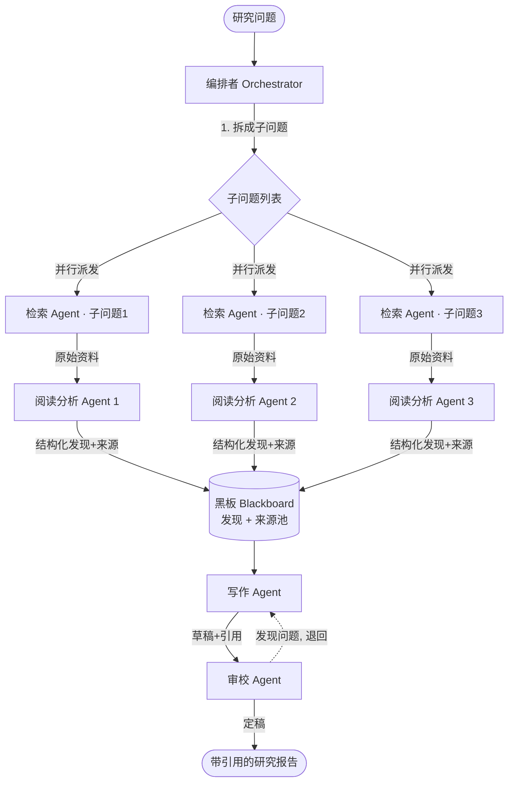

# 项目三 · 多 Agent 协作研究系统（编排高级）

> 一句话：给系统一个研究问题，它自己把活儿拆开——派一个 Agent 去搜资料、几个 Agent 并行去读和分析、一个 Agent 把发现写成文章、一个 Agent 审校挑错——最后产出一份**分章节、带来源引用**的研究报告。这就是 Anthropic、OpenAI 的 "Deep Research" 类产品背后的骨架。

> **学习目标**
> - 把[第 9 章的编排者-工作者（Orchestrator-Worker）架构](../02-核心能力篇/09-多agent协作系统.md)落成一个真能跑的"深度研究"系统。
> - 学会**子 Agent 设计**：每个 Agent 的角色、工具、提示、上下文隔离怎么定。
> - 学会**编排者**怎么做任务分解、并行调度、结果汇总、冲突处理。
> - 学会**引用管理**：来源去重、编号、在报告里标注 `[1][2]`。
> - 学会**成本控制**：用便宜模型干粗活、并行省时间、算清一次运行花多少钱（呼应[第 15 章](../03-工程篇/15-成本与性能优化.md)）。
> - 学会**可观测**：多 Agent 的执行轨迹怎么看，出了问题怎么定位（呼应[第 14 章](../03-工程篇/14-可观测性与调试.md)）。

> **前置知识**：本项目是[第 9 章 多 Agent 协作](../02-核心能力篇/09-多agent协作系统.md)的实战落地，强烈建议先读完第 9 章（编排者-工作者、上下文隔离、黑板/消息通信）。检索部分复用[第 8 章 RAG](../02-核心能力篇/08-rag检索增强生成.md)。工具部分复用[第 6 章](../02-核心能力篇/06-工具系统设计.md)。还会用到[项目二·自动化工具调用 Agent](./项目2-自动化工具调用agent.md)里的 Agent 循环。代码 TS 主线，关键处给 Python 对照。

---

## 1. 需求与目标

我们要做的东西，用一句话说清楚：

> **输入**一个研究问题（比如"对比 React Server Components 和传统 SSR 的取舍"），**输出**一份分章节、每个论断都标了来源 `[1][2]` 的 Markdown 研究报告，末尾附参考文献列表。

把它拆成可验收的具体要求：

| # | 需求 | 验收标准 |
|---|------|---------|
| 1 | 接收一个研究问题 | 命令行或函数入参传入一句话问题 |
| 2 | 自动拆解子问题 | 编排者把大问题拆成 3-6 个可独立调研的子问题 |
| 3 | 并行检索 + 阅读分析 | 多个子问题同时跑，不是一个个排队 |
| 4 | 产出结构化报告 | 有标题、摘要、分章节正文、结论 |
| 5 | 带来源引用 | 每个事实性论断后有 `[n]`，末尾有去重编号的来源列表 |
| 6 | 成本可控、可核算 | 子 Agent 用便宜模型；运行完打印这次花了多少 token、多少钱 |
| 7 | 可观测 | 能看到每个子 Agent 干了什么、用了哪些工具、花了多少 |

**为什么必须是多 Agent？** 回顾第 9 章的克制原则——能用单 Agent 解决就别拆。但"深度研究"恰好是少数**真的需要拆**的场景，原因有三：

1. **天然可并行。** "调研 React 的优点"和"调研 SSR 的优点"互不依赖，可以同时跑。单 Agent 只能一个接一个串行做，慢。
2. **职责心智冲突。** 研究时要发散广撒网，写作时要收敛讲连贯，审校时要挑剔找毛病——这三套"心智模式"塞进一个系统提示里会互相打架（第 9 章 9.1 讲过）。
3. **上下文会爆。** 一个研究问题搜出几十篇资料、每篇几千字，全塞进一个 Agent 的上下文窗口又贵又让它"分心"。拆开后，每个阅读 Agent 只看它那一份资料，上下文干净。

这就像前端把一个塞了搜索、列表、详情、编辑的"万能页面组件"拆成职责清晰的子组件——不是为了炫技，是因为塞在一起真的维护不动了。

---

## 2. 架构总览

我们用**编排者-工作者（Orchestrator-Worker）**架构，这是第 9 章讲的四种架构里最适合"深度研究"的一种：一个编排者（Orchestrator）负责拆任务、派活、收结果；多个工作者（Worker）各干一摊。



**几个关键设计点，逐个说：**

**1. 检索 + 阅读分析为什么分成两个 Agent？** 你可以合成一个，但分开有个好处：检索 Agent 只负责"搜到东西"，阅读分析 Agent 负责"读懂并提炼"。这样阅读 Agent 拿到的是清洗过的原始资料，它的上下文不被"我该搜什么关键词"这类杂念污染。如果想省钱省调用，也可以合并——本项目代码里给了一个 `researchSubQuestion()` 把这两步合在一个工作者里跑，更紧凑；架构图拆开是为了讲清职责。

**2. 黑板（Blackboard）是什么？** 第 9 章讲过两种 Agent 间通信方式：共享状态（黑板）和消息传递。这里用黑板——一个所有工作者都能写、写作 Agent 能读的共享数据结构。每个阅读 Agent 把它的发现（findings）和引用的来源（sources）写进黑板。写作 Agent 从黑板里读全部发现来写文章。

> **前端类比**：黑板就像一个共享的 Redux/Pinia store，或者一个所有组件都能读写的 React Context。各个 worker 往里 `dispatch`，writer 从里面 `useSelector`。

**3. 上下文隔离（context isolation）。** 这是多 Agent 省钱省脑子的关键——每个子 Agent 有**自己独立的对话历史**，互不污染。检索 Agent 1 的上下文里只有"子问题1 + 它搜到的资料"，看不到子问题2、3 的任何东西。编排者持有全局视野，但把任务派下去时只给每个工作者它该看的那一小块。

**4. 编排者是瓶颈也是单点。** 所有结果都汇总到编排者/黑板，写作 Agent 串行在最后跑。这是 Orchestrator-Worker 的固有特点（第 9 章 9.3 提过"编排者瓶颈"这个坑）。我们的并行只发生在"检索+阅读"这一层，写作和审校是串行的——这没问题，因为写作本来就需要看到所有发现才能动笔。

---

## 3. 目录结构

```
research-system/
├── package.json
├── tsconfig.json
├── .env                      # ANTHROPIC_API_KEY 等，绝不提交
├── .env.example
└── src/
    ├── index.ts              # 入口：读问题 → 跑编排者 → 打印报告 + 成本
    ├── llm.ts                # 模型薄抽象层：一个 chat() 切换厂商/模型
    ├── types.ts              # 共享类型：SubQuestion / Finding / Source / Blackboard
    ├── cost.ts               # 成本核算：累计 token、按模型单价算钱
    ├── tracing.ts            # 可观测：给每个 Agent 调用打一条带耗时/token 的轨迹
    ├── tools/
    │   └── search.ts         # 检索工具（web 搜索 或 本地知识库，二选一）
    ├── citations.ts          # 引用管理：来源去重、编号、注入报告
    └── agents/
        ├── orchestrator.ts   # 编排者：拆解 → 并行调度 → 汇总
        ├── researcher.ts     # 检索+阅读分析工作者（合并版）
        ├── writer.ts         # 写作 Agent
        └── reviewer.ts       # 审校 Agent
```

> 一个文件一个职责，跟你拆 React 组件/Vue SFC 是一个习惯。`llm.ts` 这层薄抽象很重要——全书强调"先讲原理再绑框架"，所有模型调用都走它，换厂商只改一个文件。

---

## 4. 地基：模型抽象层、类型、成本、可观测

先把四块地基铺好，后面 Agent 都建在上面。

### 4.1 模型抽象层 `llm.ts`

我们用 Anthropic Claude 作为主线（多模型原则下也提了怎么切 OpenAI/本地）。注意几个**已核实的 Claude 技术细节**：

- 模型 ID 直接用字符串、**不加日期后缀**：`claude-opus-4-8`（贵、最强推理）、`claude-haiku-4-5`（最快最便宜，子 Agent 干粗活用它）。
- 思考用 `thinking: { type: "adaptive" }`，**不要用** `budget_tokens`（4.6+ 模型会 400）。
- 努力程度 `output_config: { effort: "low" | "medium" | "high" }`。
- 结构化输出用 `output_config: { format: { type: "json_schema", schema } }`。
- 密钥走 `process.env.ANTHROPIC_API_KEY`，绝不硬编码。

#### TypeScript

```typescript
// src/llm.ts —— 模型薄抽象层：全系统唯一调模型的地方
import Anthropic from "@anthropic-ai/sdk";

const client = new Anthropic(); // 自动读 process.env.ANTHROPIC_API_KEY

// 我们项目里用到的模型档位。子 Agent 用便宜的 haiku，编排/写作用 opus。
export type ModelTier = "cheap" | "smart";

const MODEL_ID: Record<ModelTier, string> = {
  cheap: "claude-haiku-4-5", // $1/$5 每百万 token，干检索/阅读的粗活
  smart: "claude-opus-4-8", // $5/$25，拆任务、写报告这种要脑子的活
};

export interface ChatOptions {
  tier: ModelTier;
  system: string; // 系统提示（角色设定）
  messages: Anthropic.MessageParam[]; // 对话历史
  tools?: Anthropic.Tool[]; // 可选：注册给模型的工具
  // 可选：要求模型输出符合某个 JSON Schema（结构化输出）
  jsonSchema?: Record<string, unknown>;
  maxTokens?: number;
  effort?: "low" | "medium" | "high";
}

// 返回值带上 usage，方便上层做成本核算
export interface ChatResult {
  message: Anthropic.Message; // 完整响应（含 content blocks、stop_reason）
  inputTokens: number;
  outputTokens: number;
  modelId: string;
}

export async function chat(opts: ChatOptions): Promise<ChatResult> {
  const modelId = MODEL_ID[opts.tier];

  const message = await client.messages.create({
    model: modelId,
    max_tokens: opts.maxTokens ?? 4096,
    system: opts.system,
    messages: opts.messages,
    // 让模型自适应决定要不要思考、思考多深
    thinking: { type: "adaptive" },
    output_config: {
      effort: opts.effort ?? "medium",
      // 只有传了 jsonSchema 才约束输出格式
      ...(opts.jsonSchema
        ? { format: { type: "json_schema", schema: opts.jsonSchema } }
        : {}),
    },
    ...(opts.tools ? { tools: opts.tools } : {}),
  });

  return {
    message,
    inputTokens: message.usage.input_tokens,
    outputTokens: message.usage.output_tokens,
    modelId,
  };
}

// 小工具：从一个响应里把所有 text block 拼成字符串
export function extractText(message: Anthropic.Message): string {
  return message.content
    .filter((b): b is Anthropic.TextBlock => b.type === "text")
    .map((b) => b.text)
    .join("\n");
}
```

> **想换 OpenAI 或本地模型？** 只改这个文件：把 `client.messages.create` 换成 `openai.chat.completions.create({ model, messages })`，或指向 Ollama 的 OpenAI 兼容端点 `http://localhost:11434/v1`。上层 Agent 代码一行都不用动——这就是薄抽象层的价值。

#### Python

```python
# src/llm.py —— 模型薄抽象层
import os
from dataclasses import dataclass
from typing import Any, Literal

import anthropic

client = anthropic.Anthropic()  # 自动读 os.environ["ANTHROPIC_API_KEY"]

ModelTier = Literal["cheap", "smart"]

MODEL_ID: dict[ModelTier, str] = {
    "cheap": "claude-haiku-4-5",  # 子 Agent 干粗活
    "smart": "claude-opus-4-8",   # 拆任务、写报告
}


@dataclass
class ChatResult:
    message: anthropic.types.Message
    input_tokens: int
    output_tokens: int
    model_id: str


def chat(
    *,
    tier: ModelTier,
    system: str,
    messages: list[dict[str, Any]],
    tools: list[dict[str, Any]] | None = None,
    json_schema: dict[str, Any] | None = None,
    max_tokens: int = 4096,
    effort: Literal["low", "medium", "high"] = "medium",
) -> ChatResult:
    model_id = MODEL_ID[tier]
    output_config: dict[str, Any] = {"effort": effort}
    if json_schema is not None:
        output_config["format"] = {"type": "json_schema", "schema": json_schema}

    kwargs: dict[str, Any] = {
        "model": model_id,
        "max_tokens": max_tokens,
        "system": system,
        "messages": messages,
        "thinking": {"type": "adaptive"},  # 不要用 budget_tokens
        "output_config": output_config,
    }
    if tools is not None:
        kwargs["tools"] = tools

    message = client.messages.create(**kwargs)
    return ChatResult(
        message=message,
        input_tokens=message.usage.input_tokens,
        output_tokens=message.usage.output_tokens,
        model_id=model_id,
    )


def extract_text(message: anthropic.types.Message) -> str:
    return "\n".join(b.text for b in message.content if b.type == "text")
```

### 4.2 共享类型 `types.ts`

这些类型定义了 Agent 之间传递的数据形状——相当于团队约定好的接口契约。

```typescript
// src/types.ts

// 编排者拆出来的一个子问题
export interface SubQuestion {
  id: number;
  question: string; // 具体的子调研问题
  rationale: string; // 为什么要查这个（便于人看、便于调试）
}

// 一条原始来源（搜索结果 / 知识库片段）
export interface Source {
  url: string; // 唯一标识：URL 或文档路径
  title: string;
  snippet: string; // 原文片段（写作时引用的依据）
}

// 一个阅读分析 Agent 产出的"发现"
export interface Finding {
  subQuestionId: number;
  // 提炼出的要点，每个要点关联了它依据的来源 url
  points: { text: string; sourceUrls: string[] }[];
}

// 黑板：所有工作者写、写作 Agent 读
export interface Blackboard {
  question: string; // 原始研究问题
  subQuestions: SubQuestion[];
  findings: Finding[]; // 各子问题的发现
  sources: Source[]; // 全部来源（未去重，去重在 citations.ts 做）
}
```

> Python 用 `dataclass` 或 `pydantic.BaseModel` 等价实现，字段名一致，这里不重复贴。

### 4.3 成本核算 `cost.ts`

这是呼应[第 15 章 成本与性能](../03-工程篇/15-成本与性能优化.md)的关键件。多 Agent 最容易"成本爆炸"——一个研究跑下来调了十几次模型。我们要让每一次调用的开销都被记账，最后能打印出"这次研究花了 ¥X"。

#### TypeScript

```typescript
// src/cost.ts —— 累计 token 与费用核算
import type { ChatResult } from "./llm.js";

// 单价（美元 / 每百万 token），已核实，截至 2026-06
// 实际价格以官方文档为准
const PRICE: Record<string, { in: number; out: number }> = {
  "claude-opus-4-8": { in: 5, out: 25 },
  "claude-haiku-4-5": { in: 1, out: 5 },
  "claude-sonnet-4-6": { in: 3, out: 15 },
};

export class CostTracker {
  private rows: {
    agent: string;
    modelId: string;
    inTok: number;
    outTok: number;
    usd: number;
  }[] = [];

  // 每次模型调用后记一笔，agent 是调用方名字（"orchestrator"、"researcher#1"...）
  record(agent: string, r: ChatResult): void {
    const price = PRICE[r.modelId] ?? { in: 0, out: 0 };
    const usd =
      (r.inputTokens / 1_000_000) * price.in +
      (r.outputTokens / 1_000_000) * price.out;
    this.rows.push({
      agent,
      modelId: r.modelId,
      inTok: r.inputTokens,
      outTok: r.outputTokens,
      usd,
    });
  }

  totalUsd(): number {
    return this.rows.reduce((s, r) => s + r.usd, 0);
  }

  // 打印一张成本明细表
  report(): string {
    const lines = this.rows.map(
      (r) =>
        `  ${r.agent.padEnd(16)} ${r.modelId.padEnd(18)} ` +
        `in=${r.inTok} out=${r.outTok} $${r.usd.toFixed(4)}`,
    );
    return [
      "—— 成本明细 ——",
      ...lines,
      `—— 合计：$${this.totalUsd().toFixed(4)} （约 ¥${(this.totalUsd() * 7.2).toFixed(3)}）——`,
    ].join("\n");
  }
}
```

#### Python

```python
# src/cost.py
from dataclasses import dataclass, field
from .llm import ChatResult

PRICE = {  # 美元/百万 token，以官方文档为准
    "claude-opus-4-8": {"in": 5, "out": 25},
    "claude-haiku-4-5": {"in": 1, "out": 5},
    "claude-sonnet-4-6": {"in": 3, "out": 15},
}


@dataclass
class CostTracker:
    rows: list[dict] = field(default_factory=list)

    def record(self, agent: str, r: ChatResult) -> None:
        price = PRICE.get(r.model_id, {"in": 0, "out": 0})
        usd = r.input_tokens / 1_000_000 * price["in"] + \
              r.output_tokens / 1_000_000 * price["out"]
        self.rows.append({"agent": agent, "model": r.model_id,
                          "in": r.input_tokens, "out": r.output_tokens, "usd": usd})

    def total_usd(self) -> float:
        return sum(r["usd"] for r in self.rows)

    def report(self) -> str:
        lines = [f"  {r['agent']:<16} {r['model']:<18} "
                 f"in={r['in']} out={r['out']} ${r['usd']:.4f}" for r in self.rows]
        return "\n".join(["—— 成本明细 ——", *lines,
                          f"—— 合计：${self.total_usd():.4f} ——"])
```

### 4.4 可观测 `tracing.ts`

呼应[第 14 章 可观测性与调试](../03-工程篇/14-可观测性与调试.md)。多 Agent 系统出了问题最难定位——到底是哪个子 Agent、在哪一步、为什么搞砸了？我们用最朴素但极有效的办法：给每次 Agent 动作打一条结构化轨迹（trace span），带上耗时、token、关键输入输出摘要。

```typescript
// src/tracing.ts —— 极简结构化轨迹
export interface Span {
  agent: string; // 谁
  action: string; // 干了啥（"decompose" / "search" / "analyze" / "write"...）
  startMs: number;
  durationMs: number;
  detail?: string; // 一句话摘要，便于扫
}

export class Tracer {
  spans: Span[] = [];

  // 包裹一个异步动作，自动记开始/结束/耗时
  async track<T>(
    agent: string,
    action: string,
    fn: () => Promise<T>,
    detail?: (result: T) => string,
  ): Promise<T> {
    const startMs = Date.now();
    const result = await fn();
    this.spans.push({
      agent,
      action,
      startMs,
      durationMs: Date.now() - startMs,
      detail: detail?.(result),
    });
    return result;
  }

  // 按时间线打印，并标出哪些是并行跑的（开始时间重叠）
  report(): string {
    const t0 = this.spans.length ? this.spans[0].startMs : 0;
    return [
      "—— 执行轨迹 ——",
      ...this.spans.map(
        (s) =>
          `  +${String(s.startMs - t0).padStart(5)}ms ` +
          `[${s.agent}] ${s.action} (${s.durationMs}ms)` +
          (s.detail ? ` — ${s.detail}` : ""),
      ),
    ].join("\n");
  }
}
```

> 生产环境里你会把这些 span 发到 LangSmith、Langfuse 或 OpenTelemetry（第 14 章详述）。这里手写一个，是为了让你看清"轨迹"本质上就是一串带时间戳的事件——和前端的 Performance API、或者你给函数包一层 `console.time` 是一回事。后面运行示例里你会看到它把并行子任务的重叠时间清楚地标出来。

---

## 5. 检索工具

第 8 章讲过 RAG 的检索。这里我们要给检索 Agent 一个能调用的**工具**（第 6 章的概念：工具就是注册给模型的回调函数）。

需求说"web 搜索或本地知识库，二选一作主线"。我们**以本地知识库为主线**——原因有二：(1) 大多数企业研究系统查的是内部资料，本地库更贴近真实场景；(2) 不依赖外部搜索 API key，你照着代码就能跑通。文末"扩展方向"会说怎么换成真 web 搜索。

> 真要用 web 搜索，Claude 有内置的服务端工具：在 `tools` 里加 `{ type: "web_search_20260209", name: "web_search" }`，模型自己发起搜索、返回带引用的结果，无需你实现执行循环（这是已核实的 Claude 能力）。本项目为了让你能离线跑通、并把"引用管理"讲透，主线走自建本地检索。

#### TypeScript

```typescript
// src/tools/search.ts —— 本地知识库检索工具
import type Anthropic from "@anthropic-ai/sdk";
import type { Source } from "../types.js";

// 演示用：一个内存里的"知识库"。真实项目里这是 pgvector / Qdrant 等向量库
// （见第 8 章），这里用关键词命中代替向量检索，把注意力放在多 Agent 编排上。
interface Doc {
  url: string;
  title: string;
  text: string;
}

const KNOWLEDGE_BASE: Doc[] = [
  {
    url: "kb://rsc/overview",
    title: "React Server Components 概述",
    text: "RSC 在服务端渲染组件并把序列化结果流式传给客户端，组件代码不进 JS bundle，能直接访问后端资源，减少客户端 JS 体积。",
  },
  {
    url: "kb://ssr/traditional",
    title: "传统 SSR 工作方式",
    text: "传统 SSR 在服务端把整页渲染成 HTML 返回，客户端再 hydrate。首屏快，但要下载并执行完整 JS 才可交互，TTI 受 bundle 体积影响。",
  },
  {
    url: "kb://rsc/tradeoffs",
    title: "RSC 的取舍",
    text: "RSC 减少 bundle、利于数据获取，但心智模型更复杂：要区分 server/client 组件，调试更难，生态仍在成熟。",
  },
  // ……实际项目里这里是成百上千篇文档
];

// 朴素检索：按关键词重叠打分，返回 top-k。真实场景换成向量相似度。
function retrieve(query: string, k = 3): Source[] {
  const terms = query.toLowerCase().split(/\s+/).filter(Boolean);
  return KNOWLEDGE_BASE.map((doc) => {
    const hay = (doc.title + " " + doc.text).toLowerCase();
    const score = terms.reduce((s, t) => s + (hay.includes(t) ? 1 : 0), 0);
    return { doc, score };
  })
    .filter((x) => x.score > 0)
    .sort((a, b) => b.score - a.score)
    .slice(0, k)
    .map(({ doc }) => ({ url: doc.url, title: doc.title, snippet: doc.text }));
}

// 工具定义：注册给模型的"回调函数"的 schema
export const searchTool: Anthropic.Tool = {
  name: "search_knowledge_base",
  description:
    "检索内部知识库。输入一个具体的查询语句，返回最相关的若干文档片段（含 url、标题、正文）。一次查一个明确的点，必要时多次调用。",
  input_schema: {
    type: "object",
    properties: {
      query: { type: "string", description: "具体的检索查询" },
    },
    required: ["query"],
  },
};

// 工具的实际执行：模型决定调用它时，我们跑这个函数
export function runSearch(input: { query: string }): Source[] {
  return retrieve(input.query);
}
```

#### Python

```python
# src/tools/search.py
from ..types import Source  # dataclass(url, title, snippet)

KNOWLEDGE_BASE = [
    {"url": "kb://rsc/overview", "title": "React Server Components 概述",
     "text": "RSC 在服务端渲染组件并把序列化结果流式传给客户端……"},
    {"url": "kb://ssr/traditional", "title": "传统 SSR 工作方式",
     "text": "传统 SSR 在服务端把整页渲染成 HTML 返回，客户端再 hydrate……"},
    {"url": "kb://rsc/tradeoffs", "title": "RSC 的取舍",
     "text": "RSC 减少 bundle、利于数据获取，但心智模型更复杂……"},
]


def retrieve(query: str, k: int = 3) -> list[Source]:
    terms = [t for t in query.lower().split() if t]
    scored = []
    for doc in KNOWLEDGE_BASE:
        hay = (doc["title"] + " " + doc["text"]).lower()
        score = sum(1 for t in terms if t in hay)
        if score:
            scored.append((score, doc))
    scored.sort(key=lambda x: -x[0])
    return [Source(url=d["url"], title=d["title"], snippet=d["text"])
            for _, d in scored[:k]]


SEARCH_TOOL = {
    "name": "search_knowledge_base",
    "description": "检索内部知识库，返回最相关的文档片段（url、标题、正文）。",
    "input_schema": {
        "type": "object",
        "properties": {"query": {"type": "string", "description": "具体的检索查询"}},
        "required": ["query"],
    },
}


def run_search(inp: dict) -> list[Source]:
    return retrieve(inp["query"])
```

---

## 6. 子 Agent 设计

现在到核心——设计每个子 Agent。第 9 章强调过：每个子 Agent 要**角色单一、上下文隔离、只带必要工具**。下面这张表是我们的设计契约：

| 子 Agent | 角色（系统提示要点） | 模型档位 | 工具 | 上下文里有什么 |
|---------|---------------------|---------|------|--------------|
| 检索+阅读（researcher） | 用搜索工具查一个子问题，读懂结果，提炼带来源的要点 | cheap（haiku） | `search_knowledge_base` | **只有它负责的那一个子问题** + 它自己搜到的资料 |
| 写作（writer） | 把所有发现组织成分章节、带引用占位符的报告草稿 | smart（opus） | 无 | 全部发现（从黑板读）+ 来源列表 |
| 审校（reviewer） | 检查事实是否有来源支撑、引用是否对应、结构是否清晰 | smart（opus） | 无 | 草稿 + 发现 + 来源 |

**注意上下文隔离这一列**：检索 Agent 之间互相看不见对方的上下文。这是省钱、防分心的关键——也是多 Agent 比"一个大 Agent 塞所有资料"强的根本原因。

### 6.1 检索 + 阅读分析工作者 `researcher.ts`

这个工作者把"检索"和"阅读分析"合在一起跑（架构图为了讲清职责拆成两个 Agent，实现上合并更省一次调用）。它内部是一个小的 **Agent 循环**（第 5 章、项目二的核心）：调模型 → 模型要搜 → 执行搜索 → 结果喂回 → 模型再决定 → 直到模型给出最终提炼。

#### TypeScript

```typescript
// src/agents/researcher.ts
import type Anthropic from "@anthropic-ai/sdk";
import { chat, extractText } from "../llm.js";
import { searchTool, runSearch } from "../tools/search.js";
import type { Finding, Source, SubQuestion } from "../types.js";
import type { CostTracker } from "../cost.js";
import type { Tracer } from "../tracing.js";

const SYSTEM = `你是一名严谨的研究助理。你只负责一个子问题。
工作方式：
1. 用 search_knowledge_base 工具检索（可多次，换不同关键词）。
2. 读懂返回的资料。
3. 提炼出 2-4 个要点，每个要点必须注明它依据的来源 url——不许编造来源，不许写资料里没有的内容。
只围绕你被分配的子问题，不要发散到别的话题。`;

// 这个 Finding 用 JSON Schema 约束，保证写作 Agent 拿到的结构稳定
const FINDING_SCHEMA = {
  type: "object",
  properties: {
    points: {
      type: "array",
      items: {
        type: "object",
        properties: {
          text: { type: "string", description: "一个提炼出的要点" },
          sourceUrls: {
            type: "array",
            items: { type: "string" },
            description: "支撑该要点的来源 url，必须来自搜索结果",
          },
        },
        required: ["text", "sourceUrls"],
        additionalProperties: false,
      },
    },
  },
  required: ["points"],
  additionalProperties: false,
};

export interface ResearchOutput {
  finding: Finding;
  sources: Source[]; // 这一路搜集到的所有来源
}

// 关键：每个 researcher 有自己独立的 messages 数组 = 上下文隔离
export async function researchSubQuestion(
  sub: SubQuestion,
  cost: CostTracker,
  tracer: Tracer,
): Promise<ResearchOutput> {
  const agentName = `researcher#${sub.id}`;
  const collectedSources = new Map<string, Source>(); // url -> Source，顺便去重
  const messages: Anthropic.MessageParam[] = [
    { role: "user", content: `子问题：${sub.question}\n\n请检索并提炼要点。` },
  ];

  // —— Agent 循环：先放开让它用工具，最多 4 轮搜索 ——
  for (let round = 0; round < 4; round++) {
    const r = await tracer.track(
      agentName,
      "search-loop",
      () =>
        chat({
          tier: "cheap", // 子 Agent 用便宜模型
          system: SYSTEM,
          messages,
          tools: [searchTool],
          effort: "low",
        }),
      (res) => `round ${round}, stop=${res.message.stop_reason}`,
    );
    cost.record(agentName, r);

    // 模型不再要工具 = 它准备好给结论了，跳出循环
    if (r.message.stop_reason !== "tool_use") {
      messages.push({ role: "assistant", content: r.message.content });
      break;
    }

    // 执行模型请求的每个工具调用，把结果作为 tool_result 喂回
    messages.push({ role: "assistant", content: r.message.content });
    const toolResults: Anthropic.ToolResultBlockParam[] = [];
    for (const block of r.message.content) {
      if (block.type === "tool_use" && block.name === "search_knowledge_base") {
        const sources = runSearch(block.input as { query: string });
        for (const s of sources) collectedSources.set(s.url, s);
        toolResults.push({
          type: "tool_result",
          tool_use_id: block.id,
          // 把搜到的资料以文本喂回给模型读
          content: sources
            .map((s) => `[${s.url}] ${s.title}\n${s.snippet}`)
            .join("\n\n"),
        });
      }
    }
    messages.push({ role: "user", content: toolResults });
  }

  // —— 收尾：强制要求结构化输出，拿到干净的 Finding ——
  messages.push({
    role: "user",
    content:
      "现在请用规定的 JSON 结构输出你的发现。每个要点的 sourceUrls 必须来自上面搜索结果里出现过的 url。",
  });
  const finalR = await tracer.track(agentName, "finalize", () =>
    chat({
      tier: "cheap",
      system: SYSTEM,
      messages,
      jsonSchema: FINDING_SCHEMA, // 结构化输出
      effort: "low",
    }),
  );
  cost.record(agentName, finalR);

  const parsed = JSON.parse(extractText(finalR.message)) as {
    points: Finding["points"];
  };

  return {
    finding: { subQuestionId: sub.id, points: parsed.points },
    sources: [...collectedSources.values()],
  };
}
```

几个要点：

- **上下文隔离落地**：每个 `researchSubQuestion` 调用有自己的 `messages` 数组。子问题 1 的 researcher 完全不知道子问题 2 在查什么。
- **便宜模型干粗活**：`tier: "cheap"` + `effort: "low"`。检索和提炼是相对机械的活，haiku 足够，省钱。
- **工具循环有上限**：`round < 4` 防止模型无限搜（这关系到"无限委派/无限循环"这个坑，后面常见坑会讲）。
- **结构化输出兜底**：最后一步用 JSON Schema 强制输出 `Finding`，保证写作 Agent 拿到的数据形状稳定，不用去解析自由文本。

#### Python（核心片段）

```python
# src/agents/researcher.py（核心循环，省略 import）
SYSTEM = """你是一名严谨的研究助理。你只负责一个子问题。
1. 用 search_knowledge_base 检索（可多次）。2. 读懂资料。
3. 提炼 2-4 个要点，每个注明依据的来源 url，不许编造。"""

FINDING_SCHEMA = {  # 同 TS，略
    "type": "object",
    "properties": {"points": {"type": "array", "items": {
        "type": "object",
        "properties": {
            "text": {"type": "string"},
            "sourceUrls": {"type": "array", "items": {"type": "string"}},
        },
        "required": ["text", "sourceUrls"], "additionalProperties": False}}},
    "required": ["points"], "additionalProperties": False,
}


def research_sub_question(sub, cost, tracer) -> dict:
    agent = f"researcher#{sub['id']}"
    collected: dict[str, Source] = {}  # url -> Source 去重
    messages = [{"role": "user",
                 "content": f"子问题：{sub['question']}\n\n请检索并提炼要点。"}]

    for _round in range(4):  # Agent 循环上限
        r = chat(tier="cheap", system=SYSTEM, messages=messages,
                 tools=[SEARCH_TOOL], effort="low")
        cost.record(agent, r)
        if r.message.stop_reason != "tool_use":
            messages.append({"role": "assistant", "content": r.message.content})
            break
        messages.append({"role": "assistant", "content": r.message.content})
        tool_results = []
        for block in r.message.content:
            if block.type == "tool_use" and block.name == "search_knowledge_base":
                sources = run_search(block.input)
                for s in sources:
                    collected[s.url] = s
                tool_results.append({
                    "type": "tool_result", "tool_use_id": block.id,
                    "content": "\n\n".join(
                        f"[{s.url}] {s.title}\n{s.snippet}" for s in sources),
                })
        messages.append({"role": "user", "content": tool_results})

    messages.append({"role": "user",
                     "content": "现在用规定 JSON 结构输出发现，sourceUrls 必须来自搜索结果。"})
    final = chat(tier="cheap", system=SYSTEM, messages=messages,
                 json_schema=FINDING_SCHEMA, effort="low")
    cost.record(agent, final)
    parsed = json.loads(extract_text(final.message))
    return {
        "finding": {"subQuestionId": sub["id"], "points": parsed["points"]},
        "sources": list(collected.values()),
    }
```

### 6.2 写作 Agent `writer.ts`

写作 Agent 用 smart 模型（opus），因为组织一篇连贯、有逻辑、带引用的报告需要真正的写作能力。它**不带工具**——它只读黑板里的发现，不再去搜。

关键设计：我们让写作 Agent 在正文里用 `[url]` 这种**来源 url 占位符**，而不是直接写 `[1][2]`。为什么？因为"哪个来源是第几号"应该由引用管理模块统一编号（下一节），而不是让模型去数——模型数数不可靠，会把 `[3]` 写成 `[2]`。让模型只管"这句话依据哪个 url"，编号交给确定性的代码。

#### TypeScript

```typescript
// src/agents/writer.ts
import { chat, extractText } from "../llm.js";
import type { Blackboard } from "../types.js";
import type { CostTracker } from "../cost.js";
import type { Tracer } from "../tracing.js";

const SYSTEM = `你是一名技术写作专家，把研究发现组织成一份清晰的研究报告。
要求：
1. 结构：标题（#）、一段摘要、若干分章节（##）、一段结论。
2. 每个事实性论断后面，紧跟它依据的来源占位符，格式为 [url]，例如 [kb://rsc/overview]。
   一句话有多个来源就写多个：[kb://a][kb://b]。
3. 只写发现里有的内容，不要编造、不要加发现里没有的"常识"。
4. 不要自己编号引用（不要写 [1][2]），就用 [url] 占位符，编号会由程序处理。`;

export async function writeReport(
  bb: Blackboard,
  cost: CostTracker,
  tracer: Tracer,
): Promise<string> {
  // 把黑板上的发现拼成给写作 Agent 看的输入
  const findingsText = bb.findings
    .map((f) => {
      const sub = bb.subQuestions.find((s) => s.id === f.subQuestionId);
      const points = f.points
        .map((p) => `  - ${p.text} 〔来源: ${p.sourceUrls.join(", ")}〕`)
        .join("\n");
      return `## 子问题 ${f.subQuestionId}：${sub?.question}\n${points}`;
    })
    .join("\n\n");

  const r = await tracer.track(
    "writer",
    "write",
    () =>
      chat({
        tier: "smart", // 写作要好模型
        system: SYSTEM,
        effort: "high", // 写作值得多花点努力
        maxTokens: 4096,
        messages: [
          {
            role: "user",
            content: `研究问题：${bb.question}\n\n以下是各子问题的发现，请据此写报告：\n\n${findingsText}`,
          },
        ],
      }),
    (res) => `${extractText(res.message).length} 字草稿`,
  );
  cost.record("writer", r);
  return extractText(r.message);
}
```

> Python 版结构完全对称（`tier="smart"`, `effort="high"`，把 findings 拼成文本喂进去），不再重复贴。

### 6.3 审校 Agent `reviewer.ts`

审校 Agent 是质量闸门。它检查三件事：(1) 每个论断是否真有来源支撑、有没有编造；(2) 引用占位符 `[url]` 是不是都对应到了真实存在的来源；(3) 结构是否清晰。它可以**退回让写作 Agent 改**（这是架构图里那条虚线"退回"）。

```typescript
// src/agents/reviewer.ts
import { chat, extractText } from "../llm.js";
import type { Blackboard } from "../types.js";
import type { CostTracker } from "../cost.js";
import type { Tracer } from "../tracing.js";

const SYSTEM = `你是一名严格的审校。检查研究报告草稿：
1. 每个事实论断是否都有 [url] 来源支撑？没有支撑的论断要标出来。
2. 用到的 [url] 是否都在"可用来源列表"里？引用了不存在的 url 要标出来。
3. 结构是否清晰、有无重复或自相矛盾的地方？
输出 JSON：{ "approved": boolean, "issues": string[], "fixedDraft": string }
- 如果只有小问题，你可以直接在 fixedDraft 里改好并 approved=true。
- 如果问题大（大量无来源论断），approved=false 并在 issues 里说明。`;

const REVIEW_SCHEMA = {
  type: "object",
  properties: {
    approved: { type: "boolean" },
    issues: { type: "array", items: { type: "string" } },
    fixedDraft: { type: "string", description: "修订后的报告（Markdown）" },
  },
  required: ["approved", "issues", "fixedDraft"],
  additionalProperties: false,
};

export interface ReviewResult {
  approved: boolean;
  issues: string[];
  draft: string; // 审校后的版本（可能已修订）
}

export async function reviewReport(
  draft: string,
  bb: Blackboard,
  cost: CostTracker,
  tracer: Tracer,
): Promise<ReviewResult> {
  const availableUrls = [...new Set(bb.sources.map((s) => s.url))].join("\n");
  const r = await tracer.track(
    "reviewer",
    "review",
    () =>
      chat({
        tier: "smart",
        system: SYSTEM,
        effort: "medium",
        jsonSchema: REVIEW_SCHEMA,
        messages: [
          {
            role: "user",
            content: `可用来源列表：\n${availableUrls}\n\n报告草稿：\n${draft}`,
          },
        ],
      }),
    (res) => {
      const p = JSON.parse(extractText(res.message));
      return `approved=${p.approved}, ${p.issues.length} issues`;
    },
  );
  cost.record("reviewer", r);
  const parsed = JSON.parse(extractText(r.message)) as {
    approved: boolean;
    issues: string[];
    fixedDraft: string;
  };
  return { approved: parsed.approved, issues: parsed.issues, draft: parsed.fixedDraft };
}
```

---

## 7. 编排者

编排者是整个系统的大脑。它做四件事：**任务分解 → 并行调度 → 结果汇总 → 冲突处理**。

### 7.1 任务分解

编排者用 smart 模型把研究问题拆成 3-6 个子问题。用结构化输出保证拿到干净的列表。

```typescript
// src/agents/orchestrator.ts（第一部分：分解）
import { chat, extractText } from "../llm.js";
import type { Blackboard, SubQuestion } from "../types.js";
import type { CostTracker } from "../cost.js";
import type { Tracer } from "../tracing.js";
import { researchSubQuestion } from "./researcher.js";
import { writeReport } from "./writer.js";
import { reviewReport } from "./reviewer.js";

const DECOMPOSE_SYSTEM = `你是研究项目的编排者。把一个研究问题拆成 3-6 个彼此独立、可分别调研的子问题。
原则：
- 子问题之间尽量不重叠（避免重复劳动）。
- 合在一起能覆盖原问题的主要方面。
- 每个子问题足够具体，能直接拿去检索。`;

const DECOMPOSE_SCHEMA = {
  type: "object",
  properties: {
    subQuestions: {
      type: "array",
      minItems: 3,
      maxItems: 6,
      items: {
        type: "object",
        properties: {
          question: { type: "string" },
          rationale: { type: "string", description: "为什么要查这个" },
        },
        required: ["question", "rationale"],
        additionalProperties: false,
      },
    },
  },
  required: ["subQuestions"],
  additionalProperties: false,
};

async function decompose(
  question: string,
  cost: CostTracker,
  tracer: Tracer,
): Promise<SubQuestion[]> {
  const r = await tracer.track(
    "orchestrator",
    "decompose",
    () =>
      chat({
        tier: "smart",
        system: DECOMPOSE_SYSTEM,
        effort: "medium",
        jsonSchema: DECOMPOSE_SCHEMA,
        messages: [{ role: "user", content: `研究问题：${question}` }],
      }),
    (res) =>
      `拆出 ${JSON.parse(extractText(res.message)).subQuestions.length} 个子问题`,
  );
  cost.record("orchestrator", r);
  const parsed = JSON.parse(extractText(r.message)) as {
    subQuestions: { question: string; rationale: string }[];
  };
  // 编号——id 由代码分配，不靠模型
  return parsed.subQuestions.map((s, i) => ({ id: i + 1, ...s }));
}
```

> **去重的第一道防线在这里**：分解时就要求"子问题之间尽量不重叠"。这是防"上下文不共享导致重复劳动"这个坑的源头——如果两个子问题问的是一回事，两个 researcher 会各搜一遍、写作时还会重复。从拆解阶段就避免，比事后去重便宜。

### 7.2 并行调度 + 结果汇总

这是省时间的核心。子问题之间互不依赖，所以用 `Promise.all`（Python 用 `asyncio.gather`）**同时跑**，而不是 `for` 循环一个个 await。

```typescript
// src/agents/orchestrator.ts（第二部分：并行调度 + 汇总 + 冲突处理）

export interface ResearchResult {
  report: string;
  blackboard: Blackboard;
  reviewIssues: string[];
}

export async function runResearch(
  question: string,
  cost: CostTracker,
  tracer: Tracer,
): Promise<ResearchResult> {
  // —— 1. 分解 ——
  const subQuestions = await decompose(question, cost, tracer);

  // —— 2. 并行调度：所有 researcher 同时跑 ——
  // 这是关键的一行：Promise.all 让 N 个子 Agent 并发，总耗时≈最慢的那个
  // 而不是 N 个之和。前端的 Promise.all 你早就熟，这里直接复用直觉。
  const outputs = await Promise.all(
    subQuestions.map((sub) => researchSubQuestion(sub, cost, tracer)),
  );

  // —— 3. 结果汇总到黑板 ——
  const blackboard: Blackboard = {
    question,
    subQuestions,
    findings: outputs.map((o) => o.finding),
    sources: outputs.flatMap((o) => o.sources), // 先全收进来，去重在 citations 做
  };

  // —— 4. 冲突处理：检测多个 researcher 是否得出相互矛盾的要点 ——
  const conflicts = detectConflicts(blackboard);
  if (conflicts.length > 0) {
    // 把冲突作为提示交给写作 Agent，让它在报告里"如实呈现分歧"而不是硬选一个
    blackboard.findings.push({
      subQuestionId: -1, // 用 -1 标记这是"冲突提示"
      points: conflicts.map((c) => ({
        text: `注意：以下两处可能存在分歧，请在报告中如实并列呈现 —— ${c}`,
        sourceUrls: [],
      })),
    });
  }

  // —— 5. 写作（串行，需要看到全部发现）——
  const draft = await writeReport(blackboard, cost, tracer);

  // —— 6. 审校，必要时退回重写一次 ——
  let review = await reviewReport(draft, blackboard, cost, tracer);
  if (!review.approved) {
    // 退回：把审校意见塞回写作 Agent 重写一版（最多退一次，防无限循环）
    blackboard.findings.push({
      subQuestionId: -2,
      points: review.issues.map((i) => ({ text: `审校意见：${i}`, sourceUrls: [] })),
    });
    const draft2 = await writeReport(blackboard, cost, tracer);
    review = await reviewReport(draft2, blackboard, cost, tracer);
  }

  return {
    report: review.draft,
    blackboard,
    reviewIssues: review.issues,
  };
}

// 朴素冲突检测：找出包含对立词且主题词重叠的要点对。
// 真实项目可以用一个轻量模型专门判分歧；这里用规则演示"冲突处理"这件事本身。
function detectConflicts(bb: Blackboard): string[] {
  const allPoints = bb.findings.flatMap((f) => f.points.map((p) => p.text));
  const conflicts: string[] = [];
  const OPPOSITES: [string, string][] = [
    ["更快", "更慢"],
    ["增加", "减少"],
    ["简单", "复杂"],
  ];
  for (let i = 0; i < allPoints.length; i++) {
    for (let j = i + 1; j < allPoints.length; j++) {
      for (const [a, b] of OPPOSITES) {
        if (
          (allPoints[i].includes(a) && allPoints[j].includes(b)) ||
          (allPoints[i].includes(b) && allPoints[j].includes(a))
        ) {
          conflicts.push(`「${allPoints[i]}」 vs 「${allPoints[j]}」`);
        }
      }
    }
  }
  return conflicts;
}
```

**冲突处理说明**：多个 researcher 独立调研，难免得出不一致的结论（一个说"RSC 更快"，一个说"hydrate 拖慢首屏"）。怎么办？两种策略：

- **如实并列**（我们采用）：把分歧标出来，交给写作 Agent 在报告里**同时呈现两种说法**，让读者判断。研究报告本就该尊重资料里的分歧。
- **裁决**：再派一个 Agent 或让编排者基于来源可信度选一个。更复杂，本项目不做。

> `detectConflicts` 这里用关键词规则做演示，实战可以换成"再调一次便宜模型，专门判两个要点是否矛盾"。重点是让你看到：**冲突处理是编排者的明确职责，不能让它悄悄丢失**。

#### Python（编排者并行调度核心）

```python
# src/agents/orchestrator.py（核心：分解 + 并行 + 汇总）
import asyncio
import json

# 注意：若用同步的 anthropic 客户端，把 chat 包进 asyncio.to_thread；
# 生产建议用 anthropic.AsyncAnthropic + await，这里演示用 to_thread 把同步调用并行化。

async def run_research(question, cost, tracer) -> dict:
    sub_questions = decompose(question, cost, tracer)  # 同 TS，结构化输出

    # 并行：N 个 researcher 同时跑。asyncio.gather 等价于 TS 的 Promise.all
    outputs = await asyncio.gather(*[
        asyncio.to_thread(research_sub_question, sub, cost, tracer)
        for sub in sub_questions
    ])

    blackboard = {
        "question": question,
        "subQuestions": sub_questions,
        "findings": [o["finding"] for o in outputs],
        "sources": [s for o in outputs for s in o["sources"]],
    }

    conflicts = detect_conflicts(blackboard)
    if conflicts:
        blackboard["findings"].append({
            "subQuestionId": -1,
            "points": [{"text": f"注意，可能存在分歧，请并列呈现 —— {c}",
                        "sourceUrls": []} for c in conflicts],
        })

    draft = write_report(blackboard, cost, tracer)
    review = review_report(draft, blackboard, cost, tracer)
    if not review["approved"]:
        blackboard["findings"].append({
            "subQuestionId": -2,
            "points": [{"text": f"审校意见：{i}", "sourceUrls": []}
                       for i in review["issues"]],
        })
        draft2 = write_report(blackboard, cost, tracer)
        review = review_report(draft2, blackboard, cost, tracer)

    return {"report": review["draft"], "blackboard": blackboard,
            "reviewIssues": review["issues"]}
```

---

## 8. 引用管理

这是研究系统的"颜面"——引用错乱（标了 `[5]` 但参考文献只有 4 条，或者 `[2]` 指向的来源驴唇不对马嘴）是这类系统最常见、最掉价的 bug。

我们的策略前面铺垫过：**写作 Agent 只在正文写 `[url]` 占位符，编号由确定性代码统一分配**。`citations.ts` 干三件事：

1. **去重**：同一个 url 在不同子问题里被引用，只算一个来源、给一个编号。
2. **编号**：按在正文里**首次出现的顺序**给每个 url 分配 `[1][2]...`（符合学术惯例）。
3. **替换 + 生成列表**：把正文里的 `[url]` 替换成 `[n]`，并在末尾生成"参考文献"列表。

```typescript
// src/citations.ts —— 引用去重、编号、注入
import type { Source } from "./types.js";

export function applyCitations(draft: string, sources: Source[]): string {
  // url -> Source 映射，便于查标题
  const sourceByUrl = new Map(sources.map((s) => [s.url, s]));

  // 1+2. 扫描正文里出现的 [url]，按首次出现顺序编号
  const urlToNumber = new Map<string, number>();
  // 匹配 [kb://...] 或 [http...] 这类占位符
  const citationRe = /\[((?:kb:\/\/|https?:\/\/)[^\]]+)\]/g;
  let m: RegExpExecArray | null;
  while ((m = citationRe.exec(draft)) !== null) {
    const url = m[1];
    if (!urlToNumber.has(url)) {
      urlToNumber.set(url, urlToNumber.size + 1);
    }
  }

  // 3a. 把正文里的 [url] 替换成 [n]
  const body = draft.replace(citationRe, (_full, url: string) => {
    const n = urlToNumber.get(url);
    return n ? `[${n}]` : ""; // 找不到编号（理论上不会）就删掉，避免留下脏占位符
  });

  // 3b. 生成参考文献列表（只列真正被引用到的来源，按编号排序）
  const refs = [...urlToNumber.entries()]
    .sort((a, b) => a[1] - b[1])
    .map(([url, n]) => {
      const src = sourceByUrl.get(url);
      const title = src?.title ?? "(未知标题)";
      return `[${n}] ${title} — ${url}`;
    });

  return `${body}\n\n## 参考文献\n\n${refs.join("\n")}`;
}
```

#### Python

```python
# src/citations.py
import re

def apply_citations(draft: str, sources: list) -> str:
    source_by_url = {s.url: s for s in sources}
    url_to_number: dict[str, int] = {}
    citation_re = re.compile(r"\[((?:kb://|https?://)[^\]]+)\]")

    # 按首次出现顺序编号
    for m in citation_re.finditer(draft):
        url = m.group(1)
        if url not in url_to_number:
            url_to_number[url] = len(url_to_number) + 1

    # 正文 [url] -> [n]
    def repl(m):
        n = url_to_number.get(m.group(1))
        return f"[{n}]" if n else ""
    body = citation_re.sub(repl, draft)

    # 参考文献列表
    refs = []
    for url, n in sorted(url_to_number.items(), key=lambda x: x[1]):
        title = getattr(source_by_url.get(url), "title", "(未知标题)")
        refs.append(f"[{n}] {title} — {url}")

    return f"{body}\n\n## 参考文献\n\n" + "\n".join(refs)
```

> **为什么编号交给代码而不是模型？** 模型很会写文章，但很不会"数到第几个"。让它管语义（"这句话依据这个 url"），让代码管确定性的机械活（"这个 url 是第 3 号"）。这是 Agent 系统里一条通用心法：**确定性的事别交给概率性的模型**——能用代码精确算的，就别让模型猜。

---

## 9. 入口与运行步骤

### 9.1 入口 `index.ts`

```typescript
// src/index.ts
import { runResearch } from "./agents/orchestrator.js";
import { applyCitations } from "./citations.js";
import { CostTracker } from "./cost.js";
import { Tracer } from "./tracing.js";

async function main() {
  // 研究问题：命令行参数，或默认值
  const question =
    process.argv.slice(2).join(" ") ||
    "对比 React Server Components 和传统 SSR 的取舍";

  const cost = new CostTracker();
  const tracer = new Tracer();

  console.log(`\n🔬 研究问题：${question}\n`);
  const result = await runResearch(question, cost, tracer);

  // 应用引用（去重+编号+参考文献）
  const finalReport = applyCitations(result.report, result.blackboard.sources);

  console.log("\n========== 研究报告 ==========\n");
  console.log(finalReport);
  console.log("\n========== 可观测 ==========\n");
  console.log(tracer.report());
  console.log("\n");
  console.log(cost.report());
  if (result.reviewIssues.length) {
    console.log("\n审校残留意见：", result.reviewIssues.join("; "));
  }
}

main().catch((e) => {
  console.error("运行失败：", e);
  process.exit(1);
});
```

### 9.2 运行步骤

```bash
# 1. 初始化项目
mkdir research-system && cd research-system
npm init -y
npm install @anthropic-ai/sdk
npm install -D typescript tsx @types/node

# 2. 配置 tsconfig（ESM + 现代写法）
#    package.json 里加 "type": "module"
#    tsconfig.json 里 "module": "NodeNext", "target": "ES2022"

# 3. 把密钥放进环境变量（绝不硬编码、绝不提交）
echo 'ANTHROPIC_API_KEY=sk-ant-...' > .env
# .env 加进 .gitignore

# 4. 加载 .env 并运行（tsx 直接跑 TS，无需先编译）
node --env-file=.env ./node_modules/.bin/tsx src/index.ts
#    或自定义问题：
node --env-file=.env ./node_modules/.bin/tsx src/index.ts "对比 Rust 和 Go 在后端服务的取舍"
```

> Python 版：`pip install anthropic`，把 `.py` 文件按相同结构放好，`python -m src.index "你的研究问题"`（记得 `export ANTHROPIC_API_KEY=...`）。Python 的并行用 `asyncio`，入口 `asyncio.run(main())`。

---

## 10. 一次完整运行的产出片段

下面是用默认问题跑一次的**典型产出**（节选，实际内容随模型与知识库而变）：

```
🔬 研究问题：对比 React Server Components 和传统 SSR 的取舍

========== 研究报告 ==========

# React Server Components 与传统 SSR 的取舍对比

## 摘要

React Server Components（RSC）与传统服务端渲染（SSR）都在服务端生成内容，
但二者在 JS 体积、数据获取、心智模型上有显著差异 [1][2]。本文从渲染机制、
客户端负担、开发复杂度三方面对比，并指出各自适用场景。

## 渲染机制

传统 SSR 在服务端将整页渲染为 HTML 返回，客户端随后进行 hydrate [2]。
RSC 则在服务端渲染组件并将序列化结果流式传输给客户端，组件代码本身不进入
客户端 JS bundle [1]。

## 客户端负担

传统 SSR 首屏快，但页面需下载并执行完整 JS 才可交互，TTI 受 bundle 体积
影响 [2]。RSC 因服务端组件不进 bundle，能显著减少客户端 JS 体积 [1]。

## 开发复杂度

注意：资料中对 RSC 存在不同侧重 —— 一方面 RSC 能简化数据获取（组件可直接
访问后端资源）[1]，另一方面其心智模型更复杂，需要区分 server/client 组件、
调试更难、生态仍在成熟 [3]。

## 结论

若项目对客户端 JS 体积和后端数据获取敏感，RSC 优势明显；若团队更看重成熟
稳定的心智模型和生态，传统 SSR 仍是稳妥选择 [3]。

## 参考文献

[1] React Server Components 概述 — kb://rsc/overview
[2] 传统 SSR 工作方式 — kb://ssr/traditional
[3] RSC 的取舍 — kb://rsc/tradeoffs

========== 可观测 ==========

—— 执行轨迹 ——
  +    0ms [orchestrator] decompose (1820ms) — 拆出 3 个子问题
  + 1850ms [researcher#1] search-loop (940ms) — round 0, stop=tool_use
  + 1851ms [researcher#2] search-loop (910ms) — round 0, stop=tool_use
  + 1852ms [researcher#3] search-loop (970ms) — round 0, stop=tool_use
  + 2795ms [researcher#1] finalize (620ms)
  + 2768ms [researcher#2] finalize (640ms)
  + 2825ms [researcher#3] finalize (600ms)
  + 3450ms [writer] write (3100ms) — 612 字草稿
  + 6560ms [reviewer] review (1400ms) — approved=true, 0 issues

—— 成本明细 ——
  orchestrator     claude-opus-4-8     in=210 out=180 $0.0056
  researcher#1     claude-haiku-4-5    in=480 out=220 $0.0016
  researcher#1     claude-haiku-4-5    in=720 out=150 $0.0015
  researcher#2     claude-haiku-4-5    in=470 out=210 $0.0015
  researcher#2     claude-haiku-4-5    in=700 out=145 $0.0014
  researcher#3     claude-haiku-4-5    in=490 out=230 $0.0017
  researcher#3     claude-haiku-4-5    in=730 out=160 $0.0015
  writer           claude-opus-4-8     in=640 out=560 $0.0172
  reviewer         claude-opus-4-8     in=720 out=180 $0.0081
—— 合计：$0.0416 （约 ¥0.300）——
```

**这份产出值得注意的几点：**

1. **可观测轨迹里看到并行了。** `researcher#1/#2/#3` 的 `search-loop` 开始时间是 `+1850/1851/1852ms`——几乎同时启动，三个并行跑。如果是串行，第三个得等到第一、二个跑完才开始，总时间会从 ~6.5 秒拖到十几秒。这就是 `Promise.all` 省下的时间，肉眼可见。
2. **成本明细看得清谁花钱。** 写作和审校（opus）占了大头（$0.0172 + $0.0081），三个 researcher（haiku）加起来才 ~$0.009。这正是"便宜模型干粗活"省钱的体现——如果 researcher 也用 opus，这次成本会翻几倍。
3. **冲突被如实呈现了。** "开发复杂度"那节，系统检测到 RSC"简化数据获取"和"心智模型更复杂"的张力，让写作 Agent 并列呈现，而不是硬选一边。
4. **引用编号是对的。** 正文 `[1][2][3]` 和末尾参考文献严格对应——因为编号是代码算的，不是模型数的。

---

## 11. 常见坑

多 Agent 系统的坑，每一个我们都在前面的设计里埋了对应的防御。这里集中复盘——这也是面试高频考点。

| 坑 | 症状 | 我们的防御 |
|----|------|----------|
| **无限委派 / 无限循环** | researcher 一直搜不停，或编排者反复退回重写，token 烧爆 | researcher 工具循环设 `round < 4` 上限；审校退回最多一次 |
| **上下文不共享导致重复劳动** | 两个 researcher 查了几乎一样的东西，写作时重复，钱白花 | 分解时就要求子问题"尽量不重叠"；从源头避免 |
| **编排者瓶颈** | 所有结果都汇总到编排者，它成了串行单点，拖慢全局 | 并行只放在 researcher 这一层；写作/审校本就该串行；编排者不做重活，只做调度 |
| **引用错乱** | 标了 `[5]` 但只有 4 条参考文献；`[2]` 指向错误来源 | 模型只写 `[url]` 占位符，编号交给确定性代码统一分配 |
| **成本爆炸** | 一次研究几块钱，上规模直接破产 | 子 Agent 用 haiku；并行省时不省钱要靠模型分层；全程记账，跑完就知道花了多少 |
| **来源幻觉** | researcher 编造了知识库里没有的来源 url | 系统提示强制"sourceUrls 必须来自搜索结果"；审校 Agent 核对每个 url 是否在可用列表里 |
| **结果格式漂移** | researcher 时而返回 JSON 时而返回散文，写作 Agent 解析失败 | 收尾用 JSON Schema 强制结构化输出（`output_config.format`） |
| **并行里一个子任务崩了拖垮全部** | 一个 researcher 抛异常，`Promise.all` 整个 reject | 生产里把每个 researcher 包 try/catch，失败的子问题降级为"未能调研"，不阻塞其他 |

> 最后这条"并行容错"我们的演示代码没做，留给你练习——把 `Promise.all` 换成 `Promise.allSettled`，失败的子问题在黑板里记一条"该方面调研失败"，写作 Agent 据此说明覆盖不全。这是从"能跑"到"能上线"的关键一步。

---

## 12. 扩展方向

这个系统是个能跑的骨架，往生产推进可以做这些：

1. **换成真 web 搜索。** 把 `searchTool` 换成 Claude 内置的 `web_search_20260209` 服务端工具——模型自己发起搜索、返回带引用的结果。或接入 Tavily、Serper 这类搜索 API，在 `runSearch` 里调它们的 HTTP 接口。来源 url 就是真实网址，引用管理代码几乎不用改。

2. **接入真向量库做 RAG。** 当前 `KNOWLEDGE_BASE` 是内存数组 + 关键词命中。生产里换成 pgvector / Qdrant（第 8 章详述），`retrieve` 改成向量相似度检索，召回质量大幅提升。

3. **用框架重写编排。** 我们手写了编排循环。生产可以用 **LangGraph**（把编排者-工作者画成一张状态图，节点是 Agent、边是流转，自带并行/重试/持久化）或 **Vercel AI SDK** 的多步工具调用。框架替你做了状态管理、并行调度、断点续跑——但原理就是你现在手写的这套（第 10 章讲框架选型时会对比）。

4. **加人类介入（human-in-the-loop）。** 在"分解完子问题"和"写完草稿"两个节点暂停，让人确认或修改后再继续。这对高价值研究很有用——别让 Agent 闷头跑半天跑偏。实现上就是在这两步之间 `await` 一个人工确认（第 16 章安全篇会讲审批闸门）。

5. **加评测。** 给一组研究问题 + 标准答案要点，自动评估报告的覆盖率、引用准确率（每个 `[n]` 是否真支撑前面的论断）、有无幻觉。可以再用一个模型当"评委"（LLM-as-judge），这是第 13 章评测篇的内容。

6. **更聪明的冲突裁决。** 当前用关键词规则检测冲突。可以派一个专门的"裁决 Agent"，基于来源可信度、时效性给出加权结论，而不只是并列呈现。

---

## 13. 小结

- **深度研究是少数真正需要多 Agent 的场景**——天然可并行、职责心智冲突、上下文会爆。但仍要守第 9 章的克制原则：能用单 Agent 解决的别硬拆。
- **编排者-工作者架构**：编排者拆任务、并行派活、汇总、处理冲突；工作者各管一摊、上下文隔离、只带必要工具。
- **上下文隔离**是省钱省脑子的核心——每个子 Agent 独立的 `messages` 数组，互不污染。
- **黑板**是工作者写、写作 Agent 读的共享状态，就像一个所有组件能读写的 store。
- **成本控制三板斧**：子 Agent 用便宜模型（haiku）干粗活、并行省时间、全程记账。最贵的是写作/审校（opus），那才值得用好模型。
- **引用管理心法**：模型只写 `[url]` 语义占位符，编号交给确定性代码。确定性的事别交给概率性的模型。
- **可观测**：给每次 Agent 动作打带时间戳和 token 的轨迹，并行/串行、谁慢谁贵一目了然。

下一个项目（[项目四·全栈 AI Agent 产品](./项目4-全栈ai-agent产品.md)）会把 Agent 装进一个能上线的全栈产品里——前端流式聊天 UI、后端 Agent 服务、鉴权限流、部署，把全书串起来。

---

## 练习题

1. **（易）容错改造**：把编排者里的 `Promise.all` 换成 `Promise.allSettled`，让单个 researcher 失败时不拖垮全局，并在报告里说明哪个方面未能调研。
2. **（中）合并 vs 拆分对比**：把 researcher 拆回"检索 Agent"和"阅读分析 Agent"两个独立 Agent（架构图的原始设计），跑同一个问题，对比成本和耗时，说说什么时候合并划算、什么时候拆开划算。
3. **（中）引用健壮性**：构造一个写作 Agent 引用了不存在 url 的场景，验证 `applyCitations` 和审校 Agent 能否把它抓出来。再改进 `applyCitations`，对"引用了不在 sources 里的 url"给出明确警告而不是静默删除。
4. **（难）裁决 Agent**：把 `detectConflicts` 的关键词规则换成一个独立的"裁决 Agent"——给它两个矛盾的要点和各自来源，让它基于来源给出加权结论或判定"确实存在分歧需并列"。
5. **（难）真 web 搜索 + 评测**：接入 Claude 的 `web_search_20260209` 工具或一个真实搜索 API，再为系统写一个最小评测：给 3 个研究问题，人工标注期望覆盖的要点，自动算每次产出的覆盖率和引用准确率。

## 延伸阅读

- Anthropic 工程博客关于 multi-agent research system 的文章（关键词："building a multi-agent research system"），讲了 orchestrator-worker 在真实"深度研究"产品里的工程权衡。
- 本书[第 9 章 多 Agent 协作系统](../02-核心能力篇/09-多agent协作系统.md)：四种架构、Handoff、通信方式、上下文隔离的原理。
- 本书[第 8 章 RAG](../02-核心能力篇/08-rag检索增强生成.md)：把检索工具升级成真正的向量检索。
- 本书[第 15 章 成本与性能优化](../03-工程篇/15-成本与性能优化.md)：模型分层、并行、缓存、批处理的系统方法。
- 本书[第 14 章 可观测性与调试](../03-工程篇/14-可观测性与调试.md)：把手写 tracer 升级成 LangSmith / Langfuse / OpenTelemetry。
- LangGraph 官方文档（关键词："LangGraph multi-agent"）：用状态图描述编排者-工作者。
