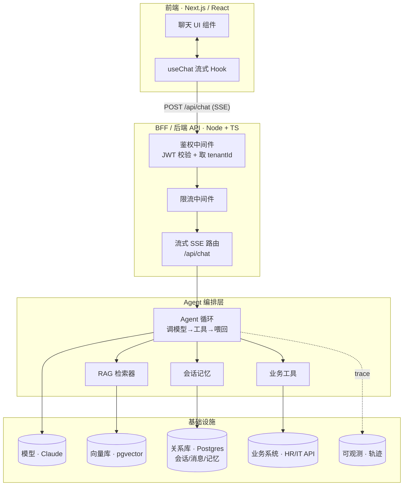

# 项目四 · 全栈 AI Agent 产品（综合 + 上线）

> 一句话：把前面所有篇章——Agent 循环、工具、记忆、RAG、流式、可观测、安全、部署——拼成一个**真能上线**的全栈产品：一个"企业知识助手"。前端聊天 UI 流式渲染、展示工具调用和思考过程、带引用、能终止重试；后端跑 Agent 循环、查公司文档、调业务工具、记住会话；再加上鉴权、限流、多租户隔离、可观测、部署。这是全书的收官项目，也是**前端工程师把全栈优势打满**的舞台。

> **学习目标**
> - 把全书的零件组装成一个端到端、可上线的产品，知道每块从哪一章来。
> - 设计清楚**前后端分层**：前端（Next.js/React）↔ BFF/后端 API（Node/TS）↔ Agent 编排 ↔ 模型/向量库/工具/DB——用你熟的 BFF 概念去理解它。
> - 写好**后端流式 SSE 接口**：内部跑 Agent 循环 + RAG + 工具 + 记忆（复用[第 12 章](../03-工程篇/12-流式输出与前端集成.md)）。
> - 写好**前端流式聊天 UI**：流式渲染文本、展示工具调用/思考中间步骤、引用、终止/重试（这是前端主场，重点写好）。
> - 搞定会话持久化、鉴权限流、多租户数据隔离（呼应[第 16 章](../03-工程篇/16-安全与防护.md)）、可观测（[第 14 章](../03-工程篇/14-可观测性与调试.md)）、部署（[第 17 章](../03-工程篇/17-部署与生产化.md)）。
> - 拿到一份**上线 checklist**，对照着把产品推上生产。

> **前置知识**：这是综合项目，建议先过一遍[项目一·智能知识库问答助手](./项目1-智能知识库问答助手.md)（RAG）、[项目二·自动化工具调用 Agent](./项目2-自动化工具调用agent.md)（工具）、[项目三·多 Agent 协作研究系统](./项目3-多agent协作研究系统.md)（编排）。本项目把它们的能力收进一个产品里，并补上"上线"那一截：鉴权、持久化、部署。代码 TS 全栈主线，关键后端逻辑给 Python 对照。

---

## 1. 产品设计

### 1.1 选什么产品

我们做**"企业知识助手"**——一个公司内部员工用的 AI 助手。选它的理由：它恰好需要把全书的能力都用上，而且是真实存在、有商业价值的产品形态（很多公司都在做内部知识助手）。

它能干三件事：

1. **查公司文档（RAG）**：员工问"我们的报销政策是什么"，它从公司知识库检索相关文档，基于文档作答，并给出来源引用。
2. **调几个业务工具（Tool）**：比如"查一下我还有几天年假""帮我提一个 IT 工单"——这些要调内部 API，不是查文档能解决的。
3. **记住会话（Memory）**：同一个对话里，它记得你前面问过什么；跨会话，它（可选）记住你的偏好。

### 1.2 用户故事

用前端做需求的方式，写几个用户故事，把"它到底要满足谁、解决什么"钉死：

- 作为**新员工**，我想问"入职第一周要做哪些事"，希望它从入职手册里给我答案**并附上手册链接**，这样我能去核对原文。
- 作为**普通员工**，我想问"我还剩几天年假"，希望它**实时查 HR 系统**告诉我准确数字，而不是让我自己去登录系统。
- 作为**员工**，我在一段对话里先问了"报销流程"，再追问"那发票要贴哪"，希望它**记得我们在聊报销**，不用我每次重复上下文。
- 作为**员工**，我看到它正在"查询文档…"，希望能看到这个**中间过程**而不是干等，必要时能**点终止**。
- 作为**管理员**，我希望 A 部门的人查不到 B 部门的机密文档——**数据按租户/部门隔离**。

这些故事直接对应到技术选择：第 1、5 条要 RAG + 引用 + 多租户隔离；第 2 条要工具；第 3 条要记忆；第 4 条要流式 + 中间步骤展示 + 终止。

### 1.3 功能清单

| 功能 | 来自哪章 | 验收 |
|------|---------|------|
| 流式聊天 | 第 12 章 | 回答逐字出现，不是等全部生成完才显示 |
| RAG 查文档 + 引用 | 第 8 章 / 项目一 | 答案带 `[1][2]`，点击能看到来源文档 |
| 业务工具调用 | 第 6 章 / 项目二 | 能查年假、提工单等，前端显示"正在调用 X 工具" |
| 思考/中间步骤可见 | 第 12 章 | 前端展示"思考中""检索中"等中间态 |
| 会话记忆 + 持久化 | 第 7 章 | 刷新页面后历史还在；同会话能追问 |
| 终止 / 重试 | 第 12 章 | 能中途停止生成；能对上一条重新生成 |
| 鉴权 + 限流 | 第 16 章 | 未登录访问被拒；单用户超频被限 |
| 多租户隔离 | 第 16 章 | 跨租户查不到对方数据 |
| 可观测 | 第 14 章 | 每次对话有 trace，能看耗时/token/工具调用 |
| 部署上线 | 第 17 章 | 一条命令/一次 push 能部署 |

---

## 2. 整体架构

这是全书架构的集大成。前端工程师最容易上手的切入点是 **BFF（Backend For Frontend）**——你大概率写过：一层薄后端，专门服务前端，聚合下游、处理鉴权、塑形数据。我们的后端 API 就是这个角色，只不过它下游连的是"模型 + 向量库 + 工具 + DB"。



**分层职责，逐层说清（这正是前端做 BFF 时的分层直觉）：**

| 层 | 职责 | 不该干什么 |
|----|------|----------|
| **前端** | 渲染、交互、流式消费、终止/重试控制 | 不持有密钥、不直连模型、不做鉴权决策 |
| **BFF / 后端 API** | 鉴权、限流、多租户上下文注入、把请求转成 SSE 流 | 不写复杂业务逻辑（薄） |
| **Agent 编排层** | 跑 Agent 循环，决定何时检索/调工具/收尾 | 不关心 HTTP 细节 |
| **基础设施** | 模型推理、向量检索、数据持久化、业务系统 | —— |

> **为什么前端绝不能直连模型？** 这是全栈安全的铁律（第 16 章）。模型 API key 一旦进了浏览器，等于公开。所有模型调用必须经过你的后端，由后端持有密钥、做鉴权、做限流。前端拿到的只是一个你自己的 `/api/chat` 端点——和你平时调自家后端接口一样。

> **关键的数据流向**：浏览器发 `POST /api/chat`（不是 GET，因为要带消息体）→ 后端鉴权、限流、注入 `tenantId` → Agent 循环跑起来 → 用 SSE 把"思考、工具调用、文本增量、引用"一段段推回浏览器 → 前端边收边渲染。这正是第 12 章流式集成的核心，我们这里把它接到完整 Agent 上。

---

## 3. 目录结构（前后端）

我们用 **Next.js（App Router）** 做一体化全栈——前端页面和后端 API 在一个项目里。这对前端工程师最省心：一套 TS、一次部署。（也可以前后端分仓，后端用独立 Node 服务，架构不变。）

```
knowledge-assistant/
├── package.json
├── next.config.js
├── .env.local                      # 密钥 + DB 连接串，绝不提交
├── .env.example
├── prisma/
│   └── schema.prisma               # 会话/消息/记忆/文档的数据库表
└── src/
    ├── app/
    │   ├── page.tsx                # 聊天页面（前端主场）
    │   ├── layout.tsx
    │   └── api/
    │       └── chat/
    │           └── route.ts        # 流式 SSE 接口（BFF 核心）
    ├── components/
    │   ├── Chat.tsx                # 聊天容器组件
    │   ├── MessageList.tsx         # 消息列表渲染
    │   ├── MessageBubble.tsx       # 单条消息（文本 + 工具步骤 + 引用）
    │   └── Composer.tsx            # 输入框 + 发送/终止按钮
    ├── hooks/
    │   └── useChat.ts              # 前端流式 Hook：发请求、消费 SSE、管状态
    ├── lib/
    │   ├── auth.ts                 # 鉴权：校验 JWT、取出 userId/tenantId
    │   ├── rateLimit.ts            # 限流
    │   ├── db.ts                   # Prisma client
    │   └── sse.ts                  # SSE 编码工具（前后端共享事件类型）
    └── server/                     # 后端纯逻辑，不含 HTTP
        ├── agent.ts                # Agent 循环编排（流式产出事件）
        ├── llm.ts                  # 模型薄抽象层
        ├── rag.ts                  # RAG 检索（多租户过滤）
        ├── tools.ts                # 业务工具定义 + 执行
        ├── memory.ts               # 会话/记忆读写
        └── tracing.ts              # 可观测轨迹
```

> `server/` 里全是不依赖 HTTP 的纯逻辑，`app/api/` 是薄薄一层 HTTP 适配——这跟你把 React 组件的"展示"和"逻辑（hook）"分开是一个习惯。后端逻辑可测、可换 HTTP 框架。

---

## 4. 数据模型与持久化

会话、消息、记忆都要落库（用户故事第 3 条：刷新后历史还在）。用 Postgres + Prisma（前端最易接受的 ORM，类型安全，跟 TS 天然契合）。向量也存 Postgres（pgvector 扩展），一个库搞定，省运维。

```prisma
// prisma/schema.prisma
// 多租户的核心：几乎每张表都有 tenantId，所有查询都按它过滤

model Conversation {
  id        String    @id @default(cuid())
  tenantId  String    // 租户/部门隔离键
  userId    String
  title     String    @default("新对话")
  messages  Message[]
  createdAt DateTime  @default(now())

  @@index([tenantId, userId]) // 按租户+用户查会话列表
}

model Message {
  id             String       @id @default(cuid())
  conversationId String
  conversation   Conversation @relation(fields: [conversationId], references: [id])
  role           String       // "user" | "assistant"
  content        String       // 文本内容
  // 助手消息附带的工具调用步骤与引用，存成 JSON，前端回放用
  steps          Json?        // [{ type: "tool", name, status }, ...]
  citations      Json?        // [{ n, title, url }]
  createdAt      DateTime     @default(now())

  @@index([conversationId])
}

// 跨会话的长期记忆（可选）：记住用户偏好等
model Memory {
  id        String   @id @default(cuid())
  tenantId  String
  userId    String
  key       String   // 如 "preferred_language"
  value     String
  createdAt DateTime @default(now())

  @@unique([tenantId, userId, key])
}

// 知识库文档分块 + 向量（RAG）。需要 pgvector 扩展
model DocChunk {
  id        String                @id @default(cuid())
  tenantId  String                // 文档也按租户隔离！
  docTitle  String
  docUrl    String
  content   String
  // embedding 用 pgvector 的 vector 类型，维度看你的 embedding 模型
  // Prisma 对 vector 支持有限，实际项目常用原生 SQL 操作这一列
  createdAt DateTime              @default(now())

  @@index([tenantId])
}
```

> **多租户隔离从数据模型就开始。** 注意 `Conversation`、`Memory`、`DocChunk` 全都有 `tenantId`，并建了索引。这是第 16 章的核心要求——**隔离不是事后加的过滤，是从 schema 设计就长进去的**。后面每个查询都会带 `where: { tenantId }`，漏一个就是越权数据泄露。

```typescript
// src/lib/db.ts —— 全局单例 Prisma client（Next.js 热重载下避免重复实例化）
import { PrismaClient } from "@prisma/client";

const globalForPrisma = globalThis as unknown as { prisma?: PrismaClient };
export const db = globalForPrisma.prisma ?? new PrismaClient();
if (process.env.NODE_ENV !== "production") globalForPrisma.prisma = db;
```

---

## 5. 后端：流式事件协议

前后端之间靠 SSE 流通信。先把**事件协议**定下来——前后端共享同一套事件类型，这是契约。前端按这套事件渲染，后端按这套事件产出。

```typescript
// src/lib/sse.ts —— 前后端共享的流式事件类型与编码

// 后端推给前端的事件种类。前端 useChat 按 type 分发渲染。
export type ChatEvent =
  | { type: "status"; status: "thinking" | "retrieving" | "calling_tool"; label: string }
  | { type: "tool"; name: string; status: "start" | "done"; summary?: string }
  | { type: "text"; delta: string } // 文本增量（逐字流式）
  | { type: "citations"; items: { n: number; title: string; url: string }[] }
  | { type: "done"; conversationId: string; messageId: string }
  | { type: "error"; message: string };

// 把一个事件编码成 SSE 帧。SSE 格式：每条消息以 "data: <json>\n\n" 结尾。
export function encodeSSE(event: ChatEvent): string {
  return `data: ${JSON.stringify(event)}\n\n`;
}
```

> 为什么自定义事件而不用 Vercel AI SDK 的 `streamText`？AI SDK 很好用，生产里推荐（它替你处理了流协议、工具调用、UI hook——第 12 章会讲）。这里**手写一套**，是为了让你看清"流式聊天"底下到底在传什么——本质就是一串 `data: {...}` 的 SSE 帧，和你用过的任何 SSE 一样。看懂了原理，用框架时才知道它替你做了什么。

---

## 6. 后端：Agent 编排层

这是产品的发动机。它把项目一/二/三的能力收进一个**会流式产出事件**的 Agent 循环里。先看辅助件，再看主循环。

### 6.1 模型抽象层 `llm.ts`

和项目三同款薄抽象，但这里要**流式**。用 Claude 的流式 API，注意已核实的细节：用 `client.messages.stream(...)`，事件 `content_block_delta` 里取 `delta.text`；模型 ID 不加日期后缀；思考用 `thinking: { type: "adaptive" }`。

```typescript
// src/server/llm.ts
import Anthropic from "@anthropic-ai/sdk";

const client = new Anthropic(); // 读 process.env.ANTHROPIC_API_KEY

export const MODEL = {
  main: "claude-opus-4-8", // 助手主模型
};

export { client, Anthropic };
```

### 6.2 RAG 检索 `rag.ts`（带多租户过滤）

复用第 8 章 / 项目一的检索，**关键差异：检索时必须按 tenantId 过滤**——A 部门的人不能检索到 B 部门的文档。

```typescript
// src/server/rag.ts
import { db } from "../lib/db.js";

export interface RetrievedDoc {
  title: string;
  url: string;
  content: string;
}

// 按租户隔离的检索。生产里用 pgvector 的向量相似度（<=> 操作符）。
// 这里用原生 SQL 演示"租户过滤 + 相似度排序"的形状。
export async function retrieve(
  tenantId: string,
  queryEmbedding: number[],
  k = 4,
): Promise<RetrievedDoc[]> {
  // 关键：WHERE "tenantId" = ${tenantId} 把检索范围锁死在本租户
  // ORDER BY embedding <=> query 是 pgvector 的余弦距离排序
  const rows = await db.$queryRaw<RetrievedDoc[]>`
    SELECT "docTitle" AS title, "docUrl" AS url, content
    FROM "DocChunk"
    WHERE "tenantId" = ${tenantId}
    ORDER BY embedding <=> ${JSON.stringify(queryEmbedding)}::vector
    LIMIT ${k}
  `;
  return rows;
}
```

> 第 8 章讲过怎么把文档切块、做 embedding、入库。这里假设入库时已经写好了 `tenantId`。**检索侧的 `WHERE tenantId` 是越权防线的最后一道**——哪怕前面鉴权漏了，这里也兜得住。纵深防御。

### 6.3 业务工具 `tools.ts`

复用项目二的工具模式。这里给两个企业工具：查年假、提工单。注意工具执行时也要**带上 tenantId/userId**，不能让用户查到别人的年假。

```typescript
// src/server/tools.ts
import type Anthropic from "@anthropic-ai/sdk";

// 工具定义：注册给模型的回调函数 schema
export const tools: Anthropic.Tool[] = [
  {
    name: "get_annual_leave",
    description: "查询当前登录用户剩余的年假天数。不需要参数，系统会用当前用户身份查询。",
    input_schema: { type: "object", properties: {} },
  },
  {
    name: "create_it_ticket",
    description: "为当前用户创建一个 IT 支持工单。",
    input_schema: {
      type: "object",
      properties: {
        title: { type: "string", description: "工单标题" },
        detail: { type: "string", description: "问题详情" },
      },
      required: ["title"],
    },
  },
];

// 工具执行上下文：从鉴权层注入，工具拿不到它就没法越权
export interface ToolContext {
  tenantId: string;
  userId: string;
}

// 实际执行：模型决定调用工具时跑这里。注意所有调用都带 ctx，按身份查。
export async function runTool(
  name: string,
  input: Record<string, unknown>,
  ctx: ToolContext,
): Promise<string> {
  switch (name) {
    case "get_annual_leave": {
      // 真实项目里这里调 HR 系统 API，带上 ctx.userId
      const days = await fakeHrApi(ctx.userId);
      return `用户 ${ctx.userId} 剩余年假 ${days} 天。`;
    }
    case "create_it_ticket": {
      const ticketId = await fakeItApi(ctx.tenantId, ctx.userId, input);
      return `已创建工单 ${ticketId}，标题：${input.title}`;
    }
    default:
      return `未知工具：${name}`;
  }
}

// —— 演示用的假业务 API ——
async function fakeHrApi(userId: string): Promise<number> {
  return 7; // 真实项目：await fetch(HR_API + userId)
}
async function fakeItApi(tenantId: string, userId: string, input: unknown): Promise<string> {
  return "IT-" + Math.random().toString(36).slice(2, 8);
}
```

### 6.4 会话记忆 `memory.ts`

读写会话历史和长期记忆，全部按 tenantId/userId 过滤。

```typescript
// src/server/memory.ts
import { db } from "../lib/db.js";
import type Anthropic from "@anthropic-ai/sdk";

// 取一个会话的历史消息（按租户校验归属，防越权读别人会话）
export async function loadHistory(
  conversationId: string,
  tenantId: string,
): Promise<Anthropic.MessageParam[]> {
  const conv = await db.conversation.findFirst({
    where: { id: conversationId, tenantId }, // 双重条件：id + tenantId
    include: { messages: { orderBy: { createdAt: "asc" } } },
  });
  if (!conv) return []; // 找不到或不属于本租户 → 当作空历史，不报错暴露存在性
  return conv.messages.map((m) => ({
    role: m.role as "user" | "assistant",
    content: m.content,
  }));
}

// 确保会话存在（新建或复用），返回 conversationId
export async function ensureConversation(
  conversationId: string | undefined,
  tenantId: string,
  userId: string,
): Promise<string> {
  if (conversationId) {
    const exists = await db.conversation.findFirst({
      where: { id: conversationId, tenantId, userId },
    });
    if (exists) return conversationId;
  }
  const conv = await db.conversation.create({ data: { tenantId, userId } });
  return conv.id;
}

// 保存一轮对话（用户消息 + 助手消息含步骤/引用）
export async function saveTurn(
  conversationId: string,
  userText: string,
  assistantText: string,
  steps: unknown[],
  citations: unknown[],
): Promise<string> {
  await db.message.create({
    data: { conversationId, role: "user", content: userText },
  });
  const asst = await db.message.create({
    data: {
      conversationId,
      role: "assistant",
      content: assistantText,
      steps: steps as never,
      citations: citations as never,
    },
  });
  return asst.id;
}
```

### 6.5 Agent 主循环 `agent.ts`（核心，流式产出事件）

这是把一切串起来的地方。它是一个 **async generator**——边跑边 `yield` 事件出去，外层 HTTP 把这些事件编码成 SSE 推给前端。这是流式 Agent 的关键模式：**Agent 不是跑完再返回，而是一边跑一边吐事件**。

```typescript
// src/server/agent.ts
import { client, MODEL, Anthropic } from "./llm.js";
import { retrieve } from "./rag.js";
import { tools, runTool, type ToolContext } from "./tools.js";
import { loadHistory } from "./memory.js";
import type { ChatEvent } from "../lib/sse.js";
import { embed } from "./embed.js"; // 第 8 章的 embedding 函数，按下不表

const SYSTEM = `你是企业知识助手。
- 涉及公司政策、文档类问题：先用检索到的资料作答，每个论断标注来源 [n]，不要编造。
- 涉及个人数据（年假、工单）：调用相应工具，不要瞎猜。
- 涉及对话中已经提过的内容：结合上下文，不要让用户重复。
- 答不出来就老实说不知道，不要硬编。`;

export interface AgentInput {
  conversationId: string;
  userText: string;
  ctx: ToolContext; // { tenantId, userId } —— 从鉴权层来
  signal: AbortSignal; // 支持前端终止
}

// async generator：跑 Agent 循环，逐个 yield ChatEvent
export async function* runAgent(
  input: AgentInput,
): AsyncGenerator<ChatEvent, { text: string; steps: unknown[]; citations: unknown[] }> {
  const { conversationId, userText, ctx, signal } = input;

  // —— 1. 取历史 + RAG 检索（多租户过滤）——
  yield { type: "status", status: "retrieving", label: "正在检索公司文档…" };
  const history = await loadHistory(conversationId, ctx.tenantId);
  const queryVec = await embed(userText);
  const docs = await retrieve(ctx.tenantId, queryVec, 4);

  // 把检索到的文档拼进 system，并准备引用编号（确定性编号，见项目三的心法）
  const citationItems = docs.map((d, i) => ({ n: i + 1, title: d.title, url: d.url }));
  const ragContext = docs
    .map((d, i) => `[${i + 1}] ${d.title}\n${d.content}`)
    .join("\n\n");
  const systemWithRag = `${SYSTEM}\n\n可参考的公司文档：\n${ragContext || "（无相关文档）"}`;

  const messages: Anthropic.MessageParam[] = [
    ...history,
    { role: "user", content: userText },
  ];

  const steps: unknown[] = []; // 记录工具调用步骤，用于持久化和前端回放
  let fullText = "";

  // —— 2. Agent 循环：流式调模型，处理工具，直到收尾 ——
  for (let round = 0; round < 5; round++) {
    if (signal.aborted) break; // 前端终止

    yield { type: "status", status: "thinking", label: "正在思考…" };

    // 流式调用模型
    const stream = client.messages.stream(
      {
        model: MODEL.main,
        max_tokens: 4096,
        system: systemWithRag,
        messages,
        tools,
        thinking: { type: "adaptive" }, // 不要用 budget_tokens
        output_config: { effort: "medium" },
      },
      { signal }, // 把 AbortSignal 传给 SDK，终止时真正掐断请求
    );

    // 流式消费：文本增量逐字 yield 给前端
    for await (const ev of stream) {
      if (signal.aborted) break;
      if (ev.type === "content_block_delta" && ev.delta.type === "text_delta") {
        fullText += ev.delta.text;
        yield { type: "text", delta: ev.delta.text };
      }
    }

    const finalMsg = await stream.finalMessage();

    // 模型不再要工具 → 收尾
    if (finalMsg.stop_reason !== "tool_use") {
      messages.push({ role: "assistant", content: finalMsg.content });
      break;
    }

    // —— 执行工具，把结果喂回，继续循环 ——
    messages.push({ role: "assistant", content: finalMsg.content });
    const toolResults: Anthropic.ToolResultBlockParam[] = [];
    for (const block of finalMsg.content) {
      if (block.type === "tool_use") {
        // 通知前端：正在调用工具（中间步骤可见，用户故事第 4 条）
        yield { type: "tool", name: block.name, status: "start" };
        const result = await runTool(
          block.name,
          block.input as Record<string, unknown>,
          ctx, // 带身份，防越权
        );
        steps.push({ type: "tool", name: block.name });
        yield { type: "tool", name: block.name, status: "done", summary: result };
        toolResults.push({ type: "tool_result", tool_use_id: block.id, content: result });
      }
    }
    messages.push({ role: "user", content: toolResults });
  }

  // —— 3. 推送引用 + 收尾 ——
  // 只保留正文里真正引用到的来源（简化：这里全推；可按需过滤）
  if (citationItems.length) {
    yield { type: "citations", items: citationItems };
  }

  return { text: fullText, steps, citations: citationItems };
}
```

**这个循环的几个要点：**

- **async generator 是流式 Agent 的灵魂。** `yield` 一个事件，外层就能立刻推给前端。它把"跑 Agent"和"推流"解耦——Agent 只管 `yield`，不管 HTTP。这跟 React 里把状态更新和渲染解耦是一个味道。
- **AbortSignal 一路传到底。** 前端点终止 → `signal.aborted` 变 true → 循环里 break，并且把 `signal` 传给 `client.messages.stream` 真正掐断模型请求（不然你只是不显示了，模型还在后台烧钱）。这是"终止"功能能省钱的关键。
- **工具调用对前端可见。** 调工具前 `yield { type: "tool", status: "start" }`，调完 `yield ... status: "done"`。前端据此显示"正在查询年假…→ 已查到"。用户不再面对黑盒。
- **tenantId/userId 通过 `ctx` 一路带到工具执行。** 工具拿不到全局身份，只能用传进来的 `ctx`，从根上防越权。

#### Python 对照（Agent 主循环核心）

```python
# server/agent.py —— 用 async generator 流式产出事件
import anthropic

client = anthropic.AsyncAnthropic()
SYSTEM = "你是企业知识助手。涉及文档先检索并标注来源 [n]；涉及个人数据调工具……"


async def run_agent(*, conversation_id, user_text, ctx, abort_event):
    # ctx = {"tenant_id":..., "user_id":...}；abort_event 是 asyncio.Event 做终止
    yield {"type": "status", "status": "retrieving", "label": "正在检索公司文档…"}
    history = await load_history(conversation_id, ctx["tenant_id"])
    query_vec = await embed(user_text)
    docs = await retrieve(ctx["tenant_id"], query_vec, 4)

    citation_items = [{"n": i + 1, "title": d.title, "url": d.url}
                      for i, d in enumerate(docs)]
    rag_context = "\n\n".join(f"[{i+1}] {d.title}\n{d.content}"
                             for i, d in enumerate(docs))
    system_with_rag = f"{SYSTEM}\n\n可参考的公司文档：\n{rag_context or '（无相关文档）'}"
    messages = [*history, {"role": "user", "content": user_text}]
    steps, full_text = [], ""

    for _round in range(5):
        if abort_event.is_set():
            break
        yield {"type": "status", "status": "thinking", "label": "正在思考…"}

        async with client.messages.stream(
            model="claude-opus-4-8", max_tokens=4096,
            system=system_with_rag, messages=messages, tools=TOOLS,
            thinking={"type": "adaptive"},          # 不要用 budget_tokens
            output_config={"effort": "medium"},
        ) as stream:
            async for ev in stream:
                if abort_event.is_set():
                    break
                if ev.type == "content_block_delta" and ev.delta.type == "text_delta":
                    full_text += ev.delta.text
                    yield {"type": "text", "delta": ev.delta.text}
            final_msg = await stream.get_final_message()

        if final_msg.stop_reason != "tool_use":
            messages.append({"role": "assistant", "content": final_msg.content})
            break

        messages.append({"role": "assistant", "content": final_msg.content})
        tool_results = []
        for block in final_msg.content:
            if block.type == "tool_use":
                yield {"type": "tool", "name": block.name, "status": "start"}
                result = await run_tool(block.name, block.input, ctx)
                steps.append({"type": "tool", "name": block.name})
                yield {"type": "tool", "name": block.name, "status": "done",
                       "summary": result}
                tool_results.append({"type": "tool_result",
                                     "tool_use_id": block.id, "content": result})
        messages.append({"role": "user", "content": tool_results})

    if citation_items:
        yield {"type": "citations", "items": citation_items}
    # generator 末尾把汇总结果通过外层闭包/返回值带出，用于持久化
```

---

## 7. 后端：鉴权、限流、SSE 路由

### 7.1 鉴权 `auth.ts`

校验 JWT，取出 `userId` 和 `tenantId`。这个 `tenantId` 是整个多租户隔离的源头——它从这里产生，往下一路传到 RAG 检索和工具执行。

```typescript
// src/lib/auth.ts
import jwt from "jsonwebtoken";

export interface AuthContext {
  userId: string;
  tenantId: string;
}

// 从请求头的 Bearer token 解出身份。失败抛错 → 路由返回 401。
export function authenticate(req: Request): AuthContext {
  const header = req.headers.get("authorization") ?? "";
  const token = header.replace(/^Bearer\s+/i, "");
  if (!token) throw new Error("missing token");

  // 密钥走环境变量，绝不硬编码
  const payload = jwt.verify(token, process.env.JWT_SECRET!) as {
    sub: string;
    tenantId: string;
  };
  return { userId: payload.sub, tenantId: payload.tenantId };
}
```

> 真实项目里 JWT 多半来自你的 SSO / 身份服务（Auth0、Cognito、自建）。重点是：**`tenantId` 必须来自服务端可信的 token，不能来自前端传的参数**——否则用户改个参数就越权了。这是第 16 章反复强调的：永远不要相信客户端传来的身份/权限信息。

### 7.2 限流 `rateLimit.ts`

防止单用户刷爆、防止成本失控（第 15、16 章）。这里用最简单的固定窗口内存计数演示；生产用 Redis 做分布式限流。

```typescript
// src/lib/rateLimit.ts —— 演示用内存固定窗口限流
const buckets = new Map<string, { count: number; resetAt: number }>();

// 每个用户每分钟最多 N 次请求
export function checkRateLimit(userId: string, limit = 20, windowMs = 60_000): boolean {
  const now = Date.now();
  const b = buckets.get(userId);
  if (!b || now > b.resetAt) {
    buckets.set(userId, { count: 1, resetAt: now + windowMs });
    return true;
  }
  if (b.count >= limit) return false; // 超频
  b.count++;
  return true;
}
```

> 内存限流只在单实例有效，多实例部署会失效——生产务必换 Redis（`INCR` + `EXPIRE`）或用网关层限流（第 17 章）。这里用内存版是为了让你看清限流的本质：**一个计数器 + 一个时间窗口**。

### 7.3 流式 SSE 路由 `app/api/chat/route.ts`

这是 BFF 的核心——把鉴权、限流、Agent 编排、SSE 推流串起来。Next.js App Router 的 Route Handler 支持返回 `ReadableStream`，正好用来做 SSE。

```typescript
// src/app/api/chat/route.ts
import { authenticate } from "../../../lib/auth.js";
import { checkRateLimit } from "../../../lib/rateLimit.js";
import { encodeSSE, type ChatEvent } from "../../../lib/sse.js";
import { runAgent } from "../../../server/agent.js";
import { ensureConversation, saveTurn } from "../../../server/memory.js";

export const runtime = "nodejs"; // Agent 循环要 Node 运行时（不是 edge）

export async function POST(req: Request): Promise<Response> {
  // —— 1. 鉴权 ——
  let auth;
  try {
    auth = authenticate(req);
  } catch {
    return new Response("Unauthorized", { status: 401 });
  }

  // —— 2. 限流 ——
  if (!checkRateLimit(auth.userId)) {
    return new Response("Too Many Requests", { status: 429 });
  }

  // —— 3. 解析请求体 ——
  const body = (await req.json()) as {
    conversationId?: string;
    message: string;
  };
  if (!body.message?.trim()) {
    return new Response("empty message", { status: 400 });
  }

  // 把前端的 AbortController 接到这里：客户端断开连接 → req.signal 触发
  const signal = req.signal;

  // —— 4. 构造 SSE 流 ——
  const encoder = new TextEncoder();
  const stream = new ReadableStream({
    async start(controller) {
      const send = (e: ChatEvent) => controller.enqueue(encoder.encode(encodeSSE(e)));
      try {
        const conversationId = await ensureConversation(
          body.conversationId,
          auth.tenantId,
          auth.userId,
        );

        // 跑 Agent，把它 yield 的每个事件推给前端
        const gen = runAgent({
          conversationId,
          userText: body.message,
          ctx: { tenantId: auth.tenantId, userId: auth.userId },
          signal,
        });

        let result;
        while (true) {
          const { value, done, } = await gen.next();
          if (done) {
            result = value; // generator 的 return 值：{ text, steps, citations }
            break;
          }
          send(value); // 把事件推给前端
        }

        // —— 5. 持久化这一轮 ——
        const messageId = await saveTurn(
          conversationId,
          body.message,
          result.text,
          result.steps,
          result.citations,
        );

        send({ type: "done", conversationId, messageId });
      } catch (err) {
        send({ type: "error", message: (err as Error).message });
      } finally {
        controller.close();
      }
    },
  });

  // SSE 响应头
  return new Response(stream, {
    headers: {
      "Content-Type": "text/event-stream",
      "Cache-Control": "no-cache, no-transform",
      Connection: "keep-alive",
    },
  });
}
```

> **`req.signal` 是终止功能的后端落点。** 浏览器那边 `fetch` 用了 `AbortController`，用户点终止 → 浏览器断开连接 → Next.js 触发 `req.signal` → 我们把它传给 `runAgent` → 一路传到 `client.messages.stream`，真正掐断模型请求。前后端的终止是同一根信号贯穿的。

---

## 8. 前端：流式聊天 UI（前端主场）

终于到前端主场了。这块要写好——它是这个产品用户唯一直接接触的部分，也是前端工程师的看家本领。

核心是一个 `useChat` Hook（管状态、发请求、消费 SSE 流），加几个展示组件。我们故意**不直接用现成的聊天库**，手写一遍，让你彻底搞懂"流式聊天前端"在干什么。生产里可以换成 Vercel AI SDK 的 `useChat`（第 12 章会讲），但原理一模一样。

### 8.1 流式 Hook `useChat.ts`

这是前端的发动机。它要做：发 POST 请求、用 `ReadableStream` 逐块读 SSE、解析事件、增量更新消息状态、支持终止和重试。

```typescript
// src/hooks/useChat.ts
"use client";
import { useState, useRef, useCallback } from "react";
import type { ChatEvent } from "../lib/sse.js";

// 前端的消息模型：比后端多了 UI 状态（流式中的步骤、是否在生成）
export interface UiMessage {
  id: string;
  role: "user" | "assistant";
  content: string;
  status?: string; // "正在检索…" "正在思考…" 等中间态
  toolSteps: { name: string; status: "start" | "done"; summary?: string }[];
  citations: { n: number; title: string; url: string }[];
  streaming: boolean; // 是否正在流式生成
}

export function useChat(token: string) {
  const [messages, setMessages] = useState<UiMessage[]>([]);
  const [conversationId, setConversationId] = useState<string | undefined>();
  const [isStreaming, setIsStreaming] = useState(false);
  // 保存当前请求的 AbortController，用于"终止"
  const abortRef = useRef<AbortController | null>(null);
  // 记住最后一条用户消息，用于"重试"
  const lastUserText = useRef<string>("");

  // 更新最后一条助手消息（流式增量时频繁调用）
  const patchLastAssistant = useCallback((patch: Partial<UiMessage>) => {
    setMessages((prev) => {
      const next = [...prev];
      const last = next[next.length - 1];
      if (last?.role === "assistant") {
        next[next.length - 1] = { ...last, ...patch };
      }
      return next;
    });
  }, []);

  const send = useCallback(
    async (text: string) => {
      lastUserText.current = text;
      setIsStreaming(true);

      // 乐观更新：先把用户消息和一个空的助手占位消息放进列表
      const userMsg: UiMessage = {
        id: crypto.randomUUID(),
        role: "user",
        content: text,
        toolSteps: [],
        citations: [],
        streaming: false,
      };
      const asstMsg: UiMessage = {
        id: crypto.randomUUID(),
        role: "assistant",
        content: "",
        toolSteps: [],
        citations: [],
        streaming: true,
      };
      setMessages((prev) => [...prev, userMsg, asstMsg]);

      const controller = new AbortController();
      abortRef.current = controller;

      try {
        const res = await fetch("/api/chat", {
          method: "POST",
          headers: {
            "Content-Type": "application/json",
            Authorization: `Bearer ${token}`,
          },
          body: JSON.stringify({ conversationId, message: text }),
          signal: controller.signal, // 终止用
        });

        if (!res.ok || !res.body) {
          patchLastAssistant({
            content: `出错了（${res.status}）`,
            streaming: false,
          });
          return;
        }

        // —— 逐块读取 SSE 流 ——
        const reader = res.body.getReader();
        const decoder = new TextDecoder();
        let buffer = "";

        while (true) {
          const { value, done } = await reader.read();
          if (done) break;
          buffer += decoder.decode(value, { stream: true });

          // SSE 帧以 \n\n 分隔，逐帧解析
          const frames = buffer.split("\n\n");
          buffer = frames.pop() ?? ""; // 最后一段可能不完整，留到下次

          for (const frame of frames) {
            const line = frame.replace(/^data:\s*/, "").trim();
            if (!line) continue;
            const event = JSON.parse(line) as ChatEvent;
            handleEvent(event);
          }
        }
      } catch (err) {
        // AbortError = 用户主动终止，不算错误
        if ((err as Error).name !== "AbortError") {
          patchLastAssistant({ content: "网络错误，请重试", streaming: false });
        }
      } finally {
        setIsStreaming(false);
        abortRef.current = null;
        patchLastAssistant({ streaming: false, status: undefined });
      }

      // 把一个 SSE 事件映射成 UI 状态更新
      function handleEvent(event: ChatEvent) {
        switch (event.type) {
          case "status":
            patchLastAssistant({ status: event.label });
            break;
          case "tool":
            setMessages((prev) => {
              const next = [...prev];
              const last = next[next.length - 1];
              if (last?.role === "assistant") {
                // start 时新增一条步骤，done 时更新它
                const steps = [...last.toolSteps];
                const idx = steps.findIndex(
                  (s) => s.name === event.name && s.status === "start",
                );
                if (event.status === "start") {
                  steps.push({ name: event.name, status: "start" });
                } else if (idx >= 0) {
                  steps[idx] = { name: event.name, status: "done", summary: event.summary };
                }
                next[next.length - 1] = { ...last, toolSteps: steps };
              }
              return next;
            });
            break;
          case "text":
            // 文本增量：累加（这就是"逐字出现"的效果来源）
            setMessages((prev) => {
              const next = [...prev];
              const last = next[next.length - 1];
              if (last?.role === "assistant") {
                next[next.length - 1] = {
                  ...last,
                  content: last.content + event.delta,
                  status: undefined, // 一旦开始出文本，清掉"思考中"
                };
              }
              return next;
            });
            break;
          case "citations":
            patchLastAssistant({ citations: event.items });
            break;
          case "done":
            setConversationId(event.conversationId);
            break;
          case "error":
            patchLastAssistant({ content: `出错：${event.message}`, streaming: false });
            break;
        }
      }
    },
    [token, conversationId, patchLastAssistant],
  );

  // 终止：中断当前请求（前端停显示 + 后端掐断模型）
  const stop = useCallback(() => {
    abortRef.current?.abort();
  }, []);

  // 重试：删掉最后一轮（用户+助手），用同样的文本重发
  const retry = useCallback(() => {
    if (!lastUserText.current) return;
    setMessages((prev) => prev.slice(0, -2)); // 去掉最后一对消息
    void send(lastUserText.current);
  }, [send]);

  return { messages, send, stop, retry, isStreaming, conversationId };
}
```

**这个 Hook 是前端流式的精髓，几个要点：**

- **乐观更新（optimistic update）**：发送瞬间就把用户消息和空的助手占位塞进列表，UI 立刻有反应——这是前端老手的基本功，别等服务器回了才显示。
- **逐块读 SSE 是核心循环**：`reader.read()` 拿到一块块字节，按 `\n\n` 拆成 SSE 帧，逐帧 `JSON.parse` 成事件。`buffer.pop()` 那行很关键——网络分块不保证正好切在帧边界，最后一段可能不完整，留到下次拼。这是手写 SSE 解析必须处理的细节。
- **`text` 事件累加 content** 就是"逐字出现"的来源。每来一个 delta，就 `content + delta`，React 重渲染，用户看到字一个个冒出来。
- **`tool` 事件驱动中间步骤展示**：start 时新增一条"正在调用 X"，done 时更新成"已完成"。用户故事第 4 条（中间过程可见）就靠它。
- **终止 = `controller.abort()`**：前端 fetch 的 AbortController 一 abort，浏览器断连，后端的 `req.signal` 跟着触发，一路掐到模型。前后端终止是一根信号。
- **重试 = 删最后一对 + 重发**：简单可靠。

### 8.2 单条消息组件 `MessageBubble.tsx`

把文本、工具步骤、引用、流式光标渲染出来。

```typescript
// src/components/MessageBubble.tsx
"use client";
import type { UiMessage } from "../hooks/useChat.js";

export function MessageBubble({ msg }: { msg: UiMessage }) {
  const isUser = msg.role === "user";
  return (
    <div className={isUser ? "bubble bubble-user" : "bubble bubble-assistant"}>
      {/* 中间步骤：思考中 / 工具调用，仅助手消息显示 */}
      {!isUser && (
        <div className="steps">
          {msg.status && <div className="step step-thinking">⏳ {msg.status}</div>}
          {msg.toolSteps.map((s, i) => (
            <div key={i} className={`step step-tool step-${s.status}`}>
              {s.status === "start" ? "🔧 调用工具" : "✅ 已完成"}：{s.name}
              {s.summary && <span className="step-summary"> — {s.summary}</span>}
            </div>
          ))}
        </div>
      )}

      {/* 正文。流式中末尾加一个闪烁光标 */}
      <div className="content">
        {msg.content}
        {msg.streaming && <span className="cursor">▋</span>}
      </div>

      {/* 引用：可点击跳到来源文档（用户故事第 1、5 条）*/}
      {msg.citations.length > 0 && (
        <div className="citations">
          <div className="citations-title">来源</div>
          {msg.citations.map((c) => (
            <a key={c.n} href={c.url} target="_blank" rel="noreferrer" className="citation">
              [{c.n}] {c.title}
            </a>
          ))}
        </div>
      )}
    </div>
  );
}
```

### 8.3 聊天容器 + 输入框

```typescript
// src/components/Chat.tsx
"use client";
import { useChat } from "../hooks/useChat.js";
import { MessageBubble } from "./MessageBubble.js";
import { Composer } from "./Composer.js";

// token 真实场景从登录态/session 拿，这里作为 prop 传入
export function Chat({ token }: { token: string }) {
  const { messages, send, stop, retry, isStreaming } = useChat(token);

  return (
    <div className="chat">
      <div className="messages">
        {messages.map((m) => (
          <MessageBubble key={m.id} msg={m} />
        ))}
      </div>
      <Composer
        disabled={false}
        isStreaming={isStreaming}
        onSend={send}
        onStop={stop}
        onRetry={retry}
        canRetry={messages.length > 0 && !isStreaming}
      />
    </div>
  );
}
```

```typescript
// src/components/Composer.tsx
"use client";
import { useState } from "react";

export function Composer(props: {
  disabled: boolean;
  isStreaming: boolean;
  canRetry: boolean;
  onSend: (text: string) => void;
  onStop: () => void;
  onRetry: () => void;
}) {
  const [text, setText] = useState("");

  const submit = () => {
    const t = text.trim();
    if (!t || props.isStreaming) return;
    props.onSend(t);
    setText("");
  };

  return (
    <div className="composer">
      <textarea
        value={text}
        onChange={(e) => setText(e.target.value)}
        onKeyDown={(e) => {
          // Enter 发送，Shift+Enter 换行（聊天框惯例）
          if (e.key === "Enter" && !e.shiftKey) {
            e.preventDefault();
            submit();
          }
        }}
        placeholder="问我公司政策、查年假、提工单…"
        disabled={props.disabled}
      />
      <div className="composer-buttons">
        {props.isStreaming ? (
          // 生成中：显示"终止"按钮
          <button onClick={props.onStop} className="btn-stop">
            ⏹ 终止
          </button>
        ) : (
          <button onClick={submit} className="btn-send">
            发送
          </button>
        )}
        {props.canRetry && (
          <button onClick={props.onRetry} className="btn-retry">
            ↻ 重试
          </button>
        )}
      </div>
    </div>
  );
}
```

```typescript
// src/app/page.tsx —— 页面入口
import { Chat } from "../components/Chat.js";

export default function Page() {
  // 真实项目：从 cookie/session 拿登录后的 JWT。这里演示传一个占位。
  const token = process.env.NEXT_PUBLIC_DEMO_TOKEN ?? "";
  return (
    <main>
      <h1>企业知识助手</h1>
      <Chat token={token} />
    </main>
  );
}
```

> **前端这一套，本质上跟你平时做的实时功能没区别**：发请求、消费流、增量更新 state、渲染。难点不在 AI，在"流式 + 中间状态 + 可中断"这三件你其实都见过的事（弹幕、进度条、可取消的上传）。把它们组合好，就是一个专业的 AI 聊天 UI。

---

## 9. 可观测接入

呼应[第 14 章](../03-工程篇/14-可观测性与调试.md)。生产上线后，你最需要回答的问题是："这次对话为什么慢/贵/答错了？"——靠的是轨迹（trace）。

在 `agent.ts` 里给每次模型调用、每次工具执行、每次检索打一条 span（结构跟项目三的 `tracing.ts` 一样），带上 `conversationId`、`tenantId`、耗时、token、工具名。然后：

- **本地/小规模**：直接 `console.log` 结构化 JSON，或写一张 `Trace` 表。
- **生产**：发到 LangSmith、Langfuse 或 OpenTelemetry collector。这些工具能按 `conversationId` 把一次完整对话的所有 span 串成一棵树，让你点开看每一步。

```typescript
// 在 agent.ts 的关键节点插入（示意）
trace.span({
  conversationId,
  tenantId: ctx.tenantId,
  action: "llm_call",
  durationMs,
  inputTokens: finalMsg.usage.input_tokens,
  outputTokens: finalMsg.usage.output_tokens,
  model: MODEL.main,
});
```

> 三个一定要记的维度：**token（算钱、第 15 章）、耗时（找慢点）、tenantId（按租户排查 + 多租户成本归集）**。一次对话一条 trace，串起所有 span，是排障的命根子。

---

## 10. 部署

呼应[第 17 章](../03-工程篇/17-部署与生产化.md)。给一种具体、对前端工程师最顺手的方案：**Vercel 部署 Next.js（前后端一体）+ 托管 Postgres**。

### 10.1 方案

```
浏览器 ──HTTPS──> Vercel (Next.js 前端 + /api/chat 路由)
                      │
                      ├──> Claude API（模型）
                      ├──> 托管 Postgres + pgvector（Neon / Supabase）
                      └──> 业务系统 API
```

为什么选它：前后端一个项目一次 `git push` 就部署、Vercel 帮你搞定 HTTPS/CDN/扩缩容、Neon/Supabase 给你一个带 pgvector 的托管 Postgres。前端工程师最熟的链路。

### 10.2 关键配置

```bash
# Vercel 环境变量（在 Vercel 控制台设，绝不进代码）
ANTHROPIC_API_KEY=sk-ant-...
JWT_SECRET=...
DATABASE_URL=postgres://...   # 托管 Postgres 连接串

# 部署：连 GitHub 仓库后，push 即部署；或：
vercel --prod
```

### 10.3 处理流式与长任务——两个生产坑

**坑一：Serverless 函数超时。** Vercel 等平台的 Serverless 函数有最大执行时长（按套餐几十秒到几分钟）。一个 Agent 跑工具循环可能超时。对策：

- 路由里声明 `export const maxDuration = 60;`（提到平台允许的上限）。
- Agent 循环加轮数上限（我们 `round < 5` 已经做了）。
- 真正的长任务（比如项目三那种深度研究）别走"一个请求等到底"，改成**任务队列 + 轮询/Webhook**：请求立刻返回一个 taskId，后台 worker 跑，前端轮询进度（第 17 章详述）。我们这个知识助手是交互式短任务，`maxDuration` + 轮数上限够用。

**坑二：流式被中间层缓冲。** 有些 CDN / 代理会缓冲响应，导致 SSE 不流式、用户干等到最后一次性出全部。对策：

- 响应头加 `Cache-Control: no-transform`（我们路由里已加）和 `X-Accel-Buffering: no`（针对 Nginx）。
- 确认平台/网关不对 `text/event-stream` 做缓冲（第 17 章讲怎么验证流式真的没被缓冲）。

> 也可以容器化（Docker）部署到任意云（第 17 章讲 Dockerfile + 健康检查 + 优雅退出）。架构不变，只是换了承载方式。Serverless 上手快，容器更可控,看团队基础设施。

---

## 11. 上线 checklist

把产品推上生产前，对照这张清单逐项打勾。这是从"能在本地跑"到"敢让真用户用"的距离。

**安全（第 16 章）**
- [ ] 模型 API key 只在后端，前端绝无密钥；所有模型调用经过 `/api/chat`
- [ ] 鉴权：每个请求校验 JWT，`tenantId`/`userId` 来自可信 token，不信前端传参
- [ ] 多租户隔离：会话、记忆、文档检索、工具执行**全部**按 `tenantId` 过滤，逐条复查无遗漏
- [ ] 限流：按用户/租户限流，生产用 Redis 而非内存
- [ ] 提示注入防护：用户输入不直接拼进可执行指令；工具调用做参数校验（第 16 章）
- [ ] 越权测试：拿 A 租户的 token 去查 B 租户的会话/文档，确认被拒

**正确性与质量（第 13 章）**
- [ ] RAG 答案带引用，引用编号与来源一一对应（确定性编号，别让模型数）
- [ ] 答不出来时老实说不知道，不幻觉
- [ ] 有一组评测用例（典型问题 + 期望要点），上线前跑一遍

**流式与交互（第 12 章）**
- [ ] 文本逐字流式，不是一次性出全部
- [ ] 中间步骤（思考、工具调用）对用户可见
- [ ] 终止能真正掐断后端模型请求（不是只停显示）
- [ ] 重试可用；网络错误有兜底提示

**持久化**
- [ ] 会话/消息落库，刷新页面历史还在
- [ ] 数据库迁移脚本就绪（`prisma migrate`），有备份策略

**可观测（第 14 章）**
- [ ] 每次对话有 trace，记录 token、耗时、工具调用、tenantId
- [ ] 错误有上报（Sentry 等），能按 conversationId 定位

**成本（第 15 章）**
- [ ] 知道单次对话平均成本，设了用量/预算告警
- [ ] 评估过用提示缓存（`cache_control`）缓存稳定的系统提示前缀省钱
- [ ] 评估过简单意图能否降级到便宜模型（haiku）

**部署（第 17 章）**
- [ ] 环境变量在平台配置，不进代码库
- [ ] Serverless 超时已设上限 / 长任务走队列
- [ ] 流式未被中间层缓冲（线上实测验证）
- [ ] 健康检查端点、回滚预案

---

## 12. 评测与监控

呼应[第 13 章（评测）](../03-工程篇/13-评测与测试.md)和[第 14 章（监控）](../03-工程篇/14-可观测性与调试.md)。上线不是终点，得持续盯着。

**上线前评测（offline）**：攒一组代表性问题——文档类（"报销政策"）、工具类（"剩余年假"）、追问类（多轮上下文）、它该拒答的（"帮我查 CEO 的工资"）。对每个写下期望：答案要点、该不该调工具、该不该带引用、该不该拒。每次改提示/换模型前后都跑一遍，看有没有回归。可以用一个模型当评委（LLM-as-judge）自动打分（第 13 章）。

**上线后监控（online）**：
- **质量信号**：用户有没有点"重试"（重试率高 = 答得不好）、有没有点踩、对话轮数异常长（可能在反复纠正它）。
- **成本信号**：每日 token 消耗、单次对话成本分布、有没有异常高的离群对话。
- **性能信号**：首字延迟（TTFT，流式体验的关键）、整轮耗时、工具调用耗时。
- **错误信号**：模型 5xx/限流、工具调用失败、SSE 断流。

把这些接到看板（第 14 章），设几条告警（成本突增、错误率突增、TTFT 变慢），就能在用户抱怨前发现问题。

---

## 13. 常见坑

| 坑 | 症状 | 对策 |
|----|------|------|
| 前端拿到密钥 | API key 出现在浏览器网络面板/打包产物 | 密钥只在后端；前端只调自家 `/api/chat` |
| 多租户漏过滤 | A 部门查到 B 部门文档/会话 | 每个查询都 `where tenantId`；schema 就带隔离键；写越权测试 |
| 终止假终止 | 点了终止，前端停了但后端模型还在烧钱 | AbortSignal 一路传到 `client.messages.stream`；验证后端真的中断 |
| 流式被缓冲 | 用户干等到最后一次性出全部 | `no-transform` 头；关掉中间层缓冲；线上实测 |
| Serverless 超时 | 工具循环跑久了 504 | 设 `maxDuration` + 轮数上限；长任务走队列 |
| 引用错乱 | `[5]` 没对应来源 | 模型只写语义占位，编号交给确定性代码（同项目三） |
| SSE 帧解析错位 | 偶发 JSON.parse 失败 | 按 `\n\n` 拆帧，最后不完整的一段 buffer 留到下次 |
| 历史无限增长 | 会话超长，token 爆、变慢 | 超长会话做截断/摘要（第 7 章记忆压缩） |
| 内存限流多实例失效 | 多副本部署后限流形同虚设 | 换 Redis 分布式限流或网关层限流 |

---

## 14. 扩展方向

- **多 Agent 升级**：把"研究类"复杂问题路由给项目三的多 Agent 编排（深度调研后产出长报告），普通问答仍走单 Agent。一个产品里两种复杂度并存。
- **更丰富的工具**：接日历、邮件、审批流——记得每个有副作用的工具加审批闸门（第 16 章 human-in-the-loop）。
- **流式 UI 增强**：Markdown 渲染、代码高亮、引用悬浮预览、消息编辑后重新生成。
- **离线评测自动化**：把评测集接进 CI，每次提交自动跑、看质量回归。
- **用框架重写**：前端换 Vercel AI SDK 的 `useChat`、后端用它的 `streamText` + 工具调用，省掉手写 SSE 协议那一层（第 10、12 章）——但你现在已经懂底下在干什么了，用框架更踏实。
- **成本优化**：提示缓存稳定前缀、简单意图降级到 haiku、高频问答结果缓存（第 15 章）。

---

## 15. 小结：全书知识点 → 章节映射

这是全书的收尾。回头看这个产品，它把前面几乎每一篇都用上了。下面这张映射表，既是本项目的总结，也是整本书的一次回顾——你可以拿它当复习提纲，也能在面试里用来讲"我做过一个完整的 Agent 产品，用到了……"。

| 产品中的能力 | 用到的知识点 | 对应章节 |
|------------|------------|---------|
| 调模型、处理响应、流式 | LLM API 基础、Token、上下文窗口 | 第 1-4 章（基础篇） |
| Agent 循环（调模型→工具→喂回→再调） | Agent 核心循环与 ReAct 推理范式 | [第 5 章](../02-核心能力篇/05-agent核心循环与推理范式.md) |
| 业务工具（查年假、提工单） | 工具系统设计、工具即回调函数 | [第 6 章](../02-核心能力篇/06-工具系统设计.md) |
| 会话记忆、刷新后历史还在、超长截断 | 记忆与上下文管理 | [第 7 章](../02-核心能力篇/07-记忆与上下文管理.md) |
| 查公司文档 + 带引用作答 | RAG 检索增强生成、向量检索 | [第 8 章](../02-核心能力篇/08-rag检索增强生成.md) |
| 复杂研究问题路由给多 Agent（扩展方向） | 多 Agent 协作、编排者-工作者 | [第 9 章](../02-核心能力篇/09-多agent协作系统.md) |
| 选 Next.js 一体化、薄抽象层换厂商 | Agent 框架选型、框架无关原则 | [第 10 章](../03-工程篇/10-agent框架选型.md) |
| 评测集、回归测试、LLM-as-judge | 评测与测试 | [第 13 章](../03-工程篇/13-评测与测试.md) |
| 流式 SSE 接口、前端流式 Hook、中间步骤可见 | 流式输出与前端集成 | [第 12 章](../03-工程篇/12-流式输出与前端集成.md) |
| 每次对话打 trace、按 conversationId 排障 | 可观测性与调试 | [第 14 章](../03-工程篇/14-可观测性与调试.md) |
| 模型分层、提示缓存、成本核算与告警 | 成本与性能优化 | [第 15 章](../03-工程篇/15-成本与性能优化.md) |
| 鉴权、限流、多租户隔离、提示注入防护 | 安全与防护 | [第 16 章](../03-工程篇/16-安全与防护.md) |
| Vercel/容器部署、流式与长任务处理 | 部署与生产化 | [第 17 章](../03-工程篇/17-部署与生产化.md) |

**一句话收尾**：从前端工程师的视角看，做一个 AI Agent 产品，其实是把你早就会的东西（组件化、状态管理、流式消费、BFF 分层、鉴权、部署）和几样新东西（Agent 循环、工具、RAG、记忆）拼起来。新的部分这本书讲透了，旧的部分本来就是你的主场。**这正是前端转 AI Agent 开发最大的优势——你离"能上线"，比你以为的近得多。**

---

## 练习题

1. **（易）记忆压缩**：当前会话历史全量塞进上下文。给 `loadHistory` 加一个策略：超过 N 条消息时，把最早的几条用一个便宜模型摘要成一段，再拼进上下文（第 7 章记忆压缩）。
2. **（中）越权测试**：写一个测试，拿租户 A 的 JWT 去访问租户 B 的 `conversationId`，断言后端返回的是空历史（而不是泄露 B 的内容，也不要因为"会话存在但不属于你"而暴露存在性）。
3. **（中）提示缓存省钱**：系统提示 + RAG 上下文里有稳定前缀。用 Claude 的 `cache_control: { type: "ephemeral" }` 缓存稳定部分，跑同一会话多轮，对比开/关缓存的 token 成本（第 15 章）。
4. **（难）长任务走队列**：把"深度研究"这类长任务从 `/api/chat` 拆出来：新建 `/api/research` 立刻返回 taskId，后台 worker 跑（可用项目三的多 Agent），前端轮询 `/api/research/:taskId` 看进度，完成后展示带引用的报告（第 17 章）。
5. **（难）评测闭环**：搭一个最小评测集（文档类/工具类/追问类/拒答类各 2-3 题 + 期望），写脚本对每题跑一遍产品、用 LLM-as-judge 打分，输出一份覆盖率/正确率/幻觉率报告，接进 CI（第 13 章）。

## 延伸阅读

- 本书[第 12 章 流式输出与前端集成](../03-工程篇/12-流式输出与前端集成.md)：SSE / WebSocket、Vercel AI SDK 的 `useChat` 与 `streamText`。
- 本书[第 16 章 安全与防护](../03-工程篇/16-安全与防护.md)：鉴权、多租户、提示注入、审批闸门的系统方法。
- 本书[第 17 章 部署与生产化](../03-工程篇/17-部署与生产化.md)：Serverless vs 容器、流式部署的坑、长任务架构。
- 本书[项目一·智能知识库问答助手](./项目1-智能知识库问答助手.md)、[项目二·自动化工具调用 Agent](./项目2-自动化工具调用agent.md)、[项目三·多 Agent 协作研究系统](./项目3-多agent协作研究系统.md)：本项目复用了它们的能力。
- Next.js 官方文档 App Router 的 Route Handlers 与 Streaming 章节（关键词："Next.js streaming route handler"）。
- Vercel AI SDK 文档（关键词："Vercel AI SDK useChat streamText"）：生产里替代手写 SSE 的成熟方案。
